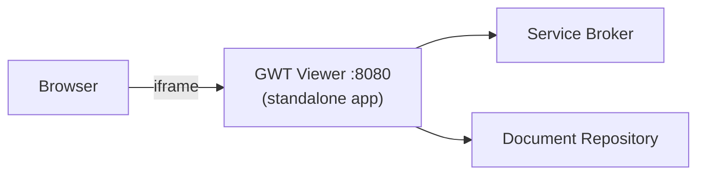
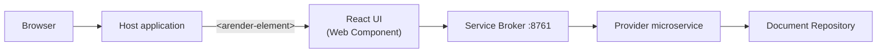

# ARender React UI

Starting with v2026, ARender offers a React-based document viewer alongside the classic GWT viewer. The React UI is distributed as an npm package (`arender-ui`) that registers an `<arender-element>` Web Component. You embed it directly into your web application — no iframe, no standalone server.

Both viewers connect to the same backend rendition services (broker, converter, renderer, text handler). Switching viewers does not affect your backend deployment.

## Feature comparison

| Feature | GWT Viewer | React UI |
|---------|-----------|----------|
| Document viewing | Yes | Yes |
| Annotations | Yes | Yes |
| Search | Yes | Yes |
| Redaction | Yes | Yes |
| Thumbnails | Yes | Yes |
| Print / Download | Yes | Yes |
| Text selection | Yes | Yes |
| Video playback | Yes | Yes |
| Document comparison | Yes | Not yet |
| Document builder | Yes | Not yet |
| Visual profiles | Yes | Not yet |
| White-labeling | Yes | CSS-based |
| Plugins | Yes | Not yet |
| OAuth2 / OIDC | Yes | Not yet |
| Web Component embed | No | Yes |
| Framework wrappers (Angular, Vue, Svelte) | No | Yes |
| Internationalization | Limited | 15 languages |

## Integration model

| Aspect | GWT Viewer | React UI |
|--------|-----------|----------|
| Delivery | Standalone Spring Boot application | npm package, embedded as Web Component |
| Embedding | `<iframe>` pointing to viewer URL | `<arender-element>` in the host page |
| Deployment | Dedicated Docker container (`arender-ui-springboot`) | Bundled into the host application |
| Connector model | Java JARs bundled in the viewer | Provider microservices (REST) |
| Document loading | Viewer fetches from repository directly | Host app calls broker API, or broker routes to provider via `/connector/documents` |
| Configuration | `.properties` files, environment variables | HTML attributes, JavaScript API |

**GWT viewer** — a self-contained application:

**React UI** — a component embedded in your application:

## Which viewer should I choose?

**Choose the GWT viewer** if you need the full feature set today — comparison, document builder, visual profiles, plugins, or OAuth2/OIDC integration. It is stable, full-featured, and production-proven across thousands of deployments.

**Choose the React UI** if you want to embed a document viewer directly into your web application. It is the strategic direction for ARender: a Web Component that integrates natively with any frontend framework, with a pure REST API and decoupled connector providers. Core viewing, annotation, search, and redaction are fully functional.

There is no deprecation date for the GWT viewer.

## Next steps

- [Getting started](./getting-started.md) — install, embed, and open your first document
- [Web Component](./web-component.md) — HTML attributes, JavaScript API, styling
- [Framework wrappers](./framework-wrappers.md) — React, Angular, Vue, Svelte integration
- [Configuration](./configuration.md) — CORS setup, reverse proxy, backend connection
- [Connector providers](./connector-providers.md) — load documents from Alfresco, FileNet, or custom repositories
- [Migration from GWT](./migration-from-gwt.md) — concept mapping and checklist
