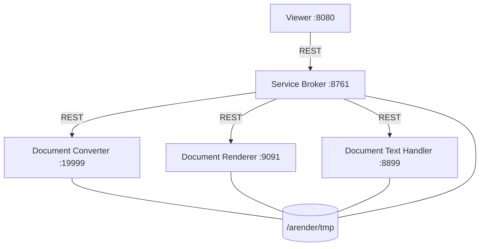
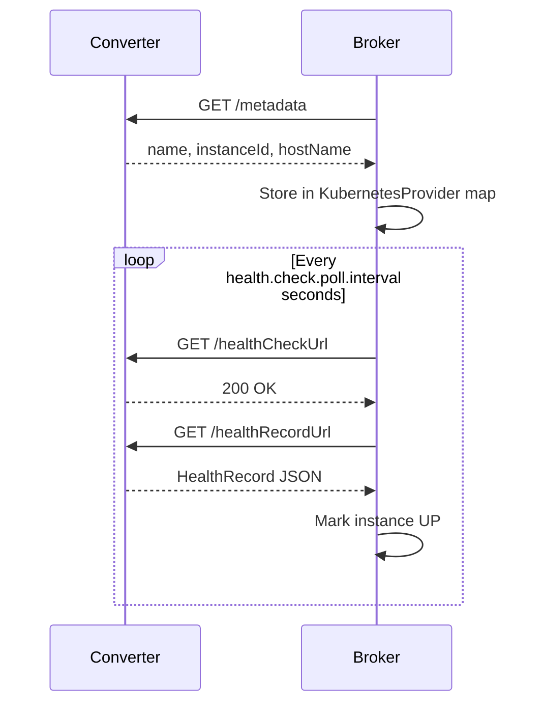
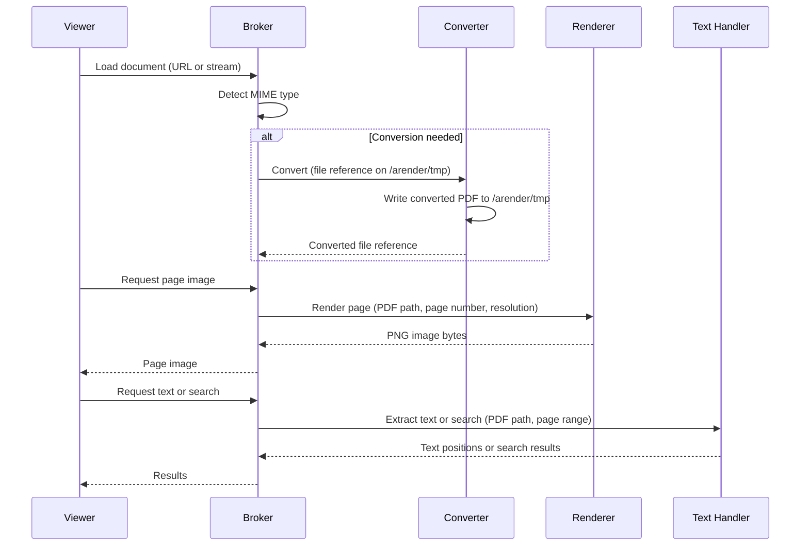

# Microservices architecture

The ARender rendition backend consists of four independent microservices coordinated by a central broker. Each service runs as a separate Spring Boot process, exposes its own REST API, and is independently scalable.

## Service overview



All rendition services share a single ReadWriteMany volume mounted at `/arender/tmp`. This shared volume is the mechanism for passing document files between services. The broker routes requests, but document content travels through the filesystem, not over HTTP between services.

---

## Document service broker

**Port:** 8761
**Image:** `arender-document-service-broker`

The broker is the sole entry point for all rendition operations. The viewer connects exclusively to the broker. No other rendition service is exposed to the viewer directly.

### Responsibilities

- Receives document load requests from the viewer
- Resolves MIME types and selects the appropriate processing pipeline
- Delegates format conversion to the converter when the document is not natively renderable
- Delegates image generation to the renderer
- Delegates text extraction, search, and comparison to the text handler
- Manages asynchronous conversion and transformation orders
- Maintains a document accessor cache (in-memory or distributed via Hazelcast)
- Extracts composite documents: emails (EML, MSG, MBOX), archives (ZIP, RAR, 7z, JAR), and PDF portfolios
- Exposes the full rendition REST API documented at `/swagger-ui/index.html`

### Native MIME types

Documents with these MIME types bypass the converter and go directly to the renderer or text handler:

```
application/pdf
image/tiff
video/mp4
application/vnd.ms-xpsdocument
```

All other supported types trigger a conversion step first. The mapping from source MIME type to conversion target is configured in the broker's `application.properties` under `arender.format.conversionTargetMimeTypes.*`.

### REST client configuration

The broker uses a WebClient to call downstream services. Key parameters:

```properties
# Maximum response buffer (bytes)
rest.client.max-in-memory-size=8000000

# Maximum connection pool size
rest.client.max-connections=200

# Pending acquisition timeout (ms)
rest.client.pending-acquire-timeout=120000

# Read and write timeouts (ms)
rest.client.read-timeout=120000
rest.client.write-timeout=120000
```

### Renderer selection

The broker selects between two renderer implementations via configuration:

```properties
# Options: PDFOwl (default) or JNIPdfEngine (deprecated)
micro-services.pdf-renderer=PDFOwl
```

### Health monitoring loop

The broker polls each registered microservice on a fixed schedule using `MicroServiceHealthCheckJob`. The job calls the service's `healthCheckUrl`, reads a `HealthRecord` from its `healthRecordUrl`, and marks the instance as UP or DOWN in the internal `MicroServiceHolder`. When running in standalone mode, the broker can restart failed service processes via the `/actuator/shutdown` endpoint.

```properties
# Poll interval in seconds
health.check.poll.interval=5

# Initial delay in seconds
health.check.poll.initial=1

# HTTP timeout for health check calls (seconds)
health.check.template.timeout=5

# HTTP timeout for health record calls (seconds)
health.check.template.record.timeout=30

# Allow broker to restart failed microservices (standalone mode)
health.check.restart.enabled=true
```

---

## Document converter

**Port:** 19999
**Image:** `arender-document-converter`

The converter transforms non-native formats into PDF or MP4 before the broker routes them to the renderer or text handler.

### Supported conversion paths

| Input category | Tool used | Output |
|---|---|---|
| Office (DOC, DOCX, XLS, XLSX, PPT, PPTX, ODP, ODT, ODS, VSD, PUB, RTF) | LibreOffice (headless), DirectOffice, or MS Office (AROMS2PDF) | PDF |
| HTML, EML body | wkhtmltopdf | PDF |
| Images (PNG, JPEG, BMP, WEBP, GIF, SVG, PCX, HEIF, WMF, etc.) | ImageMagick | PDF |
| Text files, vCard | Internal renderer | PDF |
| Video/audio (MOV, MKV, AVI, WAV, MP3, etc.) | FFmpeg | MP4 |
| AFP | cpmcopy | PDF |
| XFA forms | PDFFormsFlattener | PDF (flattened) |

### Key timeouts

```properties
# LibreOffice conversion (seconds)
soffice.conversion.timeout=120

# MS Office conversion (seconds)
msoffice.conversion.timeout=120

# HTML/EML conversion (seconds)
html.conversion.timeout=120

# Image conversion (seconds)
image.conversion.timeout=45

# Video conversion (seconds)
video.conversion.timeout=300

# PDF form flattening (seconds)
tools.pdf.flattener.timeout=60

# AFP conversion (ms)
arender.afp.conversion.timeout.ms=120000
```

### Tool paths

The converter invokes external tools by name. They must be on the system PATH, or you can configure explicit paths:

```properties
rendition.soffice.path=soffice
rendition.directoffice.path=directoffice
tools.wkhtmltopdf.path=wkhtmltopdf
tools.imagemagick.convert.path=magick
rendition.avconv.path=ffmpeg
rendition.avprobe.path=ffprobe
tools.pdf.flattener.path=PDFFormsFlattener
arender.afp.executable.path=cpmcopy
```

The Docker image for the converter ships with all required tools pre-installed.

### Self-test (nurse)

The converter includes a self-test mechanism called the "nurse" that converts sample files at startup to verify that tools are operational:

```properties
nurse.samplesDirectory=/arender/samples/
nurse.outPath=/tmp/document-converter-nurse/
```

---

## Document renderer

**Port:** 9091
**Image:** `arender-document-renderer-pdfowl`

The renderer generates page images from PDF files. It is the only service that produces visual page content for the viewer.

### PDFOwl rendering engine

The default renderer uses PDFOwl, a native binary process managed by the Spring Boot service. The service maintains a pool of PDFOwl processes:

```properties
# Path to the PDFOwl binary
pdfowl.path=lib/pdfowl

# Maximum time for a PDFOwl command (ms)
pdfowl.client.watchdog=10000

# TTL for idle PDFOwl clients in the pool (ms)
pdfowl.client.ttl=30000

# Memory limit per PDFOwl process (MB)
pdfowl.memlimit.mb=1024

# Enable process recycling (if false, a new process per query)
pdfowl.recycling.enable=true
```

When `pdfowl.recycling.enable` is true, idle PDFOwl processes remain in the pool for up to `pdfowl.client.ttl` milliseconds. When false, each render request spawns a fresh process, which is safer but slower.

### Capabilities

- Renders PDF pages to PNG or SVG at configurable resolution
- Applies image filters: brightness, contrast, inversion, cropping
- Activates and deactivates OCG layers (Optional Content Groups) for complex PDFs
- Performs image comparison between source and converted PDFs (used for PDF/A quality validation)

### Health check

The renderer runs an internal health check against a sample PDF on a periodic basis:

```properties
# Health check interval (ms)
health.time.interval=60000
health.sample.path=src/main/resources/pdfS4mpl3.pdf
```

---

## Document text handler

**Port:** 8899
**Image:** `arender-document-text-handler`

The text handler uses Apache PDFBox for all text-level operations on PDF files.

### Capabilities

- Text extraction with character-level position data (used for text selection and copy in the viewer)
- Full-text search within a document, with configurable timeout
- Streamed search results with per-result timeout
- Bookmark (outline) extraction
- Digital signature verification
- Document comparison using text diff, with optional diff-fragment resolution
- Named destination and hyperlink extraction

### Key configuration

```properties
# Batch size for text parsing across pages
pdf.text.parsing.batch.size=10

# Search timeout (seconds)
pdf.search.timeout=60

# Per-result timeout for streamed search (ms)
pdf.search.stream.timeout=500

# Include diff fragment detail in comparison results
# Disabling improves performance for documents with many differences
document.comparison.include.diff-fragments=true
```

### Digital signature verification

Signature verification is disabled by default. To enable it, provide certificate paths:

```properties
pdf.signatures.enable=false
PRIVATE_CERT=../defaultPathPrivateCert
PUBLIC_CERT=../defaultPathPublicCert
trusted.root.certificates.path=../defaultPathRootCert
PASSWORD_KEYSTORE=defaultPassword
PASSWORD_PRIVATE_CERT=defaultPassword
```

---

## Service discovery

The broker discovers microservices using one of two mechanisms depending on the deployment model.

### Kubeprovider (Docker Compose)

In Docker Compose, the broker maps service hostnames to ports using the `kubeprovider.kubeHosts` configuration. Each microservice declares its hostname through environment variables. The broker's `KubernetesProvider` pings each configured host at startup, retrieves its metadata via `GET /metadata`, and caches the resolved instance. It retries every second until all expected hosts are reachable.



Broker-side environment variables map hostnames to ports:

```yaml
service-broker:
  environment:
    - "DSB_KUBEPROVIDER_KUBE.HOSTS_DOCUMENT-CONVERTER=19999"
    - "DSB_KUBEPROVIDER_KUBE.HOSTS_DOCUMENT-RENDERER=9091"
    - "DSB_KUBEPROVIDER_KUBE.HOSTS_DOCUMENT-TEXT-HANDLER=8899"
```

Each microservice announces its identity to the broker:

```yaml
document-converter:
  environment:
    - "DCV_EUREKA_INSTANCE_METADATA.MAP_HOST.NAME=document-converter"
    - "DCV_APP_EUREKA_HOSTNAME=service-broker"
    - "DCV_APP_EUREKA_PORT=8761"
```

### Kubernetes DNS (Helm chart)

In Kubernetes, the Helm chart generates a ConfigMap for the broker with fully qualified service DNS names:

```yaml
kubeprovider:
  kubeHosts:
    arender-rendition-converter.arender.svc.cluster.local: 19999
    arender-rendition-handler.arender.svc.cluster.local: 8899
    arender-rendition-renderer.arender.svc.cluster.local: 9091
```

The `KubernetesProvider` resolves these DNS names through standard Kubernetes service resolution. No Eureka server is required.

---

## Inter-service communication flow

All communication between services is over HTTP (REST). There is no message queue, no gRPC, and no direct database sharing.



The broker selects a service instance from its internal `MicroServiceMap` for each request. In clustered deployments with multiple replicas per service, it picks an available instance from the pool maintained by the health check job.

---

## Shared volume constraints

All four rendition services must mount the same volume at `/arender/tmp`. This is a hard requirement:

- Converted files are written by the converter and read by the renderer and text handler.
- The broker tracks file references, not file content.
- In Kubernetes, the PVC must use a `ReadWriteMany` access mode.
- In Docker Compose, a named volume shared across services satisfies this requirement.

If the shared volume is unavailable or not mounted consistently across containers, document processing will fail with file-not-found errors.

---

## Related pages

- [System architecture](../overview/architecture.md)
- [Docker Compose deployment](../deployment/docker-compose.md)
- [Kubernetes Helm deployment](../deployment/kubernetes-helm.md)
- [Monitoring and observability](../operations/monitoring.md)
