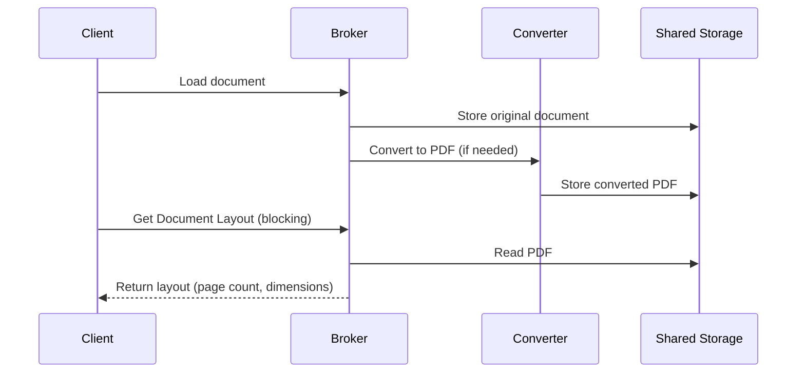
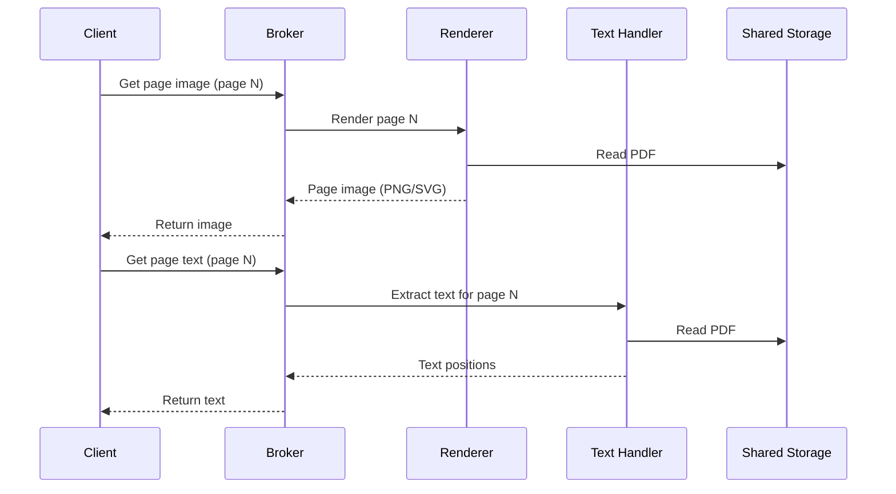

# Rendition pipeline

The rendition pipeline is the set of backend operations that transform a source document into viewable content: page images, text positions, bookmarks, and metadata.

## Pipeline stages

When a user opens a document, the viewer and broker coordinate through multiple asynchronous calls. The process is not a single sequential chain: the layout is resolved first, and then page images and text are fetched independently, per page, on demand.

#### Document loading and layout resolution



#### Per-page rendering (async, on demand)



### 1. Document loading

The document is loaded into the Document Service Broker — either through a provider or directly by URL. The broker stores the original file in the shared temporary volume (`/arender/tmp`).

### 2. Format conversion

If the document is not a native format (PDF, TIFF, or supported image), the broker sends it to the Document Converter for transformation to PDF. The converter selects the appropriate engine:

| Source format | Conversion engine |
|--------------|-------------------|
| Word, Excel, PowerPoint, Visio, RTF | LibreOffice (headless), MS Office (AROMS2PDF), or DirectOffice |
| HTML, Email (EML) | wkhtmltopdf |
| Images (PNG, JPEG, GIF, TIFF, etc.) | ImageMagick |
| Multimedia (video, audio) | FFmpeg |
| AutoCAD (DWG, DXF) | Dedicated AutoCAD converter |
| XFA forms (PDF with XFA) | Dedicated XFA flattener |
| AFP | Dedicated AFP converter |
| Plain text | PDFBox text-to-PDF |

The converted PDF is stored in the shared volume.

### 3. Layout resolution

Once conversion completes (or immediately for native formats), the broker builds the document layout: page count, page dimensions (width, height), rotation, and DPI. This layout is returned to the viewer so it can render the initial page structure.

### 4. Page rendering (on demand)

When the viewer needs to display a specific page, it requests the page image from the broker. The Document Renderer reads the PDF and produces the image. PDFOwl is the default rendering engine.

- **PDFOwl**: pool-based rendering engine (default)
- **JNI renderer**: legacy native library (deprecated)

Rendering parameters include width, rotation, crop box, layer visibility, and image filters (brightness, contrast, invert). Output formats are PNG or SVG.

### 5. Text extraction (on demand)

When the viewer needs text for a specific page (for search highlighting, text selection, or copy), it requests text positions from the broker. The Document Text Handler (PDFBox) extracts:

- Character-level text positions for search result highlighting
- Full-text content for search indexing
- Bookmarks (document outline)
- Digital signatures
- Named destinations and hyperlinks

## Asynchronous operations

Long-running operations use an asynchronous order pattern:

1. Client submits a request (conversion, comparison, transformation)
2. Broker returns an order ID immediately
3. Client polls the order status: `QUEUED` -> `PROCESSING` -> `PROCESSED` or `FAILED`
4. Client retrieves the result document when processing completes

## Shared file storage

All microservices mount the same volume at `/arender/tmp`. Documents are stored with filenames derived from their `DocumentId` for traceability. Each format variant of a document has a distinct file entry.

## Native formats

Some formats bypass conversion entirely:

```properties
arender.format.nativeMimeTypes=application/pdf,image/tiff,video/mp4,application/vnd.ms-xpsdocument
```

These are rendered directly without a conversion step.

## Next steps

- [System architecture](../overview/architecture.md)
- [REST API reference](../reference/rest-api/broker-api.md)
