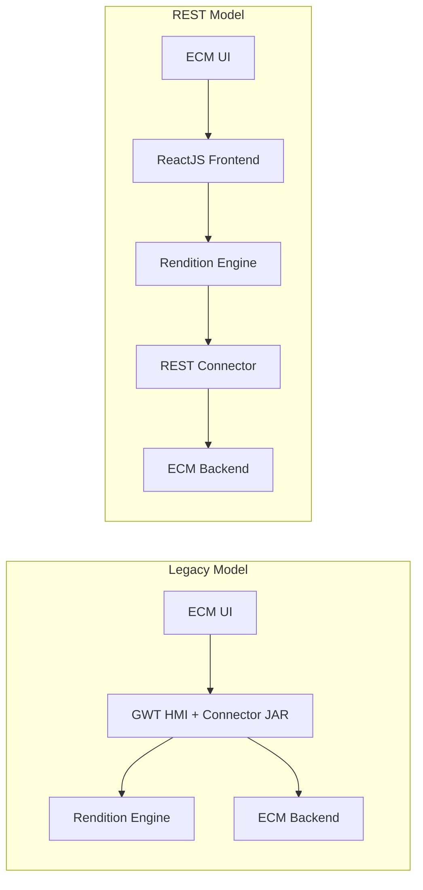

An ARender connector is the bridge between the ARender viewer and an Enterprise Content Management (ECM) system or document repository. It handles fetching document content, managing annotations, and translating ECM-specific identifiers into ARender's internal document model.

ARender provides two connector models:

## Legacy Connector (JAR-based)

The legacy model requires implementing Java interfaces (`DocumentAccessor`, `AnnotationAccessor`) and packaging the connector as a JAR file. This JAR is deployed alongside the GWT-based HMI frontend (`arondor-arender-hmi-springboot`) in its `lib` folder. The connector is loaded at runtime via a URL parser chain configured through the `arender.server.url.parsers.beanNames` property.

This approach is still supported for existing integrations with the GWT HMI frontend.

## REST Connector (Microservice-based)

Introduced in ARender 2026, the REST connector model decouples connectors into independent Spring Boot microservices that expose standard REST endpoints. The Rendition Engine acts as a broker, routing requests from the ReactJS frontend to the appropriate connector based on an `X-Provider-ID` HTTP header.

:::warning ReactJS Frontend Required
The REST connector model works exclusively with the **ReactJS frontend**. The legacy GWT-based HMI does not use the Rendition Engine's connector endpoints.
:::

## Comparison

| Aspect | Legacy (JAR) | REST (Microservice) |
|--------|-------------|---------------------|
| **Frontend** | GWT HMI | ReactJS |
| **Deployment** | JAR in HMI classpath | Independent Spring Boot application |
| **Interface** | Java `DocumentAccessor` / `AnnotationAccessor` | REST endpoints (`/documents`, `/annotations`) |
| **Language** | Java only | Any language capable of serving HTTP |
| **Routing** | URL parser chain (`beanNames` property) | `X-Provider-ID` header + Rendition registry |
| **Coupling** | Tightly coupled to HMI runtime | Loosely coupled, network boundary |
| **Scaling** | Scales with HMI | Scales independently |
| **Debugging** | Requires repackaging and redeploying JAR | Standard application debugging |
| **Configuration** | Spring XML beans + properties file | Spring Boot `application.properties` / `application.yml` |

## Next Steps

- **New integration?** Start with the [REST Connector Architecture](rest-connector/architecture.md) and the [Building a REST Connector](rest-connector/building-a-connector.md) tutorial.
- **Existing GWT HMI integration?** See the [Legacy Connector](legacy/documentAccessorInterface.md) documentation.
