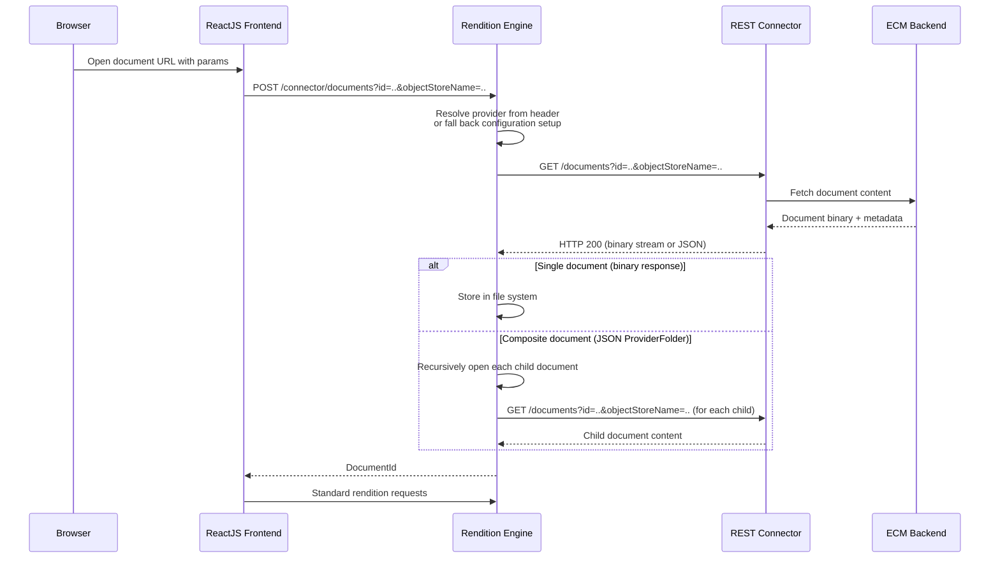
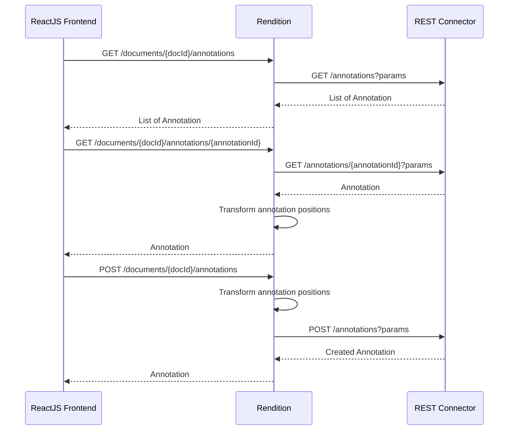

The REST connector model decouples connector logic from the ARender frontend into independent microservices. Each connector runs as its own application and communicates with the Rendition Engine via HTTP.

## High-Level Architecture

```mermaid
graph TD
    ECM_UI[ECM User Interface] -->|Opens ARender URL| Browser
    Browser -->|Loads viewer| Frontend[ReactJS Frontend]
    Frontend -->|"POST /connector/documents"| Rendition[Rendition Engine]
    Rendition -->|"GET /documents?params"| Connector[REST Connector]
    Connector -->|Fetches content| ECM[ECM Backend]
    Rendition -->|Stores document| File System[NFS]
```

### Components

1. **ECM User Interface** — The application (e.g., FileNet Workplace, Alfresco Share) from which users launch ARender to view a document.

2. **ReactJS Frontend** — The ARender viewer. When opening a document through a REST connector, it sends a `POST /connector/documents` request to the Rendition Engine with the ECM-specific parameters.

3. **Rendition Engine** — Routes connector requests to the appropriate REST connector based on the `X-Provider-ID` header or based on configuration. It stores fetched documents in the file system (i.e NFS) and handles annotation position transformations.

4. **REST Connector** — An independent REST application (Spring Boot for the provided FileNet and Alfresco REST Connector) implementing the [Provider API](provider-api.md). Each connector runs on its own port (e.g., FileNet on 8787, Alfresco on 8788).

5. **ECM Backend** — The source system from which documents and annotations are fetched.

:::info
The legacy GWT-based HMI frontend does not use the Rendition Engine's connector endpoints. Only the ReactJS frontend supports REST connectors.
:::

## Document Opening Flow



### Flow Details

1. The ReactJS frontend sends a `POST /connector/documents` request with the ECM-specific query parameters (e.g., `id`, `objectStoreName` for FileNet, or `nodeRef`, `alf_ticket` for Alfresco).

2. The Rendition reads the `X-Provider-ID` header to determine which connector to use. If the header is absent, it falls back to the `connector.defaultRegistry` configuration.

3. The Rendition generates a `DocumentId` from the whitelisted parameters and checks its cache. If the document is already cached, it returns the existing `DocumentId` immediately.

4. Otherwise, it forwards the parameters as query strings to the connector's `GET /documents` endpoint.

5. The connector fetches the document from the ECM and returns either:
   - A **binary stream** for a single document (with an optional `Content-Disposition` header for the document title)
   - A **JSON `ProviderFolder`** for composite documents containing multiple files

6. For composite documents, the Rendition recursively opens each child by calling back the connector's `GET /documents` with each child's parameters.

## Annotation Flow



For annotation operations, the Rendition retrieves the cached document accessor (which stores the provider name and original URL parameters) and forwards the request to the connector. The Rendition also applies annotation position transformations when the document has a composite layout.

## Composite Documents

The `GET /documents` endpoint can return two types of responses, distinguished by the `Content-Type` header:

- **Binary stream** (`application/octet-stream`, `application/pdf`, etc.) — A single document file.
- **JSON** (`application/json`) — A `ProviderFolder` describing a hierarchical structure of files and subfolders.

The JSON response uses polymorphic types:

```json
{
  "type": "folder",
  "name": "Case Documents",
  "parameters": {},
  "contents": [
    {
      "type": "file",
      "name": "contract.pdf",
      "parameters": {
        "id": "DOC001",
        "objectStoreName": "OS1"
      }
    },
    {
      "type": "folder",
      "name": "Attachments",
      "parameters": {},
      "contents": [
        {
          "type": "file",
          "name": "annex.pdf",
          "parameters": {
            "id": "DOC002",
            "objectStoreName": "OS1"
          }
        }
      ]
    }
  ]
}
```

Each `ProviderFile` in the folder structure must include a `parameters` map with the query parameters needed to fetch that specific file. The Rendition will call `GET /documents` again with these parameters for each child.

## Provider Selection

The Rendition selects the connector to use based on:

1. The `X-Provider-ID` HTTP header sent by the frontend (e.g., `X-Provider-ID: filenet`).
2. If no header is present, the `connector.defaultRegistry` configuration value.
3. If neither is set, the Rendition falls back to its default URL-based document opening behavior (no connector involved).

The provider name maps to a configuration entry containing the connector's base URL and the list of whitelisted query parameters. See [Configuration](configuration.md) for details.
