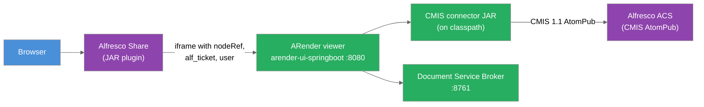

ARender integrates with Alfresco Content Services (ACS) through two components: a CMIS repository connector deployed inside the ARender viewer, and an Alfresco Share plugin that replaces the default document preview with an ARender iframe.

## 1. Overview

The CMIS connector is a Java JAR bundled on the `arender-ui-springboot` classpath. It implements the `DocumentAccessor` interface and authenticates to Alfresco using the ticket passed in the URL query parameters. The Share plugin obtains the Alfresco ticket and nodeRef from the user session, then opens an iframe pointing at ARender with those values.



*Figure: Request flow from Alfresco Share to ARender Classic viewer.*

## 2. Prerequisites

- ARender Classic viewer (`arender-ui-springboot`) running
- Alfresco Content Services 5.x or later with CMIS 1.1 AtomPub endpoint active
- Alfresco Share 5.x or later (for the Share plugin integration)
- Network connectivity from the ARender viewer host to the Alfresco CMIS endpoint

## 3. Connector installation

The CMIS connector is included in the `-alfresco` image variant of the ARender viewer. No separate JAR deployment is required when using that image.

```yaml title="docker-compose.yml"
services:
  ui:
    image: artifactory.arondor.cloud:5001/arender-ui-springboot:{{version}}-alfresco
    environment:
      - "ARENDERSRV_ARENDER_SERVER_RENDITION_HOSTS=http://service-broker:8761/"
      - "ARENDERSRV_ARENDER_SERVER_ALFRESCO_ATOM_PUB_URL=http://alfresco:8080/alfresco/api/-default-/cmis/versions/1.1/atom"
    ports:
      - "8080:8080"
```

:::note
This excerpt shows only the `ui` service configuration. The full rendition stack (service-broker, converter, renderer, text-handler) is also required. See [Docker Compose](../../installation/docker-compose.md) for the complete configuration.
:::

To deploy a custom JAR variant, place the fat JAR in `/home/arender/lib/` inside the container and use a base `arender-ui-springboot` image.

### Install the Alfresco Share plugin

The integration requires two JAR files:

- `arender-for-alfresco-share-plugin-{{version}}.jar` — integrates the ARender viewer within Share
- `arender-for-alfresco-ACS-plugin-{{version}}.jar` — extends the ACS REST API used by ARender

**If Alfresco and Share run on separate Tomcat instances**, drop each JAR into the `lib/` folder of its respective application.

**If Alfresco and Share share the same Tomcat instance**, drop both JARs into:

```
{alfresco_tomcat}/shared/lib/
```

Then add the following to `{alfresco_tomcat}/shared/classes/alfresco/web-extension/share-config-custom.xml`, inside the `<alfresco-config>` root element:

```xml
<config evaluator="string-compare" condition="Arender">
    <url>http://{arender_host}:{arender_port}/{arender_context}</url>
    <!-- Example: <url>http://192.168.1.8:8080/ARenderHMI</url> -->
</config>
```

Restart the Alfresco Share server after deploying the JARs and updating the configuration. The plugin replaces the default document preview component with an ARender iframe for all supported document types.

## 4. Configuration

All CMIS connector properties are set on the `ui` service via environment variables or `arender-server.properties`.

### Core connection

| Environment variable | Property | Default | Description |
|---|---|---|---|
| `ARENDERSRV_ARENDER_SERVER_ALFRESCO_ATOM_PUB_URL` | `arender.server.alfresco.atom.pub.url` | `http://localhost:8080/alfresco/api/-default-/cmis/versions/1.1/atom` | CMIS AtomPub endpoint URL |
| `ARENDERSRV_ARENDER_SERVER_ALFRESCO_CONTEXT` | `arender.server.alfresco.context` | `alfresco` | Alfresco context path |

### Authentication

By default, the connector authenticates using the `alf_ticket` URL parameter (user-delegated). To use a technical service account instead, set `user` and `password`. When a service account is configured, all access to Alfresco uses that account regardless of the user's own ticket.

| Environment variable | Property | Default | Description |
|---|---|---|---|
| `ARENDERSRV_ARENDER_SERVER_ALFRESCO_USER` | `arender.server.alfresco.user` | (empty) | Service account login. Leave empty to use user-delegated authentication |
| `ARENDERSRV_ARENDER_SERVER_ALFRESCO_PASSWORD` | `arender.server.alfresco.password` | (empty) | Service account password |

### Annotation storage

Annotations are stored as XFDF files in Alfresco. The recommended mode stores them as CMIS child documents of the annotated document.

| Environment variable | Property | Default | Description |
|---|---|---|---|
| `ARENDERSRV_ARENDER_SERVER_ALFRESCO_ANNOTATION_PATH` | `arender.server.alfresco.annotation.path` | `/Dictionnaire de données` | Alfresco path where annotation folders are created (legacy mode) |
| `ARENDERSRV_ARENDER_SERVER_ALFRESCO_ANNOTATION_FOLDER_NAME` | `arender.server.alfresco.annotation.folder.name` | `SuperAnnotations` | Name of the annotation folder |
| `ARENDERSRV_ARENDER_SERVER_ALFRESCO_ANNOTATION_USE_CHILD_API` | `arender.server.alfresco.annotation.use.child.api` | `true` | Store annotations as CMIS child documents (recommended) |

To migrate from the legacy folder-based storage to child document storage, set:

```properties
arender.server.alfresco.annotation.migrate.to.new.child.api=true
```

### Role-based annotation access

When `arender.server.alfresco.use.roles=true`, annotation operations are restricted by Alfresco site role.

| Environment variable | Property | Default | Description |
|---|---|---|---|
| `ARENDERSRV_ARENDER_SERVER_ALFRESCO_USE_ROLES` | `arender.server.alfresco.use.roles` | `false` | Enforce annotation permissions based on Alfresco site roles |
| `ARENDERSRV_ARENDER_SERVER_ALFRESCO_USE_PERMISSIONS` | `arender.server.alfresco.use.permissions` | `false` | Use Alfresco node permissions for annotation access |

Default role permissions when `use.roles=true`:

| Role | Create | Modify any | Modify own | Create redactions | Delete redactions |
|---|---|---|---|---|---|
| SiteManager | yes | yes | yes | yes | yes |
| SiteCollaborator | yes | yes | yes | yes | yes |
| SiteContributor | yes | no | yes | yes | no |
| SiteConsumer | no | no | no | no | no |

Override specific role assignments:

```bash
ARENDERSRV_ARENDER_SERVER_ALFRESCO_ROLE_CREATE_ANNOTATION=SiteManager,SiteCollaborator,SiteContributor
ARENDERSRV_ARENDER_SERVER_ALFRESCO_ROLE_MODIFY_ANNOTATION=SiteManager,SiteCollaborator
ARENDERSRV_ARENDER_SERVER_ALFRESCO_ROLE_MODIFY_OWN_ANNOTATION=SiteContributor
```

### URL parameters used by the connector

| Parameter | Source | Description |
|---|---|---|
| `nodeRef` | Share plugin | Alfresco nodeRef (e.g. `workspace://SpacesStore/...`) |
| `alf_ticket` | Share plugin | Alfresco authentication ticket |
| `user` | Share plugin | Alfresco username |
| `versionLabel` | Share plugin | Document version label |
| `docs` | Share plugin (multi-document) | Comma-separated `nodeRef;versionLabel` pairs |
| `folder` | Share plugin (folder) | Set to any non-null value to open the nodeRef as a folder |

### Document Builder configuration

| Property | Default | Description |
|---|---|---|
| `arender.server.alfresco.document.builder.document.type` | (empty) | Force a specific Alfresco content type on new documents |
| `arender.server.alfresco.document.builder.aspects.to.propagate` | (empty) | Comma-separated aspect names to copy from parent |
| `arender.server.alfresco.document.builder.properties.to.propagate` | (empty) | Comma-separated property names to copy from parent |
| `arender.server.alfresco.document.builder.transfer.annotations` | `false` | Copy annotations when creating or updating a document |
| `arender.server.alfresco.document.builder.number.try.rename.document` | `5` | Rename attempt count when a document with the same name already exists |

## 5. Verification

1. Verify the CMIS endpoint is reachable from the ARender container:

```bash
curl http://alfresco:8080/alfresco/api/-default-/cmis/versions/1.1/atom
```

Expected: an XML Atom service document listing CMIS workspaces.

2. Open a document from Alfresco Share. The ARender iframe should load within the Share document preview panel.

3. Create an annotation in the viewer. Confirm it persists across page reloads by reopening the document.

## 6. Common issues

| Error | Cause | Solution |
|---|---|---|
| Document does not load, viewer shows an error | CMIS endpoint unreachable | Run `curl http://alfresco:8080/.../atom` from the viewer container. Check viewer logs for authentication errors |
| Annotations are not saved | Insufficient write access | The authenticated user needs write access to the document or to the annotation path folder |
| Share shows the default preview instead of ARender | JARs not deployed or Share not restarted | Verify both JARs are present in `lib/` or `shared/lib/` and that Share was restarted after deployment |
| Viewer loads but shows "Cannot view document" | Missing URL parameters | Check that the Share plugin is passing `nodeRef`, `alf_ticket`, and `user` parameters in the iframe URL |