ARender integrates with Alfresco Content Services (ACS) through the `alfresco-provider` microservice. The provider is a standalone Spring Boot application that connects to Alfresco via the CMIS AtomPub protocol and exposes the ARender provider REST contract to the Document Service Broker.

## 1. Overview

The `alfresco-provider` runs as a Docker container alongside the ARender rendition backend. The Document Service Broker routes document requests to it based on the `X-Provider-ID` header injected by the BFF or reverse proxy layer. The provider fetches document content from Alfresco and returns it to the broker for rendering.

```mermaid
%%{init: {'theme': 'neutral'}}%%
%% Modern viewer Alfresco integration
flowchart LR
  classDef client fill:#4A90D9,color:#fff
  classDef arender fill:#27AE60,color:#fff
  classDef ecm fill:#8E44AD,color:#fff

  Browser["Browser"]:::client
  Element["arender-element<br/>(Web Component)"]:::client
  BFF["BFF / reverse proxy<br/>(injects X-Provider-ID)"]:::arender
  Broker["Document Service Broker<br/>:8761"]:::arender
  Provider["alfresco-provider<br/>:8788"]:::arender
  Alfresco["Alfresco ACS<br/>(CMIS AtomPub)"]:::ecm

  Browser --> Element
  Element --> BFF
  BFF --> Broker
  Broker -- "X-Provider-ID: alfresco" --> Provider
  Provider -- "CMIS 1.1 AtomPub" --> Alfresco
```



*Figure: Request flow from the Modern viewer to Alfresco through the provider.*

## 2. Prerequisites

- ARender rendition backend running (broker, converter, renderer, text handler)
- A BFF or reverse proxy that injects the `X-Provider-ID: alfresco` header or set the configuration `registry.default-provider=filenet`
- Alfresco Content Services 5.x or later with CMIS 1.1 AtomPub endpoint enabled
- Network connectivity from the `alfresco-provider` container to the Alfresco CMIS endpoint
- Java 17 or later (if building from source)
- Docker (for container deployment)

## 3. Provider installation

The provider ships as a Docker image. Add it to your Docker Compose stack alongside the rendition services.

```yaml title="docker-compose.yml"
services:
  alfresco-provider:
    image: artifactory.arondor.cloud:5001/arender-alfresco-provider:{{version}}
    environment:
      - "ARENDER_SERVER_ALFRESCO_ATOM_PUB_URL=http://alfresco:8080/alfresco/api/-default-/cmis/versions/1.1/atom"
    ports:
      - "8788:8788"

  service-broker:
    image: artifactory.arondor.cloud:5001/arender-document-service-broker:{{version}}
    environment:
      - "DSB_KUBEPROVIDER_KUBE.HOSTS_DOCUMENT-CONVERTER=19999"
      - "DSB_KUBEPROVIDER_KUBE.HOSTS_DOCUMENT-RENDERER=9091"
      - "DSB_KUBEPROVIDER_KUBE.HOSTS_DOCUMENT-TEXT-HANDLER=8899"
      - "REGISTRY_PROVIDERS_ALFRESCO_BASE_URL=http://alfresco-provider:8788"
      - "REGISTRY_PROVIDERS_ALFRESCO_WHITELISTED_PARAMS=nodeRef,versionLabel,docs,folder"
      - "REGISTRY_DEFAULT_PROVIDER=alfresco"
    # ... rendition services omitted for brevity
```

## 4. Configuration

The provider is configured through Spring Boot externalized configuration. All properties under `arender.server.alfresco.*` can be set as environment variables.

### Application properties

```properties title="application.properties"
# HTTP port (default: 8788)
server.port=8788

# CMIS AtomPub endpoint for the Alfresco server
arender.server.alfresco.atom.pub.url=http://localhost:8080/alfresco/api/-default-/cmis/versions/1.1/atom
```

### Configuration reference

| Property | Default | Description |
|---|---|---|
| `server.port` | `8788` | HTTP port the provider listens on |
| `arender.server.alfresco.atom.pub.url` | `http://localhost:8080/alfresco/.../atom` | CMIS 1.1 AtomPub endpoint URL for the Alfresco server |

### Request parameters

The following query parameters are used by the provider. The broker forwards all incoming request parameters to the provider regardless of whether they appear in `REGISTRY_PROVIDERS_ALFRESCO_WHITELISTED_PARAMS`.

| Parameter | Required | Description |
|---|---|---|
| `nodeRef` | Yes (single document or folder) | Alfresco nodeRef (e.g. `workspace://SpacesStore/...`). The `workspace://SpacesStore/` prefix is stripped internally. |
| `alf_ticket` | Yes | Alfresco authentication ticket for the current user |
| `user` | Yes | Alfresco username |
| `versionLabel` | No | Document version label |
| `docs` | Yes (multi-document) | Comma-separated list of `nodeRef;versionLabel` pairs |
| `folder` | No | When set with `nodeRef`, opens the nodeRef as a folder and returns its children |

:::note
`whitelistedParams` controls which parameters form the internal `DocumentId` used for caching. Parameters outside the list are still forwarded to the provider. Do not add `alf_ticket` to `whitelistedParams`: it is a short-lived per-user token, and including it in the cache key causes every request with a new ticket to miss the cache, forcing unnecessary re-rendition of the same document.
:::

### Authentication

The provider authenticates to Alfresco using the `alf_ticket` passed as a query parameter. This is the Alfresco ticket obtained during the user's session (user-delegated authentication). No service account is configured in the provider itself. Ticket validity is managed on the Alfresco side.

The provider maintains a cache of CMIS connections keyed by ticket. Each connection entry expires after 2 hours of inactivity.

### Annotation access

The provider exposes annotation CRUD endpoints alongside the document endpoint. Annotations are read and written through the Alfresco CMIS API. The endpoints follow the ARender provider REST contract:

| Endpoint | Method | Description |
|---|---|---|
| `/documents` | GET | Retrieve document content |
| `/annotations` | GET | Retrieve all annotations for a document |
| `/annotations/ids` | GET | Retrieve annotation identifiers |
| `/annotations/{annotationId}` | GET | Retrieve a single annotation |
| `/annotations` | POST | Create an annotation |
| `/annotations/{annotationId}` | PUT | Update an annotation |
| `/annotations/{annotationId}` | DELETE | Delete an annotation |

## 5. Verification

After starting the provider, verify the integration:

1. Check the provider is reachable from the broker container:

```bash
curl http://alfresco-provider:8788/documents?nodeRef=<nodeRef>&alf_ticket=<ticket>&user=<user>
```

Expected response: document binary stream with `Content-Disposition` and `Content-Type` headers.

2. Open the ARender Modern viewer and load a document from Alfresco. Check that the document renders without error.

## 6. Sample use case

A legal department uses Alfresco to manage contract documents. The Modern viewer is embedded in an Angular application using `angular-arender-ui`. When a user opens a contract from the Alfresco document library:

1. The Angular application retrieves the user's Alfresco ticket from the session.
2. The application builds the viewer URL with `nodeRef`, `alf_ticket`, and `user` parameters.
3. The `<arender-element>` component sends the request to the BFF.
4. The BFF injects `X-Provider-ID: alfresco` and forwards to the broker.
5. The broker calls `alfresco-provider:8788/documents?nodeRef=...&alf_ticket=...&user=...`.
6. The provider returns the contract PDF via CMIS. The broker renders it and streams pages to the viewer.

## 7. Common issues

| Error | Cause | Solution |
|---|---|---|
| `Cannot view document, missing info in query parameters` | `nodeRef`, `alf_ticket`, or `user` is absent from the request | Verify that the BFF forwards all required parameters in the request. The broker forwards all incoming parameters to the provider; the issue is in the BFF or the client not sending the required parameters |
| `Connection refused` on CMIS call | The `arender.server.alfresco.atom.pub.url` is unreachable from the provider container | Check network connectivity: `curl <atom-pub-url>` from inside the provider container |
| `IllegalStateException: NOT IMPLEMENTED` | The request mode (DOCUMENT, FOLDER, MULTIDOCUMENT) could not be determined | Ensure `nodeRef` is present for single document mode, or `docs` for multi-document mode |