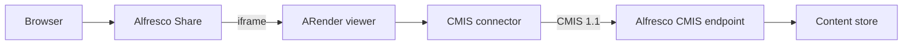

import ARenderDownloads from '@site/src/components/ARenderDownloads';

# Alfresco integration

ARender integrates with Alfresco Content Services (ACS) through two separate components:

- **The CMIS repository connector**, deployed as part of the ARender viewer, fetches documents from Alfresco via the CMIS AtomPub protocol.
- **The ACS Share plugin**, an Alfresco Module Package (AMP) installed on the Alfresco Share tier, replaces the default document preview with an ARender iframe.

Both components are required for the full integration. The Share plugin builds the ARender URL with the correct Alfresco credentials; the CMIS connector uses those credentials to retrieve the document content.

## Prerequisites

- ARender viewer running with the CMIS connector JAR on its classpath
- Alfresco Content Services 5.x or later with CMIS 1.1 enabled (AtomPub endpoint active)
- Alfresco Share 5.x or later (for the Share plugin)
- Network connectivity from the ARender viewer host to the Alfresco CMIS endpoint

<ARenderDownloads version="2026.0.0" filter={["plugin-alfresco"]} />

## Architecture



The Share plugin retrieves the user's Alfresco ticket and the document nodeRef, then opens an iframe pointing at ARender with those values as query parameters. ARender's CMIS connector authenticates to Alfresco using the ticket and fetches the document content via CMIS.

## Step 1: Deploy the CMIS connector

The CMIS connector is packaged as a fat JAR. Place it in the viewer's lib directory:

```yaml title="docker-compose.yml"
# docker-compose.yml excerpt
services:
  ui:
    image: artifactory.arondor.cloud:5001/arender-ui-springboot:{{version}}-alfresco
    environment:
      - "ARENDERSRV_ARENDER_SERVER_RENDITION_HOSTS=http://service-broker:8761/"
      - "ARENDERSRV_ARENDER_SERVER_ALFRESCO_ATOM_PUB_URL=http://alfresco:8080/alfresco/api/-default-/cmis/versions/1.1/atom"
    ports:
      - 8080:8080
```

The `-alfresco` image variant includes the CMIS connector JAR pre-packaged, so no volume mount is needed for the connector.

:::info
This excerpt shows only the `ui` service configuration. The full rendition stack (service-broker, converter, renderer, text-handler) is also required. See [Docker Compose](../../installation/docker-compose.md) for the complete configuration.
:::

## Step 2: Configure the CMIS connector

All CMIS connector properties are set on the `ui` service. The following environment variables correspond to properties in `arender-server.properties`:

| Environment variable | Property | Default | Description |
|----------------------|----------|---------|-------------|
| `ARENDERSRV_ARENDER_SERVER_ALFRESCO_ATOM_PUB_URL` | `arender.server.alfresco.atom.pub.url` | `http://localhost:8080/alfresco/api/-default-/cmis/versions/1.1/atom` | CMIS AtomPub endpoint URL |
| `ARENDERSRV_ARENDER_SERVER_ALFRESCO_CONTEXT` | `arender.server.alfresco.context` | `alfresco` | Alfresco context path |
| `ARENDERSRV_ARENDER_SERVER_ALFRESCO_USER` | `arender.server.alfresco.user` | (empty) | Technical account login (leave empty to use the user's own ticket) |
| `ARENDERSRV_ARENDER_SERVER_ALFRESCO_PASSWORD` | `arender.server.alfresco.password` | (empty) | Technical account password |
| `ARENDERSRV_ARENDER_SERVER_ALFRESCO_ANNOTATION_PATH` | `arender.server.alfresco.annotation.path` | `/Dictionnaire de données` | Alfresco path where annotation folders are created |
| `ARENDERSRV_ARENDER_SERVER_ALFRESCO_ANNOTATION_FOLDER_NAME` | `arender.server.alfresco.annotation.folder.name` | `SuperAnnotations` | Name of the annotation folder under the annotation path |
| `ARENDERSRV_ARENDER_SERVER_ALFRESCO_ANNOTATION_USE_CHILD_API` | `arender.server.alfresco.annotation.use.child.api` | `true` | Store annotations as CMIS child documents (recommended) |
| `ARENDERSRV_ARENDER_SERVER_ALFRESCO_USE_ROLES` | `arender.server.alfresco.use.roles` | `false` | Enforce annotation permissions based on Alfresco site roles |
| `ARENDERSRV_ARENDER_SERVER_ALFRESCO_USE_PERMISSIONS` | `arender.server.alfresco.use.permissions` | `false` | Use Alfresco node permissions to control annotation access |

### Authentication mode

By default, the connector authenticates with the Alfresco ticket passed in the `alf_ticket` URL parameter (user-delegated authentication). In this mode, `arender.server.alfresco.user` and `arender.server.alfresco.password` must remain empty.

To use a technical account instead (service account), set `user` and `password`. In this mode, all users access Alfresco through the same technical identity, and the Alfresco ticket from the URL is not used.

## Step 3: Configure annotation storage

Annotations are stored as XFDF files in an Alfresco folder. The connector creates one annotation folder per document under the configured annotation path.

The default behavior (with `use.child.api=true`) stores annotation XFDF files as CMIS child documents of the annotated document. This is the recommended mode and avoids creating a separate folder hierarchy.

To enable migration from the old folder-based storage to the new child document storage:

```
arender.server.alfresco.annotation.migrate.to.new.child.api=true
```

## Step 4: Configure role-based annotation access

When `arender.server.alfresco.use.roles=true`, annotation operations are restricted by Alfresco site role. The default role hierarchy and permissions:

| Role | Create annotations | Modify annotations | Modify own | Create redactions | Delete redactions |
|------|-------------------|--------------------|------------|-------------------|-------------------|
| SiteManager | yes | yes | yes | yes | yes |
| SiteCollaborator | yes | yes | yes | yes | yes |
| SiteContributor | yes | no | yes | yes | no |
| SiteConsumer | no | no | no | no | no |

These defaults come from `arender-server.properties` and can be overridden via environment variables:

```
ARENDERSRV_ARENDER_SERVER_ALFRESCO_ROLE_CREATE_ANNOTATION=SiteManager,SiteCollaborator,SiteContributor
ARENDERSRV_ARENDER_SERVER_ALFRESCO_ROLE_MODIFY_ANNOTATION=SiteManager,SiteCollaborator
ARENDERSRV_ARENDER_SERVER_ALFRESCO_ROLE_MODIFY_OWN_ANNOTATION=SiteContributor
```

## Step 5: Install the Alfresco Share plugin

The Share plugin is distributed as an AMP file. Install it using the Alfresco Module Management Tool:

```bash
java -jar alfresco-mmt.jar install \
  arender-for-alfresco-share-plugin-{{version}}.amp \
  alfresco-share.war -force
```

After installation, configure the plugin to point to your ARender viewer URL. The plugin builds the iframe URL in this form:

```
http://<arender-host>:8080/?nodeRef=<nodeRef>&user=<username>&alf_ticket=<ticket>&versionLabel={{version}}
```

The Share plugin replaces the default Alfresco Share document preview component with an ARender iframe for all supported document types.

## URL parameters used by the CMIS connector

| Parameter | Source | Description |
|-----------|--------|-------------|
| `nodeRef` | Share plugin | Alfresco nodeRef (e.g. `workspace://SpacesStore/...`) |
| `alf_ticket` | Share plugin | Alfresco authentication ticket for the current user |
| `user` | Share plugin | Alfresco username |
| `versionLabel` | Share plugin | Document version label (required for annotation targeting) |
| `docs` | Share plugin (multi-document) | Comma-separated list of `nodeRef;versionLabel` pairs |
| `folder` | Share plugin (folder) | Set to any non-null value to open the nodeRef as a folder |

## Document Builder configuration

The CMIS connector supports the ARender Document Builder feature, which allows saving assembled documents back to Alfresco.

| Property | Default | Description |
|----------|---------|-------------|
| `arender.server.alfresco.document.builder.document.type` | (empty) | Force a specific Alfresco content type on newly created documents |
| `arender.server.alfresco.document.builder.aspects.to.propagate` | (empty) | Comma-separated aspect names to copy from parent to child document |
| `arender.server.alfresco.document.builder.properties.to.propagate` | (empty) | Comma-separated property names to copy from parent to child document |
| `arender.server.alfresco.document.builder.transfer.annotations` | `false` | Copy annotations when creating or updating a document |
| `arender.server.alfresco.document.builder.number.try.rename.document` | `5` | Number of rename attempts when a document with the same name already exists |

## Troubleshooting

**Document does not load, viewer shows an error.** Verify the CMIS endpoint is reachable from the ARender container: `curl http://alfresco:8080/alfresco/api/-default-/cmis/versions/1.1/atom`. Check the viewer logs for authentication errors.

**Annotations are not saved.** Confirm the authenticated user has write access to the annotation folder path in Alfresco. If `use.child.api=true`, the user needs write access to the document itself.

**Share plugin shows the default preview instead of ARender.** Verify the AMP was applied correctly and the Share server was restarted. Check the browser console for iframe loading errors.

## Related pages

- [Connectors concept](../../concepts/connectors.md)
- [Annotations concept](../../concepts/annotations.md)
