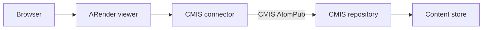

# CMIS integration

The CMIS connector integrates ARender with any CMIS-compliant content repository using the Apache Chemistry OpenCMIS client library. It supports the AtomPub binding and is tested primarily against Alfresco Content Services, but it works with any repository that exposes a standard CMIS 1.0 or 1.1 AtomPub endpoint.

For Alfresco-specific integration (Share plugin, Alfresco site roles, ADF/ACA), see the [Alfresco integration guide](./alfresco.md). This page covers generic CMIS configuration and non-Alfresco use cases.

## Prerequisites

- ARender viewer with the CMIS connector JAR on its classpath
- A CMIS-compliant repository with an AtomPub endpoint accessible from the ARender host
- Valid credentials for the repository (user ticket or service account)

## How the connector works



The CMIS connector activates when a request contains a `nodeRef` or `docs` parameter combined with an `alf_ticket` parameter or a configured service account. It:

1. Establishes a CMIS session to the AtomPub endpoint, authenticating with the provided ticket or service account credentials.
2. Fetches the document content stream identified by the `nodeRef` (CMIS object ID).
3. Returns the content to the ARender rendition pipeline.
4. Reads and writes annotations as XFDF files stored as CMIS child documents or in a dedicated CMIS folder.

CMIS connections are cached for up to two hours by session ticket or service account identity, with a maximum of 20 concurrent sessions.

## Step 1: Deploy the CMIS connector

Add the connector JAR to the viewer:

```yaml
# docker-compose.yml excerpt
services:
  ui:
    image: artifactory.arondor.cloud:5001/arender-ui-springboot:2026.0.0-cmis
    environment:
      - "ARENDERSRV_ARENDER_SERVER_RENDITION_HOSTS=http://service-broker:8761/"
      - "ARENDERSRV_ARENDER_SERVER_ALFRESCO_ATOM_PUB_URL=http://cms.example.com:8080/cmis/atom11"
      - "ARENDERSRV_ARENDER_SERVER_ALFRESCO_USER=svc-arender"
      - "ARENDERSRV_ARENDER_SERVER_ALFRESCO_PASSWORD=secret"
    ports:
      - 8080:8080
```

## Step 2: Configure the CMIS connection

The connector bean `cmisConnection` is configured via properties. All properties are prefixed `arender.server.alfresco.` because the CMIS connector was originally developed against Alfresco; the property names apply to any CMIS repository.

### Service account authentication

To have all users access the repository through a shared service account, set `user` and `password`:

```
ARENDERSRV_ARENDER_SERVER_ALFRESCO_USER=svc-arender
ARENDERSRV_ARENDER_SERVER_ALFRESCO_PASSWORD=secret
```

### User-delegated authentication

To authenticate as the individual user, leave `user` and `password` empty and pass `alf_ticket` and `user` in the viewer URL. The connector uses the ticket as the CMIS password. This mode requires the URL to include a valid session ticket from the ECM system.

### CMIS endpoint URL

The `atomPubURL` must point to the CMIS AtomPub service document:

```
ARENDERSRV_ARENDER_SERVER_ALFRESCO_ATOM_PUB_URL=http://cms.example.com:8080/alfresco/api/-default-/cmis/versions/1.1/atom
```

For non-Alfresco repositories, replace with the correct AtomPub URL from your vendor's documentation.

## Configuration reference

| Environment variable | Property | Default | Description |
|----------------------|----------|---------|-------------|
| `ARENDERSRV_ARENDER_SERVER_ALFRESCO_ATOM_PUB_URL` | `arender.server.alfresco.atom.pub.url` | `http://localhost:8080/alfresco/api/-default-/cmis/versions/1.1/atom` | CMIS AtomPub endpoint URL |
| `ARENDERSRV_ARENDER_SERVER_ALFRESCO_CONTEXT` | `arender.server.alfresco.context` | `alfresco` | Repository context path (used for Alfresco-specific REST calls) |
| `ARENDERSRV_ARENDER_SERVER_ALFRESCO_USER` | `arender.server.alfresco.user` | (empty) | Service account username; leave empty for user-delegated auth |
| `ARENDERSRV_ARENDER_SERVER_ALFRESCO_PASSWORD` | `arender.server.alfresco.password` | (empty) | Service account password |
| `ARENDERSRV_ARENDER_SERVER_ALFRESCO_ANNOTATION_PATH` | `arender.server.alfresco.annotation.path` | `/Dictionnaire de données` | Repository path where annotation folders are created (folder-based mode) |
| `ARENDERSRV_ARENDER_SERVER_ALFRESCO_ANNOTATION_FOLDER_NAME` | `arender.server.alfresco.annotation.folder.name` | `SuperAnnotations` | Annotation folder name (folder-based mode) |
| `ARENDERSRV_ARENDER_SERVER_ALFRESCO_ANNOTATION_USE_CHILD_API` | `arender.server.alfresco.annotation.use.child.api` | `true` | Store annotations as CMIS child documents of the annotated node |
| `ARENDERSRV_ARENDER_SERVER_ALFRESCO_ANNOTATION_MIGRATE_TO_NEW_CHILD_API` | `arender.server.alfresco.annotation.migrate.to.new.child.api` | `true` | Automatically migrate folder-based annotations to child document storage |
| `ARENDERSRV_ARENDER_SERVER_ALFRESCO_ANNOTATION_INHERIT_READ_ONLY_FROM_DOCUMENT` | `arender.server.alfresco.annotation.inherit.read.only.from.document` | `false` | Disable annotation creation when the document is read-only in the repository |
| `ARENDERSRV_ARENDER_SERVER_ALFRESCO_SHOW_METADATAS` | `arender.server.alfresco.show.metadatas` | `false` | Show document metadata in the viewer thumbnail panel |
| `ARENDERSRV_ARENDER_SERVER_ALFRESCO_INCLUDED_METADATAS` | `arender.server.alfresco.included.metadatas` | (empty) | Comma-separated metadata property names to display |

## Annotation storage modes

### Child document storage (recommended)

With `use.child.api=true` (the default), the connector stores XFDF annotation files as CMIS child documents of the annotated document. This requires the CMIS repository to support the CMIS `cmis:item` or child folder relationship.

To migrate existing folder-based annotations to the child document model, set both:

```
arender.server.alfresco.annotation.use.child.api=true
arender.server.alfresco.annotation.migrate.to.new.child.api=true
```

### Folder-based storage

With `use.child.api=false`, the connector creates a subfolder under `annotationsPath` for each document and stores the XFDF file inside it. The folder is named after the document's CMIS object ID. This mode works with all CMIS 1.0 repositories.

## URL parameters

The CMIS connector activates when a request contains `nodeRef` or `docs`, and either `alf_ticket` or a configured service account.

| Parameter | Required | Description |
|-----------|----------|-------------|
| `nodeRef` | Yes (single document) | CMIS object ID of the document (Alfresco format: `workspace://SpacesStore/{guid}`) |
| `alf_ticket` | Yes (user-delegated auth) | Repository session ticket for the current user |
| `user` | Yes | Username; required even in service account mode to associate annotations with the correct user |
| `versionLabel` | Yes (single document) | Document version label; required for annotation targeting |
| `docs` | Yes (multi-document) | Comma-separated list of `nodeRef;versionLabel` pairs |
| `folder` | No | If present, the `nodeRef` is treated as a folder; the connector opens all documents in the folder |

### Example URL (single document, user-delegated)

```
http://arender.example.com:8080/?nodeRef=workspace://SpacesStore/550e8400-e29b-41d4-a716-446655440000&user=jsmith&alf_ticket=TICKET_abc123&versionLabel=1.0
```

### Example URL (multi-document)

```
http://arender.example.com:8080/?docs=workspace://SpacesStore/id1;1.0,workspace://SpacesStore/id2;2.0&user=jsmith&alf_ticket=TICKET_abc123
```

## Role-based annotation access

The CMIS connector supports restricting annotation operations by role. Roles are passed by the UI plugin (Share plugin or custom integration) and matched against the configured role lists.

The default role hierarchy for Alfresco sites is `SiteManager,SiteCollaborator,SiteContributor,SiteConsumer`. To enable role-based access control:

```
ARENDERSRV_ARENDER_SERVER_ALFRESCO_USE_ROLES=true
ARENDERSRV_ARENDER_SERVER_ALFRESCO_ROLE_HIERARCHY=SiteManager,SiteCollaborator,SiteContributor,SiteConsumer
ARENDERSRV_ARENDER_SERVER_ALFRESCO_ROLE_CREATE_ANNOTATION=SiteManager,SiteCollaborator,SiteContributor
ARENDERSRV_ARENDER_SERVER_ALFRESCO_ROLE_MODIFY_ANNOTATION=SiteManager,SiteCollaborator
ARENDERSRV_ARENDER_SERVER_ALFRESCO_ROLE_MODIFY_OWN_ANNOTATION=SiteContributor
ARENDERSRV_ARENDER_SERVER_ALFRESCO_ROLE_CREATE_REDACTION=SiteManager,SiteCollaborator,SiteContributor
ARENDERSRV_ARENDER_SERVER_ALFRESCO_ROLE_DELETE_REDACTION=SiteManager,SiteCollaborator
```

For non-Alfresco CMIS repositories, define your own role names and pass them in the `user` parameter context or implement a custom authentication service provider.

## Supported CMIS versions

The connector uses Apache Chemistry OpenCMIS client and supports:

- CMIS 1.0 (AtomPub binding)
- CMIS 1.1 (AtomPub binding)

Browser binding is not supported. WebServices (SOAP) binding is available for Alfresco only, via the `soapWSURL` property, but it is not the recommended path.

## Troubleshooting

**"Must specify the user name" error.** The `user` parameter is mandatory in the request URL. Ensure your integration passes `&user=<username>` in every viewer URL.

**"Must specify the version number" error.** The `versionLabel` parameter is required for single-document mode. Pass the version label from your repository (e.g. `1.0` for the initial version in Alfresco).

**CMIS session expires mid-session.** Sessions are cached for two hours by ticket or service account key. If users experience re-authentication prompts, verify the repository's ticket expiration is longer than two hours, or configure a service account to avoid per-user session limits.

**Annotations not visible after saving.** Confirm that `use.child.api` is set consistently across restarts. Changing this setting after annotations exist in folder-based storage requires migrating them first.

## Related pages

- [Connectors concept](../../concepts/connectors.md)
- [Alfresco integration guide](./alfresco.md)
- [Embed the viewer](./embed-viewer.md)
- [Annotations concept](../../concepts/annotations.md)
