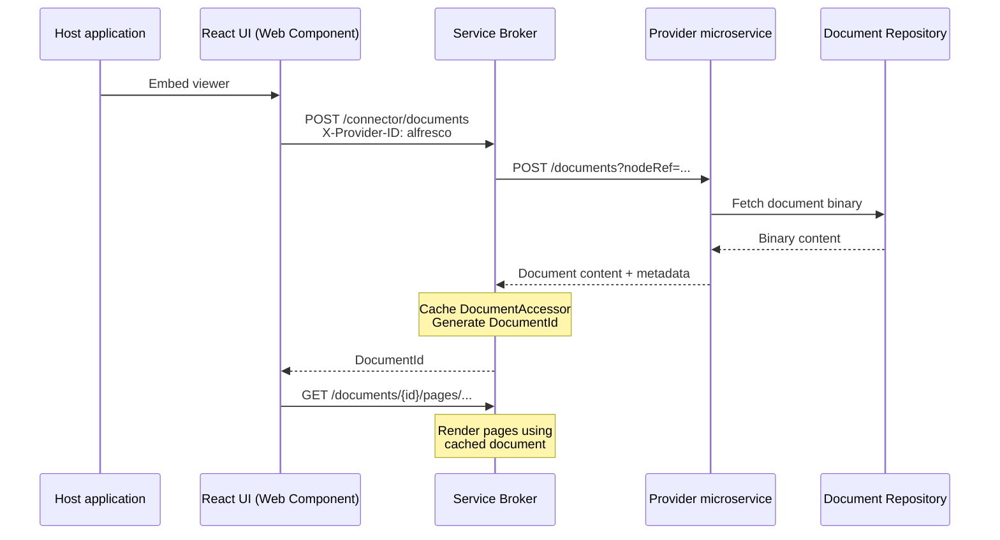

# Connector providers

The Modern Viewer loads documents from external repositories through **providers** — standalone REST microservices that run as their own Docker containers. Each provider communicates with the service broker over HTTP and handles document retrieval from a specific repository type.

This decoupled model means connectors have their own lifecycle, scaling, and release cadence — independent of the viewer and of each other.

For general connector concepts, see [Connectors](../../concepts/connectors.md).

## Architecture



1. The host application embeds the React UI as an `<arender-element>` Web Component.
2. The React UI sends a `POST /connector/documents` request to the broker, including an `X-Provider-ID` header that identifies which provider to use.
3. The broker looks up the provider's URL in its registry and forwards the request with the original query parameters and headers.
4. The provider fetches the document from the repository and returns the binary content (or a JSON folder structure for composite documents).
5. The broker caches the document, generates a `DocumentId`, and returns it to the React UI.
6. Subsequent page rendering requests use the cached document through the standard rendition pipeline.

## Available providers

ARender v2026 ships the following provider images:

| Provider | Docker image | Default port | Repository type |
|----------|-------------|-------------|----------------|
| Alfresco | `arender-alfresco-provider` | 8788 | Alfresco via CMIS |
| FileNet | `arender-filenet-provider` | 8787 | IBM FileNet Content Engine |

## Docker Compose example

Deploy the backend services with a provider:

```yaml
services:
  service-broker:
    image: docker-arender.arondor.com/document-service-broker:{{version}}
    ports:
      - "8761:8761"
    environment:
      # Register the Alfresco provider
      REGISTRY_PROVIDER_ALFRESCO_URL: http://alfresco-provider:8788
    volumes:
      - arender-tmp:/arender/tmp

  alfresco-provider:
    image: docker-arender.arondor.com/arender-alfresco-provider:{{version}}
    ports:
      - "8788:8788"
    environment:
      ARENDER_SERVER_ALFRESCO_ATOMPUBURL: http://alfresco:8080/alfresco/api/-default-/cmis/versions/1.1/atom

  document-renderer:
    image: docker-arender.arondor.com/document-renderer:{{version}}
    volumes:
      - arender-tmp:/arender/tmp

  document-converter:
    image: docker-arender.arondor.com/document-converter:{{version}}
    volumes:
      - arender-tmp:/arender/tmp

  document-text-handler:
    image: docker-arender.arondor.com/document-text-handler:{{version}}
    volumes:
      - arender-tmp:/arender/tmp

volumes:
  arender-tmp:
```

The React UI itself is embedded in your host application via the npm package — it does not appear in this Docker Compose file.

## Broker registry configuration

The broker needs to know each provider's URL. Configure this with Spring Boot properties:

```properties
# Register a provider named "alfresco" at the given URL
registry.provider.alfresco.url=http://alfresco-provider:8788

# Register a provider named "filenet"
registry.provider.filenet.url=http://filenet-provider:8787
```

Or as environment variables:

```bash
REGISTRY_PROVIDER_ALFRESCO_URL=http://alfresco-provider:8788
REGISTRY_PROVIDER_FILENET_URL=http://filenet-provider:8787
```

## How `X-Provider-ID` works

The `X-Provider-ID` HTTP header tells the broker which provider should handle the request. The React UI sets this header based on the document source. The broker uses it to look up the provider URL in its registry and route the request.

## FileNet provider configuration

The FileNet provider connects to an IBM FileNet Content Engine. Configure it with the following environment variables:

```bash
ARENDER_SERVER_FILENET_CE_URL=https://filenet-engine:9443/wsi/FNCEWS40MTOM/
ARENDER_SERVER_FILENET_CE_LOGIN=p8admin
ARENDER_SERVER_FILENET_CE_PASSWORD=secret
```

The default port is `8787`.

## Document model

Providers return one of two structures:

- **`ProviderFile`** — A single document with a name and a map of parameters. The broker receives the binary content in the response body.
- **`ProviderFolder`** — A folder containing nested `ProviderFile` and `ProviderFolder` entries. The broker converts this into a `DocumentContainer` hierarchy, fetching each file individually.

## Annotations through providers

Providers can also handle annotation storage. The broker proxies annotation CRUD operations to the provider:

| Operation | Broker endpoint | Provider endpoint |
|-----------|----------------|-------------------|
| List annotation IDs | `GET /documents/{id}/annotations/ids` | `GET /annotations/ids` |
| Get annotation | `GET /documents/{id}/annotations/{annotationId}` | `GET /annotations/{annotationId}` |
| Create annotation | `POST /documents/{id}/annotations` | `POST /annotations` |
| Update annotation | `PUT /documents/{id}/annotations/{annotationId}` | `PUT /annotations/{annotationId}` |
| Delete annotation | `DELETE /documents/{id}/annotations/{annotationId}` | `DELETE /annotations/{annotationId}` |

If your provider does not implement annotation endpoints, annotations fall back to the broker's default storage (XFDF files or JDBC, depending on your backend configuration).

## Building a custom provider

A provider is a Spring Boot application that implements REST endpoints matching the provider API contract. See the `sample-provider` source code for a reference implementation.

At minimum, implement:

```
GET /documents?<your-parameters>
```

Return the document binary as the response body, with appropriate `Content-Type` and `Content-Disposition` headers.

For annotation support, implement the annotation endpoints listed above.
