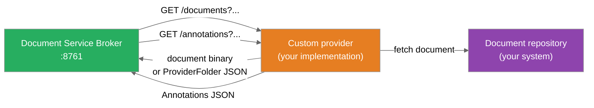

A provider is a standalone REST microservice that connects ARender to a document repository. The Document Service Broker routes document requests to the provider and receives document content or metadata in return. This guide explains how to build a provider that implements the ARender provider REST contract.

## 1. Overview

The provider contract is defined by the `rest-provider-api` library. Two response types exist: `ProviderFile` (a single document) and `ProviderFolder` (a composite document with child documents and sub-folders). The broker calls `GET /documents` on the provider with the document parameters as query string values. The provider returns either a raw binary stream (for a single file) or a JSON `ProviderFolder` structure (for composite documents).



*Figure: The broker calls the provider for documents and annotations.*

## 2. Prerequisites

- Java 17 or later
- Maven 3.8 or later
- Access to the ARender `rest-provider-api` library (available from the ARender Maven registry)
- A running ARender rendition backend to test against

## 3. Provider installation

A provider is a Spring Boot application packaged as a Docker image. The recommended starting point is to copy the `sample-provider` structure.

### Step 1: Add the dependency

Add the `rest-provider-api` dependency to your `pom.xml`:

```xml title="pom.xml"
<dependency>
    <groupId>com.arender.connector</groupId>
    <artifactId>rest-provider-api</artifactId>
    <version>{{version}}</version>
</dependency>
```

### Step 2: Create the application entry point

```java title="MyProviderApplication.java"
import org.springframework.boot.SpringApplication;
import org.springframework.boot.autoconfigure.SpringBootApplication;

@SpringBootApplication
public class MyProviderApplication {
    public static void main(String[] args) {
        SpringApplication.run(MyProviderApplication.class, args);
    }
}
```

### Step 3: Implement the document controller

Create a `@RestController` that handles the required endpoints. The minimum required endpoint is `GET /documents`.

```java title="MyProviderController.java"
import com.arender.connector.provider.api.document.ProviderFile;
import com.arender.connector.provider.api.document.ProviderFolder;
import org.springframework.http.HttpHeaders;
import org.springframework.web.bind.annotation.*;
import jakarta.servlet.http.HttpServletResponse;
import java.io.IOException;
import java.io.InputStream;

@RestController
public class MyProviderController {

    @GetMapping("/documents")
    public void loadDocument(
            @RequestParam("document_path") String documentPath,
            HttpServletResponse response) throws IOException {

        // Fetch the document from your repository
        InputStream content = myRepository.getDocument(documentPath);
        String title = myRepository.getTitle(documentPath);
        String mimeType = myRepository.getMimeType(documentPath);

        // Set content headers
        response.setHeader(HttpHeaders.CONTENT_TYPE, mimeType);
        if (title != null) {
            String encoded = java.net.URLEncoder.encode(title, "UTF-8");
            response.setHeader(HttpHeaders.CONTENT_DISPOSITION,
                "attachment; filename*=UTF-8''" + encoded);
        }
        response.setStatus(200);
        content.transferTo(response.getOutputStream());
    }
}
```

### Step 4: Package and deploy

Build the provider as a Docker image and add it to your Docker Compose stack:

<!-- [TODO: ZIP package not yet defined — inline content shown] -->

```yaml title="docker-compose.yml"
services:
  my-provider:
    image: my-org/my-arender-provider:{{version}}
    environment:
      - "MY_REPO_URL=http://my-repo:8080"
    ports:
      - "9000:9000"

  service-broker:
    image: artifactory.arondor.cloud:5001/arender-document-service-broker:{{version}}
    environment:
      - "CONNECTOR_REGISTRIES_MYPROVIDER_BASE_URL=http://my-provider:9000"
      - "CONNECTOR_REGISTRIES_MYPROVIDER_WHITELISTED_PARAMS=document_path"
      - "CONNECTOR_DEFAULT_REGISTRY=myprovider"
```

## 4. Configuration

### Broker side: provider registry

Register the provider in the Document Service Broker configuration. The broker needs the provider's base URL and the list of whitelisted query parameters.

| Property | Description |
|---|---|
| `connector.registries.<name>.baseUrl` | Base URL of the provider (e.g. `http://my-provider:9000`) |
| `connector.registries.<name>.whitelistedParams` | Comma-separated parameter names forwarded to the provider and used for document ID generation |
| `connector.defaultRegistry` | Name of the default provider when no `X-Provider-ID` header is present |

**Environment variable equivalents:**

```bash
CONNECTOR_REGISTRIES_MYPROVIDER_BASE_URL=http://my-provider:9000
CONNECTOR_REGISTRIES_MYPROVIDER_WHITELISTED_PARAMS=document_path
CONNECTOR_DEFAULT_REGISTRY=myprovider
```

The `whitelistedParams` list controls which query parameters are forwarded to the provider. Only the listed parameters are used when generating the internal `DocumentId` for caching. Parameters not in the list are stripped before the request reaches the provider.

### BFF side: provider routing

The BFF or reverse proxy must inject the `X-Provider-ID` header to route requests to the correct provider. The header value must match the registry key in the broker configuration.

```text
X-Provider-ID: myprovider
```

When multiple providers are registered, the BFF decides which provider to route to based on the request context (user session, URL path, tenant, etc.).

### Response types

#### Single document: binary stream

For a single document, write the content bytes directly to the HTTP response output stream and set `Content-Type` and optionally `Content-Disposition`.

The broker treats any response with a binary body as a single document. It detects the MIME type from the `Content-Type` header and routes the document through the rendition pipeline accordingly.

#### Composite document: ProviderFolder JSON

For composite documents (multiple files viewed together as one), return a `ProviderFolder` JSON object. The broker recursively processes the folder structure, rendering each `ProviderFile` as a section of the composite document.

```java
// Simple two-document composite
ProviderFolder folder = new ProviderFolder("My Composite");
folder.setContents(new java.util.ArrayList<>());

ProviderFile doc1 = new ProviderFile("Page 1");
doc1.setParameters(java.util.Map.of("document_path", "file-001"));

ProviderFile doc2 = new ProviderFile("Page 2");
doc2.setParameters(java.util.Map.of("document_path", "file-002"));

folder.getContents().add(doc1);
folder.getContents().add(doc2);
```

Respond with `Content-Type: application/json` and write the folder using a JSON serializer. The broker calls back to the provider for each `ProviderFile`'s `parameters` map as individual document requests.

#### Model reference

| Class | Type field value | Description |
|---|---|---|
| `ProviderFile` | `"file"` | Single document. Contains `name` (string) and `parameters` (map of string to string) |
| `ProviderFolder` | `"folder"` | Composite document. Contains `name`, `parameters`, and `contents` (list of `ProviderDocument`) |
| `ProviderDocument` | (abstract) | Base class for `ProviderFile` and `ProviderFolder`. Contains `name` |

The JSON type discriminator is the `type` field: `"file"` or `"folder"`. Jackson handles this automatically via `@JsonSubTypes` annotations on `ProviderDocument`.

### Annotation endpoints

To support annotations, implement the following endpoints. All are optional; omitting them disables annotation features for documents served by this provider.

| Endpoint | Method | Parameters | Description |
|---|---|---|---|
| `/annotations` | GET | Same params as `/documents` | Return all annotations as an `Annotations` object |
| `/annotations/ids` | GET | Same params | Return a list of `AnnotationId` |
| `/annotations/{annotationId}` | GET | Same params + path var | Return a single `Annotation` |
| `/annotations` | POST | Same params + request body `Annotation` | Create an annotation |
| `/annotations/{annotationId}` | PUT | Same params + path var + request body | Update an annotation |
| `/annotations/{annotationId}` | DELETE | Same params + path var | Delete an annotation |

The `Annotations`, `Annotation`, and `AnnotationId` types are from the ARender annotation API (`arondor-viewer-annotation-api`).

## 5. Verification

After deploying the provider, run the following checks before testing end-to-end rendering.

1. Verify the provider is reachable at its configured base URL. Replace `<your-params>` with the query parameters your provider requires:

```bash
curl "http://my-provider:9000/documents?document_path=some-test-doc"
```

Expected: a document binary stream is returned with `Content-Type` and `Content-Disposition` headers set.

2. Confirm the broker recognizes the provider. Open the broker Swagger UI at `http://localhost:8761/swagger-ui.html` (or the actuator environment endpoint at `http://localhost:8761/actuator/env`) and check that `connector.registries.myprovider.base-url` is present with the correct value. Alternatively, inspect the broker startup logs for a line confirming the connector registry was loaded.

3. Load a document through the Modern viewer. Pass the required query parameters and confirm the document renders without error. If the broker cannot reach the provider, the viewer will show a loading error; check the broker container logs for a `Connection refused` or `404` on the provider URL.

## 6. Sample use case

A company operates an internal document management system (DMS) that exposes a proprietary REST API. Documents are identified by a `dms_id` parameter. The company wants to display DMS documents in the ARender Modern viewer without migrating the DMS to a standard protocol.

The solution is a custom provider that implements the `rest-provider-api` contract:

```mermaid
%%{init: {'theme': 'neutral'}}%%
%% Custom DMS provider deployment
flowchart LR
  classDef arender fill:#27AE60,color:#fff
  classDef custom fill:#E67E22,color:#fff
  classDef infra fill:#8E44AD,color:#fff

  Viewer["Modern viewer<br/>(React Web Component)"]:::arender
  BFF["BFF / reverse proxy<br/>(injects X-Provider-ID: dms)"]:::arender
  Broker["Document Service Broker<br/>:8761"]:::arender
  Provider["dms-provider<br/>:9000"]:::custom
  DMS["Internal DMS<br/>(proprietary REST API)"]:::infra

  Viewer --> BFF
  BFF --> Broker
  Broker -- "GET /documents?dms_id=..." --> Provider
  Provider -- "GET /api/documents/{dms_id}/content" --> DMS
  Provider -- "binary stream" --> Broker
```



The Docker Compose stack for this deployment:

```yaml title="docker-compose.yml"
services:
  dms-provider:
    image: my-org/dms-arender-provider:1.0.0
    environment:
      - "DMS_BASE_URL=http://internal-dms:8080"
    ports:
      - "9000:9000"

  service-broker:
    image: artifactory.arondor.cloud:5001/arender-document-service-broker:{{version}}
    environment:
      - "CONNECTOR_REGISTRIES_DMS_BASE_URL=http://dms-provider:9000"
      - "CONNECTOR_REGISTRIES_DMS_WHITELISTED_PARAMS=dms_id"
      - "CONNECTOR_DEFAULT_REGISTRY=dms"
```

The BFF injects `X-Provider-ID: dms` on every request. The broker routes requests to the `dms-provider`, which translates the ARender provider contract into calls against the internal DMS API. Document content is returned as a binary stream; the rendition pipeline handles format detection and rendering.

## 7. Common issues

| Issue | Cause | Solution |
|---|---|---|
| Broker returns 404 for documents | Provider URL is incorrect in the broker registry | Verify `connector.registries.<name>.baseUrl` points to the running provider |
| Document is cached with wrong ID | Required parameters are not in `whitelistedParams` | Add all parameters that uniquely identify a document to the `whitelistedParams` list |
| `Content-Disposition` filename is garbled | Filename not URL-encoded | Encode the filename with `URLEncoder.encode(name, "UTF-8")` and use `filename*=UTF-8''<encoded>` format |
| Composite document returns blank pages | `ProviderFile.parameters` does not match the parameters expected by `/documents` | Ensure the parameter names in `ProviderFile.parameters` match the query parameter names your controller reads |
| Provider not called | `X-Provider-ID` header is absent or has an unknown value | Confirm the BFF injects the header and that the header value matches a registered provider name in the broker |

## 8. References

- [Connector providers concept](./connector-providers.md)
- [Alfresco provider](./alfresco.md) (reference implementation)
- [FileNet provider](./filenet.md) (reference implementation)
- [Provider REST API reference](../../reference/rest-api/provider-api.md)
- [Rendition configuration](../../reference/rendition-properties.md)
