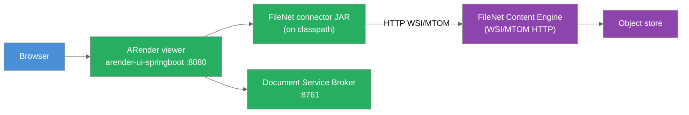

ARender integrates with IBM FileNet Content Engine (P8) through a connector JAR bundled on the `arender-ui-springboot` classpath. The connector connects to the Content Engine using the WSI/MTOM HTTP protocol and stores annotations natively in the FileNet P8 annotation model.

## 1. Overview

The FileNet connector is bundled on the `arender-ui-springboot` classpath in the `-filenet` image variant. It implements the `DocumentAccessor` interface and activates automatically when the ARender viewer receives a request containing `objectStoreName` or `objectStoreId`.



*Figure: Request flow from the Classic viewer to FileNet through the connector JAR.*

## 2. Prerequisites

- ARender Classic viewer (`arender-ui-springboot`) running
- IBM FileNet Content Engine 5.2 or later
- The FileNet WSI/MTOM HTTP endpoint active (typically at `:9080/wsi/FNCEWS40MTOM/`)
- A valid FileNet object store
- Network connectivity from the ARender viewer host to the Content Engine HTTP endpoint

## 3. Connector installation

The connector is included in the `-filenet` image variant of the ARender viewer. No separate volume mount is required.

```yaml title="docker-compose.yml"
services:
  ui:
    image: artifactory.arondor.cloud:5001/arender-ui-springboot:{{version}}-filenet
    environment:
      - "ARENDERSRV_ARENDER_SERVER_RENDITION_HOSTS=http://service-broker:8761/"
      - "ARENDERSRV_ARENDER_SERVER_FILENET_CE_URL=http://filenet-ce:9080/wsi/FNCEWS40MTOM/"
      - "ARENDERSRV_ARENDER_SERVER_FILENET_AUTHENTICATION_METHOD=loginPasswordObjectStoreProvider"
      - "ARENDERSRV_ARENDER_SERVER_FILENET_CE_LOGIN=svc-arender"
      - "ARENDERSRV_ARENDER_SERVER_FILENET_CE_PASSWORD=secret"
    ports:
      - "8080:8080"
```

:::note
This excerpt shows only the `ui` service configuration. The full rendition stack (service-broker, converter, renderer, text-handler) is also required. See [Docker Compose](../../installation/docker-compose.classic.md) for the complete configuration.
:::

### Kubernetes (Helm)

For Kubernetes, use an init container or a custom Docker image that includes the connector JAR in `/home/arender/lib/`. Use `extraVolumes` and `extraVolumeMounts` in the Helm chart to inject the JAR at deployment time. See [Kubernetes / Helm](../../installation/kubernetes-helm.md) for the pattern.

## 4. Configuration

All connector properties are set on the `ui` service. The following environment variables correspond to properties in `arender-server.properties`.

### Authentication modes

Select the authentication mode via `arender.server.filenet.authentication.method`.

#### Login/password (service account)

All users access FileNet through a shared service account. Use the HTTP MTOM endpoint.

```bash
ARENDERSRV_ARENDER_SERVER_FILENET_AUTHENTICATION_METHOD=loginPasswordObjectStoreProvider
ARENDERSRV_ARENDER_SERVER_FILENET_CE_URL=http://filenet-ce:9080/wsi/FNCEWS40MTOM/
ARENDERSRV_ARENDER_SERVER_FILENET_CE_LOGIN=svc-arender
ARENDERSRV_ARENDER_SERVER_FILENET_CE_PASSWORD=secret
```

#### OAuth2 authentication

Pass an OAuth2 token to FileNet. Use this mode when ARender is behind an OAuth2-secured gateway.

First, enable OAuth2 on the ARender viewer and configure the Spring OAuth2 client:

```bash
ARENDER_SERVER_OAUTH2_ENABLED=true
SPRING_SECURITY_OAUTH2_CLIENT_REGISTRATION_ARENDER_CLIENT_ID=arender-client
SPRING_SECURITY_OAUTH2_CLIENT_REGISTRATION_ARENDER_CLIENT_SECRET=<client-secret>
SPRING_SECURITY_OAUTH2_CLIENT_REGISTRATION_ARENDER_PROVIDER=keycloak
SPRING_SECURITY_OAUTH2_CLIENT_REGISTRATION_ARENDER_AUTHORIZATION_GRANT_TYPE=authorization_code
SPRING_SECURITY_OAUTH2_CLIENT_REGISTRATION_ARENDER_SCOPE=openid
SPRING_SECURITY_OAUTH2_CLIENT_REGISTRATION_ARENDER_REDIRECT_URI={baseUrl}/login/oauth2/code/{registrationId}
SPRING_SECURITY_OAUTH2_CLIENT_PROVIDER_KEYCLOAK_AUTHORIZATION_URI=https://<keycloak-host>/realms/<realm>/protocol/openid-connect/auth
SPRING_SECURITY_OAUTH2_CLIENT_PROVIDER_KEYCLOAK_TOKEN_URI=https://<keycloak-host>/realms/<realm>/protocol/openid-connect/token
SPRING_SECURITY_OAUTH2_CLIENT_PROVIDER_KEYCLOAK_JWK_SET_URI=https://<keycloak-host>/realms/<realm>/protocol/openid-connect/certs
SPRING_SECURITY_OAUTH2_CLIENT_PROVIDER_KEYCLOAK_USER_NAME_ATTRIBUTE=preferred_username
SPRING_SECURITY_OAUTH2_RESOURCESERVER_JWT_ISSUER_URI=https://<keycloak-host>/realms/<realm>
```

Then set the FileNet connector to use the OAuth2 mode:

```bash
ARENDERSRV_ARENDER_SERVER_FILENET_AUTHENTICATION_METHOD=oauth2ObjectStoreProvider
ARENDERSRV_ARENDER_SERVER_FILENET_CE_URL=http://filenet-ce:9080/wsi/FNCEWS40MTOM/
ARENDERSRV_ARENDER_SERVER_SECURITY_OAUTH2_PREFIX=Bearer
```

#### JAAS (default)

Uses container-managed JAAS authentication. This is the default mode (`jaasObjectStoreProvider`).

### Core configuration reference

| Environment variable | Property | Default | Description |
|---|---|---|---|
| `ARENDERSRV_ARENDER_SERVER_FILENET_AUTHENTICATION_METHOD` | `arender.server.filenet.authentication.method` | `jaasObjectStoreProvider` | Authentication mode: `loginPasswordObjectStoreProvider`, `oauth2ObjectStoreProvider`, or `jaasObjectStoreProvider` |
| `ARENDERSRV_ARENDER_SERVER_FILENET_CE_URL` | `arender.server.filenet.ce.url` | `http://localhost:9080/wsi/FNCEWS40MTOM/` | Content Engine HTTP endpoint URL |
| `ARENDERSRV_ARENDER_SERVER_FILENET_CE_LOGIN` | `arender.server.filenet.ce.login` | (empty) | Service account login (login/password mode only) |
| `ARENDERSRV_ARENDER_SERVER_FILENET_CE_PASSWORD` | `arender.server.filenet.ce.password` | (empty) | Service account password (login/password mode only) |
| `ARENDERSRV_ARENDER_SERVER_SECURITY_OAUTH2_PREFIX` | `arender.server.security.oauth2.prefix` | (empty) | Token prefix for OAuth2 mode (e.g. `Bearer`) |
| `ARENDERSRV_ARENDER_SERVER_FILENET_KEEP_XML_ATTRIBUTES_AS_DOCUMENT_PROPERTIES` | `arender.server.filenet.keep.xml.attributes.as.document.properties` | `false` | Expose XML attributes as document properties in the viewer |
| `ARENDERSRV_ARENDER_SERVER_ANNOTATIONS_FILENET_CAN_CREATE` | `arender.server.annotations.filenet.can.create` | `true` | Allow users to create annotations on FileNet documents |
| `ARENDERSRV_ARENDER_SERVER_LEGACY_LAYOUT_ENABLED` | `arender.server.legacy.layout.enabled` | `true` | Use blocking layout call (required for FileNet authentication context propagation) |

### Annotation storage

Two annotation storage modes are available.

**Native FileNet annotations (default):** Annotations are stored as FileNet P8 annotation objects using the native API.

```properties
arender.server.wrapper.source.annotation.accessor=fileNetAnnotationAccessor
```

**XFDF annotations stored in FileNet:** Annotations are stored as XFDF files attached to the document using the FileNet P8 API. Use this mode for XFDF compatibility with external tools.

```properties
arender.server.wrapper.source.annotation.accessor=xfdfFileNetAnnotationAccessor
```

### URL parameters

The FileNet connector activates when a request contains `objectStoreName` or `objectStoreId`.

| Parameter | Required | Description |
|---|---|---|
| `objectStoreName` | One of the two | Object store display name (URL-encoded) |
| `objectStoreId` | One of the two | Object store GUID |
| `objectType` | No | `DOCUMENT` (default), `FOLDER`, `MULTISELECT`, `XMLDESCRIPTOR`, `FILENETCONTAINER`, `MIXEDOBJECTS`, `CONTENTCONTAINERXML`, `SETMULTISELECT` |
| `id` | Yes (for DOCUMENT, FOLDER) | FileNet document or folder GUID |
| `vsId` | Alternative to `id` | Version series GUID; opens the current version |
| `ids` | Yes (for MIXEDOBJECTS) | Comma-separated list of `type:guid` pairs |
| `contentElement` | No | Index of the content element to open when a document has multiple content elements |

### Document Builder configuration

| Property | Default | Description |
|---|---|---|
| `arender.server.filenet.document.builder.create.new.document.bean.name` | `filenetDocumentUpdaterCopy` | Bean for creating a new document from Document Builder |
| `arender.server.filenet.document.builder.update.first.document.bean.name` | `filenetDocumentUpdaterNewVersion` | Bean for updating the first document (creates a new version) |
| `arender.server.filenet.document.builder.update.all.document.bean.name` | `filenetDocumentUpdaterPropertiesUpdater` | Bean for "update all" operation |
| `arender.server.filenet.document.builder.update.first.document.properties.copy.bean.name` | `legacyFileNetPropertiesCopy` | Property copy strategy: `legacyFileNetPropertiesCopy` or `advancedFileNetPropertiesMerger` |
| `arender.server.filenet.document.builder.disabled.for.checkout.and.archived.documents` | `false` | Disable Document Builder on checked-out or archived documents |
| `arender.server.filenet.document.builder.unauthorized.object.store.ids` | (empty) | Comma-separated object store IDs where Document Builder is blocked |

### Watermark configuration

| Property | Default | Description |
|---|---|---|
| `arender.server.watermark.display.provider` | `defaultParameterDisplayWatermarkProvider` | Set to `fileNetDisplayWatermarkProvider` to activate group-based watermarks |
| `arender.server.watermark.filenet.group.with` | (empty) | Comma-separated FileNet groups that receive the watermark |
| `arender.server.watermark.filenet.group.without` | (empty) | Comma-separated FileNet groups exempt from the watermark |
| `arender.server.watermark.filenet.document.class` | (empty) | Comma-separated FileNet document classes that trigger the watermark |
| `arender.watermark.bean.name` | `customWatermark` | Spring bean ID of the watermark to display |

## 5. Verification

1. Verify the CE endpoint is reachable from the viewer container:

```bash
curl http://filenet-ce:9080/wsi/FNCEWS40MTOM/
```

Expected: a WSDL or service description from the CE endpoint.

2. Open a document using a URL with `objectStoreName` and `id` parameters:

```text
http://arender.example.com:8080/?objectStoreName=MyObjectStore&id={doc-guid}&objectType=DOCUMENT
```

3. Confirm the document renders and annotations load correctly.

## 6. Sample use case

A bank uses IBM FileNet as its enterprise content store. Loan officers open documents directly from the IBM Content Navigator interface. The ARender Classic viewer is embedded in ICN as a viewer plugin. When a loan officer opens a contract:

1. ICN constructs an ARender URL with `objectStoreName`, `id`, and `objectType`.
2. The FileNet connector authenticates using the service account credentials.
3. The connector retrieves the document content via the WSI/MTOM API.
4. The broker renders the document. Annotations are stored natively in FileNet using `fileNetAnnotationAccessor`.

## 7. Common issues

| Error | Cause | Solution |
|---|---|---|
| `Connection refused` on startup | CE HTTP endpoint unreachable | Verify the endpoint URL is correct and reachable from the viewer container |
| Authentication failure | Incorrect credentials or the service account lacks access to the object store | Verify the credentials and FileNet role assignments for the service account |
| Annotations do not load | Wrong annotation accessor bean | Confirm `arender.server.wrapper.source.annotation.accessor` is set to `fileNetAnnotationAccessor` or `xfdfFileNetAnnotationAccessor` consistently |
| Layout call blocks | `arender.server.legacy.layout.enabled` is `false` | Set `legacy.layout.enabled=true`. FileNet authentication context does not propagate to new threads without this setting |
| Documents open but annotations are inconsistent after switching accessor type | Existing annotations were created with a different accessor | Choose one accessor type and migrate annotations. Do not switch accessor types on an existing deployment without a migration plan |