ARender integrates with IBM FileNet Content Engine (P8) through the `filenet-provider` microservice. The provider is a standalone Spring Boot application that connects to the Content Engine using either a login/password service account, OAuth2 token forwarding, or JAAS, and exposes the ARender provider REST contract to the Document Service Broker.

## 1. Overview

The `filenet-provider` runs as a Docker container alongside the ARender rendition backend. The Document Service Broker routes document requests to it based on the `X-Provider-ID` header injected by the BFF or reverse proxy. The provider fetches documents from a FileNet object store and returns them for rendering.

```mermaid
%%{init: {'theme': 'neutral'}}%%
%% ARender Horizon FileNet integration
flowchart LR
  classDef client fill:#4A90D9,color:#fff
  classDef arender fill:#27AE60,color:#fff
  classDef ecm fill:#8E44AD,color:#fff

  Browser["Browser"]:::client
  Element["arender-element<br/>(Web Component)"]:::client
  BFF["BFF / reverse proxy<br/>(injects X-Provider-ID)"]:::arender
  Broker["Document Service Broker<br/>:8761"]:::arender
  Provider["filenet-provider<br/>:8787"]:::arender
  CE["FileNet Content Engine<br/>(WSI/MTOM HTTP)"]:::ecm
  Store["Object store"]:::ecm

  Browser --> Element
  Element --> BFF
  BFF --> Broker
  Broker -- "X-Provider-ID: filenet" --> Provider
  Provider -- "HTTP WSI/MTOM" --> CE
  CE --> Store
```



*Figure: Request flow from ARender Horizon to FileNet through the provider.*

## 2. Prerequisites

- ARender rendition backend running (broker, converter, renderer, text handler)
- A BFF or reverse proxy that injects the `X-Provider-ID: filenet` header or set the configuration `registry.default-provider=filenet`
- IBM FileNet Content Engine 5.2 or later with the WSI/MTOM HTTP endpoint active
- A valid FileNet object store
- Network connectivity from the `filenet-provider` container to the Content Engine endpoint
- Java 17 or later (if building from source)

## 3. Provider installation

The provider ships as a Docker image. Add it to your Docker Compose stack alongside the rendition services.

<!-- [TODO: ZIP package not yet defined — inline content shown] -->

```yaml title="docker-compose.yml"
services:
  filenet-provider:
    image: artifactory.arondor.cloud:5001/arender-filenet-provider:{{version}}
    environment:
      - "ARENDER_SERVER_FILENET_AUTHENTICATION_METHOD=loginPasswordObjectStoreProvider"
      - "ARENDER_SERVER_FILENET_CE_URL=http://filenet-ce:9080/wsi/FNCEWS40MTOM/"
      - "ARENDER_SERVER_FILENET_CE_LOGIN=svc-arender"
      - "ARENDER_SERVER_FILENET_CE_PASSWORD=secret"
    ports:
      - "8787:8787"

  service-broker:
    image: artifactory.arondor.cloud:5001/arender-document-service-broker:{{version}}
    environment:
      - "DSB_KUBEPROVIDER_KUBE.HOSTS_DOCUMENT-CONVERTER=19999"
      - "DSB_KUBEPROVIDER_KUBE.HOSTS_DOCUMENT-RENDERER=9091"
      - "DSB_KUBEPROVIDER_KUBE.HOSTS_DOCUMENT-TEXT-HANDLER=8899"
      - "REGISTRY_PROVIDERS_FILENET_BASE_URL=http://filenet-provider:8787"
      - "REGISTRY_PROVIDERS_FILENET_WHITELISTED_PARAMS=objectStoreName,objectStoreId,objectType,id,ids,vsId,vsIds,objectId,contentElement"
      - "REGISTRY_DEFAULT_PROVIDER=filenet"
    # ... rendition services omitted for brevity
```

## 4. Configuration

The provider is configured through Spring Boot externalized configuration. All properties under `arender.server.filenet.*` can be set as environment variables.

### Application properties

```properties title="application.properties"
# HTTP port (default: 8787)
server.port=8787

# OAuth2 resource server (required for oauth2ObjectStoreProvider)
spring.security.oauth2.resourceserver.jwt.issuer-uri=http://localhost:8080/auth/realms/myrealm

# Authentication method: oauth2ObjectStoreProvider | loginPasswordObjectStoreProvider | jaasObjectStoreProvider
arender.server.filenet.authentication.method=loginPasswordObjectStoreProvider

# Content Engine WSI/MTOM HTTP endpoint
arender.server.filenet.ce.url=http://localhost:9080/wsi/FNCEWS40MTOM/

# Service account credentials (loginPasswordObjectStoreProvider only)
arender.server.filenet.ce.login=p8admin
arender.server.filenet.ce.password=filenet

# OAuth2 token prefix (oauth2ObjectStoreProvider only)
arender.server.filenet.security.oauth2.prefix=
```

### Authentication modes

The provider supports three authentication methods, selected via `arender.server.filenet.authentication.method`.

#### Login/password (service account)

All requests use a shared technical account. Use the WSI/MTOM HTTP endpoint.

```bash
ARENDER_SERVER_FILENET_AUTHENTICATION_METHOD=loginPasswordObjectStoreProvider
ARENDER_SERVER_FILENET_CE_URL=http://filenet-ce:9080/wsi/FNCEWS40MTOM/
ARENDER_SERVER_FILENET_CE_LOGIN=svc-arender
ARENDER_SERVER_FILENET_CE_PASSWORD=secret
```

#### OAuth2 token forwarding

The provider acts as an OAuth2 resource server. It validates the JWT from the incoming request, then passes the token (with optional prefix) to FileNet for authentication. Use this mode when ARender is behind an OAuth2-secured gateway.

```bash
ARENDER_SERVER_FILENET_AUTHENTICATION_METHOD=oauth2ObjectStoreProvider
ARENDER_SERVER_FILENET_CE_URL=http://filenet-ce:9080/wsi/FNCEWS40MTOM/
ARENDER_SERVER_FILENET_SECURITY_OAUTH2_PREFIX=
SPRING_SECURITY_OAUTH2_RESOURCESERVER_JWT_ISSUER_URI=https://keycloak.example.com/auth/realms/myrealm
```

The provider extracts the principal name and access token from the validated JWT. These are used with the `FileNetP8WSI` JAAS stanza to authenticate the subject against FileNet.

### Configuration reference

| Property | Default | Description |
|---|---|---|
| `server.port` | `8787` | HTTP port the provider listens on |
| `arender.server.filenet.authentication.method` | `oauth2ObjectStoreProvider` | Authentication mode: `loginPasswordObjectStoreProvider`, `oauth2ObjectStoreProvider`, or `jaasObjectStoreProvider` |
| `arender.server.filenet.ce.url` | `http://localhost:9080/wsi/FNCEWS40MTOM/` | Content Engine WSI/MTOM HTTP endpoint URL |
| `arender.server.filenet.ce.login` | `p8admin` | Service account login (login/password mode only) |
| `arender.server.filenet.ce.password` | `filenet` | Service account password (login/password mode only) |
| `arender.server.filenet.security.oauth2.prefix` | (empty) | Prefix prepended to the OAuth2 token when authenticating to FileNet |
| `spring.security.oauth2.resourceserver.jwt.issuer-uri` | — | JWT issuer URI for OAuth2 resource server validation (OAuth2 mode only) |

### Request parameters

The broker forwards the following query parameters to the provider. They must be listed in `REGISTRY_PROVIDERS_FILENET_WHITELISTED_PARAMS` on the broker.

| Parameter | Required | Description |
|---|---|---|
| `objectStoreName` | One of the two | Object store display name (URL-encoded) |
| `objectStoreId` | One of the two | Object store GUID |
| `objectType` | No | `DOCUMENT` (default), `FOLDER`, `MULTISELECT`, `XMLDESCRIPTOR`, `FILENETCONTAINER`, `MIXEDOBJECTS`, `CONTENTCONTAINERXML`, `SETMULTISELECT` |
| `id` | Yes (for DOCUMENT, FOLDER) | FileNet document or folder GUID |
| `vsId` | Alternative to `id` | Version series GUID; opens the current version |
| `ids` | Yes (for MIXEDOBJECTS) | Comma-separated list of GUIDs |
| `vsIds` | No | Comma-separated version series GUIDs |
| `objectId` | No | Additional object identifiers (list) |
| `contentElement` | No | Index of the content element to open when a document has multiple content elements |

The host application passes these parameters to the viewer as a single query string, which reaches the provider untouched:

```javascript
window.ARender.openDocument('objectStoreName=OS1&id=93DFA526-1B2C-4D3E-8F90-ABCDEF123456');
```

Parameters are grouped by key and each key keeps its own order, so lists (`ids`, `vsIds`, `objectId`) stay paired by index end to end. See [Web Component → Parameter contract](../../reference/web-component.md#parameter-contract) for the encoding rules, and note that `uuid` is reserved by the viewer — never use it as a FileNet parameter name.

### Annotation access

The provider exposes annotation CRUD endpoints:

| Endpoint | Method | Description |
|---|---|---|
| `/documents` | GET | Retrieve document content |
| `/annotations` | GET | Retrieve all annotations for a document |
| `/annotations/ids` | GET | Retrieve annotation identifiers |
| `/annotations/{annotationId}` | GET | Retrieve a single annotation |
| `/annotations` | POST | Create an annotation |
| `/annotations/{annotationId}` | PUT | Update an annotation |
| `/annotations/{annotationId}` | DELETE | Delete an annotation |

## 5. Verification

1. Verify the Content Engine endpoint is reachable from the provider container:

```bash
curl http://filenet-ce:9080/wsi/FNCEWS40MTOM/
```

Expected: a WSDL or service description response from the CE MTOM endpoint.

2. Check provider logs on startup. A successful connection produces log output indicating the CE connection was established.

3. Load a document through ARender Horizon:

```javascript
window.ARender.openDocument('objectStoreName=<objectStoreName>&id=<documentGuid>');
```

Confirm the document renders and that no connection errors appear in the provider logs.

## 6. Sample use case

A financial institution uses IBM FileNet to store client contracts. ARender Horizon is embedded in a React application through the `<arender-element>` Web Component. When a case worker opens a contract:

1. The React application authenticates the user via OAuth2, obtains a JWT, and calls `window.ARender.openDocument('objectStoreName=OS1&id=…')`.
2. The `X-Provider-ID: filenet` header is injected by the BFF along with the JWT as a Bearer token.
3. The broker routes the request to `filenet-provider:8787`.
4. The provider validates the JWT (OAuth2 resource server), extracts the principal and token, and authenticates to FileNet using the `FileNetP8WSI` JAAS stanza.
5. The provider retrieves the contract from the object store and streams it to the broker.
6. The broker renders the contract and returns page images to the viewer.

## 7. Common issues

| Error | Cause | Solution |
|---|---|---|
| `Connection refused` on CE URL | The CE WSI/MTOM endpoint is unreachable from the provider container | Verify network connectivity: `curl <ce-url>` from inside the provider container |
| Authentication failure with `loginPasswordObjectStoreProvider` | Incorrect credentials or the service account lacks access to the object store | Verify credentials and that the account has the required FileNet roles |
| JWT validation failure with `oauth2ObjectStoreProvider` | The `spring.security.oauth2.resourceserver.jwt.issuer-uri` does not match the token's issuer | Confirm the issuer URI matches the token's `iss` claim exactly |
| `IllegalStateException` on document request | Missing `objectStoreName` or `objectStoreId` in request | Check the query string passed to `openDocument()`, ensure the BFF forwards it unchanged, and that the parameters are whitelisted in the broker |
| Provider starts but documents return 404 | The `objectType` parameter does not match the FileNet object | Confirm `objectType` is set correctly (`DOCUMENT`, `FOLDER`, etc.) |