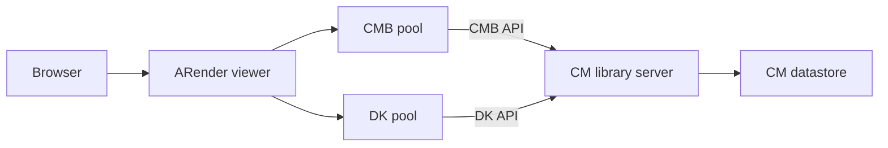

# IBM Content Manager integration

The IBM Content Manager (CM) connector integrates ARender with IBM Content Manager 8.1. It fetches documents from a CM library server using the CM Java SDK (`CMBConnection` / `DKDatastoreICM` APIs) and stores annotations natively using the CM annotation model.

## Prerequisites

- ARender viewer with the CM connector JAR on its classpath
- IBM Content Manager 8.1 or later
- The CM client libraries from your CM installation placed on the viewer classpath:
  - `Beans.jar` (CMB beans API)
  - `cm.jar` / SDK JARs
  - `db2jcc.jar` and license JARs (`db2jcc_license_cisuz.jar`, `db2jcc_license_cu.jar`)
  - `cmbview81.jar` (CM viewer/annotation API)
- Network connectivity from the ARender viewer host to the CM library server (default port: `1919` for RMI, `50000` for DB2)
- A valid CM datastore and service account credentials

:::note
The CM client libraries are not redistributed by ARender. Obtain them from your IBM Content Manager installation and add them to the viewer's classpath alongside the connector JAR.
:::

## Architecture



The viewer receives a request containing a `docid` URL parameter. The connector establishes a pooled connection to the CM library server, fetches the document content, and returns it to the rendition pipeline. Annotations are read and written using the CM annotation API (`CMBAnnotationSet`).

The connector maintains two connection pools:

- **CMBConnectionPool** (`CMConnection`): used for document metadata and annotation operations via the CMB beans API
- **DKDatastorePool** (`DKConnection`): used for document content retrieval via the DK SDK (`DKDatastoreICM`)

## Step 1: Deploy the CM connector

Place the connector JAR and the CM client libraries in the viewer's lib directory:

```yaml
# docker-compose.yml excerpt
services:
  ui:
    image: artifactory.arondor.cloud:5001/arender-ui-springboot:2026.0.0-cm
    environment:
      - "ARENDERSRV_ARENDER_SERVER_RENDITION_HOSTS=http://service-broker:8761/"
    volumes:
      - ./lib/Beans.jar:/home/arender/lib/Beans.jar
      - ./lib/cm.jar:/home/arender/lib/cm.jar
      - ./lib/db2jcc.jar:/home/arender/lib/db2jcc.jar
      - ./lib/db2jcc_license_cisuz.jar:/home/arender/lib/db2jcc_license_cisuz.jar
      - ./lib/db2jcc_license_cu.jar:/home/arender/lib/db2jcc_license_cu.jar
      - ./lib/cmbview81.jar:/home/arender/lib/cmbview81.jar
      - ./config/cmbclient.ini:/home/arender/config/cmbclient.ini
      - ./config/cmbicmsrvs.ini:/home/arender/config/cmbicmsrvs.ini
      - ./config/cmbicmenv.ini:/home/arender/config/cmbicmenv.ini
    ports:
      - 8080:8080
```

## Step 2: Configure the CM INI files

The CM SDK requires three INI configuration files that describe the server connection. These files are read by the CM client library at runtime.

### cmbclient.ini

Specifies the CM server RMI endpoint:

```ini
RemoteHost=cm-library-server
RemotePort=1919
```

### cmbicmsrvs.ini

Specifies the CM datastore and database connection details:

```ini
ICMSERVER=ICMNLSDB
ICMSERVERREPTYPE=DB2
ICMSCHEMA=ICMADMIN
ICMSSO=FALSE
ICMDBAUTH=SERVER
ICMREMOTE=TRUE
ICMHOSTNAME=cm-db2-server
ICMPORT=50000
ICMREMOTEDB=ICMNLSDB
ICMNODENAME=
ICMOSTYPE=LNX
ICMJDBCDRIVER=
ICMJDBCURL=
ICMJNDIREF=
```

### cmbicmenv.ini

Contains the Base64-encoded credentials for the CM datastore (format: `datastore=(base64(login;password))`):

```ini
icmnlsdb=(base64encodedcredentials=)
```

:::note
The `cmbicmenv.ini` file encodes the CM login and password in Base64. Treat this file as a secret and do not commit it to source control. Use a Docker secret or a mounted volume from a secure store.
:::

## Step 3: Configure the connector properties

The CM connector is configured via Spring XML beans or environment variables. The two key components are `CMConnection` (CMB beans API) and `DKConnection` (DK SDK).

### CMConnection

Manages the CMB connection pool used for metadata retrieval and annotation operations.

| Property | Default | Description |
|----------|---------|-------------|
| `dsType` | `ICM` | CM datasource type. Use `ICM` for standard CM installations. |
| `serverName` | `ICMNLSDB` | CM library server (datastore) name. Must match the `ICMSERVER` entry in `cmbicmsrvs.ini`. |
| `userId` | (required) | CM service account user ID. |
| `password` | (required) | CM service account password. |
| `connectionPoolSize` | `10` | Maximum number of CMB connections in the pool. |
| `connectionPoolFree` | `5` | Maximum number of idle connections retained in the pool. |
| `connectionDuration` | `100000` | Connection timeout in milliseconds. |

### DKConnection

Manages the DK datastore pool used for document content retrieval.

| Property | Default | Description |
|----------|---------|-------------|
| `dataStoreName` | `ICMNLSDB` | CM datastore name. Must match the CM library server datastore. |
| `user` | (required) | CM service account user ID. |
| `password` | (required) | CM service account password. |
| `classOfDkConnection` | `com.ibm.mm.sdk.server.DKDatastoreICM` | DK connection class. Do not change unless using a custom CM variant. |
| `minConnectionPool` | `5` | Minimum number of DK connections maintained in the pool. |
| `maxConnectionPool` | `10` | Maximum number of DK connections in the pool. |
| `timeout` | `60` | Connection pool timeout in seconds. |
| `maxValidateConnectionTries` | `10` | Number of retries when validating a connection before failing. |

Example Spring XML bean configuration (placed in the viewer's classpath under `WEB-INF/classes/`):

```xml
<bean id="cmConnection" class="com.arondor.viewer.cm.CMConnection">
    <property name="dsType" value="ICM"/>
    <property name="serverName" value="ICMNLSDB"/>
    <property name="userId" value="icmadmin"/>
    <property name="password" value="changeme"/>
    <property name="connectionPoolSize" value="10"/>
    <property name="connectionPoolFree" value="5"/>
    <property name="connectionDuration" value="100000"/>
</bean>

<bean id="dkConnection" class="com.arondor.viewer.cm.DKConnection">
    <property name="dataStoreName" value="ICMNLSDB"/>
    <property name="user" value="icmadmin"/>
    <property name="password" value="changeme"/>
    <property name="minConnectionPool" value="5"/>
    <property name="maxConnectionPool" value="10"/>
    <property name="timeout" value="60"/>
</bean>

<bean id="cmDocumentAccessorFactory" class="com.arondor.viewer.cm.CMDefaultDocumentAccessorFactory">
    <property name="cmConnection" ref="cmConnection"/>
    <property name="dkConnection" ref="dkConnection"/>
</bean>

<bean id="cmURLParser" class="com.arondor.viewer.cm.CMURLParser">
    <property name="docIdURLParameter" value="docid"/>
    <property name="documentAccessorFactory" ref="cmDocumentAccessorFactory"/>
</bean>
```

## Step 4: Configure annotation storage

The CM connector stores annotations natively using the CM annotation API (`CMBAnnotationSet`). Annotations are mapped between the ARender model and the CM model using the `CMAnnotationAccessor`.

The following annotation types are supported:

| CM annotation type | ARender annotation type |
|--------------------|------------------------|
| `ANN_TEXT` | PostIt (sticky note) |
| `ANN_ARROW` | Arrow |
| `ANN_HIGHLIGHT` | Rectangle (semi-transparent) |
| `ANN_STAMP` | Stamp |
| `ANN_RECT` | Highlight (filled rectangle) |

Annotation geometry is converted between CM coordinates (96 DPI) and PDF coordinates (72 DPI) using a correction factor of `72/96`.

To configure minimum post-it dimensions (to prevent annotations from being created too small to display):

```xml
<bean id="cmDocumentAccessorFactory" class="com.arondor.viewer.cm.CMDefaultDocumentAccessorFactory">
    ...
    <property name="minimalPostitWidth" value="120"/>
    <property name="minimalPostitHeight" value="80"/>
</bean>
```

## URL parameters

The CM connector activates when a request contains the `docid` URL parameter.

| Parameter | Required | Description |
|-----------|----------|-------------|
| `docid` | Yes | CM document identifier (item ID in the CM library). |

### Example URL

Open a document by CM item ID:

```
http://arender.example.com:8080/?docid=CM000001234
```

When used with the IBM Content Navigator plugin, URLs are constructed automatically by the ICN plugin. Direct URL usage is applicable for custom integrations or testing.

## Document metadata

When a document is loaded, the connector automatically retrieves CM item metadata and exposes it as document properties in the viewer. All CM item attributes with non-empty values are mapped to `DocumentProperty` entries with both the attribute name as key and label.

The document title in the viewer is set to the CM item name (`CMBItem.getName()`).

## Configuration reference

| Property | Class | Default | Description |
|----------|-------|---------|-------------|
| `dsType` | `CMConnection` | `ICM` | CM datasource type |
| `serverName` | `CMConnection` | `ICMNLSDB` | CM library server / datastore name |
| `userId` | `CMConnection` | (required) | Service account login |
| `password` | `CMConnection` | (required) | Service account password |
| `connectionPoolSize` | `CMConnection` | `10` | Maximum CMB connections |
| `connectionPoolFree` | `CMConnection` | `5` | Maximum idle CMB connections |
| `connectionDuration` | `CMConnection` | `100000` | CMB connection timeout (ms) |
| `dataStoreName` | `DKConnection` | `ICMNLSDB` | DK datastore name |
| `user` | `DKConnection` | (required) | Service account login |
| `password` | `DKConnection` | (required) | Service account password |
| `minConnectionPool` | `DKConnection` | `5` | Minimum DK connections |
| `maxConnectionPool` | `DKConnection` | `10` | Maximum DK connections |
| `timeout` | `DKConnection` | `60` | DK pool timeout (seconds) |
| `maxValidateConnectionTries` | `DKConnection` | `10` | Retries on connection validation failure |
| `docIdURLParameter` | `CMURLParser` | `docid` | URL parameter name carrying the CM item ID |
| `minimalPostitWidth` | `CMDefaultDocumentAccessorFactory` | `120` | Minimum post-it annotation width (pixels at 96 DPI) |
| `minimalPostitHeight` | `CMDefaultDocumentAccessorFactory` | `80` | Minimum post-it annotation height (pixels at 96 DPI) |

## Troubleshooting

**Connection refused on startup.** Verify that the CM library server RMI port (default `1919`) is reachable from the ARender viewer container. Check that `RemoteHost` in `cmbclient.ini` resolves correctly from inside the container. For Docker deployments, use the service hostname or container name, not `localhost`.

**ClassNotFoundException or NoClassDefFoundError on first document open.** The CM client JARs are missing from the viewer's classpath. Verify that all required JARs (`Beans.jar`, `cm.jar`, `db2jcc.jar`, license JARs, `cmbview81.jar`) are mounted and accessible. Check the startup logs for the exact missing class.

**Authentication failure (`CMBException: Problem for CM connection`).** The `userId` and `password` in the `CMConnection` bean do not match the CM service account credentials, or the account does not have read access to the target datastore. Verify the credentials against the CM administration console.

**Document content not loading (`DKException` in logs).** The `DKConnection` pool cannot establish a `DKDatastoreICM` connection. Check that `dataStoreName` matches the datastore name in CM and that the DB2 port (`50000` by default) is reachable. Increase `maxValidateConnectionTries` if the DB2 server is slow to accept connections.

**Annotations are lost after restarting ARender.** Annotations are stored in CM via the `CMBAnnotationSet` API and are persisted in the CM database. If annotations disappear, verify that the `saveAnnotationSet` call completed without error. Check the viewer logs for `CMBAnnotationEngineException` entries.

**Unsupported annotation type warning in logs.** The CM connector maps `ANN_TEXT`, `ANN_ARROW`, `ANN_HIGHLIGHT`, `ANN_STAMP`, and `ANN_RECT` annotation types. Any other CM annotation type produces a `WARN` log entry and is silently skipped. This is expected behaviour for annotation types not supported by ARender.

**Connection pool exhausted under load.** Increase `connectionPoolSize` on `CMConnection` and `maxConnectionPool` on `DKConnection`. Also increase the `connectionDuration` if connections are being timed out prematurely.

## Related pages

- [Connectors concept](../../concepts/connectors.md)
- [IBM FileNet integration](./ibm-filenet.md)
- [IBM Content Navigator integration](./ibm-content-navigator.md)
- [Annotations concept](../../concepts/annotations.md)
