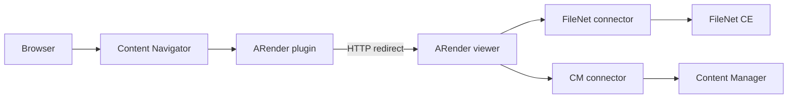

# IBM Content Navigator integration

The ARender IBM Content Navigator (ICN) plugin replaces the ICN built-in document viewer with ARender. It is a UI plugin connector: it does not fetch documents directly, but intercepts ICN viewer launch requests and redirects them to the ARender viewer. The actual document retrieval then happens through the FileNet connector (for P8 repositories) or the CM connector (for Content Manager repositories), depending on the ICN desktop configuration.

## Prerequisites

- IBM Content Navigator 2.0.3 or later
- An ARender viewer deployment reachable from the ICN server (HTTP or HTTPS)
- The FileNet connector configured on the ARender viewer if your ICN desktops use P8 repositories (see [IBM FileNet integration](/docs/arender/guides/integration/ibm-filenet))
- The ICN plugin JAR: `arondor-arender-navigator-plugin-2026.0.0.jar`
- The `navigator-api` and `json4j` libraries from your ICN installation (required at ICN deploy time; they are provided-scope in the plugin)

:::note
The ICN plugin JAR does not bundle the ICN API. It must be deployed inside the ICN application server where the ICN API is already present on the classpath.
:::

## Architecture



When a user opens a document in ICN, the plugin intercepts the viewer launch. For single-document viewing, the `ARenderPluginViewerDef` redirects through `ARenderPluginViewerService`. For multi-document or folder viewing (including Document Builder and Compare actions), the `ARenderPluginService` constructs the ARender URL with multiple object IDs and performs the redirect via a client-side JavaScript call.

## Step 1: Deploy the ICN plugin

Copy the plugin JAR to the ICN plugin directory. The exact location depends on your ICN deployment. In a WebSphere-based ICN installation, this is typically the `plugins` folder under the ICN data directory:

```
cp arondor-arender-navigator-plugin-2026.0.0.jar /opt/IBM/ECMClient/data/plugins/
```

The JAR manifest declares the plugin entry point:

```
Plugin-Class: com.arondor.viewer.navigatorplugin.ARenderPlugin
```

After copying the JAR, restart the ICN application server.

## Step 2: Register the plugin in ICN

1. Log in to the ICN administration console.
2. Navigate to **Plug-ins**.
3. Click **New Plug-in** and enter the full path to the JAR file.
4. Click **Load** and then **Save**.

The plugin registers the following components with ICN:

- **Viewer**: `ARenderPluginViewer`, replaces the ICN viewer for supported MIME types
- **Services**: `ARenderPluginViewerService` (single-document redirect) and `ARenderPluginService` (multi-document/folder URL builder)
- **Actions**: Open in ARender, Merge documents (Document Builder), Compare documents

## Step 3: Configure the plugin

After loading the plugin, a configuration pane is available in the ICN administration console under the plugin entry.

| Field | Description |
|-------|-------------|
| **ARender context root** | URL or context path of the ARender viewer. If a relative path is provided (e.g. `/ARender`), ICN prepends the server base URL. If an absolute URL is provided (e.g. `https://arender.example.com`), it is used directly. Default: `/ARender`. |
| **Unauthorized desktops for Document Builder** | Comma-separated list of ICN desktop IDs where the Document Builder action is disabled. Users on these desktops see ARender in read-only mode. |
| **Watermark on download** | Comma-separated `desktopId=watermarkBeanName` pairs. When a user downloads a document from a listed desktop, ARender applies the named watermark bean. |
| **Watermark on print** | Comma-separated `desktopId=watermarkBeanName` pairs. When a user prints from a listed desktop, ARender applies the named watermark bean. |

Example configuration stored by ICN (JSON):

```json
{
  "arenderContextRoot": "https://arender.example.com",
  "arenderUnauthorizedDesktops": "readonly-desktop,archive-desktop",
  "arenderWatermarkOnDownload": "confidential-desktop=customWatermark",
  "arenderWatermarkOnPrint": "confidential-desktop=customWatermark"
}
```

## Step 4: Assign the viewer to ICN desktops

1. In the ICN administration console, navigate to **Desktops**.
2. Select the desktop you want to configure.
3. Under the **Viewer Maps** tab, add a viewer map entry:
   - Set the viewer to **ARenderPluginViewer**.
   - Select the MIME types you want ARender to handle (PDF, Office documents, images, email, etc.).
4. Save and apply the desktop configuration.

### Supported MIME types

The plugin registers viewer support for the following content types by default:

- `application/pdf`
- `image/png`, `image/jpeg`, `image/gif`, `image/tiff`
- `message/rfc822`, `application/vnd.ms-outlook`
- `text/html`, `text/rtf`
- `application/zip`, `application/x-zip`
- `application/msword`, `application/vnd.openxmlformats-officedocument.wordprocessingml.document`
- `application/vnd.openxmlformats-officedocument.spreadsheetml.sheet`
- `application/vnd.ms-excel`, `application/x-ms-excel`
- `application/vnd.ms-powerpoint`, `application/vnd.openxmlformats-officedocument.presentationml.presentation`
- `application/vnd.oasis.opendocument.text`, `application/vnd.oasis.opendocument.spreadsheet`, `application/vnd.oasis.opendocument.presentation`

### Supported server types

The plugin supports the following ICN repository server types: `p8` (FileNet P8), `cm` (IBM Content Manager), `od` (IBM Content Manager OnDemand).

## Step 5: Configure the ARender viewer

The ICN plugin redirects document opens to the ARender viewer. The ARender viewer must be configured with the appropriate repository connector for your ICN server type.

For FileNet P8 desktops, configure the FileNet connector on the ARender viewer:

```yaml
# docker-compose.yml excerpt
services:
  ui:
    image: artifactory.arondor.cloud:5001/arender-ui-springboot:2026.0.0-filenet
    environment:
      - "ARENDERSRV_ARENDER_SERVER_RENDITION_HOSTS=http://service-broker:8761/"
      - "ARENDERSRV_ARENDER_SERVER_FILENET_CE_URL=http://filenet-ce:9080/wsi/FNCEWS40MTOM/"
      - "ARENDERSRV_ARENDER_SERVER_FILENET_AUTHENTICATION_METHOD=loginPasswordObjectStoreProvider"
      - "ARENDERSRV_ARENDER_SERVER_FILENET_CE_LOGIN=svc-arender"
      - "ARENDERSRV_ARENDER_SERVER_FILENET_CE_PASSWORD=secret"
    volumes:
      - ./lib/jace.jar:/home/arender/lib/jace.jar
    ports:
      - 8080:8080
```

For Content Manager desktops, configure the CM connector instead (see [IBM Content Manager integration](/docs/arender/guides/integration/ibm-content-manager)).

## Plugin actions

### Open in ARender

The default action opens one or more selected documents (or folders) in a new ARender browser window. The plugin collects the FileNet object IDs (which ICN provides in `classId,objectStoreId,objectId` format), strips the class and object store parts, and constructs an ARender URL of the form:

```
https://arender.example.com/ARender.html?ids=doc:{guid1},doc:{guid2}&objectStoreId={storeId}&objectType=mixedObjects
```

### Merge documents (Document Builder)

The Merge action opens a reorder dialog before launching ARender. Documents marked as reserved (checked out) or archived cannot be merged and will display an error. When confirmed, ARender opens with Document Builder activated:

```
https://arender.example.com/ARender.html?ids=...&documentbuilder.enabled=true&documentbuilder.activateOnStartup=true
```

### Compare documents

The Compare action requires exactly two documents. Selecting one or more than two documents displays an error. When two documents are selected, ARender opens in comparison mode:

```
https://arender.example.com/ARender.html?ids=...&visualization.multiView.doComparison=true
```

## Configuration reference

| ICN plugin field | Key in JSON config | Default | Description |
|------------------|--------------------|---------|-------------|
| ARender context root | `arenderContextRoot` | `/ARender` | Absolute URL or context path of the ARender viewer. Do not include a trailing slash. |
| Unauthorized desktops for Document Builder | `arenderUnauthorizedDesktops` | (empty) | Comma-separated ICN desktop IDs where Document Builder is forcibly disabled. |
| Watermark on download | `arenderWatermarkOnDownload` | (empty) | `desktopId=watermarkBeanName` pairs (comma-separated) applied when downloading. |
| Watermark on print | `arenderWatermarkOnPrint` | (empty) | `desktopId=watermarkBeanName` pairs (comma-separated) applied when printing. |

## Troubleshooting

**ARender viewer does not open when clicking a document in ICN.** Verify that the viewer map for the desktop includes `ARenderPluginViewer` and that the MIME type of the document matches a registered content type. Check the ICN server logs for errors from `ARenderPluginViewerService`.

**ARender opens but shows an error fetching the document.** The ICN plugin only redirects; it does not fetch documents. The error originates from the ARender viewer's repository connector. Confirm that the FileNet or CM connector is correctly configured on the ARender viewer and that the viewer can reach the Content Engine or CM server.

**Document Builder is not available on a specific desktop.** Check the **Unauthorized desktops** field in the plugin configuration. If the desktop ID appears there, Document Builder is disabled by design. Remove it from the list to re-enable it.

**The ARender context root points to the wrong server.** If the context root is a relative path (e.g. `/ARender`), the plugin prepends the ICN server base URL. To point to an external ARender deployment, use a full absolute URL (e.g. `https://arender.example.com`).

**Watermarks are not applied on download or print.** Verify that the `desktopId=watermarkBeanName` format is correct (no spaces around `=` or `,`). The desktop ID must match the ICN desktop identifier exactly. The watermark bean must be declared in the ARender viewer's Spring configuration.

**Compare action fails with "Only one document selected".** The Compare action requires exactly two documents. Selecting a folder also triggers an error. Only document items support comparison.

## Related pages

- [Connectors concept](/docs/arender/concepts/connectors)
- [IBM FileNet integration](/docs/arender/guides/integration/ibm-filenet)
- [IBM Content Manager integration](/docs/arender/guides/integration/ibm-content-manager)
- [Embed the viewer](/docs/arender/guides/integration/embed-viewer)
