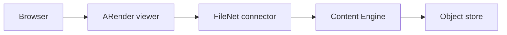

# IBM FileNet integration

The FileNet connector integrates ARender with IBM FileNet Content Engine (P8). It fetches documents from a FileNet object store using the JACE API (the native Java Content Engine client library) and stores annotations natively using the FileNet P8 annotation model.

## Prerequisites

- ARender viewer with the FileNet connector JAR on its classpath
- IBM FileNet Content Engine 5.2 or later
- The JACE client library (`jace.jar`) and its dependencies from your FileNet installation, placed on the viewer classpath
- Network connectivity from the ARender viewer host to the FileNet Content Engine endpoint
- A valid FileNet object store

:::note
The FileNet JACE library is not redistributed by ARender. You must obtain it from your FileNet installation and add it to the viewer's classpath alongside the connector JAR.
:::

## Architecture



The viewer receives a request containing FileNet object store and document identifiers. The connector establishes a connection to the Content Engine, fetches the document content, and returns it to the rendition pipeline. Annotations are read and written via the FileNet P8 annotation API.

## Step 1: Deploy the FileNet connector

Place the connector JAR and the JACE dependencies in the viewer's lib directory:

```yaml
# docker-compose.yml excerpt
services:
  ui:
    image: artifactory.arondor.cloud:5001/arender-ui-springboot:2026.0.0-filenet
    environment:
      - "ARENDERSRV_ARENDER_SERVER_RENDITION_HOSTS=http://service-broker:8761/"
      - "ARENDERSRV_ARENDER_SERVER_FILENET_CE_URL=iiop://filenet-ce:2809/FileNet/Engine"
      - "ARENDERSRV_ARENDER_SERVER_FILENET_AUTHENTICATION_METHOD=jaasObjectStoreProvider"
    volumes:
      - ./lib/jace.jar:/home/arender/lib/jace.jar
    ports:
      - 8080:8080
```

## Step 2: Configure the Content Engine connection

The connector supports three authentication modes, selected via `arender.server.filenet.authentication.method`.

### JAAS authentication (default)

Used when ARender runs inside a Java EE container that already has a FileNet JAAS login module configured. The connector delegates authentication to the container.

```
ARENDERSRV_ARENDER_SERVER_FILENET_AUTHENTICATION_METHOD=jaasObjectStoreProvider
ARENDERSRV_ARENDER_SERVER_FILENET_CE_URL=iiop://filenet-ce:2809/FileNet/Engine
```

The IIOP URL format is typical for WebSphere deployments.

### Login/password authentication (technical account)

All users access FileNet through a shared service account. Use the HTTP MTOM endpoint:

```
ARENDERSRV_ARENDER_SERVER_FILENET_AUTHENTICATION_METHOD=loginPasswordObjectStoreProvider
ARENDERSRV_ARENDER_SERVER_FILENET_CE_URL=http://filenet-ce:9080/wsi/FNCEWS40MTOM/
ARENDERSRV_ARENDER_SERVER_FILENET_CE_LOGIN=svc-arender
ARENDERSRV_ARENDER_SERVER_FILENET_CE_PASSWORD=secret
```

### OAuth2 authentication

Pass an OAuth2 token to FileNet using a prefix. This mode is used when ARender is behind an OAuth2-secured gateway:

```
ARENDERSRV_ARENDER_SERVER_FILENET_AUTHENTICATION_METHOD=oauth2ObjectStoreProvider
ARENDERSRV_ARENDER_SERVER_FILENET_CE_URL=http://filenet-ce:9080/wsi/FNCEWS40MTOM/
ARENDERSRV_ARENDER_SERVER_SECURITY_OAUTH2_PREFIX=Bearer
```

## Step 3: Configure annotation storage

The connector offers two annotation storage modes.

### Native FileNet annotations (default)

Annotations are stored as FileNet P8 annotation objects using the native API. This is the default mode, configured via:

```
arender.server.wrapper.source.annotation.accessor=fileNetAnnotationAccessor
```

Annotation format uses the FileNet annotation object model with XFDF content embedded in the annotation properties.

### XFDF annotations stored in FileNet

Annotations are stored as XFDF files attached to the document using the FileNet P8 API:

```
arender.server.wrapper.source.annotation.accessor=xfdfFileNetAnnotationAccessor
```

Use this mode if you need XFDF format compatibility with other tools or if native FileNet annotations present formatting issues.

## Configuration reference

| Environment variable | Property | Default | Description |
|----------------------|----------|---------|-------------|
| `ARENDERSRV_ARENDER_SERVER_FILENET_AUTHENTICATION_METHOD` | `arender.server.filenet.authentication.method` | `jaasObjectStoreProvider` | Authentication mode: `jaasObjectStoreProvider`, `loginPasswordObjectStoreProvider`, or `oauth2ObjectStoreProvider` |
| `ARENDERSRV_ARENDER_SERVER_FILENET_CE_URL` | `arender.server.filenet.ce.url` | `iiop://localhost:2809/FileNet/Engine` | Content Engine endpoint URL |
| `ARENDERSRV_ARENDER_SERVER_FILENET_CE_LOGIN` | `arender.server.filenet.ce.login` | `login` | Service account login (login/password mode only) |
| `ARENDERSRV_ARENDER_SERVER_FILENET_CE_PASSWORD` | `arender.server.filenet.ce.password` | `password` | Service account password (login/password mode only) |
| `ARENDERSRV_ARENDER_SERVER_SECURITY_OAUTH2_PREFIX` | `arender.server.security.oauth2.prefix` | (empty) | Token prefix for OAuth2 mode (e.g. `Bearer`) |
| `ARENDERSRV_ARENDER_SERVER_FILENET_KEEP_XML_ATTRIBUTES_AS_DOCUMENT_PROPERTIES` | `arender.server.filenet.keep.xml.attributes.as.document.properties` | `false` | Expose XML attributes as document properties in the viewer |
| `ARENDERSRV_ARENDER_SERVER_ANNOTATIONS_FILENET_CAN_CREATE` | `arender.server.annotations.filenet.can.create` | `true` | Allow users to create annotations on FileNet documents |
| `ARENDERSRV_ARENDER_SERVER_LEGACY_LAYOUT_ENABLED` | `arender.server.legacy.layout.enabled` | `true` | Use blocking layout call (required for FileNet authentication context propagation) |

## URL parameters

The FileNet connector activates when a request contains `objectStoreName` or `objectStoreId`.

| Parameter | Required | Description |
|-----------|----------|-------------|
| `objectStoreName` | One of the two | Object store display name (URL-encoded) |
| `objectStoreId` | One of the two | Object store GUID |
| `objectType` | No | `DOCUMENT` (default), `FOLDER`, `MULTISELECT`, `XMLDESCRIPTOR`, `FILENETCONTAINER`, `MIXEDOBJECTS`, `CONTENTCONTAINERXML`, `SETMULTISELECT` |
| `id` | Yes (for DOCUMENT, FOLDER) | FileNet document or folder GUID |
| `vsId` | Alternative to `id` | Version series GUID; opens the current version |
| `ids` | Yes (for MIXEDOBJECTS) | Comma-separated list of `type:guid` pairs (e.g. `doc:{guid},folder:{guid}`) |
| `contentElement` | No | Index of the content element to open when a document has multiple content elements |

### Example URLs

Open a document by GUID:
```
http://arender.example.com:8080/?objectStoreName=MyObjectStore&id={550E8400-E29B-41D4-A716-446655440000}&objectType=DOCUMENT
```

Open the current version using a version series GUID:
```
http://arender.example.com:8080/?objectStoreName=MyObjectStore&vsId={7A3F1B2C-...}&objectType=DOCUMENT
```

Open a folder:
```
http://arender.example.com:8080/?objectStoreName=MyObjectStore&id={folder-guid}&objectType=FOLDER
```

## Document Builder configuration

The connector supports saving assembled documents back to FileNet.

| Property | Default | Description |
|----------|---------|-------------|
| `arender.server.filenet.document.builder.create.new.document.bean.name` | `filenetDocumentUpdaterCopy` | Bean used when creating a new document from Document Builder |
| `arender.server.filenet.document.builder.update.first.document.bean.name` | `filenetDocumentUpdaterNewVersion` | Bean used when updating the first document (creates a new version) |
| `arender.server.filenet.document.builder.update.all.document.bean.name` | `filenetDocumentUpdaterPropertiesUpdater` | Bean used for "update all" operation |
| `arender.server.filenet.document.builder.update.first.document.properties.copy.bean.name` | `legacyFileNetPropertiesCopy` | Property copy strategy: `legacyFileNetPropertiesCopy` or `advancedFileNetPropertiesMerger` |
| `arender.server.filenet.document.builder.disabled.for.checkout.and.archived.documents` | `false` | Disable Document Builder on checked-out or archived documents |
| `arender.server.filenet.document.builder.unauthorized.object.store.ids` | (empty) | Comma-separated object store IDs where Document Builder is blocked |

## Watermark configuration

The connector can display watermarks based on FileNet group membership or document class.

| Property | Default | Description |
|----------|---------|-------------|
| `arender.server.watermark.display.provider` | `defaultParameterDisplayWatermarkProvider` | Set to `fileNetDisplayWatermarkProvider` to activate group-based watermarks |
| `arender.server.watermark.filenet.group.with` | (empty) | Comma-separated FileNet groups that receive the watermark |
| `arender.server.watermark.filenet.group.without` | (empty) | Comma-separated FileNet groups exempt from the watermark |
| `arender.server.watermark.filenet.document.class` | (empty) | Comma-separated FileNet document classes that trigger the watermark |
| `arender.watermark.bean.name` | `customWatermark` | Spring bean ID of the watermark to display |

## Troubleshooting

**Connection refused on startup.** Verify the CE URL is reachable from the viewer container. For IIOP connections, port 2809 must be open. For HTTP connections, check that the WSI MTOM endpoint is active on the FileNet application server.

**Authentication failure with JAAS mode.** JAAS mode requires the JVM to have the FileNet JAAS login configuration available. This is typically configured in `login.properties` or via a JAAS config file. In a Spring Boot container, JAAS is not automatically available: use `loginPasswordObjectStoreProvider` or `oauth2ObjectStoreProvider` instead.

**Document opens but annotations do not load.** Check that the annotation accessor bean is correctly set. The default is `fileNetAnnotationAccessor`. If you previously used `xfdfFileNetAnnotationAccessor`, verify that the property is set consistently.

**Layout call blocks for a long time.** The `arender.server.legacy.layout.enabled=true` setting forces a synchronous layout call, which is required because the FileNet authentication context does not propagate to new threads. Do not disable this unless the FileNet connection operates without per-thread authentication.

## Related pages

- [Connectors concept](../../concepts/connectors.md)
- [Embed the viewer](./embed-viewer.md)
- [Annotations concept](../../concepts/annotations.md)
