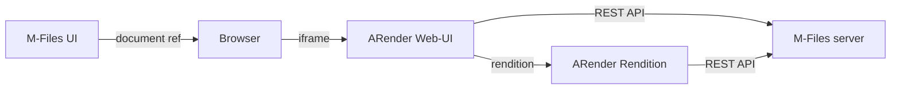

# M-Files integration

ARender integrates with [M-Files](https://www.m-files.com/) through a dedicated connector that enables document viewing, annotation, and metadata retrieval directly from M-Files vaults. The integration is available on the [M-Files Application Catalog](https://catalog.m-files.com/project/arender/).

The integration requires three components:

- **The M-Files connector JAR**, deployed on both the ARender Web-UI and the Rendition Engine, communicates with the M-Files REST API to fetch documents, annotations, and metadata.
- **The VAF application** (Vault Application Framework), installed on the M-Files vault, provides the ARender entry point within the M-Files UI.
- **ARender Rendition**, which generates images, extracts text, and performs document conversion. It also embeds the M-Files connector for direct document access.

## Prerequisites

- ARender Web-UI (Spring Boot) and Rendition Engine deployed and operational
- M-Files server with REST API enabled
- The M-Files connector JAR (`arondor-arender-mfiles-connector-<version>.jar`)
- The VAF application package (`VAF_MFF_ArenderConnector_<version>.mfappx`)
- Windows Server environment (M-Files requires Windows)
- Network connectivity from the ARender hosts to the M-Files REST API endpoint

## Architecture



- **M-Files UI**: lets the user choose which documents to open in ARender.
- **Browser**: creates the ARender frame using the URL provided by the M-Files UI.
- **ARender Web-UI**: Spring Boot module containing the M-Files connector.
- **M-Files server**: REST API that the ARender connector interacts with to fetch documents, annotations, metadata, and to create new documents or document versions.
- **ARender Rendition**: generates images, extracts text, and more. Also contains the M-Files connector for direct document access.

## Step 1: Configure the Rendition Engine

Place the M-Files connector JAR in the Rendition Engine client libraries directory:

```
rendition-engine-package-<version>/modules/RenditionEngine/client_libs/
  └─ arondor-arender-mfiles-connector-<version>.jar
```

Add the following property to the Rendition Engine `application.properties` to authorize the M-Files REST API URL:

```properties
# rendition-engine-package-<version>/modules/RenditionEngine/application.properties
authorized.urls=http://<m-files-server>/REST/
```

Start (or restart) the ARender Rendition server.

## Step 2: Deploy the Web-UI with the M-Files connector

Deploy the ARender Web-UI WAR and add the M-Files connector JAR to its classpath:

```
<webapp-root>/WEB-INF/lib/
  └─ arondor-arender-mfiles-connector-<version>.jar
```

Place the following configuration files under the Web-UI classes directory:

```
<webapp-root>/WEB-INF/classes/
  ├─ arender-editor-specific-integration.xml
  └─ vaf/
       └─ arender-server.properties
```

Edit `arender-server.properties` to match your M-Files vault configuration. This file contains the M-Files REST API URL, vault credentials, and connector behavior settings.

### Docker deployment

For Docker-based deployments, mount the connector JAR and configuration files as volumes:

```yaml
# docker-compose.yml excerpt
services:
  ui:
    image: artifactory.arondor.cloud:5001/arender-ui-springboot:2026.0.0
    environment:
      - "ARENDERSRV_ARENDER_SERVER_RENDITION_HOSTS=http://service-broker:8761/"
    volumes:
      - ./arondor-arender-mfiles-connector.jar:/opt/arender/lib/arondor-arender-mfiles-connector.jar
      - ./arender-server.properties:/opt/arender/classes/vaf/arender-server.properties
    ports:
      - 8080:8080
```

## Step 3: Install the VAF application on M-Files

1. Open the **M-Files Admin** console.
2. Right-click the target vault and select **Applications**.
3. Click **Install...** and select the `VAF_MFF_ArenderConnector_<version>.mfappx` file.
4. Confirm installation when prompted.
5. Click **Close** after installation completes.

## Step 4: Configure the VAF application

The VAF application uses a JSON configuration file managed through the M-Files Admin client:

1. In M-Files Admin, expand the vault node.
2. Click **Configurations**.
3. Under **Other Applications**, select **VAF_MFF_ArenderConnector**.
4. Open the **Configuration** tab.
5. Fill in all required properties. Click the **i** icon next to each field for help text.
6. Click **Save**.

Key configuration fields include the ARender Web-UI URL, authentication parameters, and vault-specific settings.

## Step 5: Verify the integration

1. Restart the IIS server on the M-Files host.
2. Start (or restart) the Tomcat/Spring Boot server hosting the ARender Web-UI.
3. Access M-Files and open a vault.
4. Select a document -- it should open in the ARender viewer.

## Troubleshooting

**Document does not load in ARender.** Verify that the M-Files REST API is reachable from the ARender Web-UI and Rendition Engine hosts. Check `authorized.urls` in the Rendition Engine `application.properties`. Inspect the ARender logs for HTTP errors from the M-Files connector.

**VAF application does not appear in M-Files.** Confirm the `.mfappx` was installed correctly through the M-Files Admin console. Log out and back in to the vault to ensure the application loads.

**Annotations are not saved.** Verify that the M-Files user has write permissions on the vault and that the connector configuration in `arender-server.properties` points to the correct vault and API endpoint.

## Related pages

- [Connectors concept](../../concepts/connectors.md)
- [Embed the viewer](./embed-viewer.md)
- [Annotations concept](../../concepts/annotations.md)
