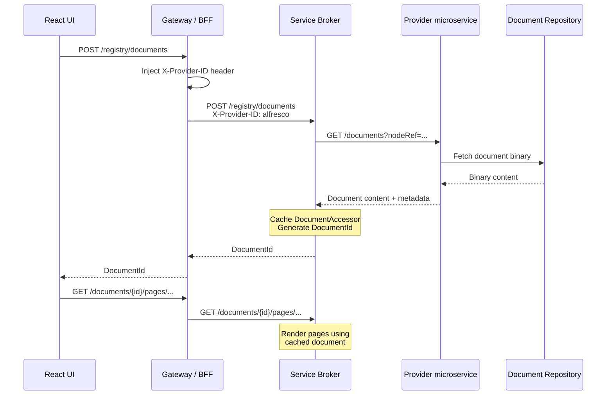
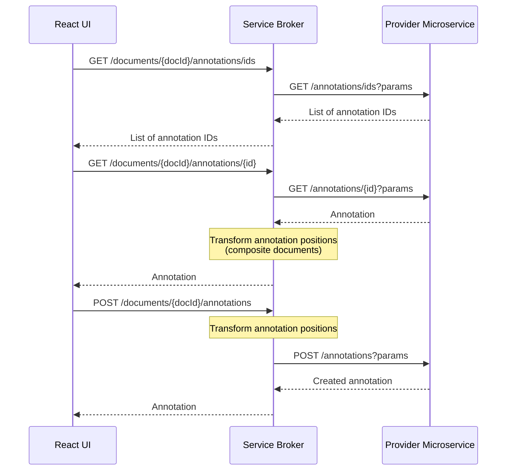

import Tabs from '@theme/Tabs';
import TabItem from '@theme/TabItem';

# Overview

The Modern Viewer loads documents from external repositories through **providers** — standalone REST microservices that run as their own Docker containers. Each provider communicates with the Document Service Broker over HTTP and handles document retrieval from a specific repository type.

This decoupled model means connectors have their own lifecycle, scaling, and release cadence — independent of the viewer and of each other.

For general connector concepts, see [Connectors](../../concepts/connectors.md).

## Document opening flow

For the overall system architecture (gateway/BFF, broker, rendition services), see [System architecture](../../overview/architecture.md).

When loading a document from a repository, the flow involves the gateway, broker, and a provider microservice:



1. The React UI sends a `POST /registry/documents` request to the gateway/BFF.
2. The gateway injects the `X-Provider-ID` header (e.g., `alfresco`, `filenet`) and forwards the request to the broker.
3. The broker looks up the provider's URL in its registry and forwards the request with the whitelisted query parameters.
4. The provider fetches the document from the repository and returns the binary content (or a JSON folder structure for composite documents).
5. The broker caches the document, generates a `DocumentId`, and returns it through the gateway to the React UI.
6. Subsequent page rendering requests follow the same path through the gateway.

## Available providers

ARender v2026 ships the following provider images:

| Provider | Docker image | Default port | Repository type |
|----------|-------------|-------------|----------------|
| Alfresco | `arender-alfresco-provider` | 8788 | Alfresco via CMIS |
| FileNet | `arender-filenet-provider` | 8787 | IBM FileNet Content Engine |


## Broker registry configuration

The broker needs to know each provider's URL.

<Tabs groupId="provider">
  <TabItem value="alfresco" label="Alfresco">

```properties title="application.properties"
# Register a provider named "alfresco" at the given URL
registry.providers.alfresco.base-url=http://alfresco-provider:8788
```

Or as an environment variable:

```bash
REGISTRY_PROVIDER_ALFRESCO_URL=http://alfresco-provider:8788
```

  </TabItem>
  <TabItem value="filenet" label="FileNet">

```properties title="application.properties"
registry.provider.filenet.url=http://filenet-provider:8787
```

Or as an environment variable:

```bash
REGISTRY_PROVIDER_FILENET_URL=http://filenet-provider:8787
```

  </TabItem>
</Tabs>


## How `X-Provider-ID` works

The `X-Provider-ID` HTTP header tells the broker which provider should handle the request. The gateway/BFF is responsible for injecting this header before forwarding requests to the broker. The broker uses it to look up the provider URL in its registry and route the request.

### Provider selection

When the broker receives a `POST /registry/documents` request, it resolves the provider in this order:

1. **`X-Provider-ID` header** — If present, the broker looks up the provider by name in its registry.
2. **`registry.default-provider`** — If the header is absent, the broker falls back to the default provider configured in `registry.default-provider`.
3. **Error** — If neither is available, the request fails.

For the full list of connector registry properties, see [Rendition properties — Connector registry](../../reference/rendition-properties.md#connector-registry).


## Document model

Providers return one of two structures:

- **`ProviderFile`** — A single document with a name and a map of parameters. The broker receives the binary content in the response body.
- **`ProviderFolder`** — A folder containing nested `ProviderFile` and `ProviderFolder` entries. The broker converts this into a `DocumentContainer` hierarchy, fetching each file individually.

For the full data model specification, see [Provider API — Data model](../../reference/rest-api/provider-api.md#data-model).

### Composite documents

When a provider returns a `ProviderFolder` (JSON response with `Content-Type: application/json`), the broker processes it recursively:

1. The broker parses the folder structure.
2. For each `ProviderFile` in the folder, the broker calls `GET /documents` again with that file's `parameters`.
3. Each file is stored independently on the shared volume.
4. The broker creates a `DocumentContainer` hierarchy so the viewer displays all files as a single multi-document.

```json
{
  "type": "folder",
  "name": "Case Documents",
  "parameters": {},
  "contents": [
    {
      "type": "file",
      "name": "contract.pdf",
      "parameters": { "id": "DOC001", "objectStoreName": "OS1" }
    },
    {
      "type": "folder",
      "name": "Attachments",
      "parameters": {},
      "contents": [
        {
          "type": "file",
          "name": "annex.pdf",
          "parameters": { "id": "DOC002", "objectStoreName": "OS1" }
        }
      ]
    }
  ]
}
```

## Annotations through providers

Providers can also handle annotation storage. The broker proxies annotation CRUD operations to the provider:

| Operation | Broker endpoint | Provider endpoint |
|-----------|----------------|-------------------|
| List annotation IDs | `GET /documents/{id}/annotations/ids` | `GET /annotations/ids` |
| Get annotation | `GET /documents/{id}/annotations/{annotationId}` | `GET /annotations/{annotationId}` |
| Create annotation | `POST /documents/{id}/annotations` | `POST /annotations` |
| Update annotation | `PUT /documents/{id}/annotations/{annotationId}` | `PUT /annotations/{annotationId}` |
| Delete annotation | `DELETE /documents/{id}/annotations/{annotationId}` | `DELETE /annotations/{annotationId}` |

If your provider does not implement annotation endpoints, annotations fall back to the broker's default storage (XFDF files or JDBC, depending on your backend configuration).

For the full broker-side endpoint specification, see [Broker API — Connector operations](../../reference/rest-api/broker-api.md#connector-operations).

### Annotation flow



For annotation operations, the broker retrieves the cached provider name and original URL parameters, then forwards the request to the provider. When the document has a composite layout, the broker applies annotation position transformations before returning or forwarding annotations.

## Building a custom provider

A provider is a Spring Boot application that implements REST endpoints matching the [Provider API](../../reference/rest-api/provider-api.md) contract. The `rest-provider-api` library provides shared Java types (`ProviderDocument`, `ProviderFile`, `ProviderFolder`).

At minimum, implement:

```
GET /documents?<your-parameters>
```

Return the document binary as the response body, with appropriate `Content-Type` and `Content-Disposition` headers. For annotation support, implement the annotation endpoints listed above.

See the [Provider API reference](../../reference/rest-api/provider-api.md) for the full endpoint specification with request/response details and status codes.
