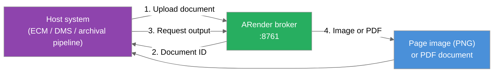

ARender's rendition pipeline can be called directly from another application (without involving the ARender viewer) to generate page images and PDF copies of documents on demand. This page describes the pattern, walks through a 5-minute integration, and points to the exact API sections you'll need.

## 1. Overview

A **host system** (an ECM, a DMS, an archival pipeline, or any business application that manages documents) calls the **broker**. The broker is the Document Service Broker, the front-door REST API of the ARender rendition stack. It returns one of two outputs:

- **Page images** (PNG), used to populate the host's own thumbnails and previews.
- **Full PDF documents**, used for long-term archival, normalization, or distribution.

Both outputs come from the same pipeline that powers the ARender viewer. The host stores and serves them through its own mechanisms. ARender stays in the role of a server-side rendering service.

> **Rendition.** Any rendered representation of a source document: a thumbnail, a preview image, or a PDF copy. The word is used heavily in the ECM world and below.

## 2. Why call ARender as a rendering service

Four concrete scenarios where this pattern pays off.

**Mismatched previews today.** Your ECM already generates thumbnails for folder views and search results, typically via a built-in converter such as LibreOffice headless. For complex formats (`.eml`, `.msg`, AutoCAD, multi-sheet Excel), those built-in thumbnails diverge from what the ARender viewer shows full-screen. A `.eml` thumbnail might show raw MIME headers while the viewer shows the rendered email body with inline images. Routing the ECM's thumbnail generation through ARender unifies both surfaces so users see the same document the same way wherever they encounter it.

**One pipeline for live viewing and archive.** If you also archive a PDF copy of each ingested document, generating that copy through the same converter that drives the viewer means a single rendering policy to qualify, monitor, and version. No separate archival pipeline to keep in sync.

**Complex formats without owning a converter.** Office, CAD, emails (multipart with embedded attachments), and other non-trivial formats are handled by ARender's existing pipeline. The host can route just those formats and leave the rest to its native renderer.

**Org-wide rendition rules applied consistently.** Watermarks, redactions, annotation visibility, font substitutions, and other server-side rules are applied uniformly to every output of the pipeline: live page images, archived PDFs, and any future rendition surface.

## 3. The contract

Five broker endpoints cover almost every rendering-service integration. Each link below jumps to the full parameter table in the reference.

| Step | Method & path | Reference |
|---|---|---|
| Upload a document | `POST /documents` | [Upload a document](../../reference/rest-api/broker-api.md#upload-a-document) |
| Get the document layout (page count, children, conversion-done signal) | `GET /documents/{id}/layout` | [Get document layout](../../reference/rest-api/broker-api.md#get-document-layout) |
| Fetch a page as PNG | `GET /documents/{id}/pages/{n}/image?pageImageDescription=IM_{width}_{rotation}` | [Get page image](../../reference/rest-api/broker-api.md#get-page-image) |
| Fetch the document as PDF | `GET /documents/{id}/file?format=pdf` | [Get document file](../../reference/rest-api/broker-api.md#get-document-file) |
| Delete when done | `DELETE /documents/{id}` | [Delete a document](../../reference/rest-api/broker-api.md#delete-a-document) |

`GET /documents/{id}/layout` is the integrator's compass. It answers two questions in one call: is the document ready, and what is inside it. A 200 response with usable data is the simplest signal that the server-side conversion is complete; if `/layout` still returns a transient or empty state, the converter has not finished yet.

The response has two shapes, told apart by its `type` field:

- **`DocumentPageLayout`** for a simple document. It carries `pageDimensionsList`, whose length is the page count, so you know how many `pages/{n}/image` calls to make.
- **`DocumentContainer`** for a composite document (EML, MSG, ZIP). It carries `children` instead, each with its own document ID, title, and MIME type, and **no** `pageDimensionsList`. Page images are not available at the container level: fetch them per child. See [§4.6](#46-composite-documents-eml-msg-zip) for the walkthrough.

Conversion to PDF starts automatically on upload. There is no `POST /conversions` to call from the integration side. To observe conversion progress explicitly, fetch [Get document conversions](../../reference/rest-api/broker-api.md#get-document-conversions) to list the order IDs and [Poll conversion status](../../reference/rest-api/broker-api.md#poll-conversion-status) to watch state. In practice, calling `GET /documents/{id}/layout` and waiting for a successful response is enough for most integrations.

**Default broker port:** `8761` (self-hosted). The hosted demo broker used in the quickstart below runs at `https://rendition.demo.arender.uxopian.com`. The interactive Swagger UI is at [https://rendition.demo.arender.uxopian.com/swagger-ui/index.html](https://rendition.demo.arender.uxopian.com/swagger-ui/index.html) if you want to try requests in your browser before writing code.

## 4. Quickstart: five-minute walkthrough

The shortest path from "I have a document file" to "I have a thumbnail and a PDF rendition." Examples assume a POSIX shell (Linux, macOS, or Git Bash on Windows).

:::tip Try it live
The commands below run against our hosted demo broker at `https://rendition.demo.arender.uxopian.com`. No setup. Paste them in your terminal. To explore the full API interactively, open the [Swagger UI](https://rendition.demo.arender.uxopian.com/swagger-ui/index.html).

For a self-hosted broker, swap the base URL for `http://your-broker-host:8761` and add auth headers if your deployment requires them.
:::

### 4.1 Upload the document

```bash
DOC_ID=$(curl -s -X POST https://rendition.demo.arender.uxopian.com/documents \
  -H "Content-Type: application/octet-stream" \
  --data-binary @my-document.pdf \
  | jq -r '.id')
echo "Document ID: $DOC_ID"
```

The broker returns a JSON body `{"id": "b64_..."}`. Capture the `id`. Every subsequent call needs it. See [Upload a document](../../reference/rest-api/broker-api.md#upload-a-document) for optional parameters (assign your own ID, set a title, upload by URL instead of binary).

### 4.2 Get the document layout

```bash
curl "https://rendition.demo.arender.uxopian.com/documents/$DOC_ID/layout"
```

For a simple document, this returns `type: "...DocumentPageLayout"` with `mimeType` and `pageDimensionsList`:

```json
{
  "type": "com.arondor.viewer.client.api.document.DocumentPageLayout",
  "documentId": { "id": "b64_YzQyZDdlNWY..." },
  "mimeType": "application/pdf",
  "pageDimensionsList": [
    { "width": 595.0, "height": 842.0, "rotation": 0, "dpi": 72, "pageLayers": null }
  ]
}
```

The length of `pageDimensionsList` is the page count, which bounds your page-image loop. A successful response also confirms server-side conversion is complete. Composite documents return a different shape, covered in §4.6. See [Get document layout](../../reference/rest-api/broker-api.md#get-document-layout).

### 4.3 Fetch page 0 as a PNG

Use the page count from §4.2 to decide which pages to fetch. The quickstart below fetches page 0 only.

```bash
curl "https://rendition.demo.arender.uxopian.com/documents/$DOC_ID/pages/0/image?pageImageDescription=IM_800_0" \
  --output page0.png
```

Page numbering is **0-based**. The `pageImageDescription` parameter encodes width and rotation: `IM_800_0` means 800 pixels wide, no rotation. Repeat with `pages/1`, `pages/2`, and so on for additional pages. Optional contrast/brightness/invert filters are documented in [Get page image](../../reference/rest-api/broker-api.md#get-page-image).

### 4.4 Fetch the whole document as PDF

```bash
curl "https://rendition.demo.arender.uxopian.com/documents/$DOC_ID/file?format=pdf" \
  --output document.pdf
```

One call, multi-page PDF returned as binary. The call is synchronous. It waits for the converter and returns the converted file. See [Get document file](../../reference/rest-api/broker-api.md#get-document-file).

### 4.5 Clean up

```bash
curl -X DELETE "https://rendition.demo.arender.uxopian.com/documents/$DOC_ID"
```

The broker holds documents in memory and on local cache until they are deleted or evicted. Long-running integrations should delete each document after its outputs are stored host-side. See [Delete a document](../../reference/rest-api/broker-api.md#delete-a-document).

That's the complete loop. Wire those five calls into your host system's rendition hook and you have a working integration.

### 4.6 Composite documents (EML, MSG, ZIP)

An email or an archive is not a page-based document. Its `/layout` returns a container that lists its parts instead of page dimensions. Handling one is a tree walk, and it rests on two rules: branch on the `type` field, and rewrite the ID before you put it in a URL.

**The two response shapes.** `/layout` always returns one of two things, told apart by its `type` field:

| `type` ends with | What it is | What you do with it |
|---|---|---|
| `DocumentPageLayout` | A document made of pages. `pageDimensionsList` carries the width, height, rotation and DPI of each page, and its length is the page count. | Loop the pages, as in §4.3. |
| `DocumentContainer` | A composite document. `children` lists its parts, in order. It has no pages of its own, so `pages/{n}/image` on it returns 500. | Walk `children`. |

The rest of this section follows one document all the way down: an email whose body is part `0` and whose attachment is a ZIP holding two PDFs. Its `/layout`:

```json
{
  "type": "com.arondor.viewer.client.api.document.DocumentContainer",
  "documentId": { "id": "b64_MDE0..." },
  "mimeType": "message/rfc822",
  "children": [
    {
      "type": "com.arondor.viewer.client.api.document.DocumentReference",
      "documentId": { "id": "b64_MDE0.../0" },
      "documentTitle": "Email:Quarterly report",
      "mimeType": "text/html"
    },
    {
      "type": "com.arondor.viewer.client.api.document.DocumentReference",
      "documentId": { "id": "b64_MDE0.../1" },
      "documentTitle": "bundle",
      "mimeType": "application/zip"
    }
  ]
}
```

**Walking `children`.** Each entry gives you the ID of one part, plus a title and a MIME type. Branch on the entry's own `type`:

- **`DocumentContainer`** — a sub-tree already expanded in place, with its own `children` populated. Recurse into it, no extra call needed. A folder inside a ZIP comes back this way.
- **`DocumentReference`** — a stub. It does not tell you whether that part has pages or is composite in turn. Call `/layout` on its ID, then apply the two shapes above to the answer.

The second case is the one to get right. Above, the attachment is a plain `DocumentReference` like the message body, and nothing in that response says it is composite. Calling `/layout` on `b64_MDE0.../1` is what reveals it:

```json
{
  "type": "com.arondor.viewer.client.api.document.DocumentContainer",
  "documentId": { "id": "b64_MDE0.../1" },
  "documentTitle": "bundle",
  "mimeType": "application/x-zip",
  "children": [
    {
      "type": "com.arondor.viewer.client.api.document.DocumentReference",
      "documentId": { "id": "b64_MDE0.../1/1" },
      "documentTitle": "alpha.pdf",
      "mimeType": null
    },
    {
      "type": "com.arondor.viewer.client.api.document.DocumentReference",
      "documentId": { "id": "b64_MDE0.../1/2" },
      "documentTitle": "omega.pdf",
      "mimeType": null
    }
  ]
}
```

Same shape, one level down. Calling `/layout` on `b64_MDE0.../1/1` finally returns a `DocumentPageLayout`, and that part is renderable.

Do not use `mimeType` to decide instead. It is `null` for ZIP entries until they are converted, and it can contradict the resolved layout: an `.eml` attached to an `.eml` is listed as `message/rfc822`, yet its `/layout` returns a `DocumentPageLayout` in `text/plain`, the raw message source rendered as text.

Do not compute the indices either, read them from `children`. An email numbers its body `0` and its attachments from `1`, a ZIP starts its entries at `1`, and a folder inside a ZIP consumes an index of its own.

:::warning Rewrite every slash as `@` before you call a part
This is the step that breaks integrations. `children` reports IDs with slashes, but `{documentId}` is a single segment of the REST path, so an ID cannot be sent as reported.

| Level | As reported in `children` | As sent in the URL |
|---|---|---|
| The root document | `b64_MDE0...` | `b64_MDE0...` |
| A part of it | `b64_MDE0.../1` | `b64_MDE0...@1` |
| A part of that part | `b64_MDE0.../1/2` | `b64_MDE0...@1@2` |

One `@` per level, with no depth limit. Sending the raw slash returns 404. Percent-encoding it as `%2F` returns 400, because Tomcat rejects encoded slashes. See [Document IDs](../../reference/rest-api/broker-api.md#document-ids) in the reference.
:::

Once rewritten, a part behaves like any other document, and every endpoint applies to it. Walking an email that carries a ZIP looks like this:

```bash
# Part 1 of the email is the ZIP. Its layout is a container, so walk its children.
curl "https://rendition.demo.arender.uxopian.com/documents/$DOC_ID@1/layout"

# Entry 1 of that ZIP is a PDF. Its layout has pages, so render them.
curl "https://rendition.demo.arender.uxopian.com/documents/$DOC_ID@1@1/pages/0/image?pageImageDescription=IM_800_0" \
  --output entry-page0.png
```

The page loop from §4.3 applies unchanged to any part that resolves to a `DocumentPageLayout`. Asking a container for a page image returns 500, at any level.

If you only need one flattened output for the whole email, call `GET /documents/{id}/file?format=pdf` on the container. It returns the body and the attachments merged into a single PDF, which is usually the shortest path for archival.

## 5. Integration shape



*Figure: Generic call flow between a host system and ARender as a rendering service.*

On the host side, the integration follows four steps:

1. **Detect** that a document needs a rendition: a newly ingested file, an updated version, or a scheduled archival job.
2. **Call** the broker to upload the document and fetch the desired output.
3. **Store** the output in the host's native rendition slot, archive store, or derived-document repository.
4. **Serve** the output through the host's existing UI and workflows.

This guide does not cover host-side mechanisms. The rendition hooks differ from one product to the next. Consult your host system's documentation for its native extension point (see [§8](#8-example-host-hooks) for entry points in common ECMs).

## 6. Outputs in detail

### 6.1 Page images

- The broker returns **PNG**. If your host stores thumbnails as JPEG or WebP, convert in the integration layer.
- Each call returns one page at one size. Multiple sizes (small thumbnail and larger preview) require multiple calls with different `pageImageDescription` widths.
- Most host systems display only the first page in their native preview, so a typical integration calls page 0 only.
- The `pageImageDescription` format also supports rotation and image filters (contrast, brightness, invert). See the parameter table on [Get page image](../../reference/rest-api/broker-api.md#get-page-image).

### 6.2 PDF

`GET /documents/{id}/file?format=pdf` returns the document as a multi-page PDF in a single call. The call is synchronous. The broker waits for the converter to finish and streams the result back. This is the right path for the vast majority of integrations.

Conversion to PDF starts automatically when the document is uploaded. For very large documents you may want to observe the conversion to decide when to call `GET /documents/{id}/file?format=pdf`. Use [Get document conversions](../../reference/rest-api/broker-api.md#get-document-conversions) to retrieve the `conversionOrderId`, then [Poll conversion status](../../reference/rest-api/broker-api.md#poll-conversion-status) to watch its state. Alternatively, calling [Get document layout](../../reference/rest-api/broker-api.md#get-document-layout) and waiting for a successful response is enough for most integrations.

## 7. When this pattern fits (and when it doesn't)

### Fits

- **Thumbnails and previews** for formats where the host's native rendition differs from what the ARender viewer shows: typically emails, Office documents, CAD files, and other complex formats.
- **Long-term archival** as a normalized PDF, served from a single conversion pipeline.
- **Normalized storage** across heterogeneous source formats: every archived document becomes a uniform PDF regardless of its origin.
- **Distribution, printing, or external signing** from a stable, format-independent binary.

### Doesn't fit

- **Documents that are already PDF**, used as their own thumbnail. The host's native PDF preview is already pixel-faithful to the source, so routing it through ARender adds a roundtrip without changing the visual.
- **Very high throughput without host-side caching.** The broker recomputes outputs unless they are stored downstream. The integration must rely on the host's rendition store to absorb load.
- **Host systems without a rendition or post-processing extension point.** With no native slot to plug into, the integration becomes an out-of-band workflow with its own lifecycle to manage.

## 8. Example host hooks

The integration code lives on the host side. Common entry points:

- **Alfresco Content Services.** A custom rendition definition routed through the Transform Service. Configure a transform that POSTs the source to the broker and stores the response as a rendition of the source node. Consult Alfresco's *Custom transforms and renditions* documentation for the current configuration shape (it has changed between major ACS versions).
- **IBM FileNet P8.** A rendition engine extension that produces a rendition object linked to the source document. Consult IBM's *Rendition Engine* documentation for the extension SPI.
- **Generic archival pipeline.** A step that, after ingestion, calls the broker and writes the returned PDF alongside the original. Trigger from a workflow engine (Camunda, Airflow, etc.) or a message queue listener.

In every case the integration code is the customer's (or partner's) responsibility. ARender's contract is the broker REST API documented above.

## 9. Glossary

- **Rendition.** Any rendered representation of a source document: a thumbnail, a preview image, or a PDF copy.
- **Broker.** The Document Service Broker, the REST front door of ARender's rendition stack (default port `8761`). All integration calls described on this page go to the broker.
- **Host system.** The application that owns the document and the user experience: an ECM (Alfresco, FileNet, and others), a DMS, an archival or records management platform, a business application with attached files.

## 10. Related references

- [Broker API reference](../../reference/rest-api/broker-api.md). The full endpoint catalog, including all parameters referenced on this page.
- [Rendition pipeline](../../concepts/rendition-pipeline.md). What happens server-side once a document reaches ARender.
- [Office conversion](../features/office-conversion.mdx). Converter configuration and backend selection (LibreOffice, DirectOffice, AROMS).
- [Connectors / Providers](../../concepts/connectors.md). The inverse integration pattern, where ARender fetches documents from a host system to render them in its own viewer.
