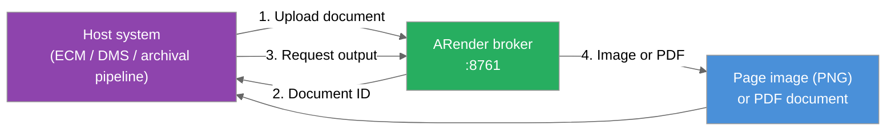

ARender's rendition pipeline can be called directly from another application — without involving the ARender viewer — to generate page images and PDF copies of documents on demand. This guide describes the pattern and the contract ARender exposes for that use case.

## 1. Overview

A host system (an ECM, a DMS, an archival pipeline, or any business application that manages documents) calls the ARender broker REST API and receives one of two canonical outputs:

- **Page images**, used to populate the host's own thumbnails and previews.
- **Full PDF documents**, used for long-term archival, normalization, or distribution.

Both outputs come from the same pipeline that powers the ARender viewer. The host system stores and serves them through its own mechanisms; ARender stays in the role of a server-side rendering service.

## 2. Why call ARender as a rendering service

- **Visual consistency** between the renditions surfaced by the host system and the ARender viewer. Users see the same document the same way, regardless of where they encounter it.
- **One pipeline for live viewing and archive.** The same parsers, fonts, and rendering rules apply to the interactive viewer and to the archived PDF.
- **Coverage of non-trivial formats.** Emails (multipart, embedded attachments), Office documents, CAD files, and other complex formats are handled by ARender's established converters.
- **Stable rendition policy.** Annotation visibility, watermarks, redactions, and any organization-wide rendering rules are applied consistently to every output.

## 3. What ARender exposes

The broker offers two stable outputs for this pattern.

### Page images

Upload a document, receive a document identifier, request a page image at a chosen width — receive a PNG. Iterate for additional pages.

### PDF documents

Upload a document, receive a document identifier, request the PDF representation of the document — receive a single multi-page PDF. ARender supports PDF/A-1, PDF/A-2, and PDF/A-3 profiles for long-term archival; the active profile is set in the converter configuration.

The exact endpoints, parameters, and return shapes are described in the [Broker API reference](../../reference/rest-api/broker-api.md).

## 4. Integration shape

*Figure: Generic call flow between a host system and ARender as a rendering service.*

From the host's side, the integration follows four steps:

1. **Detect** that a document needs a rendition — for example a newly ingested file, an updated version, or a scheduled archival job.
2. **Call** the ARender broker to upload the document and fetch the desired output.
3. **Store** the output in the host's native mechanism — a rendition slot, an archive store, a derived-document repository.
4. **Serve** the output through the host's existing UI and workflows.

Most content systems offer a rendition pipeline, a custom transformer slot, an archival hook, or a post-processing step. The integration logic lives there and stays under the customer's control. This guide does not document host-side mechanisms; consult the host system's own documentation for the appropriate extension point.

## 5. Outputs

### 5.1 Page images

- The broker returns PNG. If the host stores its renditions in another image format (JPEG, WebP), the conversion happens in the integration layer.
- Each rendition target is one broker call. Multiple sizes (a small thumbnail and a larger preview) require multiple calls, each with a different target width.
- Multi-page documents: one call per page. Most host systems only display the first page in their native preview, so a typical integration calls the broker for page zero only.

### 5.2 PDF documents

- One broker call returns a complete multi-page PDF.
- The PDF is generated from the same conversion pipeline as the one feeding the viewer. The organization has a single reference rendition for live viewing and for archive.
- For long-term archival, ARender can produce PDFs conformant to PDF/A-1, PDF/A-2, and PDF/A-3. The selected profile is set in the converter configuration; this page does not duplicate that reference.
- Trade-off versus page images: the PDF preserves the document structure (selectable text, indexing, accessibility), while page images preserve only the exact visual rendition.

## 6. When this pattern fits — and when it doesn't

### Fits

- **Thumbnails and previews** for formats where the host's native rendition differs from the ARender viewer — typically emails, Office documents, CAD files, and other complex formats.
- **Long-term archival** that needs PDF/A conformance for legal or regulatory retention.
- **Normalized storage** across heterogeneous source formats — every archived document becomes a uniform PDF regardless of its origin.
- **Distribution, printing, or external signing** from a stable, format-independent binary.

### Doesn't fit

- **Native PDFs as page images** — the host already produces a thumbnail visually identical to what the viewer shows, so the additional roundtrip brings no benefit.
- **Very high throughput without host-side caching** — the broker recomputes outputs unless the host stores them; the integration must rely on the host's own rendition store to absorb load.
- **Host systems without a rendition or post-processing extension point** — without a native slot to plug into, the integration becomes an out-of-band workflow with its own lifecycle to manage.

## 7. Example host systems

This pattern applies to most enterprise content systems. An ECM with a custom transformer slot — such as Alfresco Content Services through its Transform pipeline or IBM FileNet through its rendition framework — can route specific source formats to ARender for thumbnails and previews. An archival or records management pipeline can call the same service to produce a normalized PDF/A copy alongside the original document. The integration code is the customer's responsibility; the contract on ARender's side is the broker REST API.

## 8. Related references

- [Broker API reference](../../reference/rest-api/broker-api.md) — the exact endpoints and parameters used by the integration.
- [Rendition pipeline](/concepts/rendition-pipeline) — what happens server-side once a document reaches ARender.
- [Office conversion](../features/office-conversion.mdx) — converter configuration, including PDF/A profile selection.
- [Providers](./providers.md) — the inverse integration pattern, where ARender fetches documents from a host system to render them in its own viewer.
