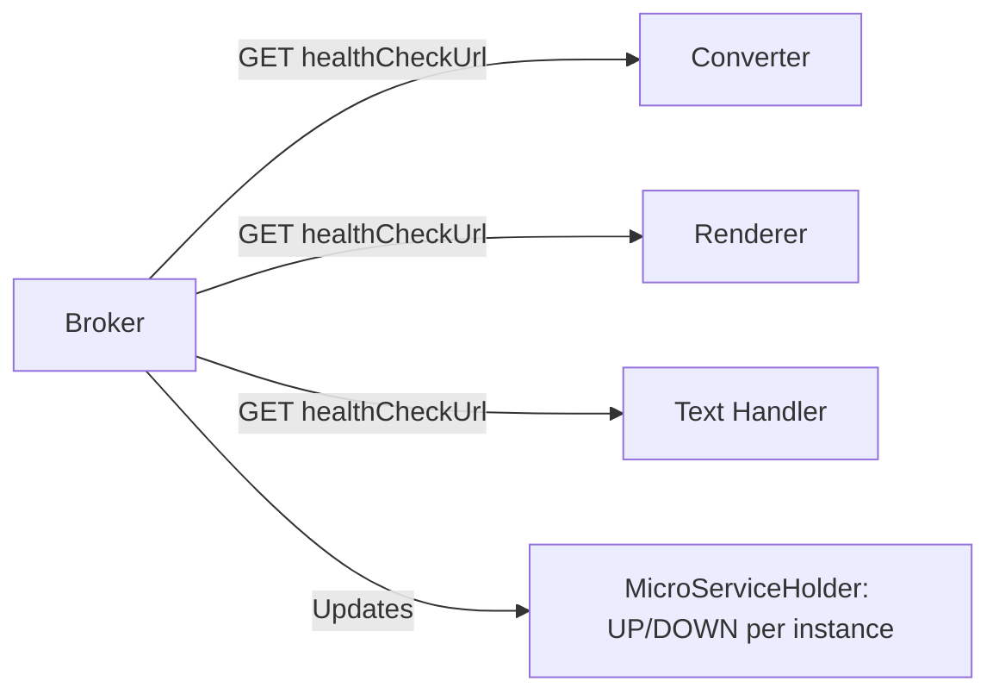

# Monitoring and observability

ARender exposes metrics, health endpoints, and structured logs across all rendition services.

## Actuator endpoints

All rendition services expose Spring Boot Actuator endpoints. The broker exposes three endpoints by default:

```properties
management.endpoints.web.exposure.include=prometheus,metrics,health
```

The converter, renderer, and text handler expose an additional `shutdown` endpoint used by the broker's health check loop to restart failed services in standalone mode:

```properties
management.endpoints.web.exposure.include=prometheus,metrics,health,shutdown
```

These defaults and all metrics export settings (Prometheus, Elasticsearch, Datadog, CloudWatch) are documented in the [Rendition properties — Shared metrics settings](../reference/rendition-properties.md#shared-metrics-settings).

### Available endpoints

| Endpoint | Path | Purpose |
|---|---|---|
| Health | `/actuator/health` | Returns UP/DOWN status for the service |
| Metrics | `/actuator/metrics` | Lists all available metric names |
| Metrics (specific) | `/actuator/metrics/{name}` | Returns values for a specific metric |
| Prometheus | `/actuator/prometheus` | Prometheus scrape endpoint (disabled by default, see below) |
| Shutdown | `/actuator/shutdown` | Triggers graceful shutdown (converter, renderer, text handler only) |

### Enabling Prometheus

The Prometheus endpoint is disabled by default. To enable it, set:

```properties
management.endpoint.prometheus.access=unrestricted
```

Once enabled, Prometheus can scrape each service at `/actuator/prometheus`.

---

## Metrics configuration

ARender uses Micrometer for metrics collection. Each service tags its metrics with a host identifier and application name.

### Per-service host tags

| Service | Host tag |
|---|---|
| Broker | `arender-broker` |
| Converter | `arender-taskconversion` |
| Renderer | `arender-jni` |
| Text handler | `arender-pdfbox` |

All services share the same application tag:

```properties
management.metrics.tags.application=arender
```

### HTTP request distribution

Every service configures percentile histograms and SLA buckets for HTTP request metrics:

```properties
management.metrics.distribution.percentiles-histogram.http.server.requests=true
management.metrics.distribution.sla.http.server.requests=100ms, 400ms, 500ms, 2000ms
management.metrics.distribution.percentiles.http.server.requests=0.5, 0.9, 0.95, 0.99
```

### Disabled default meters

By default, ARender disables several standard Micrometer meters to reduce noise. These are disabled across all services:

```properties
management.metrics.enable.tomcat=false
management.metrics.enable.http=false
management.metrics.enable.logback=false
management.metrics.enable.jvm=false
management.metrics.enable.process=false
management.metrics.enable.system=false
management.metrics.enable.application=false
management.metrics.enable.executor=false
management.metrics.enable.disk=false
```

To re-enable any of these, set the corresponding property to `true`. For example, to monitor JVM memory:

```properties
management.metrics.enable.jvm=true
```

---

## ARender endpoint metrics

The broker and all services support fine-grained per-endpoint metrics. Each endpoint metric is disabled by default and can be enabled individually:

```properties
# Enable metrics for document loading
arender.endpoint.metrics.export.load.document.enabled=true

# Enable metrics for image rendering
arender.endpoint.metrics.export.image.enabled=true

# Enable metrics for text search
arender.endpoint.metrics.export.search.enabled=true

# Enable metrics for document conversion
arender.endpoint.metrics.export.convert.enabled=true

# Enable metrics for document comparison
arender.endpoint.metrics.export.compare.enabled=true
```

The full list of toggleable endpoints:

| Property suffix | Operation |
|---|---|
| `has.document` | Document existence check |
| `bookmarks` | Bookmark extraction |
| `document.layout` | Document layout retrieval |
| `load.document.content` | Document content loading |
| `get.file.chunk` | File chunk retrieval |
| `text.position` | Text position extraction |
| `document.annotation` | Annotation retrieval |
| `transformation` | Transformation orders |
| `document.metadata` | Metadata retrieval |
| `image` | Page image rendering |
| `page.contents` | Page content retrieval |
| `search` | Text search |
| `advanced.search` | Advanced text search |
| `load.document` | Document loading |
| `evict` | Cache eviction |
| `annotation` | Annotation operations |
| `compare` | Document comparison |
| `named.destination` | Named destination extraction |
| `weather` | System weather/status |
| `readiness` | Readiness check |
| `signature` | Signature verification |
| `printable.pdf` | Printable PDF generation |
| `convert` | Format conversion |
| `health.record` | Health record retrieval |
| `document.xfa.check` | XFA form detection |

### Metric tags

Control which tags are included in exported metrics:

```properties
# Tags to include (comma-separated)
arender.endpoint.metrics.export.whitelist.tags=host,mimeType

# Include correlation ID as a tag (adds cardinality, use with caution)
arender.endpoint.metrics.export.correlation.id.tag.enabled=false

# Tags to exclude from system meters
arender.system.metrics.export.blacklist.tags=
```

### Metric collection mode

Choose between timing requests (with duration percentiles) or counting them:

```properties
# TIMER records duration; COUNTER records invocation count only
arender.metric.meter.tool=COUNTER
```

---

## External monitoring systems

ARender supports exporting metrics to four external systems. Each is disabled by default.

### Prometheus

Enable the Prometheus scrape endpoint as described above, then configure your Prometheus server to scrape each service:

```yaml title="prometheus.yml"
scrape_configs:
  - job_name: 'arender-broker'
    metrics_path: '/actuator/prometheus'
    static_configs:
      - targets: ['broker-host:8761']
  - job_name: 'arender-converter'
    metrics_path: '/actuator/prometheus'
    static_configs:
      - targets: ['converter-host:19999']
  - job_name: 'arender-renderer'
    metrics_path: '/actuator/prometheus'
    static_configs:
      - targets: ['renderer-host:9091']
  - job_name: 'arender-text-handler'
    metrics_path: '/actuator/prometheus'
    static_configs:
      - targets: ['text-handler-host:8899']
```

### Elasticsearch

```properties
management.elastic.metrics.export.enabled=true
management.elastic.metrics.export.step=5m
management.elastic.metrics.export.index=arender-micrometer-metrics
management.elastic.metrics.export.host=http://localhost:9200
```

### Datadog

```properties
management.datadog.metrics.export.enabled=true
management.datadog.metrics.export.api-key=YOUR_KEY
management.datadog.metrics.export.step=5m
management.datadog.metrics.export.uri=https://app.datadoghq.com/
```

### CloudWatch

```properties
management.cloudwatch.metrics.export.enabled=true
management.cloudwatch.metrics.export.namespace=brokerNameSpace
management.cloudwatch.metrics.export.step=5m
management.cloudwatch.metrics.export.batchSize=20
management.cloudwatch.metrics.export.region=eu-west-1
```

Each service uses its own namespace value. The defaults are `brokerNameSpace`, `converterNameSpace`, `rendererNameSpace`, and `pdfboxNameSpace`.

---

## Health checks and probes

### Kubernetes liveness and readiness probes

The Helm chart configures HTTP probes for all services:

| Service | Liveness path | Readiness path | Liveness delay | Readiness delay | Period |
|---|---|---|---|---|---|
| Broker | `/swagger-ui/index.html` | `/health/readiness` | 30s | 60s | 15s |
| Converter | `/actuator/health` | `/health/readiness` | 30s | 60s | 15s |
| Renderer | `/actuator/health` | `/health/readiness` | 30s | 60s | 15s |
| Text handler | `/actuator/health` | `/health/readiness` | 30s | 60s | 15s |

These values are configurable per service in `values.yaml`:

```yaml title="values.yaml"
rendition:
  broker:
    deployment:
      livenessProbe:
        initialDelaySeconds: 30
        periodSeconds: 15
        timeoutSeconds: 3
      readinessProbe:
        initialDelaySeconds: 60
        periodSeconds: 15
        timeoutSeconds: 1
```

Custom liveness and readiness paths can be set:

```yaml title="values.yaml"
rendition:
  broker:
    deployment:
      livenessProbe:
        path: "/actuator/health"
      readinessProbe:
        path: "/health/readiness"
```

### Internal health monitoring

The broker runs a `MicroServiceHealthCheckJob` for each registered microservice. This is separate from Kubernetes probes. The broker pings each service's health endpoint and tracks their status internally:



If a service is detected as DOWN and `health.check.restart.enabled=true` (standalone mode), the broker sends a POST to `/actuator/shutdown` and restarts the process.

---

## Log configuration

ARender uses Logback for logging. There are two logging configurations: one for Docker images (jib-packaged) and one for local Spring Boot development.

### Docker/Kubernetes log pattern

In the Helm chart, the logging ConfigMap generates a Logback configuration that routes log levels to stdout/stderr and optionally to rolling files:

```yaml title="values.yaml"
rendition:
  logging:
    default:
      consoleOnly: false
      logLevels:
        business: info      # com.arondor.arender classes
        technical: warn     # Spring, Tomcat, Jetty classes
      display:
        date: true
        podName: true
```

Set `consoleOnly: true` to disable file appenders entirely and output everything to the console, which is the recommended approach for container environments where a log aggregator collects stdout/stderr.

### Log files

When file logging is enabled, each service writes to `/arender/logs/`:

| Service | Log file | Additional log files |
|---|---|---|
| Broker | `arender-broker.log` | `arender-perf.log`, `arender-health.log` |
| Converter | `arender-converter.log` | |
| Renderer | `arender-renderer.log` | |
| Text handler | `arender-handler.log` | |

All log files use a `FixedWindowRollingPolicy` with a max size of 2 MB per file (Helm) or 50 MB (Docker image default), compressed with ZIP, up to 50 archived files.

### Performance log

The broker writes a dedicated performance log via the `LoggerInterceptor` class. This log tracks per-request timing:

```
logger name: com.arondor.viewer.common.logger.LoggerInterceptor
```

### Health log

The broker's health check activity is logged separately:

```
logger name: com.arondor.arender.micro.services.rendition.jobs.MicroServiceHealthCheckJob
```

### Persistent log storage (Kubernetes)

To persist logs across pod restarts, enable log persistence in the Helm chart:

```yaml title="values.yaml"
rendition:
  logging:
    persistance:
      enabled: true
      storage:
        size: 1Gi
      accessModes: "ReadWriteMany"
```

### Changing log levels at runtime

To change a service's log level without restarting, mount a custom logback.xml via the Helm chart:

```yaml title="values.yaml"
rendition:
  broker:
    logging:
      useDefault: false
      custom: |
        <?xml version="1.0" encoding="UTF-8"?>
        <configuration>
          <appender name="STDOUT" class="ch.qos.logback.core.ConsoleAppender">
            <encoder>
              <pattern>%date %level [%thread] %logger{10} [%file:%line] %msg%n</pattern>
            </encoder>
          </appender>
          <logger name="com.arondor.arender" level="DEBUG" />
          <root level="info">
            <appender-ref ref="STDOUT" />
          </root>
        </configuration>
```

---

## Key metrics to monitor

These metrics are the most useful for tracking ARender health and performance in production.

### System-level

| What to monitor | How |
|---|---|
| Service availability | Kubernetes liveness/readiness probes, or broker health check status |
| Pod restarts | `kube_pod_container_status_restarts_total` (from kube-state-metrics) |
| CPU and memory usage | Standard container metrics from cAdvisor or node-exporter |
| Shared volume usage | Disk usage on the `/arender/tmp` PVC |

### Application-level

| What to monitor | Metric / indicator |
|---|---|
| HTTP request latency (p50, p95, p99) | `http.server.requests` percentile histogram |
| HTTP request error rate | `http.server.requests` filtered by status 5xx |
| Conversion duration | Enable `arender.endpoint.metrics.export.convert.enabled=true` |
| Rendering duration | Enable `arender.endpoint.metrics.export.image.enabled=true` |
| Search duration | Enable `arender.endpoint.metrics.export.search.enabled=true` |
| Document load count | Enable `arender.endpoint.metrics.export.load.document.enabled=true` |

---

## Common operational issues

### Microservice not discovered by broker

**Symptoms:** Viewer shows an error when loading a document. Broker logs: "Found 0 instance of document-converter".

**Causes:**
- The microservice container is not running or has not started yet.
- In Docker Compose: the `DSB_KUBEPROVIDER_KUBE.HOSTS_*` environment variables do not match the service hostname.
- In Kubernetes: the service DNS name in the broker ConfigMap does not resolve. Check that the target service's Kubernetes Service object exists in the correct namespace.

**Diagnosis:**
```bash
# Check broker logs for discovery messages
kubectl logs deployment/arender-rendition-broker | grep "Found 0 instance"

# Verify DNS resolution from the broker pod
kubectl exec deployment/arender-rendition-broker -- nslookup arender-rendition-converter
```

### Shared volume file-not-found errors

**Symptoms:** Conversion succeeds but rendering fails. Broker logs: "FileNotFoundException" referencing `/arender/tmp/...`.

**Causes:**
- The shared PVC is not mounted in all pods.
- Different PVCs are used across services (check `claimName` consistency).
- The storage class does not actually support ReadWriteMany.

**Diagnosis:**
```bash
# Verify all pods mount the same PVC
kubectl get pods -o jsonpath='{range .items[*]}{.metadata.name}{"\t"}{.spec.volumes[*].persistentVolumeClaim.claimName}{"\n"}{end}'
```

### High conversion latency

**Symptoms:** Office or email documents take a long time to render the first page.

**Causes:**
- LibreOffice is slow to start its first conversion. Subsequent conversions are faster.
- The converter pod is CPU-constrained. Check resource limits.
- Large documents or spreadsheets with many cells exceed practical limits. The `excel.maximum.cell.count` property (default 1,000,000) caps spreadsheet size.

**Diagnosis:**
- Enable converter endpoint metrics: `arender.endpoint.metrics.export.convert.enabled=true`
- Check converter logs for timeout messages.
- Review pod CPU usage during conversion.

### PDFOwl process pool exhaustion

**Symptoms:** Rendering requests time out. Renderer logs: watchdog timeout messages.

**Causes:**
- All PDFOwl processes are busy with long-running renders.
- A document with very high-resolution or many layers exhausts the memory limit.

**Remediation:**
- Increase the memory limit: `pdfowl.memlimit.mb=2048`
- Increase the watchdog timeout: `pdfowl.client.watchdog=20000`
- Scale renderer replicas.

---

## Related pages

- [Rendition properties](../reference/rendition-properties.md)
- [System architecture](../overview/architecture.md)
- [Kubernetes Helm](../installation/kubernetes-helm.md)
- [Docker Compose](../installation/docker-compose.md)
