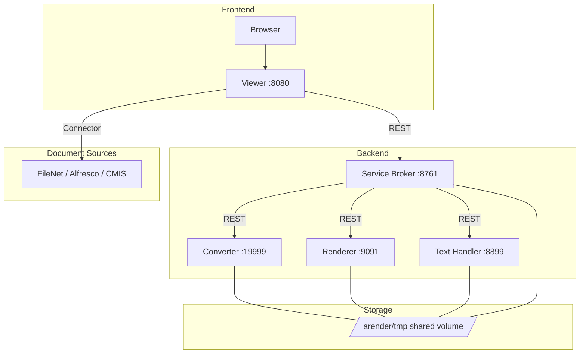

# System architecture

ARender consists of a frontend viewer and a set of backend rendition microservices.

## Components

### Viewer

The viewer is a Spring Boot application (port 8080) that serves a GWT-compiled JavaScript frontend. It handles:

- Document display in the browser
- User authentication (OAuth2/OIDC or pre-authenticated mode)
- Connector-based document loading from external repositories
- Annotation creation, editing, and storage
- Communication with the rendition backend

The viewer connects to the service broker using the `ARENDERSRV_ARENDER_SERVER_RENDITION_HOSTS` property.

### Service broker

The service broker (port 8761) is the main backend entry point. It:

- Exposes the rendition REST API
- Routes requests to converter, renderer, and text handler microservices
- Manages asynchronous conversion and comparison jobs
- Discovers microservices via static configuration (Docker Compose) or Kubernetes DNS (Kubeprovider)
- Stores document metadata and conversion orders in Hazelcast (when clustered)

### Document converter

The converter (port 19999) transforms documents into PDF or other target formats:

- Office files (including RTF) via LibreOffice (headless), MS Office (AROMS2PDF), or DirectOffice
- HTML and email (EML) via wkhtmltopdf
- Images via ImageMagick
- Multimedia (video, audio) via FFmpeg
- AutoCAD (DWG, DXF) via dedicated converter
- XFA forms via dedicated flattener
- AFP via dedicated converter
- PDF flattening for form-based PDFs

### Document renderer

The renderer (port 9091) generates page images from PDFs:

- PDFOwl rendering engine (default)
- JNI-based native rendering (deprecated)
- Output formats: PNG, SVG
- Supports image filters: brightness, contrast, invert, crop
- Layer (OCG) activation for complex PDFs

### Document text handler

The text handler (port 8899) uses PDFBox for:

- Text extraction with character-level positions
- Full-text search
- Bookmark extraction
- Digital signature verification
- Document comparison (text diff)
- Named destination and hyperlink extraction

## Communication

All backend microservices share a ReadWriteMany volume at `/arender/tmp` for exchanging document files. The broker discovers microservice instances via:

- **Kubeprovider** (Kubernetes): service DNS resolution configured in broker ConfigMap
- **Static configuration** (Docker Compose): the broker discovers microservices via `eureka.instance.*` properties that define hostnames, ports, and metadata for each service. Despite the legacy property namespace, no Eureka server is involved — the broker uses Spring Cloud's simple discovery client.

## Ports

| Service | Default port | Purpose |
|---------|-------------|---------|
| Viewer | 8080 | Frontend UI and connector integration |
| Service Broker | 8761 | REST API gateway and orchestration |
| Document Converter | 19999 | Format conversion |
| Document Renderer | 9091 | PDF-to-image rendering |
| Text Handler | 8899 | Text extraction, search, signatures |
| Hazelcast | 5701 | Distributed cache (when clustered) |

## Clustering

When running multiple replicas, ARender uses Hazelcast for:

- Distributed session storage (viewer)
- Document accessor caching (broker)
- Conversion and transformation order sharing (broker)
- Routing table synchronization (viewer)

Hazelcast discovery uses Kubernetes service DNS in Helm deployments and multicast in Docker Compose.

## Next steps

- [Docker Compose deployment](../deployment/docker-compose.md)
- [Kubernetes Helm deployment](../deployment/kubernetes-helm.md)
- [Microservices deep dive](../architecture/microservices.md)
