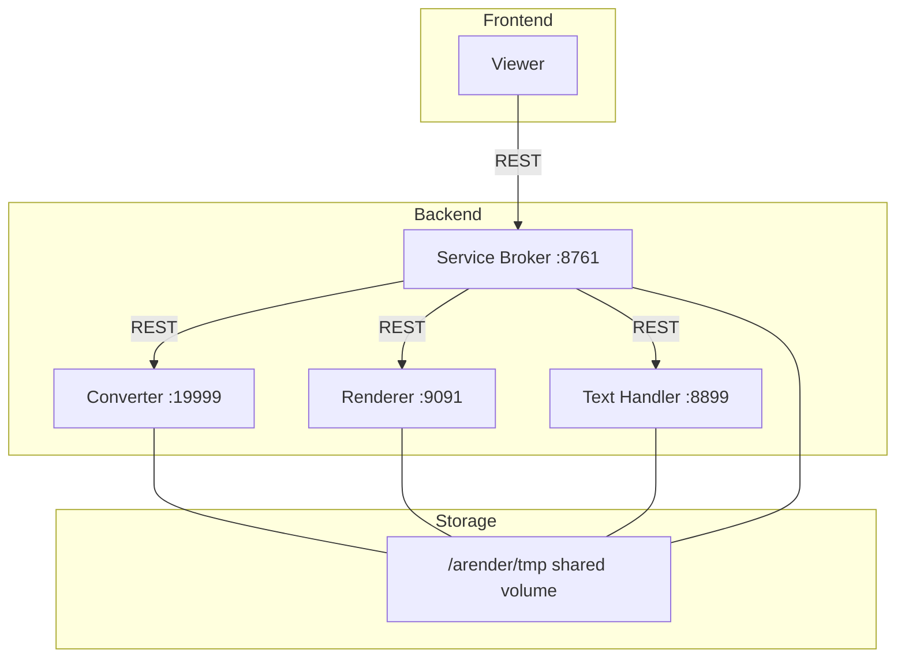
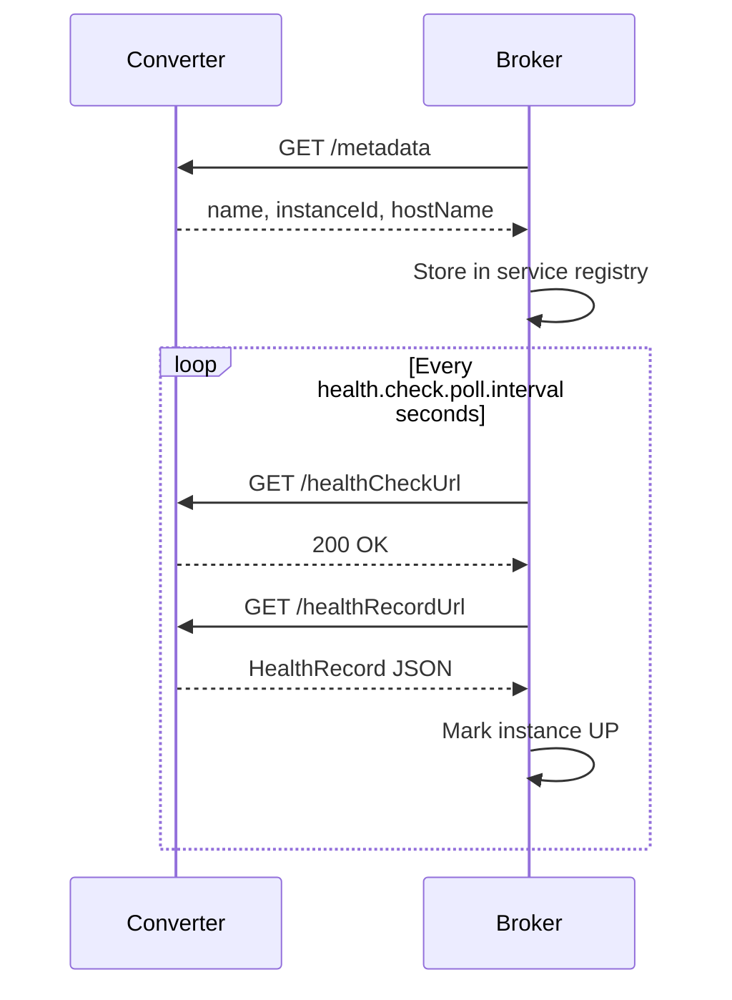
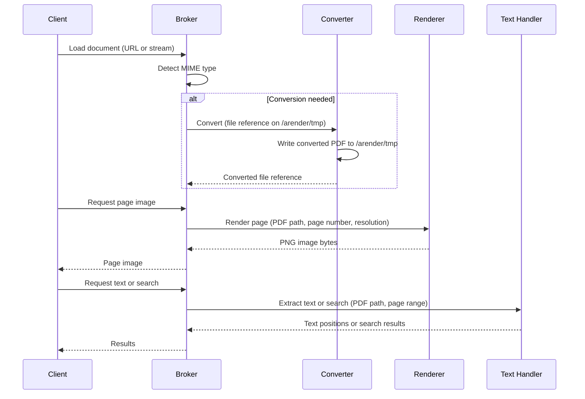

# System architecture

ARender consists of a frontend viewer and a set of backend rendition microservices. Each service runs as a separate Spring Boot process, exposes its own REST API, and is independently scalable.

## Components



The viewer is an npm package embedded as a [Web Component](../reference/web-component.md), with document connectors deployed as separate provider microservices. It connects to the backend services described below.

## Ports

| Service | Default port | Purpose |
|---------|-------------|---------|
| Service Broker | 8761 | REST API gateway and orchestration |
| Document converter | 19999 | Format conversion |
| Document renderer | 9091 | PDF-to-image rendering |
| Text Handler | 8899 | Text extraction, search, signatures |
| Alfresco Provider | 8788 | Alfresco document loading |
| FileNet Provider | 8787 | FileNet document loading |
| Hazelcast | 5701 | Distributed cache (when clustered) |

---

## Service broker

**Port:** 8761
**Image:** `arender-document-service-broker`

The broker is the sole entry point for all rendition operations. The viewer connects exclusively to the broker. No other rendition service is exposed to the viewer directly.

### Responsibilities

- Receives document load requests from the viewer
- Resolves MIME types and selects the appropriate processing pipeline
- Delegates format conversion to the converter when the document is not natively renderable
- Delegates image generation to the renderer
- Delegates text extraction, search, and comparison to the text handler
- Manages asynchronous conversion and transformation orders
- Maintains a document accessor cache (in-memory or distributed via Hazelcast)
- Extracts composite documents: emails (EML, MSG, MBOX), archives (ZIP, RAR, 7z, JAR), and PDF portfolios
- Exposes the full rendition REST API documented at `/swagger-ui/index.html`

### Native MIME types

Documents with these MIME types bypass the converter and go directly to the renderer or text handler:

```
application/pdf
image/tiff
video/mp4
application/vnd.ms-xpsdocument
```

All other supported types trigger a conversion step first. The mapping from source MIME type to conversion target is configured in the broker's `application.properties` under `arender.format.conversionTargetMimeTypes.*`.

### Health monitoring

The broker polls each registered microservice on a fixed schedule, calls its health endpoint, reads a health record, and marks the instance as UP or DOWN.

For configuration properties, see [Rendition configuration](../reference/rendition-properties.md#service-broker).

---

## Document converter

**Port:** 19999
**Image:** `arender-document-converter`

The converter transforms non-native formats into PDF or MP4 before the broker routes them to the renderer or text handler.

### Supported conversion paths

| Input category | Tool used | Output |
|---|---|---|
| Office (DOC, DOCX, XLS, XLSX, PPT, PPTX, ODP, ODT, ODS, VSD, PUB, RTF) | LibreOffice (headless), DirectOffice, or MS Office (AROMS2PDF) | PDF |
| HTML, EML body | wkhtmltopdf | PDF |
| Images (PNG, JPEG, BMP, WEBP, GIF, SVG, PCX, HEIF, WMF, etc.) | ImageMagick | PDF |
| Text files, vCard | Internal renderer | PDF |
| Video/audio (MOV, MKV, AVI, WAV, MP3, etc.) | FFmpeg | MP4 |
| AFP | cpmcopy | PDF |
| XFA forms | Built-in PDF flattener | PDF (flattened) |

The Docker image for the converter ships with all required tools pre-installed. A self-test mechanism (the "nurse") converts sample files at startup to verify that tools are operational.

For configuration properties, see [Rendition configuration](../reference/rendition-properties.md#document-converter).

---

## Document renderer

**Port:** 9091
**Image:** `arender-document-renderer-pdfowl`

The renderer resolves document layout (page count, dimensions) and generates page images from PDF files. It is the only service that produces visual page content for the viewer.

### PDFOwl rendering engine

The default renderer uses PDFOwl, a native binary process managed by the Spring Boot service. The service maintains a pool of PDFOwl processes. When process recycling is enabled (the default), idle processes remain in the pool and are reused across requests. When disabled, each render request spawns a fresh process, which is safer but slower.

### Capabilities

- Renders PDF pages to PNG or SVG at configurable resolution
- Applies image filters: brightness, contrast, inversion, cropping
- Activates and deactivates OCG layers (Optional Content Groups) for complex PDFs
- Performs image comparison between source and converted PDFs (used for PDF/A quality validation)

For configuration properties, see [Rendition configuration](../reference/rendition-properties.md#document-renderer-pdfowl).

---

## Document text handler

**Port:** 8899
**Image:** `arender-document-text-handler`

The text handler uses Apache PDFBox for all text-level operations on PDF files.

### Capabilities

- Text extraction with character-level position data (used for text selection and copy in the viewer)
- Full-text search within a document, with configurable timeout
- Streamed search results with per-result timeout
- Bookmark (outline) extraction
- Digital signature verification
- Document comparison using text diff, with optional diff-fragment resolution
- Named destination and hyperlink extraction

For configuration properties, see [Rendition configuration](../reference/rendition-properties.md#document-text-handler).

---

## Service discovery

The broker discovers microservices using one of two mechanisms depending on the deployment model.

### Kubeprovider (Docker Compose)

In Docker Compose, the broker maps service hostnames to ports using the `kubeprovider.kubeHosts` configuration. Each microservice declares its hostname through environment variables. The broker pings each configured host at startup, retrieves its metadata via `GET /metadata`, and caches the resolved instance. It retries every second until all expected hosts are reachable.



Broker-side environment variables map hostnames to ports:

```yaml title="docker-compose.yml"
service-broker:
  environment:
    - "DSB_KUBEPROVIDER_KUBE.HOSTS_DOCUMENT-CONVERTER=19999"
    - "DSB_KUBEPROVIDER_KUBE.HOSTS_DOCUMENT-RENDERER=9091"
    - "DSB_KUBEPROVIDER_KUBE.HOSTS_DOCUMENT-TEXT-HANDLER=8899"
```

Each microservice announces its identity to the broker:

```yaml title="docker-compose.yml"
document-converter:
  environment:
    - "DCV_EUREKA_INSTANCE_METADATA.MAP_HOST.NAME=document-converter"
    - "DCV_APP_EUREKA_HOSTNAME=service-broker"
    - "DCV_APP_EUREKA_PORT=8761"
```

### Kubernetes DNS (Helm chart)

In Kubernetes, the Helm chart generates a ConfigMap for the broker with fully qualified service DNS names:

```yaml title="broker-configmap.yaml"
kubeprovider:
  kubeHosts:
    arender-rendition-converter.arender.svc.cluster.local: 19999
    arender-rendition-handler.arender.svc.cluster.local: 8899
    arender-rendition-renderer.arender.svc.cluster.local: 9091
```

The broker resolves these DNS names through standard Kubernetes service resolution. No Eureka server is required.

---

## Inter-service communication flow

All communication between services is over HTTP (REST). There is no message queue, no gRPC, and no direct database sharing.



The broker selects a service instance from its internal `MicroServiceMap` for each request. In clustered deployments with multiple replicas per service, it picks an available instance from the pool maintained by the health check job.

---

## Shared volume constraints

All four rendition services must mount the same volume at `/arender/tmp`. This is a hard requirement:

- Converted files are written by the converter and read by the renderer and text handler.
- The broker tracks file references, not file content.
- In Kubernetes, the PVC must use a `ReadWriteMany` access mode.
- In Docker Compose, a named volume shared across services satisfies this requirement.

If the shared volume is unavailable or not mounted consistently across containers, document processing will fail with file-not-found errors.

---

## Clustering

When running multiple replicas, ARender uses Hazelcast for:

- Document accessor caching (broker)
- Conversion and transformation order sharing (broker)

Hazelcast discovery uses Kubernetes service DNS in Helm deployments and multicast in Docker Compose. See [Rendition caching](../concepts/caching.md) for configuration details.

---

## Next steps

- [Docker Compose](../installation/docker-compose.md)
- [Kubernetes Helm](../installation/kubernetes-helm.md)
- [Monitoring and observability](../operations/monitoring.md)
