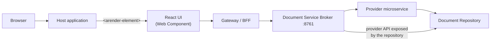

# ARender Horizon

ARender Horizon is a React-based document viewer distributed as an npm package (`arender-ui`). It registers an `<arender-element>` Web Component that you embed directly into your web application. No iframe and no standalone server are needed: the viewer lives inside your page as a native HTML element.

## Feature availability

Status as of ARender 2026.3.0.

| Area | Available | Coming soon |
|------|-----------|-------------|
| Viewing | All formats including AutoCAD, [Excel data view](/release-note/arender/v2026.3.0/release-notes#excel-data-view) (`.xlsx`), full-text search | Multi-view (split screen), table of contents, comparison (text and image) |
| Annotations | Rectangle, circle, free text, arrow, freehand, highlight, underline, strikethrough | Stamp, link, polyline, measure, bookmarks |
| Comments | Comment pinned to a point, with replies, status and a comments panel | Comment on a zone, comment on a text selection |
| Download and print | Download in original format or as PDF, print | Download as PDF with annotations (flattened or editable), print with annotations |
| Document builder | | Split, merge, page manipulation |
| Security | [OAuth2 authentication](../installation/configuration.md#authentication-and-bff) on the rendition backend (JWT validation) | Redaction, watermarks, per-user and per-document permissions defined by your repository (download, print, annotate, redact...) |
| Integration | [Web Component](../reference/web-component.md), [public JavaScript API](../reference/javascript-api.md), interface in 15 languages | |

To follow what is planned next or vote for a feature, see the [ARender product portal](https://portal.productboard.com/uxopian/2-arender/tabs/7--under-consideration).

## Architecture overview

ARender Horizon runs entirely in the browser as a Web Component embedded in your host application. It communicates with the ARender backend over REST.

- **Host application**: your web application, built with any technology
- **React UI**: the `<arender-element>` Web Component, bundled into your app via npm
- **Reverse proxy / Backend For Frontend (BFF)**: sits between the viewer and the broker. At minimum, a reverse proxy (Nginx) routes API calls and solves CORS. When using providers, it also injects the `X-Provider-ID` header. When OAuth2 is enabled on the rendition backend, a full BFF handles token management on behalf of the viewer. If your environment already has a BFF or API gateway, you can reuse it.
- **Document Service Broker**: the ARender backend that orchestrates rendition (conversion, rendering, text extraction)
- **Provider**: a microservice that loads documents from a repository (Alfresco, FileNet, M-Files, or a custom source) and exposes them to the broker through the provider REST API. A repository that exposes this API itself needs no provider: the broker calls it directly
- **Document Repository**: the system where your documents are stored

:::note
ARender does not yet ship a built-in BFF component. It is planned for an upcoming release. In the meantime, use your own reverse proxy or BFF.
:::

## Deployment model

ARender Horizon is an **npm package** that you install and bundle into your own application. There is no separate viewer server to deploy.

The **backend** is a set of Docker containers:

- The **broker** container orchestrates all rendition services (converter, renderer, text handler, file storage). This is the only backend endpoint the viewer needs.
- If your documents are stored in a repository such as Alfresco, FileNet or M-Files, you deploy an additional **provider** container. The provider is a lightweight microservice that the broker calls to fetch documents from the repository on behalf of the viewer. If your repository exposes the provider REST API itself, the broker calls it directly and no provider container is needed.

If your host application supplies documents directly (for example, by uploading a file to the broker API), no provider is needed.

## Next steps

- [Getting started](../quickstart/getting-started.md): install, embed, and open your first document
- [Web Component](../reference/web-component.md): HTML attributes, JavaScript API, styling
- [JavaScript API](../reference/javascript-api.md): commands, events and error codes to drive the viewer from your application
- [Configuration](../installation/configuration.md): CORS setup, reverse proxy, backend connection
- [Providers](../guides/integration/providers.md): load documents from Alfresco, FileNet, M-Files, or custom repositories
- [Migrating from the Classic viewer](../guides/upgrade/migration-from-gwt.md): concept mapping and checklist
