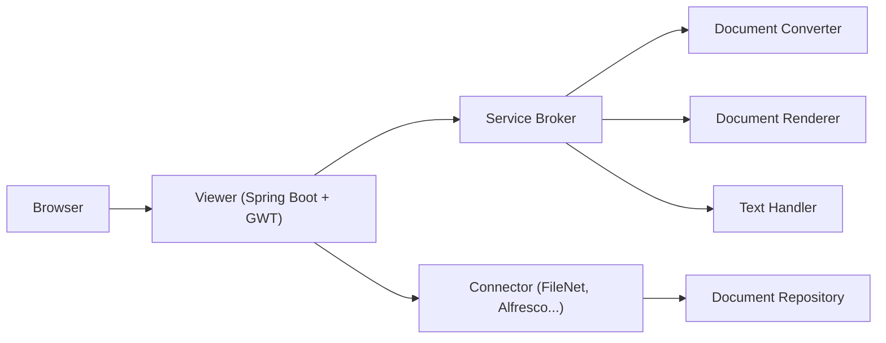

# What is ARender

ARender is a document viewing, annotation, and rendition platform built by Uxopian Software. It lets users view, annotate, compare, redact, and assemble documents in a web browser, and provides a REST API for headless document rendering and conversion.

## Who is it for

- **Solution architects** designing document management workflows
- **Developers** embedding a document viewer into web applications
- **System administrators** deploying and operating the platform
- **Business users** collaborating through annotations, comparisons, and document assembly

## What ARender does

ARender handles two primary workloads:

**Viewing and collaboration.** Users open documents from connected repositories (Alfresco, IBM FileNet, and others), view them in a browser, and collaborate using XFDF-standard annotations. The viewer supports multi-format rendering, full-text search, bookmarks, hyperlinks, digital signature validation, document comparison, redaction, and a document builder for page-level assembly.

**Backend rendition services.** A set of microservices converts documents to viewable formats, renders pages as images, extracts text, and exposes these operations through a REST API. These services can run independently of the viewer for headless processing.

## Supported document formats

ARender renders over 100 document formats natively or via conversion:

- PDF (including PDF/A, portfolios, and encrypted)
- Microsoft Office (Word, Excel, PowerPoint, Visio, Publisher, Project)
- LibreOffice / OpenDocument formats
- Images (PNG, JPEG, TIFF, GIF, WebP, HEIF, BMP, DICOM, EPS)
- HTML and SVG
- Email (EML)
- Video (MP4)
- AFP (Advanced Function Presentation)
- Plain text, RTF, vCard
- XPS

See [Supported formats](./supported-formats.md) for the complete matrix.

## Architecture at a glance

ARender runs as a set of Docker containers:

The **viewer** handles the user interface, security, and connector integration. The **service broker** orchestrates backend microservices for conversion, rendering, and text extraction. All backend rendition microservices share a temporary file volume (`/arender/tmp`).

See [System architecture](./architecture.md) for details.

## Next steps

- [Docker Compose quickstart](../quickstart/docker-compose.md): get ARender running locally in minutes
- [Core concepts](../concepts/connectors.md): understand connectors, annotations, and the rendition pipeline
- [Installation](../installation/docker-compose.md): install ARender for production
- [REST API reference](../reference/rest-api/broker-api.md): integrate programmatically
