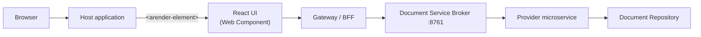

# Modern Viewer

The ARender Modern Viewer is a React-based document viewer distributed as an npm package (`arender-ui`). It registers an `<arender-element>` Web Component that you embed directly into your web application. No iframe, no standalone server needed — the viewer lives inside your page as a native HTML element.

## Feature availability

| Feature | Status |
|---------|--------|
| Document viewing (all formats including AutoCAD) | Available |
| Full-text search (improved performance) | Available |
| Download (native format and PDF) | Available |
| Print | Available |
| Internationalization (15 languages) | Available |
| Web Component | Available |
| Full annotation types (zone highlight, freetext, text highlight, rectangle, stamp, arrow, ink, sticky note...) | Coming soon |
| Document comparison (text and image) | Coming soon |
| Split, merge, page manipulation (document builder) | Coming soon |
| Redaction | Coming soon |
| Bookmarks creation / deletion | Coming soon |
| Multi-view (horizontal split) | Coming soon |
| Download as PDF with annotations | Coming soon |
| Print with annotations | Coming soon |

## Architecture overview

The Modern Viewer runs entirely in the browser as a Web Component embedded in your host application. It communicates with the ARender backend over REST.

- **Host application** — your web application, built with any technology
- **React UI** — the `<arender-element>` Web Component, bundled into your app via npm
- **Reverse proxy / Backend For Frontend (BFF)** — sits between the viewer and the broker. At minimum, a reverse proxy (Nginx) routes API calls and solves CORS. When using connector providers, it also injects the `X-Provider-ID` header. When OAuth2 is enabled on the rendition backend, a full BFF handles token management on behalf of the viewer. If your environment already has a BFF or API gateway, you can reuse it.
- **Document Service Broker** — the ARender backend that orchestrates rendition (conversion, rendering, text extraction)
- **Provider** — an optional microservice that loads documents from a repository (Alfresco, FileNet, or a custom source)
- **Document Repository** — the system where your documents are stored

:::note
ARender does not yet ship a built-in BFF component — this is planned for an upcoming release. In the meantime, use your own reverse proxy or BFF.
:::

## Deployment model

The Modern Viewer is an **npm package** that you install and bundle into your own application. There is no separate viewer server to deploy.

The **backend** is a set of Docker containers:

- The **broker** container orchestrates all rendition services (converter, renderer, text handler, file storage). This is the only backend endpoint the viewer needs.
- If your documents are stored in a repository such as Alfresco or FileNet, you deploy an additional **provider** container. The provider is a lightweight microservice that the broker calls to fetch documents from the repository on behalf of the viewer.

If your host application supplies documents directly (for example, by uploading a file to the broker API), no provider is needed.

## Next steps

- [Getting started](../quickstart/getting-started.md) — install, embed, and open your first document
- [Web Component](../reference/web-component.md) — HTML attributes, JavaScript API, styling
- [Configuration](../installation/configuration.md) — CORS setup, reverse proxy, backend connection
- [Connector providers](../guides/integration/connector-providers.md) — load documents from Alfresco, FileNet, or custom repositories
- [Migrating from the Classic viewer](../guides/upgrade/migration-from-gwt.md) — concept mapping and checklist
