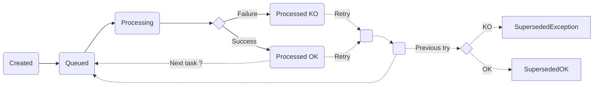
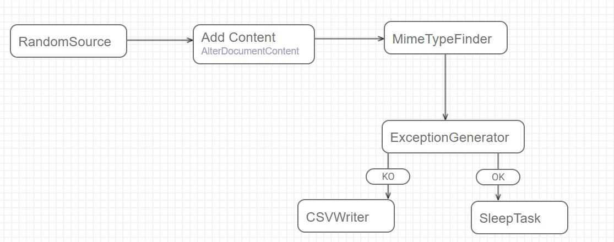
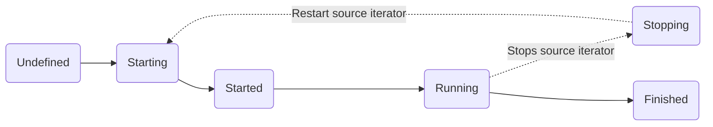

---
last_update:
  date: '2026-01-29T10:50:12.660Z'
  author: CI/CD Bot
sidebar_position: 1
title : Overall concepts 
content_hash: cf058215b3a47e2cf188e0955ce094b1b691a87d91a3d4539de2f7e23e2e0370
---

import ThemedImage from '@theme/ThemedImage';

[map]: #map
[campaign]: #campaign
[content]: #content

# What you need to know before committing to Fast2

## Glossary

Fast2 has its own vocabulary, and these terms come up throughout the documentation. Here is what each one means.

| Term | Definition |
|------|------------|
| **Source** | A Fast2 task whose job is to gather the documents or items to migrate. As it identifies them, it converts each one into a *punnet*. |
| **Punnet** | The pivot format that carries a single migration entity — documents, metadata, content and folders — through the workflow. Everything Fast2 processes travels as a punnet. |
| **Task** | A single extract, transform or inject step in a workflow. Each task is configured to the user's needs; the migration is complete once every task has run, in order. |
| **Map** *(workflow)* | An ordered chain of tasks, where the output of one task is the input of the next. Each task is a step of the workflow. |
| **Campaign** | The execution of a map over a defined perimeter. A campaign can run once or several times, and successive runs can be cumulative or independent. |
| **Worker** | The punnet processor. It applies a task's configured operations to each punnet when the broker assigns it one. Add workers to raise throughput when the workload is heavy. |
| **Broker** | The workflow orchestrator. It schedules and coordinates the workers, manages the punnet queues, and persists every punnet's data, logs and errors to the database for full traceability. |

<br />
<br />

## Architecture

At runtime, Fast2 follows a **broker–worker** model. The **broker** is the single orchestrator: it loads the map, starts the campaign, and keeps one queue per task that holds the punnets waiting for their next step. **Workers** are separate processes that pull work from the broker over plain HTTP — there is no external message bus to install or operate. A worker acquires a batch of punnets from a task's queue, runs that task on them, and hands the results back; the broker then routes each punnet into the next task's queue, and so a punnet walks the whole map one step at a time. Everything the broker knows — campaigns, per-punnet status, queue settings, logs and errors — is persisted to an **OpenSearch** database, so a campaign survives a restart and can be reopened exactly where it left off. Scaling out is deliberately boring: start more worker processes, and each one registers with the broker through a periodic heartbeat and begins pulling from the same shared queues. Adding workers adds throughput with no change to the map, and if a worker goes silent the broker simply re-queues the work it was holding.

<ThemedImage
  alt="Fast2 architecture: the broker holds one queue per task and dispatches punnets to workers over HTTP, persisting all state to OpenSearch"
  sources={{
    light: require('../assets/img/architecture_light.png').default,
    dark: require('../assets/img/architecture_dark.png').default,
  }}
  style={{width: '100%', maxWidth: '560px', display: 'block', margin: '1.5rem auto', borderRadius: '12px', boxShadow: '0 10px 28px rgba(0,0,0,0.14), 0 3px 8px rgba(0,0,0,0.08)'}}
/>

## <i className="fas fa-shopping-basket"></i> Fast2 objects

### Folder

Folder object represents a folder in the ECM or file system sense, and can have metadata as well as links to documents

:::info

This type can be included into punnets and documents, and folders themselves.

:::

```
ㄴ folder
	ㄴ name
	ㄴ path
	ㄴ parent folder
		ㄴ name
		ㄴ path
		ㄴ parent folder
			ㄴ ...
```

### Dataset

Data object represents metadata in the ECM sense. It contains a name, a type, and one or more values.

:::info

This type can be included into punnets, documents and workflows.

:::

```
ㄴ dataset
	ㄴ metadata A (ex/ key: value)
		ㄴ properties
			ㄴ property
			ㄴ property
			ㄴ ...
	ㄴ metadata B (ex/ key: [value A, value B])
	ㄴ ...
```

### Content <small>(aka 'ContentContainer')</small> {#content}

Content object materializes document content that can be simple or made up of several pages. It can be materialized by a relative or absolute path to its storage location or stored directly in memory / in an XML file.

:::info

This type can be included into documents and annotations.

:::

```
ㄴ content
	ㄴ URL
	ㄴ mime-type
	ㄴ properties
		ㄴ property
		ㄴ property
		ㄴ ...
	ㄴ subcontents
		ㄴ content
		ㄴ content
		ㄴ ...
```

### Annotations

Annotation object represents an annotation (post-its, arrow…) affixed to the content of a document. This object is not conceptualized in all ECM systems.

```
ㄴ annotation
	ㄴ ID
	ㄴ content
```

### Document

A document can also contains its own data, its content with annotations and the folder where it is stored.

:::info

This type can be included into punnets and workflows.

:::

```
ㄴ document
	ㄴ documentId
	ㄴ dataset
	ㄴ contents
	ㄴ mime-type
	ㄴ folders
	ㄴ annotations
```

### Workflow

```
ㄴ workflows
	ㄴ dataset
	ㄴ associated documents
		ㄴ document
		ㄴ document
		ㄴ ...
```

### Punnet

As introduced above, the punnet gathers all the different assets to migrate.

```
ㄴ punnet
	ㄴ punnetId
	ㄴ documents
		ㄴ document
		ㄴ document
		ㄴ ...
	ㄴ dataset
	ㄴ workflows
	ㄴ folders
```

When serialized in XML format, it will look roughly like :

```xml
<?xml version='1.0' encoding='UTF-8'?>
<ns:punnet xmlns:ns="http://www.arondor.com/xml/document" punnetId="34c5434c-4234-4fa2-9f91-7882a899a994#1">
	<ns:documentset>
		<ns:document documentId="34c5434c-4234-4fa2-9f91-7882a899a994">
			<ns:contentset>
				<com.arondor.fast2p8.model.punnet.ContentContainer contentStorage="URL">
					<ns:url>C:/samples/file.pdf</ns:url>
				</com.arondor.fast2p8.model.punnet.ContentContainer>
			</ns:contentset>
			<ns:dataset>
				<ns:data name="name" type="String">
					<ns:value>sample</ns:value>
				</ns:data>
			</ns:dataset>
			<ns:folderset>
                <ns:folder parent-path="/primary-folder/subfolder" name="sample">
                    <ns:dataset />
                </ns:folder>
            </ns:folderset>
			<ns:annotationset />
		</ns:document>
	</ns:documentset>
	<ns:dataset />
	<folderSet />
</ns:punnet>
```

#### Lifecycle

The punnet will iterate through the follwing lifecycle until the last step is reached.

<!-- https://mermaid-js.github.io/mermaid/#/flowchart -->



## Task

Task can be represented as a processing unit to be applied to a punnet. A punnet comes at the entry of the task, as an input. The task performs operations and then outputs the modified punnet.

During the processing of each task, statistics are collected allowing to know the number of punnets processed per second. This is the actual throughput of the task and it is of course dependent on the environment (neighboring tasks, multi-thread…) From this speed, Fast2 tries to estimate the average time left for all the tasks.

One of the benefits of these statistics is the ability to visualize bottlenecks. Sometimes some tasks have a longer processing time than others. Thanks to the visualization of the queues, it is quite easy to know which task is greedy.

When multiple tasks are linked together it represents a processing chain or a workflow where each punnet will be processed task by task. We will call this object a campaign.

## Map <small>― workflow</small> {#map}

Map is the Fast2 word for the workflow. It is a collection of tasks.



## Campaign <small>― workflow instance</small> {#campaign}

As we have just seen, a campaign is made up of several tasks. In other words, it represents an instance of a map.

:::warning

A campaign has a unique name

:::

Despite this uniqueness, each campaign can be ran multiple times. The statistical data of the new run will be added to the previous run(s).

Other runs can be added on top of this one.

A user has the opportunity to stop any campaign when he wants. He can always resume the campaign later, or start a fresh one.

A retry feature is also available after each campaign. This makes possible to filter certain punnets and to replay them directly in the campaign. For instance, retry each punnet in exception. You can even select which type of exception you want.

### Lifecycle



### Punnet status

For each task, the color bubble indicates the status of punnet processing.


Each colored bubble shows a specific metric:

🟡 Yellow (Top) – Number of punnets waiting to be processed

🔵 Blue (Left) – Number of punnets currently being processed

🔴 Red (Right) – Number of failures

🟠 Orange (Bottom Center) – Processing speed, in punnets per second

🟢 Green (Right-Center) – Number of successfully processed punnets
