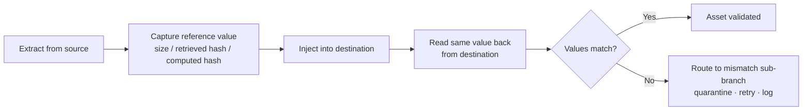

# Proving Nothing Was Lost: Reconciliation & Checksum Validation

Migrate a few billion documents and sooner or later someone asks the uncomfortable question: how do you actually *know* nothing was corrupted or lost on the way over? This page is about how Fast2 answers it. It walks through the reconciliation methodology, the trade-offs between the content-validation strategies, and what Fast2 does with an asset that fails the check.

It is written to be **system-agnostic**: "source system" and "destination system" stand for whatever you migrate from and to.

:::tip TL;DR
- Reconciliation in Fast2 means **comparing a property of the source content against the same property of the destination content** after upload.
- There are three strategies, from cheapest to most thorough: **(1)** compare the content **size**, **(2)** compare a **hash retrieved** from each system's metadata, **(3)** have Fast2 **calculate the hash** itself on both ends and compare.
- Whatever the strategy, a mismatch routes the asset into a dedicated **workflow sub-branch**: quarantine, a human-in-the-loop comparison, delete and retry, or just logging the bad IDs to a CSV.
- All of it is **sequential tasks you wire at workflow-design time**. No bespoke code.
- **Content checksums are meaningless if the binary is converted in transit** (image → PDF, HTML → image): the bytes change by design, so the hashes will never match.
:::

## Content validation strategies

As for the content, there would be several ways to validate the content (ex/ PDF binary, ≠ metadata) of the migrated assets, from least expensive to most resource/time consuming :

:::warning Important
**Note that all of these content checksum are irrelevant in case of a content conversion (ex/ image to PDF or HTML to image) occurring during the migration flow.**
:::

### 1. Rely on the content size

- Extract all the metadata associated to the content, namely the size of it calculated by the source system
- Perform the injection of the content in the destination system
- Query the destination system in a post-upload task and ask the destination system for the size of the uploaded content. If they match, it would mean that the content has not been corrupted during the transfer.

<table style={{width:'100%', borderCollapse:'collapse'}}>
  <thead>
    <tr>
      <th style={{backgroundColor:'#2e7d32', color:'white', textAlign:'left', padding:'8px 12px', width:'50%'}}>Benefits</th>
      <th style={{backgroundColor:'#c62828', color:'white', textAlign:'left', padding:'8px 12px', width:'50%'}}>Drawbacks</th>
    </tr>
  </thead>
  <tbody>
    <tr>
      <td style={{backgroundColor:'rgba(46,125,50,0.12)', verticalAlign:'top', padding:'8px 12px'}}>
        <ul style={{listStyle:'none', margin:0, padding:0}}>
          <li style={{margin:'0 0 4px 0', paddingLeft:'1.6em', textIndent:'-1.6em'}}>✅ Fast</li>
          <li style={{margin:'0 0 4px 0', paddingLeft:'1.6em', textIndent:'-1.6em'}}>✅ Rely on the source/destination knowledge of the content</li>
          <li style={{margin:'0 0 4px 0', paddingLeft:'1.6em', textIndent:'-1.6em'}}>✅ Match calculated based on just 2 values (low-to-no resource usage)</li>
          <li style={{margin:'0 0 4px 0', paddingLeft:'1.6em', textIndent:'-1.6em'}}>✅ No need to fetch the content from the destination</li>
        </ul>
      </td>
      <td style={{backgroundColor:'rgba(198,40,40,0.12)', verticalAlign:'top', padding:'8px 12px'}}>
        <ul style={{listStyle:'none', margin:0, padding:0}}>
          <li style={{margin:'0 0 4px 0', paddingLeft:'1.6em', textIndent:'-1.6em'}}>❌ Source and destination systems must know the content size</li>
          <li style={{margin:'0 0 4px 0', paddingLeft:'1.6em', textIndent:'-1.6em'}}>❌ Dependent on any post-upload business rules processing the content</li>
        </ul>
      </td>
    </tr>
  </tbody>
</table>

### 2. Retrieve (≠ calculate) the hash of the content

- Extract the metadata hash value of the content
- Upload the content into the destination
- Retrieve the hash value from the destination during a post-migration task, and compare it with the original hash value of the source system.

<table style={{width:'100%', borderCollapse:'collapse'}}>
  <thead>
    <tr>
      <th style={{backgroundColor:'#2e7d32', color:'white', textAlign:'left', padding:'8px 12px', width:'50%'}}>Benefits</th>
      <th style={{backgroundColor:'#c62828', color:'white', textAlign:'left', padding:'8px 12px', width:'50%'}}>Drawbacks</th>
    </tr>
  </thead>
  <tbody>
    <tr>
      <td style={{backgroundColor:'rgba(46,125,50,0.12)', verticalAlign:'top', padding:'8px 12px'}}>
        <ul style={{listStyle:'none', margin:0, padding:0}}>
          <li style={{margin:'0 0 4px 0', paddingLeft:'1.6em', textIndent:'-1.6em'}}>✅ Takes the same low-to-none resource capacity as the previous method</li>
          <li style={{margin:'0 0 4px 0', paddingLeft:'1.6em', textIndent:'-1.6em'}}>✅ More reliable than the previous method.</li>
        </ul>
      </td>
      <td style={{backgroundColor:'rgba(198,40,40,0.12)', verticalAlign:'top', padding:'8px 12px'}}>
        <ul style={{listStyle:'none', margin:0, padding:0}}>
          <li style={{margin:'0 0 4px 0', paddingLeft:'1.6em', textIndent:'-1.6em'}}>❌ Needs the source+destination system to auto-calculate the hash of the content</li>
          <li style={{margin:'0 0 4px 0', paddingLeft:'1.6em', textIndent:'-1.6em'}}>❌ Dependent on whether the source/destination systems calculate the format with a different hashing method</li>
        </ul>
      </td>
    </tr>
  </tbody>
</table>

### 3. Calculate (≠ retrieve) the hash of the content

- Extract the content from the source
- Calculate the hash with Fast2 as soon as the content binary is extracted *(formats supported:  MD5, SHA-1, SHA-256, SHA-512 etc)*
- Upload the content
- Retrieve (download) the content as it is in the destination
- Calculate the hash with Fast2
- Compare it with the original hash calculated right after extraction from the source.

<table style={{width:'100%', borderCollapse:'collapse'}}>
  <thead>
    <tr>
      <th style={{backgroundColor:'#2e7d32', color:'white', textAlign:'left', padding:'8px 12px', width:'50%'}}>Benefits</th>
      <th style={{backgroundColor:'#c62828', color:'white', textAlign:'left', padding:'8px 12px', width:'50%'}}>Drawbacks</th>
    </tr>
  </thead>
  <tbody>
    <tr>
      <td style={{backgroundColor:'rgba(46,125,50,0.12)', verticalAlign:'top', padding:'8px 12px'}}>
        <ul style={{listStyle:'none', margin:0, padding:0}}>
          <li style={{margin:'0 0 4px 0', paddingLeft:'1.6em', textIndent:'-1.6em'}}>✅ Fast2 will be able to use the same hashing format for both inbound/outbound content binary</li>
          <li style={{margin:'0 0 4px 0', paddingLeft:'1.6em', textIndent:'-1.6em'}}>✅ Still works even if either the source or destination is not storing the content hash.</li>
        </ul>
      </td>
      <td style={{backgroundColor:'rgba(198,40,40,0.12)', verticalAlign:'top', padding:'8px 12px'}}>
        <ul style={{listStyle:'none', margin:0, padding:0}}>
          <li style={{margin:'0 0 4px 0', paddingLeft:'1.6em', textIndent:'-1.6em'}}>❌ Needs resource for reading twice the content for calculating hashes (one after the extraction from the source, a second after the upload from the destination)</li>
          <li style={{margin:'0 0 4px 0', paddingLeft:'1.6em', textIndent:'-1.6em'}}>❌ Twice sollicitation of the destination (upload the content + download the content to calculate the hash of the content binary as-is in the destination)</li>
          <li style={{margin:'0 0 4px 0', paddingLeft:'1.6em', textIndent:'-1.6em'}}>❌ Dependent on any post-upload business rules processing the content</li>
          <li style={{margin:'0 0 4px 0', paddingLeft:'1.6em', textIndent:'-1.6em'}}>❌ Dependent on any pre-download business rules processing the content</li>
        </ul>
      </td>
    </tr>
  </tbody>
</table>

:::tip The task behind strategy 3
Strategy 3 is powered by the [**HashSignTask**](../catalog/tool.md#HashSignTask) (*Compute content hash*) from the catalog. It computes the hash of a content (default `SHA-256`), stores it as metadata, and can compare that fresh hash against a previously stored one, failing the document when the two don't match.
:::

## Handling mismatches

No matter which method (1/, 2/ or 3/) is used, if the content hash does not match, Fast2 will be able to route the “mismatching” migration assets into a specific workflow sub-branch, and/or delete the document in the destination. Sub-branches can trigger:

- storing both contents into a specific folder for visual comparison like human-in-the-loop,
- Assert the source-output content validity (check the mimetype, number of pages etc)
- Delete the document in the destination to prevent clutter of false-positive “migrated asset”
- Delete and retry uploading the content, and re-calculate a 2nd time the hash value, in case there was an issue during the upload phase
- Store the ID’s of the mismatching documents into a CSV

These post-checksum operations can be done altogether with Fast2, via sequential tasks during the workflow design phase.

## In practice

Pick the lightest strategy that still satisfies your integrity requirement. Size comparison costs almost nothing, but it's the weakest signal. Hashing on both ends with Fast2 is the strongest, and it reads every content twice. Plenty of projects split the difference: a cheap check across the bulk, full hashing kept for the assets that actually matter. When the compliance bar demands 100% hashing, you do it and you accept the extra I/O.

:::info Related
- [HashSignTask (Compute content hash)](../catalog/tool.md#HashSignTask)
- [Delta Migration](./delta-migration.md): reconciliation as part of a catch-up phase
- [Patterns](../advanced/patterns.md) & [Drools](../advanced/drools.md) for conditional routing of mismatches
:::
