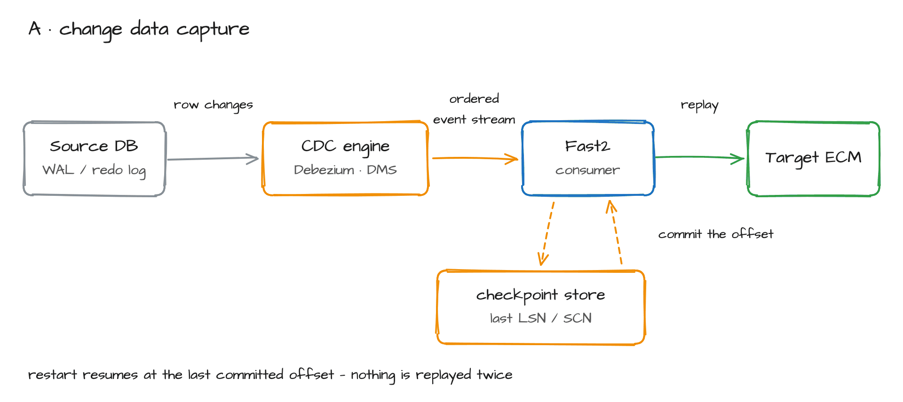
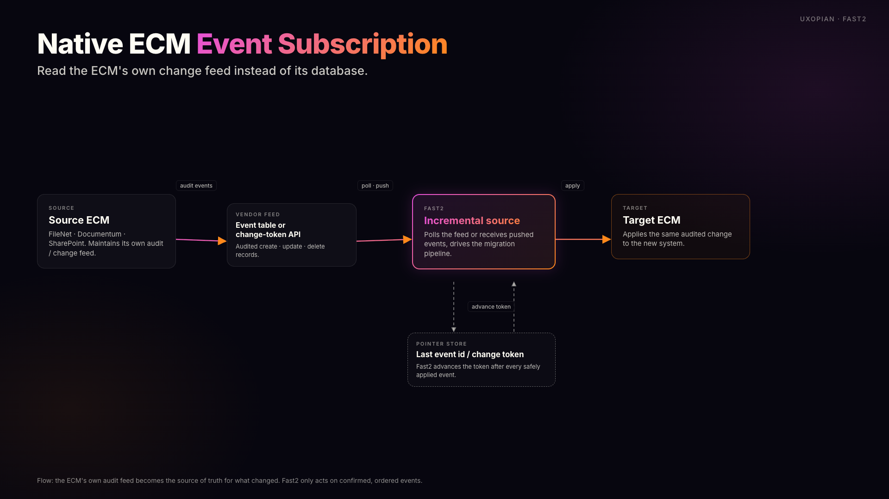
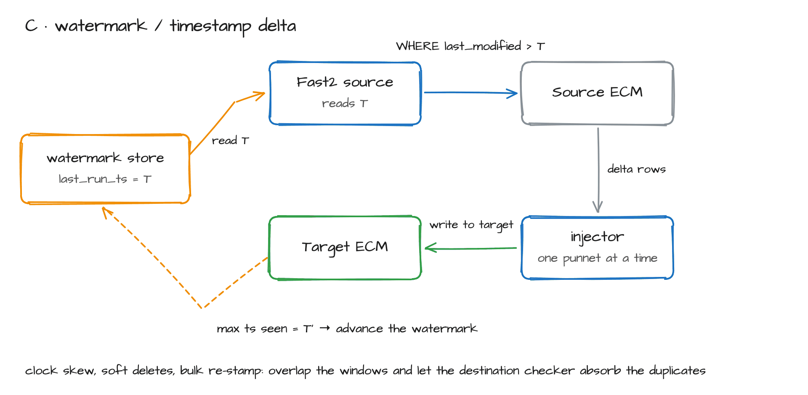
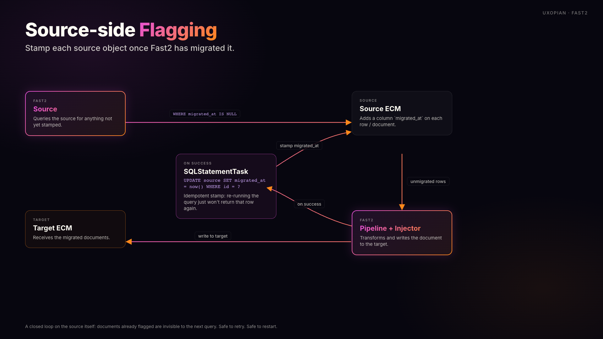
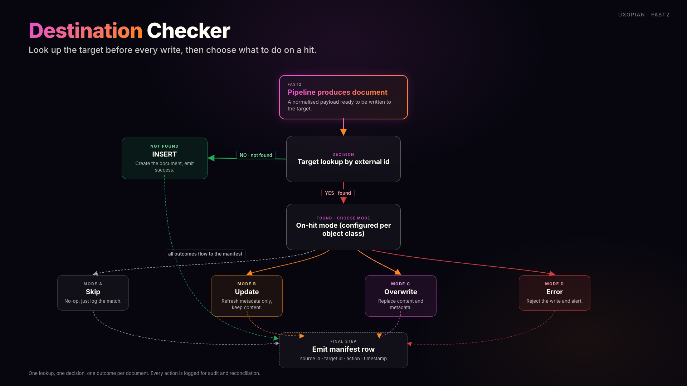
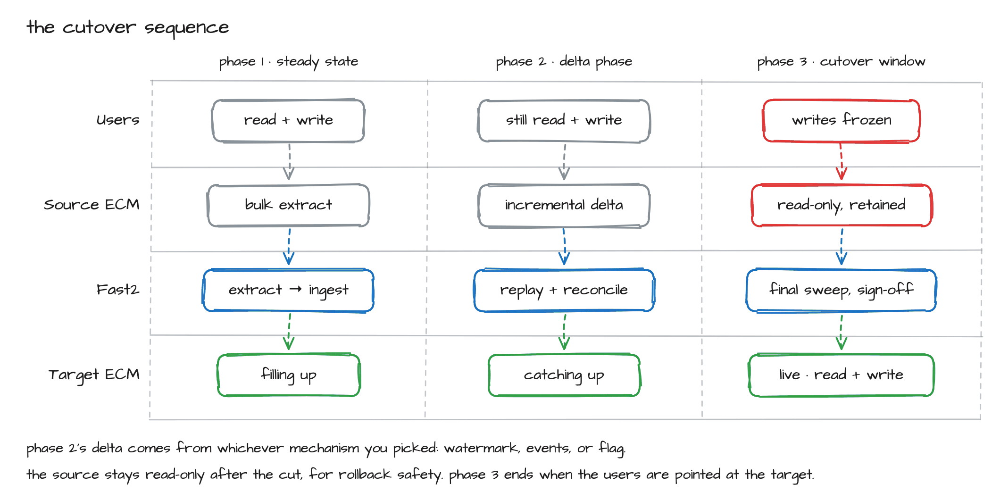

# Catching the Target Up to the Source: A Fast2 Delta Migration Methodology

> [See Part 1, Extracting From a Live ECM →](./extracting-from-live-ecm.md)
>
> [See Part 3, The Migration Ledger →](./migration-ledger.md)

After bulk extraction, the source has not stopped. Catching up is the second half of the job. You have to close the gap without losing a single document, audit entry, or ACL change, and then sign off the cutover against an audit trail a regulator will accept.

:::tip TL;DR
- Bulk extraction is roughly half the work. Delta capture, reconciliation, and cutover are the rest, and that's where projects fail.
- Four delta-capture mechanisms cover almost every real situation: CDC, native ECM events, timestamp watermark, source-side flagging. Each comes with a "use when" and, just as important, a "don't use when."
- Reconciliation is layered. Manifest plus checksum first, then destination-side duplicate prevention, then statistical sampling, with business validation last. Skip a layer and you'll find out months later.
- Cutover is a decision you make at the start. Big-bang, phased, parallel run, blue-green: each fits a different situation. Pick before you start.
- Fast2 ships the moving parts: incremental sources, per-injector duplicate prevention, SQL back-flagging, dashboards. The watermark store, the circuit breaker, and the sign-off ritual are still on you.
- Delta capture answers *what changed in the source*. It does not answer *what have I already done, and what do I re-run*. That is a separate record, and it gets its own article: [Part 3, The Migration Ledger](./migration-ledger.md).
:::

## The moving target problem

Bulk extraction is comforting because it has a number attached to it. Fourteen weeks, 80M documents, dashboard green. Trouble is, during those fourteen weeks the source kept producing documents, modifying ACLs, retiring older items, and writing new audit-trail entries. "We'll just re-run extraction at the end" is a decision I've watched blow up a project budget twice. You buy yourself another fourteen weeks, during which the source has, again, kept moving.

What you actually need is a mechanism that captures only what changed since the last known point, replays it, and proves on both sides that nothing was lost. That's the delta phase. It gets its own design and its own go/no-go gate.

## The four mechanisms of delta capture

There are really only four ways to know what changed in a source between T and T+1.

### A. Change Data Capture (CDC): read the transaction log

CDC tools tail the source database's redo or WAL log and emit each row-level change as an event. Debezium is the open-source reference. Oracle GoldenGate, AWS DMS, Striim, and Qlik Replicate are the commercial variants. When it works, it's the cleanest mechanism you can get: low latency, no polling pressure on the source, and nothing to change in the schema.

Support terms usually kill it first. Most enterprise ECMs (Documentum, FileNet, Alfresco Enterprise) treat the underlying database as private and unsupported. Any read of `dm_sysobject` or `DocVersion` outside the vendor's API routinely voids your support contract. On a large share of real ECM migrations, that one clause rules out CDC for the document plane.

Throughput is the second wall. Debezium is at-least-once and effectively single-threaded per connector, around 7,000 events per second sustained in well-tuned deployments. For a 4B-document FileNet estate moving at 120M documents per day, that's a hard ceiling, and you hit it on day one.

Then there's the operational tail. Postgres logical replication slots bloat the WAL if the consumer falls behind. Debezium tracks DDL via an internal schema-history topic and absorbs additive changes (a new nullable column) automatically. Breaking changes such as a drop, rename, or type change still need consumer coordination, or they quietly break the pipeline. And GoldenGate licensing (~$17,500 per processor, plus Veridata for diff) is rarely in the budget envelope.

**Use when:** the source is a relational DB you can legitimately read, throughput sits below the engine's ceiling, and you've got someone on staff who has run Debezium in anger.
**Avoid when:** the ECM vendor forbids DB access, sustained throughput is above ~7k events/s, or nobody on the team has operated a CDC pipeline before.

### B. Native ECM event subscription: let the source tell you

Every serious ECM has an internal event mechanism. FileNet P8 writes to its `Event` table. Documentum has `dmi_queue_item` and event-driven workflows. SharePoint exposes change tokens via Microsoft Graph. Alfresco emits audit events through its public API. You subscribe, consume, and replay.

This is the vendor-blessed path. Your support contract stays intact and schema drift becomes the vendor's problem. Two risks are worth your attention. Throughput, first, because event tables aren't designed for sustained drain at migration scale. Then the retention window. If the source's audit retention is 90 days and your migration runs 14 months, the events for the first 11 months are already gone. One project I worked discovered this on month nine, and the fallback to a full timestamp re-scan was ugly.

**Use when:** the vendor forbids DB access, the change rate is moderate, and audit retention comfortably exceeds the migration window with buffer to spare.
**Avoid when:** audit retention is shorter than the migration timeline, or the event table is already a performance bottleneck for the application team.

### C. Watermark / timestamp delta: "give me everything modified since T"

This is the simplest mechanism, and the one most teams reach for first. You run an incremental Fast2 Source whose WHERE clause is `last_modified > :last_run_ts`, record the high-water mark, and advance the pointer. Fast2 supports the pattern out of the box for SQL-backed sources. For S3 you use `start-after` to the same effect. The Fast2 Loader documentation describes two loading modes: one-shot full load, or incremental load.

Five pitfalls show up over and over.

1. **Clock skew** is the most common. If the source DB and Fast2 server drift by 200ms (well within NTP tolerance on a default config) you'll either miss rows at the boundary or duplicate them. Use a logical sequence column when the source offers one. If it doesn't, overlap your windows on purpose and lean on the destination checker for idempotency.
2. **Soft deletes** are the silent killer. Plenty of ECMs mark a document deleted by flipping a status column without bumping `last_modified`. The delete never shows up on a watermark query. You need a parallel scan against the deletion flag.
3. **Bulk re-stamp** turns a delta back into a full load. A schema migration, a reindex, a retention sweep, any one of these can touch every row and bump `last_modified` on all of them. Have a kill-switch.
4. **Boundary precision** is the one the Documentum community has been warning about for years on `r_modify_date`. Lose subsecond precision in transit and `>` quietly becomes `>=`, which becomes a duplicate. Pick a side and stick to it.
5. **Late-arriving rows** are the boundary case nobody plans for. A long-running transaction can commit a row whose `last_modified` is already older than your watermark by the time you read it. Overlap windows by at least the longest expected transaction duration, and accept that the destination checker will be earning its keep.

**Use when:** the source has a modified-timestamp column you can trust, and the change rate is high enough that events get noisy but low enough that a periodic scan is affordable.
**Avoid when:** the source bulk-re-stamps rows for reasons unrelated to user activity (reindex, retention sweep), or when soft deletes are the dominant change type.

### D. Source-side flagging: write back to the source

When you own the source schema and no regulator gets in the way, the most reliable mechanism is to write a `migrated_at` property on each source object as you finish it. The delta query becomes "give me everything where `migrated_at IS NULL`". No clocks, no watermarks, no boundary bugs.

Fast2 does not ship a productized "Mark as migrated" task. That's the most common misconception about this pattern. What it ships is `SQLStatementTask` (and its `UpdateSQLQueryTask` variant), which executes an arbitrary parameterised UPDATE in the pipeline. You stamp the source on successful ingest. If you need something richer, say a flag plus a retry counter plus an error code, a small custom transformer built against the Maven SDK does the job.

**Use when:** you own the source schema, the source is not a WORM/Centera/regulated archive, and the application team is comfortable with a new column.
**Avoid when:** the source is regulated (21 CFR Part 11, GxP, SOX-relevant archives where any modification triggers an audit event), or the application team flatly refuses schema changes.

#### D-bis: shadow flagging, when you can't write to the source

A regulated source and a DBA who says no do not mean falling all the way back to watermarks. They mean moving the flag to your side of the fence. Keep the semantics of D — "give me everything not yet marked migrated" — and hold the mark in your own table, keyed by the source's immutable identifier. No clock skew, no watermark boundary bugs, idempotent re-runs, and not a single write to the source.

What you give up is real but narrow: the source no longer knows it has been migrated, so if the decommissioning plan or a source-side application needs to read that state, only true D delivers it. Everything else you keep. This is the same table that answers "which punnets do I re-run", and it's the subject of [Part 3, The Migration Ledger](./migration-ledger.md).

## Destination-side reconciliation

Delta capture tells you what should arrive. Reconciliation tells you whether it actually did, and that's where most teams skimp. In a serious migration, reconciliation is layered, never a single check.

### Layer 1: Manifest + checksum

Every Fast2 batch (every punnet) produces a manifest: source object ID, SHA-256 of the binary, byte size, source timestamp, target ID, target timestamp. The target verifies on ingest. At sign-off, the manifest is compared row-by-row against both the source inventory and the target inventory. Three-way match or no sign-off.

The per-punnet manifest is ephemeral, though, and a three-way match across 80M documents is not an exercise you want to run over a pile of batch files. A [migration ledger](./migration-ledger.md) gives the first two sides of that match a permanent home: one row per document, queryable in SQL, so counts per batch stop being a collation exercise. Note the limit, and it matters at audit time: the ledger is a first-party record of what Fast2 believes it did, so the third side still has to be an independent enumeration of the target.

The case study worth knowing is Fast2's own published insurer migration onto Alfresco. MD5 hash validation on every document, combined with counter cross-referencing, produced an auditable completeness report. Watch out for false positives, though. If you transform the binary in transit (PDF/A normalization, image recompression), the source hash won't match the target hash. Compute and store both, or compute on a canonical form.

### Layer 2: Destination checker (Fast2's per-injector duplicate prevention)

Every Fast2 injector has at least one boolean that turns the target itself into a check. The same pattern runs across the catalogue:

| Injector | Setting | Behaviour |
|---|---|---|
| AlfrescoInjector | **Prevent duplicate** | Pre-write lookup; skip if present |
| AlfrescoRestInjector | **Overwrite documents when they already exist** + **Auto rename** + **Safe update** | Configurable per case: skip / overwrite / rename / metadata-only |
| FileNetInjector | **Prevent document overwriting** + **Throw exception if document already exists** | WHERE-clause pre-check; configurable strict mode |
| AwsInjector | **Update only** | Metadata-only update, content untouched |

Underneath, it's always the same thing: a WHERE-clause lookup against the target before the write, with configurable behaviour on a hit (skip, update, overwrite, error). This is what makes a delta phase replayable. When a delta run partially fails and you re-run it from a known watermark, the destination checker (Fast2's per-injector duplicate prevention) silently absorbs the duplicates that would otherwise corrupt the target.

### Layer 3: Statistical sample audit

Counters and hashes prove arithmetic, not fidelity. The third layer is a stratified random sample (typically 0.1% to 1% depending on regulator appetite, stratified by document class) fully rehydrated on the target: open the PDF, OCR a page, compare to the source rendering, check the ACL, check the metadata. It's slow, manual or semi-manual work. For regulated industries it's non-negotiable.

### Layer 4: Business validation

This is the only check that catches semantic loss. A contract whose amendment link is broken. A retention class silently demoted from "permanent" to "10 years". Neither of those trips any of the previous three layers. They surface only when a data steward, a security officer, and (for financial archives) a CFO open the target through their normal application. Schedule it, and budget for it. The Ameritas migration of 670M Documentum documents to CARA on AWS treats this as a deliverable, not an afterthought.

## Cutover patterns

Delta is the mechanism. Cutover is the moment it all becomes real. Pick your cutover pattern at the start of the project, not at the end.

| Pattern | When to use | Main risk | Reference |
|---|---|---|---|
| Big-bang freeze + final delta | Small estate (under 10M docs), tolerable freeze window, simple source | Discovering defects under load | TSB Bank, Big Bang cutover, multi-week incident, £330M+ remediation |
| Progressive / phased | Large estate, multiple business units, can tolerate temporary heterogeneity | Long total duration; reconciliation per phase | Microsoft SPMT phased migration patterns |
| Parallel run / dual-write | Cannot tolerate any read-side outage, application can route reads to either side | Application changes (strangler fig); doubled write cost during the window | Common in insurance core systems; 72 to 96h read-side validation typical |
| Blue-green DB flip | Source is a database you control end-to-end, RTO measured in minutes | No auto-fallback after switchover | AWS RDS Blue/Green docs, "no automated failback" |
| Trickle with read-redirect | Very large estate, no acceptable freeze window | Application complexity (read-router); two truths exist simultaneously | Microsoft SPMT "initial migration + delta sync" pattern |

Cutover is the day you prove there are no defects left, not the day you go hunting for them. The TSB case is the cautionary tale of the decade. 5.2 million customers cut over in a single weekend, up to 1.9 million of them locked out of digital banking in an incident that ran for weeks, £330M+ in remediation, and CEO Paul Pester's "the bank is on its knees" Treasury Select Committee testimony now on the public record. The lesson for practitioners is blunt: cutover was the first time the team ran the system at production scale.

Deutsche Bank's Postbank integration on the Magellan platform is the slow-burn version of the same story. Thirteen years, over €1 billion, a 2023 migration-wave outage that ran for days, and a BaFin reprimand. Both projects skipped the same gates.

## Failure modes that wreck delta phases

The same handful of failures turn up on project after project.

| Failure mode | What it looks like | One-line fix |
|---|---|---|
| Clock skew | Rows missed or duplicated at window boundary | Logical sequence column where possible; deliberate window overlap + destination checker |
| Soft deletes | Deletions never propagate | Parallel scan against deletion flag; explicit delete pipeline |
| Bulk re-stamp | "Delta" suddenly equals full load | Kill-switch on volume anomaly; coordinate with source DBA before reindex/retention sweeps |
| Schema drift | Source adds a column; pipeline silently drops it | Schema-evolution mode (Debezium 2.5+); fail-fast on unknown columns in transformer |
| Retry storm / non-idempotent writes | Same document written N times under N IDs | External-ID-based destination check (per-injector boolean); never let the engine generate target IDs |
| Phantom-write idempotency loss | Partial write committed, retry creates orphan | Wrap target operations in transactions where target supports it; otherwise compensating delete on retry |
| Postgres replication slot bloat | WAL fills the disk, source goes down | Monitoring on `pg_replication_slots.restart_lsn` and `wal_status`; alert at 80% WAL disk |
| Audit-log truncation | Events you need are gone | Verify retention window against migration timeline at project start; archive audit log if needed |
| CDC at-least-once duplicates | Same event delivered twice | Idempotent consumer (destination checker); store last-processed offset per partition |
| Late-arriving events | Long transaction commits after watermark advance | Overlap windows by max transaction duration; periodic full reconciliation sweep |
| Source→target mapping bug both sides agree on | Field consistently mapped to wrong destination | Statistical sample by business user, not engineer (the engineer wrote the bug) |
| Cutover rollback gap | Blue side gone, green side broken, no path back | After switchover AWS sets old-blue read-only automatically; keep it as your rollback path (AWS's documented strategy is logical replication from green back to blue); plan for a 24h rollback window on the first cutover |

## The Fast2 delta toolbox

Here's what Fast2 actually does for you in a delta phase, and what you're still on the hook to build.

**What Fast2 ships:**

- **Incremental Source.** WHERE-clause-driven, with full and incremental load modes documented in the Fast2 Loader reference. The Uxopian FAQ frames it for the business: "incremental, or delta, migrations let users keep working while data moves in the background."
- **Per-injector duplicate prevention.** Alfresco "Prevent duplicate," FileNet "Prevent document overwriting," AwsInjector "Update only," Alfresco REST "Safe update" / "Auto rename." A WHERE-clause lookup before write, configurable on hit.
- **SQLStatementTask / UpdateSQLQueryTask** are your building block for back-flagging the source without writing custom code.
- **Dashboards backed by Elasticsearch and Kibana.** Live counters, per-document trace IDs, ingestion rate, error breakdown. Enough to run an operations room.
- **Maven SDK** is the escape hatch. Custom Sources, Transformers, Injectors, and Tasks for whatever Fast2 can't do out of the box on your specific source.

**What Fast2 does not ship, and you shouldn't pretend it does:**

- *A built-in watermark or checkpoint store.* The pattern is supported, but the storage and the advance-the-pointer logic are on you. Most projects end up with a small Postgres table or a JSON file in a known path. Generalise that single pointer to one row per document and you have a migration ledger, which is the more useful shape on any programme that outlives a couple of campaigns. [Part 3 →](./migration-ledger.md)
- *A productized "Mark as migrated" task.* You build it from `SQLStatementTask` or a custom transformer in about 30 minutes. Not a checkbox.
- *A circuit breaker for the source.* If your watermark query suddenly returns 100x the expected volume because someone ran a reindex, Fast2 will faithfully try to ingest 100x the expected volume. The volume anomaly check is yours to build around it.
- *A platform-wide idempotency flag.* Idempotency comes from unique punnet IDs combined with the per-injector duplicate-prevention booleans. It works, but it's a pattern you assemble, not a single switch.

Pre-sales decks sometimes treat "incremental migration" as a feature checkbox. On a real project it's a methodology you build on top of three Fast2 features and one custom module. The customer needs to know that before contract signature, not in week six of delivery.

## Sign-off ritual

Sign-off is a ritual in the literal sense: a fixed sequence of steps, performed in front of named witnesses with named artefacts, before the source is ever allowed to go read-only. For every batch, and again for the final cutover, three rows on the sign-off sheet:

| Row | What it proves | Evidence | Sign-off owner |
|---|---|---|---|
| Completeness | Every source object accounted for | Three-way manifest match (source inventory ↔ Fast2 manifest ↔ target inventory) | Migration lead |
| Fidelity | Documents are intact and readable | Statistical sample audit, fully rehydrated, signed report | QA lead |
| Business validation | Semantics preserved | Data steward walkthrough on real business cases; for finance, CFO signature on aggregate totals | Business owner |

For regulated industries, add the framework relevant to the estate (GxP, 21 CFR Part 11, EU Annex 11, SOX, HIPAA, GDPR) and an explicit cross-reference to the regulator-facing audit trail. Generis markets CARA's coverage of these frameworks, which is a reasonable reference point. Hopp Tech and Datafold both publish sign-off threshold templates. Either gives you a baseline to adapt instead of starting from a blank page.

The threshold matters as much as the procedure. "99.5% match" is not a sign-off if the missing 0.5% is the legal archive. Define the threshold per document class, agree it in writing with the business owner before the delta phase begins, and for the regulated classes treat the threshold as zero.

Before any of the design work, settle one question with the business owner: which of the four delta mechanisms is permitted on this source. Everything else in this article follows from that answer.

## Hand-off to Part 3

The four mechanisms tell you what changed. The four reconciliation layers tell you whether it arrived. Neither one tells you, on a Tuesday morning in month four, which of last week's punnets never landed and which of them are safe to replay — and that question arrives on every programme large enough to have this article's problems in the first place. It has its own answer, its own schema, and its own failure modes.

**[Read Part 3: The Migration Ledger →](./migration-ledger.md)**
