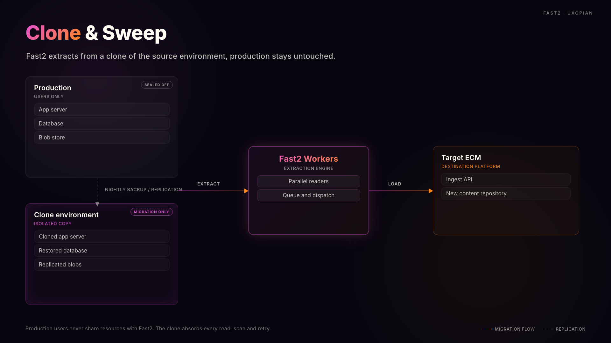
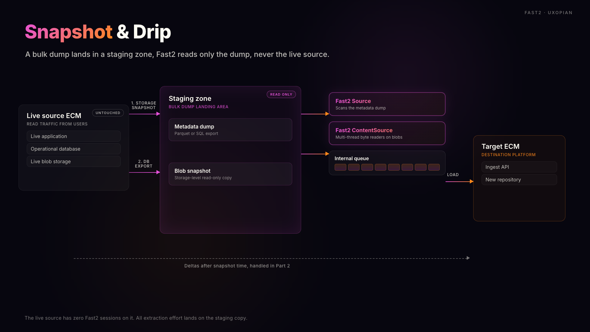
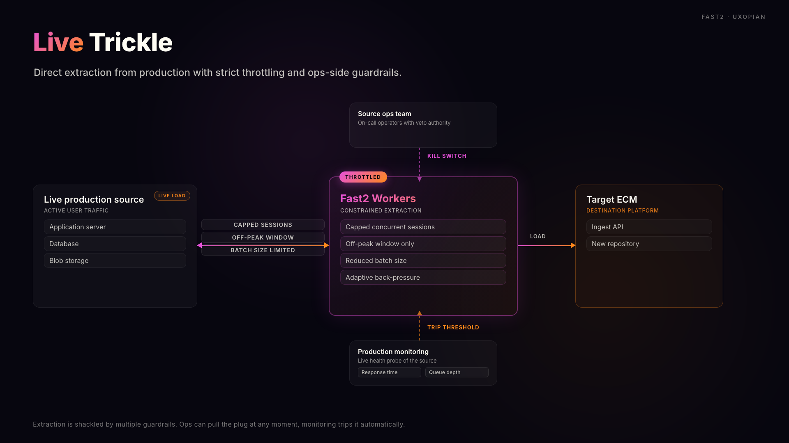

# Extracting Documents From a Live ECM Without Crashing It: A Fast2 Field Methodology

*Part 1 of 2. This article covers bulk extraction against a source that users are still hitting every minute. [Part 2: Delta Migration Methodology →](./delta-migration.md) covers how the target catches up before cutover.*

:::tip TL;DR
The hard problem in any ECM migration isn't moving the documents. It's moving them while the source is still in production. Three methodologies handle this, in decreasing order of safety: Clone & Sweep, Snapshot & Drip, and Live Trickle. Pick one before you write a single extraction task. Snapshot & Drip is what I reach for on most engagements, because it gives you a stable read surface, predictable throughput, and a clean line between history and delta that makes Part 2 tractable. Plan around 50 to 100 documents per second per extraction thread for an API-bound source, a field-measured benchmark across FileNet, Documentum, and CMIS sources, consistent with the order of magnitude in TSG's published multi-billion-document FileNet case study. Get this wrong and you end up with something like TSB Bank in 2018: roughly £330M in remediation, the CEO out, and the CIO personally sanctioned by the PRA.
:::

## The problem in one paragraph

Every migration deck shows the same arrow: old box on the left, new box on the right, "Fast2" in the middle. What the deck never shows is the third box behind the old one. Branch managers, claims adjusters, call-centre agents, nurses, all still opening documents in the source system while your extraction job hammers the same database. TSB Bank's 2018 cutover is the canonical reminder. Up to 1.9 million of its 5.2 million customers were locked out of digital banking, roughly £330M in remediation, a £48.65M fine from the FCA and PRA, and a PRA Final Notice in April 2023 imposing a personal sanction of £81,620 on the former CIO. Slaughter and May's independent review pointed to poor migration-team access to the source system among the root causes. Everything in this article is built around not repeating that failure mode.

## Load surfaces

Before you pick a methodology, picture what the source ECM actually feels when you point an extractor at it. There are three load surfaces, and you hit all of them at the same time.

- **The application API.** `IDocument.fetch()` in P8, `DfDocument.getObject()` in Documentum, the CMIS endpoint in Alfresco. Each call burns a session, a thread on the application server, a connection in the pool. Concurrency caps usually sit at 30 to 60 sessions per node. Cross that and the queue forms behind your users, not behind you.
- **The metadata database.** Oracle, SQL Server, DB2. Your scan pass is a long `SELECT ... WHERE created_at < :high_watermark ORDER BY id`. Without an index hint, you get a full table scan competing for buffer cache with the OLTP queries the business is running.
- **The blob store.** NAS, IBM TSM, Centera, S3-compatible object store. This is where the volume lives. Naive parallel reads saturate the NIC on the NAS head before anything else gives way. A 10 GbE link can flatline under eight extraction threads pulling 4 MB TIFFs.

When all three surfaces are touched simultaneously by an extractor and by end users, end-user latency degrades before any infrastructure alarm fires. The retrospectives are consistent on the failure pattern: API-only extraction against a live source is unsustainable at scale, and load testing that only happens at cutover is too late to course-correct (ArgonDigital's ECM migration lessons-learned series).

---

## Three named methodologies

### A. Clone & Sweep

You stand up a full copy of the source environment, application servers, database, blob store, restored from backup at a fixed point in time. Fast2 connects to the clone. The live source never sees your traffic.

Pros: zero production impact, full freedom on threading and parallelism, and the migration team can break things in the clone without consequence. Cons: cost. You pay for a second environment for months. Stand-up effort is non-trivial too. A P8 farm with TSM, Verity, and a 200 TB FileStore is not a one-week task. And then there is drift, which starts the moment you take the clone.

> **When to use:** regulated industries where source-side downtime is contractually forbidden. Banking core, hospital EMR, public-sector citizen services. The Ameritas migration of 670M documents from Documentum to CARA on AWS used this shape. The 50 to 100 docs/sec/thread anchor below is consistent with TSG's published billion-document FileNet engagement and with anonymised field measurements on comparable clone deployments.
>
> **When to avoid:** when the storage cost of doubling 4 TB+ of blobs kills the business case, or when the clone takes longer to refresh than the migration window itself.

### B. Snapshot & Drip (the default)

Snapshot & Drip is the default choice for most engagements. You take a point-in-time snapshot of the source: a storage snapshot of the blob store (NAS, S3 versioning, Snowball if you are crossing clouds) plus a logical export of the metadata database (`expdp` for Oracle, `bcp` or `BACPAC` for SQL Server, `db2move` for DB2) into a staging zone. Fast2 reads only from the staging zone. Production never feels the extractor.

The pattern maps cleanly onto Fast2's two-stage extraction model. The Source task scans the metadata dump (single-threaded, cheap, deterministic). It emits *punnets* (Fast2's term for a pivot XML record carrying document identity, metadata, ACLs, and a blob pointer) into the broker queue. ContentSource workers, scaled horizontally across machines through queue routing, pull punnets and fetch the actual bytes from the blob snapshot. You can run twenty ContentSource threads against a snapshot without anyone in production noticing.

Three properties make this the right default:

1. **Stable read surface.** The snapshot doesn't change under you. Restarts resume from the last committed punnet ID in the broker queue, so an interrupted campaign re-scans only the tail. No clock skew, no soft-delete edge cases, no "did the document still exist when I read it?" questions.
2. **Decoupled throughput.** You can saturate the staging zone. That's what it is there for. The 50 to 100 docs/sec/thread figure that haunts API-bound extraction becomes a floor rather than a ceiling. Maretha's FileNet-to-Nuxeo work sustained 120M+ documents per day across two consecutive migrations of 1.4B and 1.6B documents. Hash-keyed blobs travelled by Snowball; metadata streamed through Kafka into Nuxeo Stream (Maretha / Nuxeo case study, 2022).
3. **Clean separation of history and delta.** Everything in the snapshot is history. Anything created in the source after snapshot time is delta. That boundary is what makes the delta phase in Part 2 tractable.

> **When to use:** as your default. Any volume above ~10M documents, any source you don't fully control, any project with a sponsor exposed to the TSB-style regulatory tail.
>
> **When to avoid:** when the source has no usable snapshot mechanism (some legacy archive appliances), or when regulatory rules forbid copying production data into a staging zone without same-region encryption guarantees you can't yet meet.

### C. Live Trickle

The fallback. Direct extraction from the production source, with aggressive throttling, scheduled time windows, circuit-breaker patterns, and a kill switch the source team controls.

Live Trickle is what you do when neither A nor B is on the table, usually because the customer's infrastructure team cannot or will not provision the storage and compute for a clone or staging zone, and the calendar won't wait. It works. But every operational lever has to be set conservatively and reviewed weekly. You will be slower, you will be more careful, and you will spend more time in change-control meetings than you expected.

> **When to use:** small-to-medium volumes (low millions), sources with mature concurrency governance (Oracle Resource Manager, SQL Server Resource Governor) you can lean on, and tight operational coupling with the source team.
>
> **When to avoid:** any system with a 24/7 user base whose SLAs you don't control. Postbank's Magellan/Unity migration is the cautionary tale. The January 2023 wave-2 cutover triggered a multi-day online-banking outage, a BaFin reprimand, and executive bonus cuts.

---

## Decision matrix

| Scenario | Volume | User pressure | Recommended methodology |
|---|---|---|---|
| Regulated retail bank, core records | 100M–1B+ | 24/7, regulator on your back | **A. Clone & Sweep** |
| National health insurer, claims archive | 500M–4B | Office hours, weekend windows OK | **B. Snapshot & Drip** |
| Hospital EMR, active patient records | 10M–100M | Strict 24/7, life-critical | **A. Clone & Sweep** |
| Public sector, multi-agency consolidation | 50M–500M | Office hours | **B. Snapshot & Drip** |
| Insurance back-office, legacy P8 to cloud ECM | 100M–1B | Business hours | **B. Snapshot & Drip** |
| Pharma / life sciences, audit-traceable | 1M–50M | Business hours | **A or B**, depending on validation rules |
| Mid-market manufacturer, internal users | 1M–10M | Office hours, flexible | **C. Live Trickle**, with off-peak windows |
| Multi-region archive, no live consumers | Any | None | **B. Snapshot & Drip** (or direct dump to Fast2) |

A useful gut-check: if the sponsor cannot tolerate any measurable degradation in source response time during business hours, you are in column A. If they can tolerate it during a Saturday night window, you are in column B. If they shrug, you might get away with column C.

---

## Throttling and governance: the controls that matter

Whichever methodology you pick, the same set of Fast2 levers determines whether your extraction stays inside the envelope you negotiated. What matters is choosing values that match the load surface you're actually hitting.

| Fast2 lever | What it controls | Practical guidance |
|---|---|---|
| **Threads per task** | Concurrency inside a single worker | Start low (4–8) on Source tasks. ContentSource can usually go higher (16–32) if reading from a snapshot. Halve it if you are hitting prod. |
| **Batch / page size** | Records fetched per API round-trip | Match to source page-size sweet spot. P8 likes 100–500; CMIS likes 50–200. Bigger pages reduce round-trip overhead but increase per-call memory. |
| **Queue routing across workers** | Horizontal scale-out to extra machines | The broker (port 1789) dispatches punnets to whichever worker picks them up. Add machines and you don't reconfigure the campaign. |
| **Time-window campaigns** | When extraction is allowed to run | Schedule scan-heavy work outside business hours. Fast2 campaigns are restartable, so you don't lose progress when you pause. |
| **Two-stage split: Source vs ContentSource** | Decouples cheap metadata pass from heavy bytes pass | The single biggest knob. Do all your scans first, queue everything, then turn on ContentSource workers under controlled throttling. |
| **Duplicate prevention booleans** | `Prevent duplicate`, `Prevent overwriting`, `Update only`, `Auto rename` on the loader side | Set explicitly per campaign. Defaults are not what you want at scale. |
| **Incremental load support** | Re-running a campaign without re-extracting everything | Documented in the Uxopian FAQ. This is what makes Article 2's delta phase tractable. |

Two layers around Fast2 are non-negotiable on a live source.

**Source-side resource governance.** Lean on what the database already gives you. Oracle Resource Manager can cap the migration user to a fixed share of CPU and parallel-query slots; SQL Server Resource Governor can do the same with a dedicated workload group. Think of it as defence in depth. Fast2's throttling is the primary control, but you want the DBA's hand on a second valve.

**Joint runbook and a kill switch the source team owns.** The migration team does not get to decide that extraction continues when the source team says stop. Write this into the runbook on day one. The source-side ops engineer has a one-command kill (a `docker stop` on the worker, drain the queue, or pause the campaign in the Fast2 UI), and they never have to ask permission.

**Reconciliation as a deliverable.** Don't ship reconciliation as a side report. Ship it as a numbered artifact: manifest of every source ID, target ID, SHA-256 hash, byte count, extraction timestamp; counts reconciled per business domain; a sampled set of rehydrated documents opened end-to-end in the target. The MAN Energy Solutions Documentum-to-OpenText project on ~2M documents made audit-compliant traceability a deliverable rather than a by-product, and that is the bar to hold yourself to. Fast2's NoSQL backend (Elasticsearch + Kibana on port 1791) gives you the dashboarding for free. Use it.

One pattern worth naming briefly here, because it belongs in Part 2: you will sometimes want to mark documents in the source as migrated, so subsequent delta runs and eventual decommissioning can tell what has been processed. Fast2 supports this as a pattern, not as a one-click feature. Implementation, rollback, and DBA sign-off are covered in the delta-migration article.

---

## A planning baseline you can defend

Sizing conversations always come back to the same question: how fast does Fast2 actually go?

For API-bound extraction (Clone & Sweep against a cloned app server, or Live Trickle against prod) plan around 50 to 100 documents per second per extraction thread. That anchor is a field-measured benchmark from our own engagements across FileNet, Documentum, and CMIS sources; TSG's publicly published multi-billion-document FileNet case study confirms migrations at this order of magnitude are real. With a dedup shortcut on already-known content, the heavier path can climb toward the top of that band.

For dump-bound extraction (Snapshot & Drip against a staging zone) throughput is governed by the staging zone's read bandwidth and the target's ingest capacity, not the source. This is where 120M docs/day numbers (Maretha) become reachable, because the source is out of the loop.

A defensible back-of-envelope: 100M documents at 50 docs/sec/thread is about 23 days on a single thread, about 6 days on a 4-thread campaign, or roughly 2 days on 16 threads. Multiply by your own caution factor, typically 1.5x to 2x, for retries, business-day-only windows, and reconciliation overhead. Equisoft's published insurance-migration baseline of 1 to 3 years end-to-end covers the whole programme. Most of that range is design, validation, dual-run, and cutover. Extraction is one workstream.

---

## Hand-off to Part 2

Bulk extraction is half the job, and on a calendar it is usually the shorter half. While Fast2 sweeps through the snapshot, the source ECM keeps producing new documents. Claims filed Monday morning, charts updated Tuesday, contracts uploaded Wednesday. Your target has to catch up to now before anyone can cut over. That is the delta migration phase: change-data-capture vs watermark/timestamp vs source-side flagging, dual-run validation, reconciliation under load, and the cutover patterns (big-bang, phased, blue-green) that decide whether a project ends like TSB or like the 1.3B-document IBM-to-Alfresco-on-AWS insurer migration that Fast2 delivered in 22 months.

**[Read Part 2: Delta Migration Methodology →](./delta-migration.md)**
