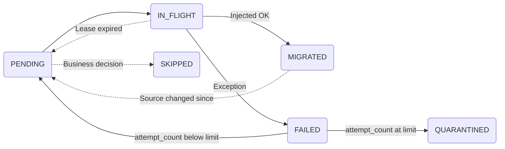

# Knowing What's Done, What's Left, and What to Re-Run: The Fast2 Migration Ledger

*Part 3 of 3. [Part 1: Extracting From a Live ECM →](./extracting-from-live-ecm.md) covers bulk extraction. [Part 2: Delta Migration →](./delta-migration.md) covers catching the target up to a moving source. This part covers the record that tells you, at any hour of any month, exactly where the programme stands.*

:::tip[TL;DR]
- Three different questions get confused with each other. *What changed in the source?* is delta capture. *Did it arrive intact?* is reconciliation. *What have I done, what's left, and what do I re-run?* is the **migration ledger**, and it is the one most projects never design.
- The ledger is an external table, owned by the migration team, holding one row per source object with its state. It doubles as the work queue, which is why it protects the source: you stop interrogating an old, slow, unreliable system to find out what you already know.
- Fast2's built-in campaign retry and Elasticsearch state are **campaign-scoped and operational**. The ledger is **programme-scoped and durable**. For re-running one failed campaign, use the built-in retry. For "which of the 340 punnets from the June batch never landed", you need the ledger.
- `(id, status)` with three states is the schema every team writes first, and it is too thin. You need attempt counts, a worker lease, an error class, the batch/punnet id, and the source hash.
- Fast2 ships the whole write path (`SQLSource`, `SQLStatementTask`, `PunnetInException` routing, `SingleCallTask`). It does not ship the ledger. Budget a day, not a sprint, and standardise the schema once per programme instead of once per team.
- The trap: a ledger is Fast2's own opinion of its own work. It never replaces a target-side inventory. Three-way match stays three-way.
:::

## The question that arrives in month four

Nobody asks it in the design workshop. It arrives on a Tuesday morning in month four, usually from the customer's own architect, and it sounds like this:

> "How do you know which punnets need to be re-run?"

There is a bad answer and a good one. The bad answer is "we re-query the source for everything that isn't in the target yet". On a 4B-document FileNet estate whose metadata database is already the application team's performance headache, that answer is how you end up on the wrong end of the joint runbook's kill switch. The good answer is that you already know, because you wrote it down when you did it.

That is the whole idea. It is not sophisticated. It is just the piece of the architecture that never makes it onto the slide with the two boxes and the arrow.

### Three questions, three mechanisms

The confusion is worth naming explicitly, because these three get collapsed into "incremental migration" in almost every deck.

| Question | Answered by | Covered in |
|---|---|---|
| What changed in the source since T? | The four delta-capture mechanisms | [Part 2](./delta-migration.md#the-four-mechanisms-of-delta-capture) |
| Did it actually arrive, intact and complete? | Layered reconciliation | [Part 2](./delta-migration.md#destination-side-reconciliation), [Content Integrity](./content-integrity.md) |
| **What have I done, what's left, what failed, what do I re-run?** | **The migration ledger** | This article |

A delta mechanism looks *outward*, at the source. Reconciliation looks *forward*, at the target. The ledger looks *inward*, at your own work. Skip it and every question about programme state has to be answered by stressing one of the two systems you were hired not to break.

## "Doesn't Fast2 already track this?"

Partly, and it is worth being precise about where the line falls, because the honest answer decides whether you build anything at all.

Fast2 maintains real state. Every punnet has a [lifecycle](../getting-started/overall-concepts.md#map) with `Processed OK` and `Processed KO` outcomes, the NoSQL backend keeps per-document trace IDs in Elasticsearch with Kibana dashboards over them, and after any campaign the **retry feature** lets you replay a filtered set of punnets, including "everything in exception", by exception type. That is a genuinely good operations room, and for a large class of situations it is all you need.

Where it stops being enough:

- **Campaign scope.** Fast2's state is organised around campaigns and their runs. A programme is not one campaign. It is dozens, across several maps, over fourteen months, with map versions changing underneath. "Retry the punnets in exception" is a question about *this run*. "Which documents from the Q2 legal-archive batch have never successfully landed, under any map version" is a question about the *programme*, and no campaign owns it.
- **Retention and volume.** Operational stores are sized for operations. Nobody plans to keep per-document trace records for 4B documents for the full duration of a multi-year programme in the same store that powers the live dashboard. Your audit evidence and your monitoring have different lifecycles, and conflating them is how month-nine reconstruction becomes archaeology.
- **The work-queue direction.** This is the one that actually matters. Fast2's state records *what happened to punnets it was given*. It cannot tell you what it was never given. Only an inventory can, and an inventory that lives outside the source is the only kind that answers "what's left" without asking the source.
- **Semantics you own.** "Failed" is not one thing. A permission error, a corrupt blob, a mapping bug, and a target timeout have four different resolutions and four different owners. You will want your own error classes, quarantine rules, and business-class stratification. That is your vocabulary, not the engine's.

So the rule of thumb: **use the built-in retry for operational re-runs inside a campaign; build a ledger when the programme is bigger than a campaign.** On a 5M-document single-source project, the built-in features are the right answer and a ledger is over-engineering. Past roughly 50M documents, or past two quarters of elapsed time, or on any estate with a regulator attached, the ledger stops being optional.

## What a ledger is

One table. One row per source object. Owned by the migration team, on infrastructure the migration team controls.

It plays three roles at once, and the fact that it is the same rows is the point:

1. **Inventory** — the authoritative list of what is in scope. Established once, cheaply, from the metadata dump.
2. **Work queue** — the thing that decides what the next campaign processes. Fast2 reads pending rows from it instead of re-scanning the source.
3. **Outcome record** — the durable per-document result, which is also the raw material for the completeness half of sign-off.

Because it is the work queue, the source is queried **once for inventory and once per document for content**, and never again to answer a state question. On a Snapshot & Drip topology the source is already out of the loop; on [Live Trickle](./extracting-from-live-ecm.md), where you are hitting production directly, this is the difference between a defensible load profile and an incident.

## Fork one: inventory-first or discover-as-you-go

Settle this before you write the DDL, because it changes the schema and it changes the plan.

**Inventory-first.** You run one full scan of the source metadata (or of the metadata dump, which is better) and insert every in-scope object as `PENDING` before any content moves. Cheap: it is a projection of a few columns, no blobs, and it runs single-threaded in a maintenance window.

*Upside:* you get a denominator. On day one you can say "4,120,338,977 documents in scope", every dashboard has a real percentage, and completeness at sign-off is a `COUNT(*) WHERE state <> 'MIGRATED'` away. *Downside:* the inventory is itself a point-in-time snapshot, so it needs the same reasoning about its own staleness as any other snapshot, and it is the delta phase's job to top it up.

**Discover-as-you-go.** No pre-pass. Rows are inserted as the source iterator emits them.

*Upside:* no upfront scan, and it copes with a source you cannot enumerate cheaply. *Downside:* no denominator, ever. You cannot distinguish "not yet reached" from "not in scope" from "silently dropped by a broken iterator predicate", and that third case is a real failure mode that an inventory catches on day one and a discovery model catches never.

**Recommendation: inventory-first, from the metadata dump, wherever the source can be enumerated at all.** The denominator is worth the maintenance window. It is also the only version of this that produces an audit artifact a regulator recognises, and the only one that makes the volume-anomaly circuit breaker from Part 2 implementable, because a circuit breaker needs an expected value.

## Fork two: shadow flagging, the non-invasive twin of Mechanism D

[Part 2's Mechanism D](./delta-migration.md#d-source-side-flagging-write-back-to-the-source) is source-side flagging: stamp `migrated_at` on the source object, and the delta query becomes "give me everything where `migrated_at IS NULL`". It is the most reliable mechanism there is, because it has no clocks in it. And it is ruled out on a large share of real estates: WORM and Centera archives cannot be modified, regulated estates (21 CFR Part 11, GxP, SOX-relevant archives) turn any write into an audit event, and plenty of application teams simply refuse a new column on a production table.

The ledger is the same mechanism with the flag moved. **You keep the semantics of D and drop the write to the source.** Call it shadow flagging: `migrated_at` lives in your table, keyed by the source's immutable identifier, and the delta query becomes a join or an anti-join against your own inventory rather than a predicate on theirs.

What you give up versus true Mechanism D is one thing, and it is worth stating plainly: the source no longer knows it has been migrated. If the decommissioning plan, or a source-side application, needs to read that state, only D delivers it. Everything else — no clock skew, no watermark boundary bugs, no soft-delete blind spot for objects already in the inventory, idempotent re-runs — you keep.

This is the option that belongs in the "avoid when" of Mechanism D. Regulated source and a refusing DBA does not mean falling all the way back to watermarks. It means flagging on your side of the fence.

## The schema

Here is the part where field experience actually pays. Every team writes the same first draft:

```sql
CREATE TABLE migration_ledger (
    id     VARCHAR(255) PRIMARY KEY,
    status VARCHAR(16)      -- pending | migrated | failed
);
```

It works for a week. Then the programme asks a question it cannot answer. What follows is the columns worth having on day one, and what breaks without each.

| Column | Type | Why it exists — and what breaks without it |
|---|---|---|
| `source_id` | `VARCHAR`, PK | The source's immutable identifier. **Never** a row number, never a path, never anything a source-side rename can change. |
| `state` | `VARCHAR` | See the state machine below. Three states is not enough. |
| `doc_class` | `VARCHAR` | Business class, indexed. Sign-off thresholds are per class (Part 2), and "99.5% overall" is not a sign-off if the missing 0.5% is the legal archive. Without it you cannot report per class, and you cannot stratify the sample audit. |
| `batch_id` / `punnet_id` | `VARCHAR` | **This is the column that answers the original question.** Without it, "which punnets do I re-run" has no SQL form. Record the punnet id Fast2 actually used, not one you invented. |
| `attempt_count` | `INT` | Distinguishes "failed once, transient, retry it" from "failed eleven times, stop, this is a poison pill". Without it you get retry storms, and retry storms against a fragile source are exactly the outcome the whole design was avoiding. |
| `last_error_class` | `VARCHAR` | Your vocabulary, not a stack trace: `SOURCE_UNAVAILABLE`, `CONTENT_CORRUPT`, `MAPPING_REJECTED`, `TARGET_TIMEOUT`, `ACL_UNRESOLVED`. Four error classes have four owners. Without it, triage is a human reading logs. |
| `last_error_detail` | `TEXT` | The message, truncated. For the engineer, not for the query. |
| `claimed_by` | `VARCHAR` | Worker or campaign identity holding the lease. Without it, two workers process the same row: the per-injector duplicate prevention absorbs the write, but you have already burned the source read, which defeats the point. |
| `claimed_at` | `TIMESTAMP` | Lease timestamp, so a killed worker's rows can be reclaimed. Without it, a `docker stop` orphans rows in `IN_FLIGHT` forever. |
| `source_hash`, `source_bytes` | `VARCHAR`, `BIGINT` | Makes the ledger *be* the [Layer 1 manifest](./delta-migration.md#layer-1-manifest--checksum) instead of duplicating it. Three-way match becomes a join. |
| `target_id` | `VARCHAR` | The identifier in the destination. Without it, reconciliation cannot walk from a source row to the object it produced, and neither can a support ticket in year three. |
| `source_modified_at` | `TIMESTAMP` | Lets the delta phase detect "migrated, but changed since" without a second store. This is where the ledger and the watermark mechanism meet. |
| `migrated_at` | `TIMESTAMP` | The shadow flag. Also your throughput curve, for free. |

Two indexing notes, because at 4B rows this stops being a detail. Index the **claim predicate** (`state`, and whatever you stratify by) and the primary key, and resist indexing the rest. Every index is write amplification on a table taking one UPDATE per migrated document. And partition by `doc_class` or by inventory batch if the platform supports it, so that a per-class completeness query is a partition scan rather than a full one.

Finally: **put the ledger on its own database.** Not on the source's DB, where it competes with the OLTP traffic you are protecting and drags the source DBA into your change management. Not on the target's, where it distorts the target's own sizing and, worse, makes your audit evidence a dependency of the system under test.

## The state machine

Three states cannot express "currently being worked on" or "deliberately excluded", and both matter.



| State | Meaning | Who moves it out |
|---|---|---|
| `PENDING` | In scope, not yet processed. The work queue. | A worker claiming it |
| `IN_FLIGHT` | Claimed under a lease. Not available to another worker. | The pipeline, or lease expiry |
| `MIGRATED` | Injected and acknowledged by the target. | Only the delta phase, if the source object changed since |
| `FAILED` | Last attempt failed, still eligible for retry. | Retry, or promotion to `QUARANTINED` |
| `QUARANTINED` | Attempt limit reached. Needs a human. **Must appear on a dashboard**, or it becomes a silent hole in the migration. | An engineer, after a fix |
| `SKIPPED` | Deliberately out of scope, with a reason. Business decision, recorded. | Nobody |

`SKIPPED` earns its place at sign-off. The difference between "we migrated 99.2%" and "we migrated 100% of the 99.2% that was in scope, and here are the 0.8% the business excluded, with the reason and the approver for each" is the difference between an awkward meeting and a signature.

## Leases, or how not to process everything twice

The claim has to be atomic. If claiming is `SELECT ... WHERE state = 'PENDING'` followed by a separate `UPDATE`, two workers will read the same rows, and the only thing standing between you and duplicate work is the target's duplicate prevention — after both workers have already read the source.

The pattern is a single atomic statement that both selects and claims, using whatever your platform gives you (`UPDATE ... RETURNING` with `SKIP LOCKED` on Postgres, `UPDATE ... OUTPUT` with `READPAST` on SQL Server, `SELECT ... FOR UPDATE SKIP LOCKED` elsewhere). Claim in blocks sized to your punnet batch, not row by row.

Then two rules that are learned the hard way:

- **Leases expire.** A worker that dies holds its rows forever unless something reclaims them. One statement at campaign start, moving `IN_FLIGHT` rows older than the longest plausible processing time back to `PENDING`, costs nothing and saves an afternoon. Make the timeout generous: reclaiming a row that is genuinely still in flight is how you create the duplicate you were preventing.
- **The mark-migrated write is not optional and not fire-and-forget.** If the injector succeeds and the ledger update fails silently, you have created a document that will be migrated again on every subsequent pass. This is the one place in the pipeline where swallowing an exception is actively harmful, and it is the default on more than one Fast2 SQL task. Turn it off deliberately.

## How Fast2 wires into it

Everything below is out-of-the-box configuration. No custom module.

| Role | Fast2 component | Note |
|---|---|---|
| Read the queue | [`SQLSource`](../catalog/source.md#SQLSource) | Its `SQL query` is your claim statement; map the ledger's key onto `punnetId` so Fast2's own trace IDs line up with your rows |
| Fetch content | `ContentSource` workers | Unchanged. The ledger only replaces the *scan*, never the content path |
| Mark migrated | [`SQLStatementTask`](../catalog/loader.md#SQLStatementTask) | Placed after the injector. Turn **Skip exceptions** off here |
| Mark failed | `SQLStatementTask` behind a [`PunnetInException`](../getting-started/create-workflow.md) link | Same table, increments `attempt_count`, sets the error class |
| Bulk state moves | [`UpdateSQLQueryTask`](../catalog/loader.md#UpdateSQLQueryTask) / [`MultiUpdateSQLQueryTask`](../catalog/loader.md#MultiUpdateSQLQueryTask) | When you are updating a set rather than one row |
| Lease reclaim | [`SingleCallTask`](../catalog/tool.md#SingleCallTask) with **Call at beginning** | Wraps the reclaim statement, runs once per campaign |
| Escalation list | `CSVWriter` | The quarantine hand-off, alongside the ledger row |
| Live view | Elasticsearch + Kibana (port 1791) | Operational dashboard. The ledger is the durable record. Different jobs |

The pipeline shape, in words: `SQLSource` claims a block of `PENDING` rows and marks them `IN_FLIGHT` → transformers → injector, with its duplicate-prevention boolean set → on the success link, `SQLStatementTask` sets `MIGRATED`, `target_id`, `migrated_at` → on the `PunnetInException` link, `SQLStatementTask` sets `FAILED`, increments `attempt_count`, records the error class.

The DDL, the claim statement, and the exact task configuration are in the cookbook: **[Track migration state in a side database →](../cookbooks/migration-ledger-sql.md)**.

## The audit trap

A ledger is Fast2 telling you what Fast2 did. It is a first-party record. On its own it certifies nothing, and a regulator's auditor will find that in about ninety seconds.

So keep the [three-way match](./delta-migration.md#layer-1-manifest--checksum) genuinely three-way: **source inventory ↔ ledger ↔ target inventory**, three independently produced counts. The ledger makes the first two sides cheap and queryable. It does not stand in for the third, and the moment someone proposes reconciling the ledger against the ledger, the completeness gate has quietly become one party marking its own homework.

The check that catches this: run a target-side enumeration on a sample of `MIGRATED` rows and confirm the objects are actually there. `MIGRATED` means "the injector returned success and the write to this table succeeded". It does not mean "the object is retrievable in the target today". Between those two statements sit failed target-side commits, retention rules that deleted on ingest, and at least one storage tier that acknowledged a write it never persisted.

## Failure modes

| Failure mode | What it looks like | Fix |
|---|---|---|
| Non-atomic claim | Two workers process the same document; duplicate prevention absorbs the write but the source read is already spent | Single atomic claim-and-update (`SKIP LOCKED` / `READPAST`) |
| Orphaned `IN_FLIGHT` rows | Progress plateaus below 100% with no failures reported; killed workers' rows never come back | Lease reclaim in a `SingleCallTask` at campaign start, generous timeout |
| Silent mark-migrated failure | The same documents keep reappearing in every pass | **Skip exceptions** off on the marking task; alert on ledger UPDATE failures |
| No `attempt_count` | Retry storm hammers a source that is already fragile | Attempt limit plus promotion to `QUARANTINED` |
| Quarantine with no dashboard | Documents quietly excluded; discovered at sign-off | `QUARANTINED` count on the ops dashboard, alert above zero |
| Mutable key as PK | A source-side rename or re-foldering orphans the row | Immutable source identifier only |
| Ledger co-located with source DB | Your write load lands on the OLTP database you were protecting | Separate database instance |
| Ledger as the only evidence | Self-certification; audit rejects it | Three-way match with an independent target enumeration |
| Ledger never topped up | Objects created during the delta phase are outside the inventory, so "0 pending" is false | The delta mechanism inserts new `PENDING` rows; completeness is against a moving denominator |
| Per-team schemas | Four projects, four vocabularies, nothing reusable | One reference schema per programme |

That penultimate row is the subtle one. Once you have an inventory, the temptation is to treat `COUNT(*) WHERE state = 'PENDING' = 0` as done. It means "done with the inventory as it stood when you took it". Wiring the delta mechanism to insert new `PENDING` rows is what makes the ledger the single answer to "what's left" instead of two answers that have to be added up by hand.

## What Fast2 ships and what you build

Consistent with the rest of this playbook, the honest split:

**Ships:** `SQLSource` for the claim, `SQLStatementTask` / `UpdateSQLQueryTask` / `MultiUpdateSQLQueryTask` for the marks, `PunnetInException` routing for the failure path, `SingleCallTask` for the campaign-boundary statement, per-injector duplicate prevention as the idempotency backstop, `CSVWriter` for the escalation list, and Elasticsearch + Kibana for the live view.

**You build:** the table, the claim statement, the reclaim statement, the state vocabulary, and the dashboard query. That is the DDL plus four statements plus task wiring — roughly a day for someone who has done it, and the cookbook is there so that nobody has to do it from scratch twice.

**Nobody ships:** the decision about which states exist, what the attempt limit is, and what `SKIPPED` means on this estate. That is a conversation with the business owner, and it belongs in the same session where you agree the per-class sign-off thresholds.

Pre-sales conversations sometimes hear "you build the ledger" as a gap. It is worth reframing accurately: every large migration programme has a control plane, whether it is designed or improvised, and the customer's own auditors will ask for it by a different name. The choice is not whether it exists. It is whether it was designed in week one or reverse-engineered from log files in month nine.

## One recommendation for the programme, not the project

If more than one project team is running Fast2 in your organisation, they are each about to invent this table. Independently, with different state vocabularies, different keys, and different re-run queries.

Standardise it once. One reference DDL, one map template with the four statements wired in, one dashboard query, held wherever your delivery assets live. It is a small artifact and it converts a recurring private workaround into a supported pattern, which is worth more to the next engagement than any individual project's version of it.

Settle three things with the business owner before the delta phase starts, and the ledger designs itself: which delta mechanism is permitted on this source (from Part 2), what the per-class sign-off threshold is, and what qualifies a document as legitimately `SKIPPED`.
