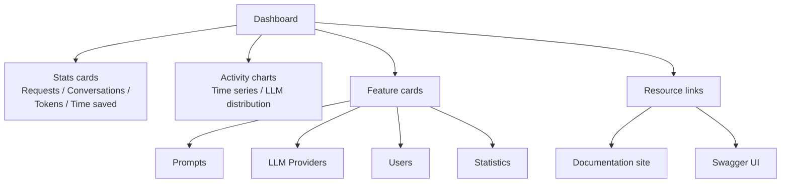

The dashboard is the landing page of the admin panel (route `/`). It gives administrators a summary of tenant activity and direct access to each management section.

## Stats cards

Four cards are displayed at the top with sparkline charts:

| Card | Description |
|---|---|
| Total requests | Number of LLM requests processed |
| Conversations | Number of distinct conversations |
| Total tokens | Sum of input and output tokens |
| Time saved | Cumulative time saved across all prompts (hours) |

Data is fetched from `GET /api/v1/admin/stats/global`.

## Activity charts

Below the stats cards, two charts show recent activity:

- **Time series**: request volume over recent days.
- **LLM distribution**: model usage breakdown by provider.

Both charts use the same Stats API endpoints as the full [Statistics](./monitoring_statistics.md) page, with a default `DAY` interval.

*Figure: Dashboard layout and navigation targets.*

## Feature cards

A grid of cards links to the admin sections:

| Card | Section | Target route |
|---|---|---|
| Prompts | AI | `/prompts` |
| LLM Providers | AI | `/llm-providers` |
| Users | Analytics | `/users` |
| Statistics | Analytics | `/statistics` |

## Resource links

Two external links are displayed at the bottom of the feature grid:

- **Documentation**: opens the product documentation site.
- **Swagger UI**: opens the interactive API explorer at the configured API endpoint (`/swagger-ui/index.html`).

## Related pages

- [Admin panel overview](./admin_panel_overview.md)
- [Monitoring statistics](./monitoring_statistics.md)
