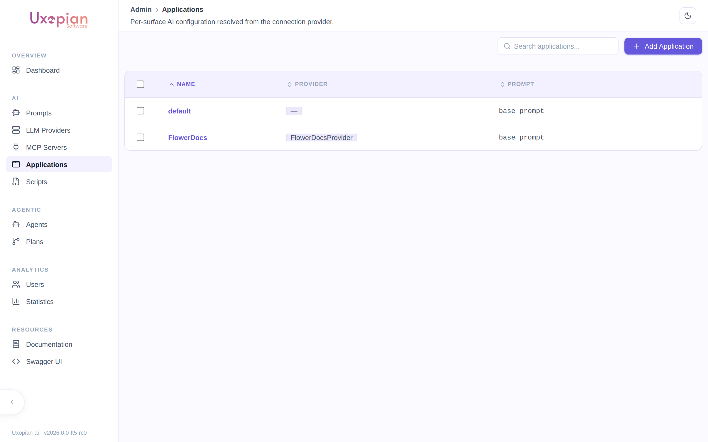
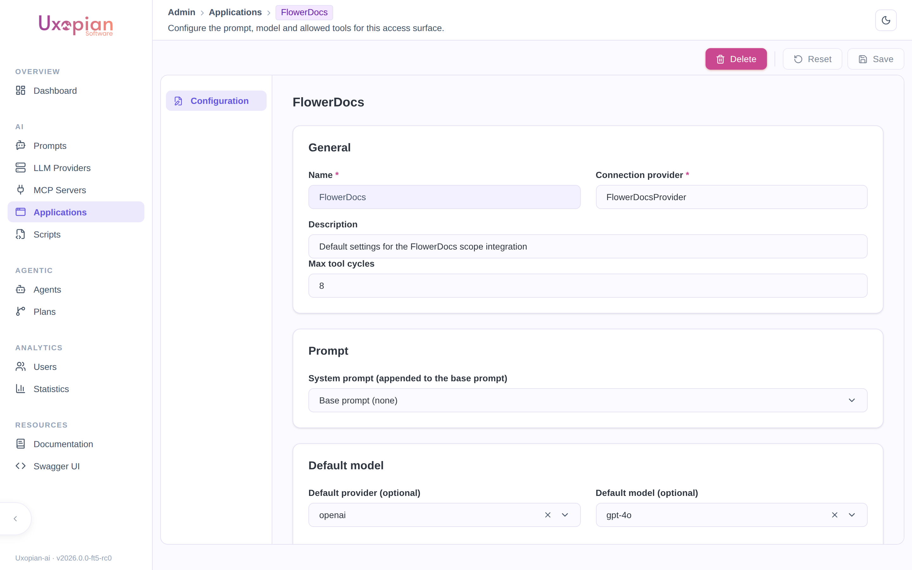

Since 2026.0.0-ft5, an **Application** (`ApplicationConf`) scopes a set of AI defaults and guardrails — a default LLM provider/model, a system prompt fragment, a maximum number of tool-calling cycles, and a tool/MCP permission whitelist — to one usage surface. This lets a single uxopian-ai deployment serve several integrations (for example, a FlowerDocs scope and a custom internal tool) with different defaults, without the surfaces stepping on each other's configuration.

## Every connection provider has a default Application

An Application is not opt-in plumbing you must wire up before anything works: **the first time a connection provider is used, uxopian-ai automatically creates a default Application for it** if none exists yet, named after the provider with any trailing `Provider` suffix stripped (`FlowerDocsProvider` → `FlowerDocs`, `AlfrescoProvider` → `Alfresco`). Creating an Application in the admin UI under that same derived name is how you customize the defaults for a provider without any other wiring.

An explicit **`X-Application-Id`** header on the request overrides this provider-derived lookup and forces a specific Application by id, regardless of which connection provider made the request.

## Navigate to Applications

In the admin panel, click **Applications** in the navigation. The page lists every Application configured for the current tenant.

*Figure: The Applications list — `default` was auto-created on first use; `FlowerDocs` was configured explicitly.*

## Fields

| Field | Description |
|---|---|
| Name | The Application's name — also becomes its id. Required, and immutable after creation (the id is derived from the name at creation time). |
| Description | Free-form description. |
| Provider | The connection provider (`ProviderId`, e.g. `FlowerDocsProvider`) this Application is associated with. Required in the editor — Save is disabled until both name and provider are filled in. |
| Prompt | A Prompt appended to the base prompt for conversations resolved to this Application. Leave unset to use the base prompt alone. |
| Default LLM provider / model | Used when neither the current turn's prompt nor the conversation already has a provider/model set — see [Resolution order](#resolution-order) below. |
| Max tool cycles | Caps the number of tool-calling round-trips for this Application. Leave unset to use the system default. |
| Permissions | The same tool/tag/MCP-server/sub-plan whitelist used elsewhere in the admin UI (see below). |

### Permissions

The Permissions section is the same reusable editor used for agent configurations in [Managing Plans](./managing_plans.md): a whitelist of native tool names, a whitelist of tool tags (or "allow all tools"), a whitelist of MCP servers (or "allow all MCP servers"), a denylist of specific tools (which always wins, even over an allow-all), and — relevant if you use the [Agentic Plan engine](../understanding/agentic_plans.md) — a whitelist of Plans this Application is allowed to invoke as callable tools.

*Figure: An Application's configuration.*

## Resolution order

Provider and model are resolved in this order, stopping at the first one that supplies a value:

1. **An explicit provider/model already set on the request itself** (a caller-supplied override).
2. **The prompt used in the current turn**, if any — its `defaultLlmProvider`/`defaultLlmModel`. If the current turn has no prompt but the conversation already has a provider/model from an earlier turn, that's inherited instead (a conversation keeps the provider/model it started with across turns).
3. **The resolved Application's** `defaultLlmProvider`/`defaultLlmModel`.
4. **The system-wide default** (`llm.default.provider` / `llm.default.model`).

A Prompt's own default therefore always wins over an Application's default when a prompt is in play — the Application default only fills the gap when nothing more specific applied in this turn or earlier in the conversation.

## Deleting a referenced Prompt is blocked

A Prompt that is either the base prompt or referenced as an Application's `prompt` cannot be deleted — the API returns a `409 Conflict` naming the Application(s) that reference it. Remove the reference from the Application (or delete the Application) first.

## Related pages

- [Managing Plans](./managing_plans.md)
- [Agentic Plan engine](../understanding/agentic_plans.md)
- [Tools](../understanding/tools.md)
- [Multi-tenancy](../understanding/multi_tenancy.md)
