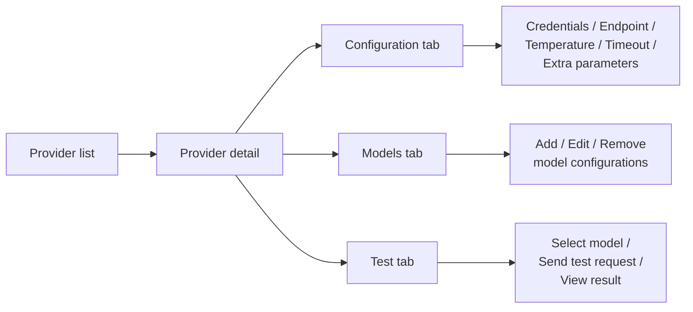

The LLM providers section of the admin panel lets you add, edit, and delete LLM provider configurations for the current tenant without restarting the application.

## Navigate to LLM providers

In the admin panel, click "LLM Providers" in the navigation. The page lists all provider configurations for the current tenant.

## Add a provider

1. Click the "Add provider" button.
2. Select the provider type from the dropdown. Supported types: `openai`, `anthropic`, `azure`, `bedrock`, `gemini`, `mistral`, `huggingface`, `ollama`, `nu-extract`.
3. Fill in the required fields:
   - **API Secret**: the API key or credential. Stored encrypted.
   - **Endpoint URL**: the provider API base URL (required for some providers).
   - **Temperature**: sampling temperature (0.0 to 1.0+).
   - **Timeout**: request timeout (e.g., `60s`).
   - **Max retries**: number of retries on failure.
   - **Extra parameters**: provider-specific fields (e.g., `deploymentName` for Azure, `region` for Bedrock).
4. Add at least one model configuration:
   - **Model conf name**: internal identifier for this model.
   - **Model name**: actual model name sent to the provider API.
   - **Multimodal supported**: check if the model accepts image inputs.
   - **Function calling supported**: check if the model supports tool calling.
5. Save.

Changes take effect immediately for new requests. Existing in-progress requests continue using their original configuration.

## Provider detail page

Click on a provider in the list to open its detail page (route `/llm-providers/:id`). The detail page has three tabs: Configuration, Models, and Test.

*Figure: Provider detail page tab structure.*

### Configuration tab

Edit the provider settings. The API secret field is masked; enter a new value only if you need to update the credential.

| Field | Description |
|---|---|
| Provider type | LLM provider backend (read-only after creation) |
| Provider name | Display name for the configuration |
| API Secret | Credential (masked, stored encrypted) |
| Endpoint URL | Base URL for the provider API |
| Temperature | Default sampling temperature |
| Timeout | Request timeout (e.g., `60s`) |
| Max retries | Retry count on failure |
| Extra parameters | Provider-specific fields (loaded from `GET /api/v1/admin/llm/providers/{name}/extra-params`) |

Extra parameters vary by provider type. For example, Azure requires `deploymentName`, Bedrock requires `region`.

### Models tab

Manage the model configurations attached to this provider. Each model entry has:

| Field | Description |
|---|---|
| Model conf name | Internal identifier used in prompt and request overrides |
| Model name | Actual model name sent to the provider API |
| Multimodal supported | Whether the model accepts image inputs |
| Function calling supported | Whether the model supports tool calling |

Add new models, edit existing ones, or remove models. A provider must have at least one model configuration.

### Test tab

Test the provider connectivity without leaving the admin panel.

1. Select a model from the provider's configured models.
2. Click "Test" to send a request to the provider.
3. The result shows a success or error status badge with the response preview.

The test tab is disabled when creating a new provider or when there are unsaved changes. Save first, then test.

## Delete a provider

On the provider detail page, click "Delete". A confirmation dialog is displayed. Requests that were using this provider will fail until a different provider is configured as default.

## Set the default provider

The default provider is set via `llm.default.provider` in `llm-clients-config.yml` or the `LLM_DEFAULT_PROVIDER` environment variable. It cannot be changed via the admin UI; a configuration change and restart are required.

## REST API endpoints

| Method | Endpoint | Description |
|---|---|---|
| `GET` | `/api/v1/admin/llm/providers` | List all available provider type names |
| `GET` | `/api/v1/admin/llm/providers/{name}/extra-params` | Get extra parameter descriptors for a provider type |
| `GET` | `/api/v1/admin/llm/provider-conf` | List all provider configurations |
| `POST` | `/api/v1/admin/llm/provider-conf` | Create a new provider configuration |
| `GET` | `/api/v1/admin/llm/provider-conf/{id}` | Get a provider configuration by ID |
| `PUT` | `/api/v1/admin/llm/provider-conf/{id}` | Update a provider configuration |
| `DELETE` | `/api/v1/admin/llm/provider-conf/{id}` | Delete a provider configuration |

## Related pages

- [LLM providers](../understanding/llm_providers.md)
- [Configure LLM providers](../how_to/configure_llm_providers.md)
- [Write a custom LLM client](../extending/custom_llm_client.md)
- [Configuration file reference (llm-clients-config.yml)](../reference/configuration.md#llm-clients-configyml)
- [Environment variables reference](../reference/environment_variables.md)
- [Admin panel overview](./admin_panel_overview.md)
