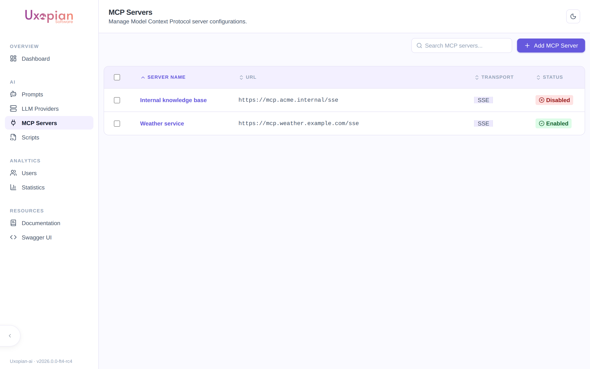

The MCP Servers section of the admin panel lets you register, test, and enable [Model Context Protocol](https://modelcontextprotocol.io) servers at runtime, without editing `mcp-server.yml` or restarting the application. Tools exposed by an enabled MCP server are merged with the local tool registry and become callable by the LLM like any other tool.

This admin UI replaces the legacy single-server boot-time `mcp.sse.url` configuration introduced in earlier releases. Existing `mcp-server.yml` entries continue to work, but new deployments should prefer the admin UI.

## Navigate to MCP servers

In the admin panel, click *MCP Servers* in the navigation. The page lists all MCP configurations registered for the current tenant, with a column for each server's `enabled` state and last-known connection status.



*Figure: the MCP Servers list — each entry shows its URL, transport type, and enabled/disabled status.*

## Multi-tenant isolation

- **Connection dedup key** — two configurations share the same underlying `SharedMcpClient` if and only if they are equal on the triple `(url, transportType, headers)`. Any difference in headers — even a non-authentication header like `User-Agent` — produces a separate pool entry.
- **Authenticated connections** — any MCP server whose `headers` map contains credentials (e.g. `Authorization`) is scoped to its tenant. Two tenants using the same MCP endpoint with different credentials result in two independent client instances.
- **Unauthenticated connections** — identical unauthenticated endpoints (same URL, same transport, no custom headers) are shared across tenants via a pooled client (`SharedMcpClient`) with reference counting. This avoids opening N connections when N tenants point at the same public MCP server.
- **Cluster sync** — when a configuration is saved, updated, or deleted, uxopian-ai publishes an `McpConfChangedEvent` through the Hazelcast event bridge so every node in the cluster invalidates its cached MCP client for the affected configuration without a restart. The bridge is gated by `@ConditionalOnBean(HazelcastInstance.class)` plus the property `mcp.cluster-sync.enabled`, so single-node deployments and integration-test profiles can opt out cleanly.

## Add an MCP server

1. Click *Add MCP server*.
2. Fill in the form:

| Field | Description |
|---|---|
| Name | Human-readable identifier for this configuration (unique per tenant). |
| URL | MCP server endpoint (e.g. `https://mcp.example.com/sse` for SSE). |
| Transport type | Transport protocol. `SSE` is the default and currently supported value. |
| Enabled | When off, the configuration is stored but not opened — use it as a draft or to temporarily disconnect without losing settings. |
| Timeout | Connection timeout in milliseconds. Default: `30000`. |
| Log requests | Log every request sent to the MCP server. Useful during setup. |
| Log responses | Log every response returned by the MCP server. Useful during setup. |
| Headers | Arbitrary HTTP headers sent with each request (e.g. `Authorization: Bearer <token>`). Header values are stored encrypted at rest. |

3. Click *Save*. If *Enabled* is checked, uxopian-ai opens the connection immediately and registers any discovered tools.

## Edit, enable, or disable

Click a configuration in the list to open its detail page. The editor exposes the same fields as the create form, plus a *Test connection* action (see below). Toggling *Enabled* on a saved configuration opens or closes the client across the cluster; no restart is required.

## Test connection and discover tools

The *Tools* tab lists the tools currently exposed by the MCP server. uxopian-ai calls `GET /api/v1/admin/mcp/mcp-conf/{id}/tools` to perform a live discovery against the server, so this tab reflects the current server state, not a cached snapshot. Use this to:

- Verify that credentials and the URL are correct.
- Confirm which tools will be made available to the LLM.
- Troubleshoot an MCP server that appears not to respond.

## Delete

Deleting a configuration closes the MCP client, removes it from the OpenSearch `mcp_configurations` index, and publishes the change across the cluster. Tools exposed by the deleted server are unregistered from the active tool list on all nodes.

## REST API

The admin UI is a thin wrapper around `/api/v1/admin/mcp/`. All endpoints require the `ADMIN` role and operate on the current tenant.

| Method | Path | Description |
|---|---|---|
| `GET` | `/mcp-conf` | List all MCP configurations for the current tenant |
| `GET` | `/mcp-conf/{id}` | Fetch a single MCP configuration |
| `POST` | `/mcp-conf` | Create an MCP configuration |
| `PUT` | `/mcp-conf/{id}` | Update an existing MCP configuration |
| `DELETE` | `/mcp-conf/{id}` | Delete an MCP configuration |
| `GET` | `/mcp-conf/{id}/tools` | Live-discover the tools exposed by the server |

Request body schema (`McpConf`):

```json
{
  "name": "openai-mcp",
  "url": "https://mcp.example.com/sse",
  "transportType": "SSE",
  "enabled": true,
  "logRequests": false,
  "logResponses": false,
  "timeout": 30000,
  "headers": {
    "Authorization": "Bearer <token>"
  }
}
```

## Common issues

| Symptom | Cause | Resolution |
|---|---|---|
| Configuration saved but no tools show up | *Enabled* left off, or transport URL unreachable | Toggle *Enabled* on, run *Test connection* to validate connectivity. |
| Tools duplicated across tenants on a shared public MCP | Added custom headers make the client appear authenticated and per-tenant | Remove tenant-specific headers if the server is truly public; shared pooling reactivates automatically. |
| Changes on one node not visible on another | Hazelcast event bridge not reachable | Verify Hazelcast cluster formation (see `hazelcast.yml` and the network policy between pods). |
| Credentials visible in request logs | *Log requests* enabled | Turn *Log requests* and *Log responses* off once the server is validated. |

## Related pages

- [Tools](../understanding/tools.md)
- [Plugin system](../understanding/plugin_system.md)
- [Configuration file reference](../reference/configuration.md)
- [Environment variables reference](../reference/environment_variables.md)
