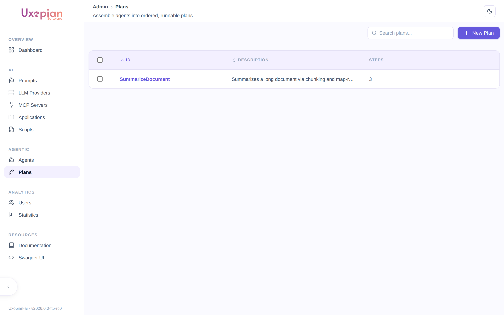
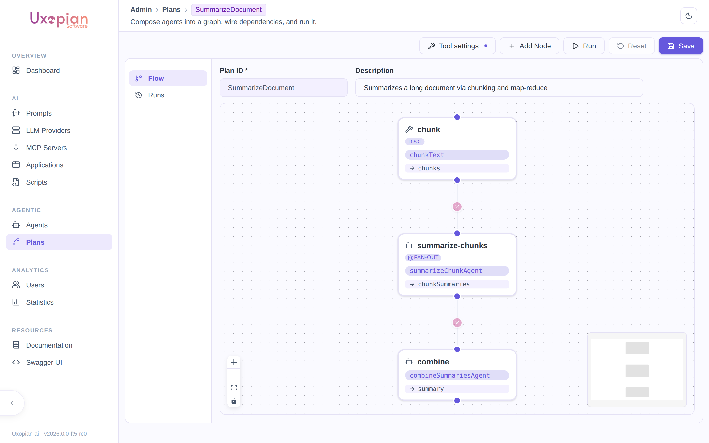
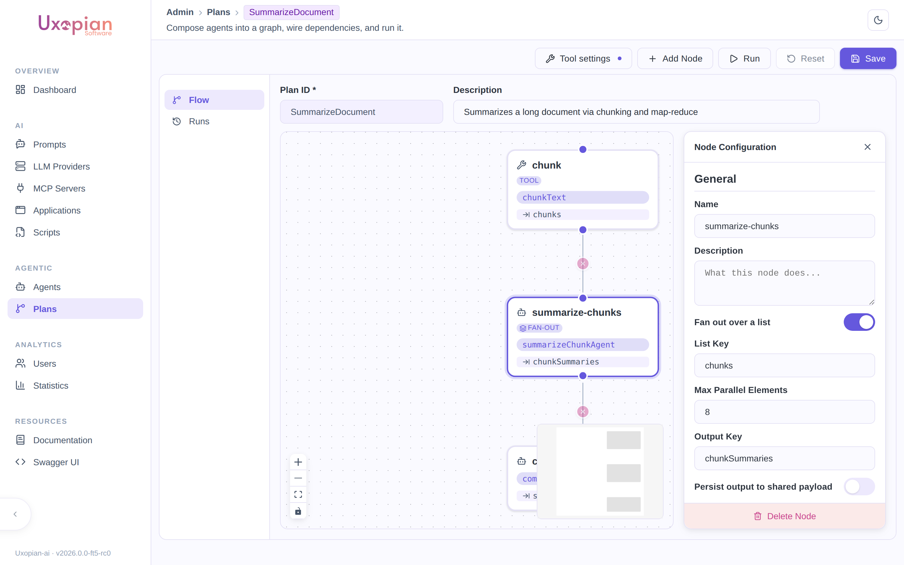
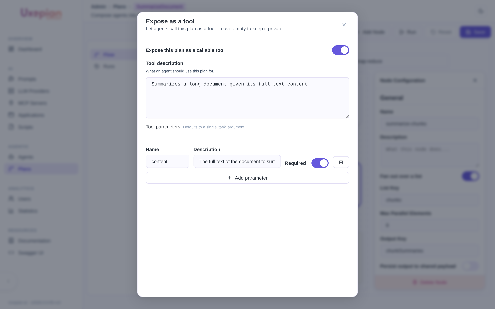
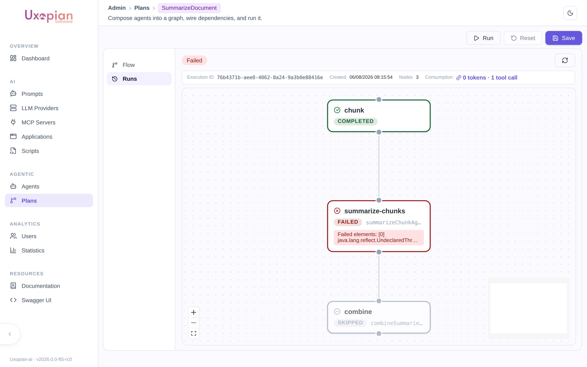

The **Plans** section of the admin panel lets you build, run, and monitor [Agentic Plans](../understanding/agentic_plans.md) — multi-step workflows of `AGENT`, `DIRECT_TOOL`, and `SUBPLAN` nodes — through a visual flow editor, without writing the plan definition by hand.

## Navigate to Plans

In the admin panel, click *Plans* in the navigation. The page lists all plans for the current tenant with a search box, and a *New Plan* button.

*Figure: The Plans list.*

## Create a plan

1. Click *New Plan*. This opens the plan editor on the **Flow** tab.
2. Set the **Plan ID** (immutable once saved) and an optional **Description**.
3. Click *Add Node* to add a node to the graph, then drag from one node's edge to another to connect them — a connection sets a dependency: the target node waits for the source node to complete.
4. Select a node to open its configuration panel.

*Figure: A three-node plan — chunk (Direct tool) → summarize-chunks (Agent, fan-out) → combine (Agent).*

## Configure a node

Every node, regardless of type, has:

| Field | Description |
|---|---|
| Name | Short label shown on the node in the graph |
| Description | Free text describing what the node does |
| Fan out over a list | Runs this node once per element of a list instead of once — see [Fan-out](#fan-out-run-a-node-once-per-list-element) below |
| Output Key | The payload key under which this node's result is published |
| Persist output to shared payload | When on, the output becomes visible to every downstream node, not just direct dependents |

Then pick the **node type** — Agent, Sub-plan, or Direct tool — each with its own fields:

- **Agent**: select an existing agent configuration from the dropdown, or click *New agent* to create one inline without leaving the plan editor. Once an agent is selected, its objective prompt is shown with the variables currently available to this node (dependency outputs, persisted outputs, plan input parameters, and — if fan-out is on — the `item` variable) highlighted, so you can see at a glance what the prompt can reference.
- **Sub-plan**: select another plan from this tenant to run as this node's body.
- **Direct tool**: select a native tool from the dropdown (grouped by tag). Once selected, each of the tool's arguments gets its own source dropdown, listing every value currently available to this node (fan-out item, a connected dependency's output, a persisted output, or a plan input parameter) — the argument is auto-bound automatically when there is exactly one possible source.

### Fan-out: run a node once per list element

A node normally runs once. Turn on **Fan out over a list** and it runs **once per element** of a JSON array already present in the payload, with several elements in flight at the same time — the *map* step of a map-reduce, expressed as a single node instead of one node per element.

Two fields appear when you enable it:

| Field | Description |
|---|---|
| List Key | The payload key holding the JSON array to iterate. The array has to already be in the payload — published by an upstream node's *Output Key*, or supplied as a plan input parameter. In the figure below, a `chunk` Direct tool node publishes its fragments under `chunks`, and the fan-out node's list key is `chunks`. |
| Max Parallel Elements | How many elements run concurrently (default 8). Lower it when the underlying LLM provider is rate-limited; raise it for throughput. A fan-out list is capped at 200 elements. |

What changes inside the node:

- **Each run gets an `item` variable** holding its own element, on top of the same payload every other node sees. This is what an Agent node's objective prompt references to work on "its" element (`item` shows up in the highlighted variable list described above), and what a Direct tool node's arguments can be bound to.
- **The node's Output Key holds a JSON array** of all the per-element results, in the order of the input list — so a downstream node can read that one key and reduce the whole set in a single call.
- **A single failing element fails the whole node**, and the error message names which indexes failed.

So the three-node plan in the figures is a complete map-reduce: `chunk` splits a document into `chunks` (no LLM), `summarize-chunks` fans out one agent call per chunk in parallel and publishes `chunkSummaries`, and `combine` reads that array and writes the final summary. A natural side benefit is that the many cheap map calls and the single quality-critical reduce call are separate agent configurations, so they can use different models.

For the underlying mechanics, see [Agentic Plans — Fan-out](../understanding/agentic_plans.md#fan-out-processing-a-list-in-parallel).

*Figure: Configuring a fan-out node — `chunks` is the list key, up to 8 elements run in parallel.*

## Expose a plan as a tool

Click *Tool settings* (top of the Flow tab) to open the tool-exposure panel:

| Field | Description |
|---|---|
| Expose this plan as a callable tool | Master switch; leave off to keep the plan private |
| Tool description | What an agent should use this plan for — shown to the calling agent as the tool's description |
| Input parameters | Named, typed parameters the caller provides when invoking this plan as a tool. The editor suggests names already referenced inside the plan (a `listKey` or a `DIRECT_TOOL` argument binding) that aren't produced by any node — a likely sign they're meant to come from outside. |

A plan exposed this way is only actually callable by an agent whose configuration explicitly allows it — see [Agentic Plans — exposing a Plan as a tool](../understanding/agentic_plans.md#exposing-a-plan-as-a-tool).

*Figure: Exposing a plan as a tool named for its plan id, taking a `content` parameter.*

## Run a plan

Click *Run* (available once the plan is saved). If the plan declares input parameters, a modal collects a value for each (required ones are enforced) before starting; otherwise the run starts immediately with no payload. The editor switches to the **Runs** tab and opens the new execution.

## Monitor an execution

The **Runs** tab shows, for a saved plan, a selector over its past executions (when there is more than one) and the currently selected execution's detail:

- Overall **status** badge (`Pending`, `Running`, `Paused`, `Completed`, `Failed`, `Cancelled`), execution id, creation time, node count, and total token/tool-call consumption.
- A **Pause** button while `Running`, **Resume** while `Paused`, and **Stop** while `Running` or `Paused` — pausing lets in-flight nodes finish before the execution actually stops; resuming continues from where it left off without re-running completed nodes; stopping moves the execution permanently to `Cancelled`, keeping the trace.
- A visual graph of the plan's nodes, color-coded by their own status (`Pending`, `Running`, `Completed`, `Failed`, `Skipped`, `Unsatisfied`). Selecting a node shows its start/completion time, input/output token counts, error message (if any), full output, and every tool call it made — each expandable to see the exact arguments, result, and (if it failed) error.
- If the whole execution failed, the failure reason is shown at the top.

*Figure: A failed run — each node's status is color-coded, and its own detail panel (not pictured selected here) shows timing, tokens, and errors.*

## REST API

The admin UI is a thin wrapper around two controllers. All endpoints require the `ADMIN` role and operate on the current tenant.

**Plan definitions** — `/api/v1/admin/plans`

| Method | Path | Description |
|---|---|---|
| `GET` | `/` | List all plans |
| `GET` | `/{id}` | Get one plan |
| `POST` | `/` | Create a plan |
| `PUT` | `/{id}` | Update a plan |
| `DELETE` | `/{id}` | Delete a plan |

**Plan executions** — `/api/v1/admin/plan-executions`

| Method | Path | Description |
|---|---|---|
| `GET` | `/` | List main (non-nested) plan executions; nested runs are reachable through their parent execution |
| `GET` | `/{id}` | Get one execution, including every node's state |
| `POST` | `/run` | Create and immediately start an execution (`{ "planId": "...", "inputPayload": { ... } }`); returns `202 Accepted` with the initial execution |
| `POST` | `/{id}/pause` | Request a cooperative pause (`409` if not `RUNNING`) |
| `POST` | `/{id}/resume` | Resume a paused execution (`409` if not `PAUSED`) |
| `POST` | `/{id}/stop` | Stop permanently — moves to `CANCELLED` (`409` if already terminal) |
| `DELETE` | `/{id}` | Delete an execution record |

## Related pages

- [Agentic Plans](../understanding/agentic_plans.md)
- [Tools](../understanding/tools.md)
- [Prompts and templating](../understanding/prompts_and_templating.md)
- [Configuration file reference](../reference/configuration.md)
