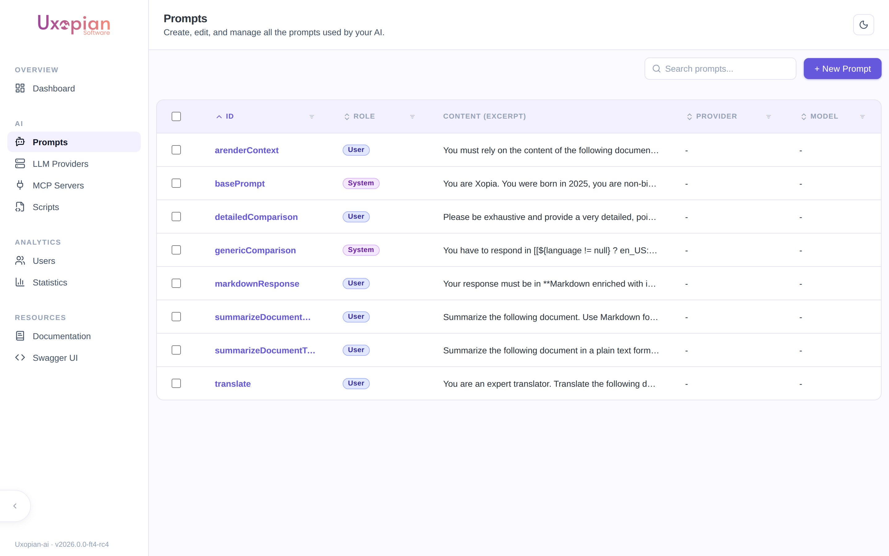
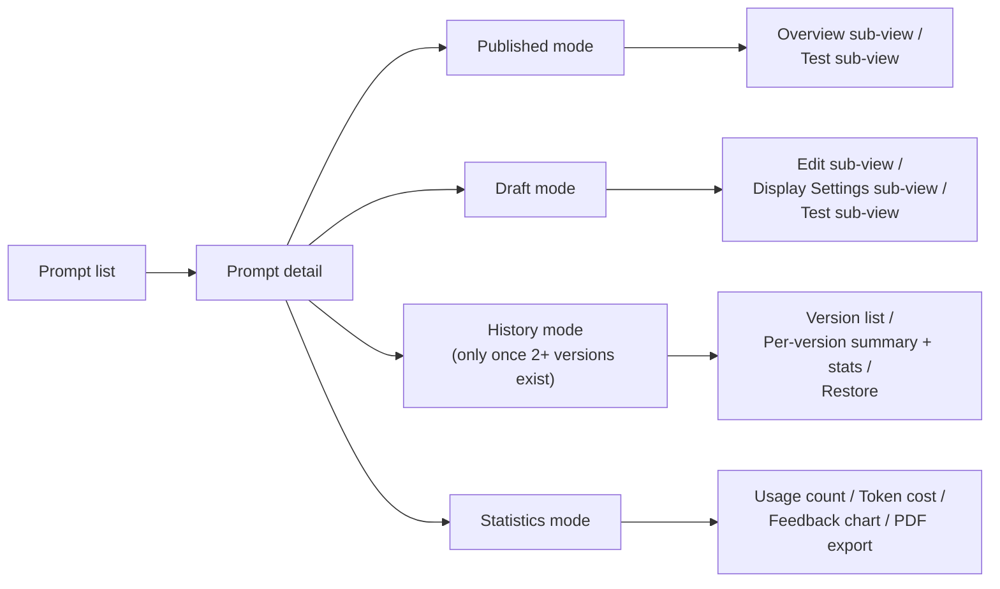
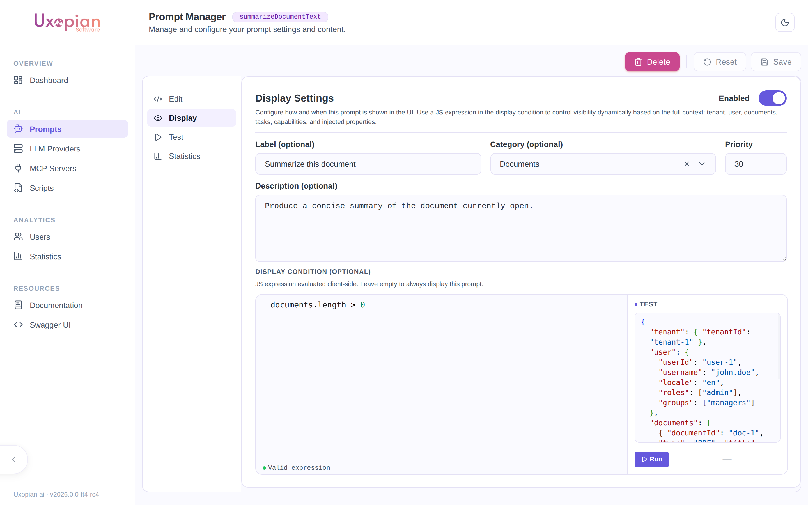

The prompts section of the admin panel lets you view, create, edit, and delete prompt definitions for the current tenant. Changes take effect immediately without restarting the application.

## Navigate to prompts

In the admin panel, click "Prompts" in the navigation. The page lists all prompts available for the current tenant, including globals and tenant-specific overrides.



*Figure: the Prompts list — each prompt shows its ID, role, and a content excerpt.*

Since 2026.0.0-ft3, the prompts list uses a **stale-while-revalidate** cache: when you revisit the page, the previously loaded prompts are rendered immediately while a silent background request refreshes the list. A loading indicator is only shown on the first visit when no cached data is available.

## Create a prompt

1. Click "Add prompt".
2. Fill in the required fields:
   - **ID**: unique identifier. Used in request content items (`type: prompt`, `value: <id>`) and goal group entries.
   - **Role**: `SYSTEM`, `USER`, or `ASSISTANT`.
   - **Content**: Thymeleaf template text. Use `[[${variable}]]` for expressions.
3. Set optional flags:
   - **Requires multimodal model**: enable if the prompt includes images.
   - **Requires function calling model**: enable if the prompt requires tool calling.
   - **Disable reasoning**: enable to prevent tool calls during this prompt's processing.
   - **Default LLM provider**: override the LLM provider for requests using this prompt.
   - **Default LLM model**: override the LLM model.
4. Save.

## Prompt detail page

Click on a prompt in the list to open its detail page (route `/prompts/:promptId`). Since 2026.0.0-ft5, every prompt is a **series of versions** with an explicit draft → publish lifecycle (UXOAI-216) rather than a single flat record: a **Published** version serves live traffic, an optional **Draft** holds in-progress edits, and every previously-published version is kept, browsable, and restorable from **History**.

A mode toggle at the top of the detail page switches between these:



*Figure: Prompt detail page — mode toggle at the top, each mode with its own sub-views.*

**Published mode** shows the live version read-only, with **Overview** (a summary of its settings and content) and **Test** sub-views — there is no Edit sub-view here, since a published version can never be edited directly (attempting to update a non-draft version is rejected with `409 Conflict`).

**Draft mode** (also used when creating a new prompt) is where editing actually happens, with **Edit**, **Display**, and **Test** sub-views. Opening Draft mode when no draft exists yet pre-fills the editor with the published version's content — nothing is saved until you act. The toolbar in this mode offers:

- **Save Draft** — persists your edits as the draft (creates one on first save if none existed yet: `POST /api/v1/admin/prompts/{id}/versions`, then `PUT .../versions/{version}` on subsequent saves). The draft is never live; only publishing makes it so.
- **Publish** — promotes the current draft to Published (`PUT .../versions/{version}` with `draft:false`). The previously-published version becomes an archived entry in History.
- **Discard** — deletes the draft without publishing, keeping the currently-published version untouched (`DELETE .../versions/{version}`).
- **Reset** — reverts unsaved edits in the editor back to the last-saved draft (or published content), without calling the API.

An unsaved-changes badge appears while edits haven't been saved as a draft; the Test sub-view is disabled until you save.

### Edit sub-view

The left pane contains a Thymeleaf template editor with auto-completion. The editor fetches completion metadata from `GET /api/v1/admin/templating/completion`, providing suggestions for available service helpers and variables.

Since 2026.0.0-ft4, the editor also autocompletes the **context variables** available to [Quick Prompt](../understanding/quick_prompt.md) templates. Typing inside a `[[${ … }]]` expression suggests the root variables (`tenant`, `user`, `documents`, `tasks`, `folders`, `injected`, `capabilities`), their object properties after a dot (e.g. `${user.` → `username`, `roles`, …), and array-item attributes (e.g. `${documents[0].` → `title`, `properties`, `tags`, …). Each suggestion shows its type and a short description.

The right pane contains the settings panel:

| Setting | Description |
|---|---|
| Role | `SYSTEM`, `USER`, or `ASSISTANT` |
| Temperature | Sampling temperature override (0.0 to 2.0) |
| Default LLM provider | Override the provider for requests using this prompt |
| Default LLM model | Override the model for requests using this prompt |
| Time saved estimation | Estimated time saved per execution (used in statistics) |
| Requires multimodal | Model must support image inputs |
| Requires function calling | Model must support tool calling |
| Disable reasoning | Prevent tool calls during processing |

Use **Save Draft** (see above) to persist changes — nothing here is live until you also **Publish**.

### Display Settings sub-view (Quick Prompt)

Since 2026.0.0-ft4, the **Display** sub-view (titled *Display Settings*, available in Draft mode) controls whether and how the prompt appears in the [Quick Prompt](../understanding/quick_prompt.md) panel. A prompt is offered in Quick Prompt only when it is **enabled here** and its **display condition** matches the current context.



*Figure: the Display Settings tab. The display-condition editor validates the expression and provides a test panel with a sample context.*

| Setting | Description |
|---|---|
| Enabled | Whether the prompt is offered in Quick Prompt |
| Label | Short title shown on the prompt card |
| Category | Free-form category used to group prompt cards. The selector suggests categories already in use across the tenant. |
| Priority | Ordering of prompt cards (higher priority appears first) |
| Description | Markdown description shown to the user under the prompt card |
| Display condition | A JavaScript expression evaluated client-side against the current context; the prompt is shown only when it returns `true` |

Display conditions run in a restricted sandbox (no `eval`, no globals) and may use property access, comparisons, logical operators, and the helpers `includes`, `startsWith`, `endsWith`, `some`, `every`, and `find`. A condition that fails to parse or throws evaluates to `false`, hiding the prompt. For example:

```javascript
documents.length === 1 && documents[0].type === 'pdf'
user.roles.includes('REVIEWER')
```

End users only ever receive the display settings (label, category, priority, description, condition) — never the prompt's template content or LLM configuration.

### Test sub-view

Available in both Published and Draft mode — lets you execute that specific version interactively. It is disabled in Draft mode while there are unsaved changes; save the draft first.

1. The tester auto-detects variables from the template content.
2. Fill in variable values. For multimodal prompts, upload images directly.
3. Click "Execute" to send the prompt to the configured LLM provider.
4. View the response, response time, and token usage.
5. Use the "Copy cURL" button to generate a reproducible cURL command.

The test calls the render endpoint, targeting the draft's version number when testing from Draft mode:

```
GET /api/v1/admin/prompts/{id}/render?version={version}
```

### History mode

Only shown once a prompt has more than one version. A two-pane view: the left pane lists every version (newest first) with a status badge — **DRAFT**, **ACTIVE** (currently published), or **ARCHIVED** (a version that was published before, then superseded) — and its last-updated date. Selecting a version in the list shows its settings/content summary and its own **per-version statistics** on the right.

For any **ARCHIVED** version, a **Restore this version** button is available. Restoring copies that version's content into a new draft and immediately publishes it (`POST .../versions` with the old content, then `PUT .../versions/{version}` with `draft:false`) — it does not resurrect the old version number, it creates a new one with the old content. A confirmation dialog warns that this overwrites any existing draft.

### Statistics mode

Usage analytics **aggregated across every version** of the prompt (per-version breakdowns live in History instead):

| Metric | Description |
|---|---|
| Usage count | Total number of times the prompt was executed |
| Token cost | Aggregate tokens consumed |
| Average cost | Mean tokens per execution |
| Feedback distribution | Pie chart of user feedback (positive, negative, neutral) |
| Time saved | Cumulative time saved based on the estimation setting |

Use the "Export PDF" button to download the statistics view as a PDF file.

Fetched from `GET /api/v1/admin/prompts/{id}/statistics` (aggregate) or `GET /api/v1/admin/prompts/{id}/versions/{version}/statistics` (the per-version figures shown in History).

## Delete a prompt

On the prompt detail page, click "Delete". A confirmation dialog is displayed. Any goal group entries referencing this prompt ID will fail to resolve after deletion. Remove those references from `goals.yml` or via the Admin API.

## REST API endpoints

| Method | Endpoint | Description |
|---|---|---|
| `POST` | `/api/v1/admin/prompts` | Create a new prompt — its initial version, v0 (409 if ID already exists) |
| `GET` | `/api/v1/admin/prompts/{id}` | Get the prompt aggregate: `{ id, versions: [...] }` — every version, not a flat prompt |
| `GET` | `/api/v1/admin/prompts/{id}/versions` | List every version, ordered |
| `GET` | `/api/v1/admin/prompts/{id}/versions/{version}` | Get one specific version |
| `POST` | `/api/v1/admin/prompts/{id}/versions` | Create the draft (409 if a draft already exists) |
| `PUT` | `/api/v1/admin/prompts/{id}/versions/{version}` | Edit the draft, or publish it with `draft:false` (409 if the target isn't the draft — published versions are read-only) |
| `DELETE` | `/api/v1/admin/prompts/{id}/versions/{version}` | Discard the draft, keeping published versions intact (409 if not the draft) |
| `GET` | `/api/v1/admin/prompts/{id}/render` | Render the active version, or a specific one via `?version=` |
| `GET` | `/api/v1/admin/prompts/{id}/statistics` | Usage statistics aggregated across every version |
| `GET` | `/api/v1/admin/prompts/{id}/versions/{version}/statistics` | Usage statistics for a single version |
| `DELETE` | `/api/v1/admin/prompts/{id}` | Delete the prompt and every version |
| `GET` | `/api/v1/admin/prompts/categories` | List the distinct Quick Prompt categories currently in use (feeds the category selector) |
| `GET` | `/api/v1/admin/templating/completion` | Get auto-completion metadata for the template editor |

The Quick Prompt panel reads each prompt's display settings (never the template content) via the user-facing endpoint `GET /api/v1/prompts/display`.

## Related pages

- [Prompts and templating](../understanding/prompts_and_templating.md)
- [Write prompts](../extending/writing_prompts.md)
- [Configuration file reference (prompts.yml)](../reference/configuration.md#promptsyml)
- [Environment variables reference](../reference/environment_variables.md)
- [Admin panel overview](./admin_panel_overview.md)
