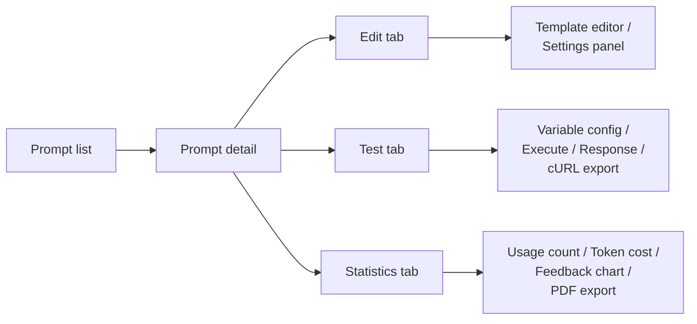

The prompts section of the admin panel lets you view, create, edit, and delete prompt definitions for the current tenant. Changes take effect immediately without restarting the application.

## Navigate to prompts

In the admin panel, click "Prompts" in the navigation. The page lists all prompts available for the current tenant, including globals and tenant-specific overrides.

## Create a prompt

1. Click "Add prompt".
2. Fill in the required fields:
   - **ID**: unique identifier. Used in request content items (`type: prompt`, `value: <id>`) and goal group entries.
   - **Role**: `SYSTEM`, `USER`, or `ASSISTANT`.
   - **Content**: Thymeleaf template text. Use `[[${variable}]]` for expressions.
3. Set optional flags:
   - **Requires multimodal model**: enable if the prompt includes images.
   - **Requires function calling model**: enable if the prompt requires tool calling.
   - **Disable reasoning**: enable to prevent tool calls during this prompt's processing.
   - **Default LLM provider**: override the LLM provider for requests using this prompt.
   - **Default LLM model**: override the LLM model.
4. Save.

## Prompt detail page

Click on a prompt in the list to open its detail page (route `/prompts/:promptId`). The detail page has three tabs: Edit, Test, and Statistics.



*Figure: Prompt detail page tab structure.*

### Edit tab

The left pane contains a Thymeleaf template editor with auto-completion. The editor fetches completion metadata from `GET /api/v1/admin/templating/completion`, providing suggestions for available service helpers and variables.

The right pane contains the settings panel:

| Setting | Description |
|---|---|
| Role | `SYSTEM`, `USER`, or `ASSISTANT` |
| Temperature | Sampling temperature override (0.0 to 2.0) |
| Default LLM provider | Override the provider for requests using this prompt |
| Default LLM model | Override the model for requests using this prompt |
| Time saved estimation | Estimated time saved per execution (used in statistics) |
| Requires multimodal | Model must support image inputs |
| Requires function calling | Model must support tool calling |
| Disable reasoning | Prevent tool calls during processing |

An unsaved changes badge appears when modifications have not been saved. Use the Reset button to discard changes or Save to apply them immediately.

### Test tab

The test tab lets you execute a prompt interactively. It is disabled when there are unsaved changes; save first.

1. The tester auto-detects variables from the template content.
2. Fill in variable values. For multimodal prompts, upload images directly.
3. Click "Execute" to send the prompt to the configured LLM provider.
4. View the response, response time, and token usage.
5. Use the "Copy cURL" button to generate a reproducible cURL command.

The test calls the render endpoint:

```
GET /api/v1/admin/prompts/{id}/render
```

### Statistics tab

Per-prompt usage analytics for the selected prompt:

| Metric | Description |
|---|---|
| Usage count | Total number of times the prompt was executed |
| Token cost | Aggregate tokens consumed |
| Average cost | Mean tokens per execution |
| Feedback distribution | Pie chart of user feedback (positive, negative, neutral) |
| Time saved | Cumulative time saved based on the estimation setting |

Use the "Export PDF" button to download the statistics view as a PDF file.

Fetched from `GET /api/v1/admin/prompts/{id}/statistics`.

## Delete a prompt

On the prompt detail page, click "Delete". A confirmation dialog is displayed. Any goal group entries referencing this prompt ID will fail to resolve after deletion. Remove those references from `goals.yml` or via the Admin API.

## REST API endpoints

| Method | Endpoint | Description |
|---|---|---|
| `POST` | `/api/v1/admin/prompts` | Create a new prompt (409 if ID already exists) |
| `PUT` | `/api/v1/admin/prompts` | Update an existing prompt |
| `GET` | `/api/v1/admin/prompts/{id}` | Get a prompt by ID |
| `GET` | `/api/v1/admin/prompts/{id}/render` | Render a prompt with a payload map |
| `GET` | `/api/v1/admin/prompts/{id}/statistics` | Get usage statistics for a prompt |
| `DELETE` | `/api/v1/admin/prompts/{id}` | Delete a prompt |
| `GET` | `/api/v1/admin/templating/completion` | Get auto-completion metadata for the template editor |

## Related pages

- [Prompts and templating](../understanding/prompts_and_templating.md)
- [Write prompts](../extending/writing_prompts.md)
- [Configuration file reference (prompts.yml)](../reference/configuration.md#promptsyml)
- [Environment variables reference](../reference/environment_variables.md)
- [Admin panel overview](./admin_panel_overview.md)
