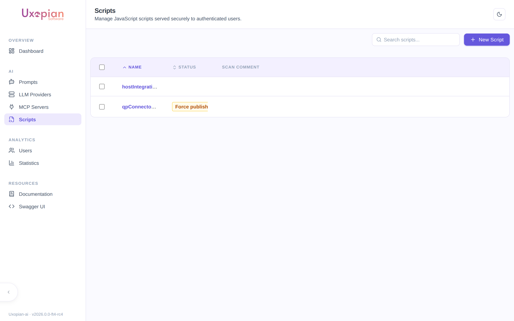
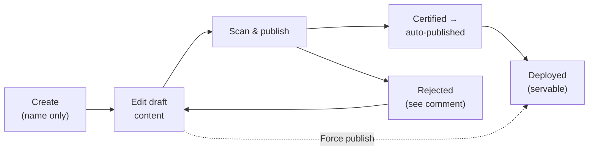
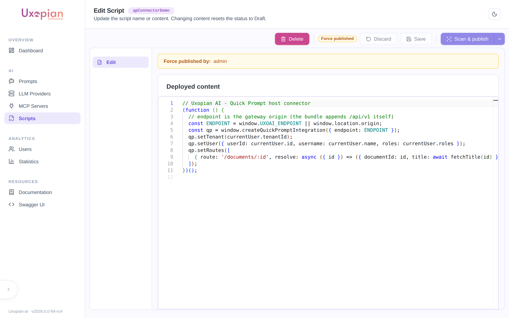

The **Scripts** section of the admin panel lets administrators author and deploy custom front-end JavaScript through a governed lifecycle that includes an **LLM-based security scan**. A typical use is the host connector that wires [Quick Prompt](../understanding/quick_prompt.md) into a business application: instead of hand-deploying a static `.js` file, the connector is authored in the admin panel, scanned, and served by uxopian-ai to authenticated users.

Scripts are managed per tenant. Changes take effect without restarting the application.



*Figure: the Scripts section lists each script with its publication status (here, a force-published script and a draft).*

## The script lifecycle



*Figure: A script is created, edited as a draft, scanned, and — once certified or force-published — deployed and served.*

A script always has two faces:

- **Draft content** — what the administrator is editing. Not servable to users.
- **Deployed content** — the last published version. This is what end users receive.

## Create a script

1. In the admin panel, open **Scripts** and click **New Script**.
2. Enter a **name**. The name becomes the script's immutable **ID** and may contain only letters, digits, `_`, and `-`. Creation fails with a conflict if the name is already used.
3. Save. The script is created empty; add its content on the detail page.

## Edit a script

Open a script to reach its detail page, which provides a code editor and the script's current status.



*Figure: the script detail page — code editor, status badge, and the Delete / Discard / Save / Scan & publish actions.*

| Action | Description |
|---|---|
| **Save** | Saves the editor content as the **draft**. Editing the draft of a certified script invalidates its certification — it must be re-scanned. |
| **Discard** | Reverts the editor to the last saved/deployed state. |
| **Scan & publish** | Runs the security scan; on a **Certified** verdict, the draft is automatically published and becomes servable. |
| **Force publish** | (In the Scan & publish dropdown.) Deploys the current draft **without** scanning. Use with care — the action is logged and attributed. |
| **Delete** | Removes the script after confirmation. |

:::note Content is edited through the draft only
You cannot modify a script's deployed content directly. All edits go through the draft; publishing promotes the draft to the deployed content.
:::

### Status

| Status | Meaning |
|---|---|
| Certified | The latest scan certified the draft as safe |
| Rejected | The latest scan rejected the draft; the scanner's comment is shown |
| Force published | The deployed content was published without a scan |
| Deployed | The script has deployed content and is being served |
| Pending scan | Transient indicator shown while a scan is in progress |

## The security scan

The scan sends the draft content to a configured LLM with a security-review prompt and expects a verdict of **Certified** or **Rejected** with a comment. This requires an LLM provider to be configured for scanning:

| Setting | Environment variable | Default | Description |
|---|---|---|---|
| `script.scan.llm-provider-id` | `SCRIPT_SCAN_LLM_PROVIDER` | (empty) | ID of a configured LLM provider used to run the scan. **Required to enable scanning.** |
| `script.scan.llm-model` | `SCRIPT_SCAN_LLM_MODEL` | (empty) | Model to use; falls back to the provider's default model when blank |
| `script.scan.prompt` | — | (built-in) | The security-review prompt sent to the model |

If no scan provider is configured, script create/edit/delete and **force publish** still work, but the **Scan & publish** action is unavailable. See [Configuration — script-scan.yml](../reference/configuration.md#script-scanyml).

## Serving a script

A deployed script is served to any authenticated user as `application/javascript`, with HTTP caching (`Cache-Control` and `ETag`, so unchanged scripts return `304 Not Modified`):

```
GET /api/v1/scripts/{id}
```

A script that has never been deployed is **not servable** and returns `401 Unauthorized`. A draft can be previewed (for development) via `GET /api/v1/scripts/{id}/draft`.

To load a deployed script in a host page:

```html
<script src="https://your-gateway/api/v1/scripts/myConnector"></script>
```

## REST API endpoints

**Administration** (`/api/v1/admin/scripts`):

| Method | Endpoint | Description |
|---|---|---|
| `GET` | `/api/v1/admin/scripts` | List scripts with full metadata |
| `GET` | `/api/v1/admin/scripts/{id}` | Get a script by ID |
| `POST` | `/api/v1/admin/scripts` | Create a script (name only; `409` if the name exists) |
| `PUT` | `/api/v1/admin/scripts/{id}` | Update the draft content |
| `POST` | `/api/v1/admin/scripts/{id}/scan` | Run the security scan |
| `POST` | `/api/v1/admin/scripts/{id}/publish` | Publish a certified draft |
| `POST` | `/api/v1/admin/scripts/{id}/force-publish` | Publish the draft without scanning |
| `DELETE` | `/api/v1/admin/scripts/{id}/draft` | Discard the draft |
| `DELETE` | `/api/v1/admin/scripts/{id}` | Delete the script (`204 No Content`) |

**Serving** (authenticated users):

| Method | Endpoint | Description |
|---|---|---|
| `GET` | `/api/v1/scripts/{id}` | Serve the deployed script as `application/javascript` (`401` if never deployed) |
| `GET` | `/api/v1/scripts/{id}/draft` | Serve the draft as `application/javascript` (for preview) |

## Related pages

- [Quick Prompt](../understanding/quick_prompt.md)
- [Embed Quick Prompt](../how_to/embed_quick_prompt.mdx)
- [Configuration — script-scan.yml](../reference/configuration.md#script-scanyml)
- [Admin panel overview](./admin_panel_overview.md)
- [Managing LLM providers](./managing_llm_providers.md)
