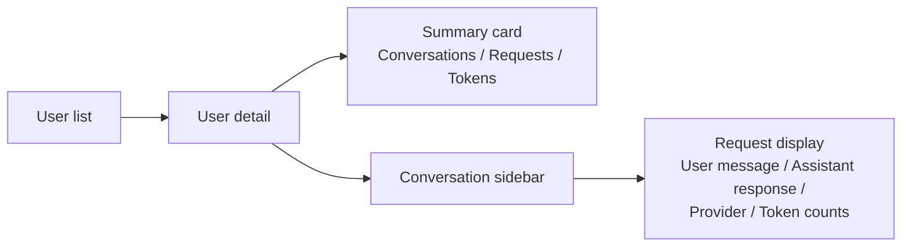

The users section of the admin panel provides a read-only view of all users for the current tenant. Administrators can browse user activity, view conversation history, and inspect individual LLM requests.

## User list

Navigate to "Users" in the admin panel. The table lists all users with sortable columns:

| Column | Description |
|---|---|
| User ID | Identifier passed in `X-User-Id` headers |
| Conversations | Total conversation count |
| Input tokens | Aggregate input token count |
| Output tokens | Aggregate output token count |
| Request count | Total number of LLM requests |

Use the search field at the top to filter users by ID.

Data is fetched from `GET /api/v1/admin/users/statistics`.

Click a row to open the user detail page.

## User detail page

Route: `/users/:userId`.

*Figure: User detail page layout.*

### User summary

A header card shows aggregate statistics for the selected user:

| Stat | Description |
|---|---|
| Conversations | Number of conversations |
| Requests | Total LLM requests |
| Total tokens | Input + output tokens |

A refresh button reloads the conversation list.

Fetched from `GET /api/v1/admin/users/details?userId={userId}`.

### Conversation list

A scrollable sidebar lists all conversations for the user. Click a conversation to display its requests in the main panel. The selected conversation is highlighted.

### Request display

For the selected conversation, the main panel shows each request in chronological order. Each request displays:

- The user message content
- The assistant response
- The LLM provider and model used
- Token counts (input and output)

Requests are paginated. Fetched from `GET /api/v1/admin/requests?conversation={conversationId}&from={offset}&size={limit}`.

## REST API endpoints

| Method | Endpoint | Description |
|---|---|---|
| `GET` | `/api/v1/admin/users/statistics` | List all users with conversation stats |
| `GET` | `/api/v1/admin/users/details?userId={id}` | Get user profile with conversations |
| `GET` | `/api/v1/admin/conversations` | List all conversations (paginated) |
| `GET` | `/api/v1/admin/conversations/{id}` | Get a conversation by ID |
| `DELETE` | `/api/v1/admin/conversations/{id}` | Delete a conversation |
| `GET` | `/api/v1/admin/requests?conversation={id}&from={n}&size={n}` | Paginated requests for a conversation |
| `GET` | `/api/v1/admin/requests/{id}` | Get a specific request |
| `DELETE` | `/api/v1/admin/requests/{id}` | Delete a request |

## Related pages

- [Conversations and requests](../understanding/conversations_and_requests.md)
- [Admin panel overview](./admin_panel_overview.md)
- [Monitoring statistics](./monitoring_statistics.md)
