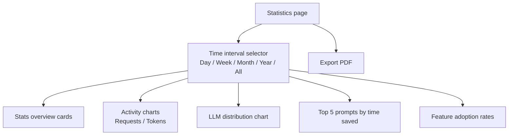

The statistics section of the admin panel displays usage metrics for the current tenant. Data is read from OpenSearch via the Stats API (`/api/v1/admin/stats`).

## Available statistics

### Global stats

The dashboard shows aggregated totals:

- Total conversations
- Total requests
- Total tokens (input + output)
- Estimated time saved

Fetched from `GET /api/v1/admin/stats/global`.

### Time interval selector

A toolbar at the top of the statistics page lets you select the time granularity. The selected interval applies to all charts on the page.

| Button | Interval | Description |
|---|---|---|
| Day | `DAY` | Daily buckets (default) |
| Week | `WEEK` | Weekly buckets |
| Month | `MONTH` | Monthly buckets |
| Year | `YEAR` | Yearly buckets |
| All | none | All-time aggregation, no interval filter |

### Activity charts

Two area/line charts show activity over the selected interval:

- **Requests**: request volume over time.
- **Tokens**: token usage (input + output) over time.

Fetched from `GET /api/v1/admin/stats/timeseries?interval={interval}`.

### LLM distribution

A chart showing which LLM models were used for requests, with counts per provider. The interval selector applies to this chart as well.

Fetched from `GET /api/v1/admin/stats/llm-distribution?interval={interval}`.

### Top prompts by time saved

Ranks the top 5 prompts by cumulative time saved (displayed in hours). This helps identify which prompts deliver the most value.

Fetched from `GET /api/v1/admin/stats/top-prompts-time-saved?interval={interval}`.

### Feature adoption

Shows adoption rates for advanced capabilities:

| Feature | Description |
|---|---|
| Multimodal | Percentage of requests using image inputs |
| Function calling | Percentage of requests using tool calling |

Fetched from `GET /api/v1/admin/stats/feature-adoption`.



*Figure: Statistics page layout and data flow.*

## PDF export

Click the "Export PDF" button at the top of the statistics page to download the current dashboard view as a PDF file. The export includes all visible charts and summary cards.

## Metrics export to OpenSearch

Uxopian AI exports custom metrics to OpenSearch via the Micrometer Elastic exporter, configured in `metrics.yml`. The default index is `micrometer-metrics`. Standard JVM, HTTP, and system metrics are disabled by default to reduce noise.

To enable additional metrics, edit `metrics.yml`:

```yaml
management:
  metrics:
    enable:
      jvm: true       # Enable JVM metrics
      http: true      # Enable HTTP request metrics
```

## Actuator endpoints

Three actuator endpoints are exposed over HTTP:

| Endpoint | Path | Description |
|---|---|---|
| Health | `/actuator/health` | Application health (public) |
| Info | `/actuator/info` | Build and version info |
| Loggers | `/actuator/loggers` | View and change log levels at runtime |

The health endpoint is public in the default gateway configuration. Other actuator endpoints should be protected in production.

## REST API endpoints

| Method | Endpoint | Description |
|---|---|---|
| `GET` | `/api/v1/admin/stats/global` | Global aggregated statistics |
| `GET` | `/api/v1/admin/stats/timeseries?interval={interval}` | Activity time series |
| `GET` | `/api/v1/admin/stats/llm-distribution?interval={interval}` | LLM model usage distribution |
| `GET` | `/api/v1/admin/stats/top-prompts-time-saved?interval={interval}` | Top 5 prompts by time saved |
| `GET` | `/api/v1/admin/stats/feature-adoption` | Feature adoption rates |

## Related pages

- [Admin panel overview](./admin_panel_overview.md)
- [Monitoring (installation)](../installation/monitoring.md)
- [Configuration file reference (metrics.yml)](../reference/configuration.md#metricsyml)
- [Environment variables reference](../reference/environment_variables.md)
