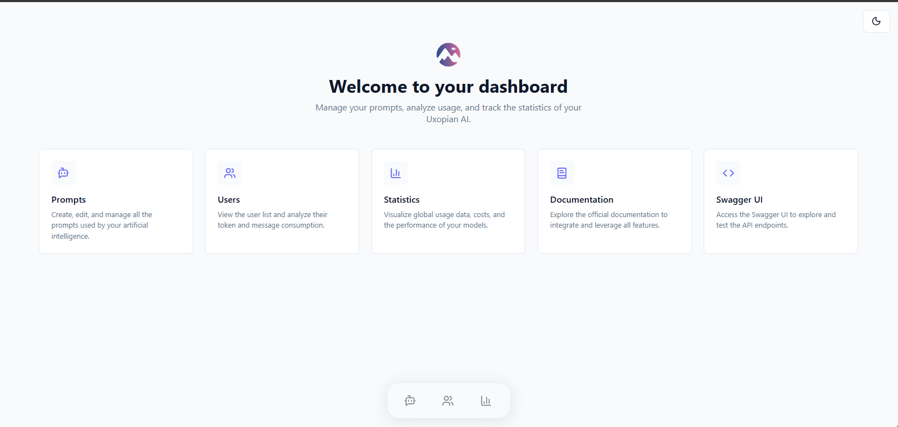

# Dashboard

The **Uxopian-ai Admin Panel** acts as the central command center for your AI infrastructure. It provides a visual interface to manage resources, monitor usage statistics, and oversee user activity.

:::info Access
The Admin Panel is restricted to users with the **admin role**.  
 **URL:** `https://<your-uxopian-endpoint>/admin`
:::

## Key Features

The dashboard offers quick access shortcuts to the primary management modules:

- **Prompts:** Navigate to the Prompt Library to manage AI interactions.
- **Users:** Monitor user activity and view detailed history.
- **Statistics:** View global health metrics and ROI data.

## Resources

You also have direct access to external developer tools:

- **Official Documentation:** Links to the comprehensive Uxopian-ai guides.
- **Swagger UI:** Access the interactive API documentation for testing endpoints directly.
