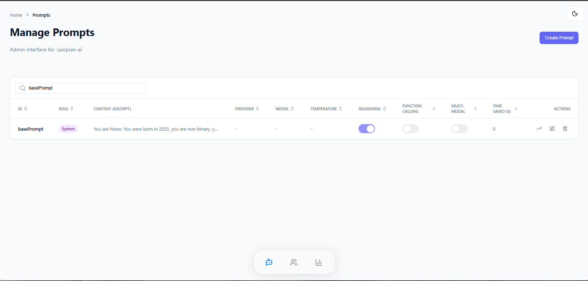
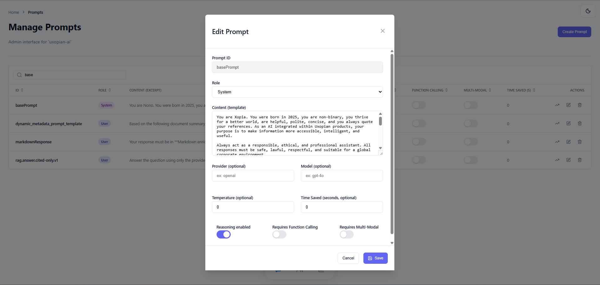
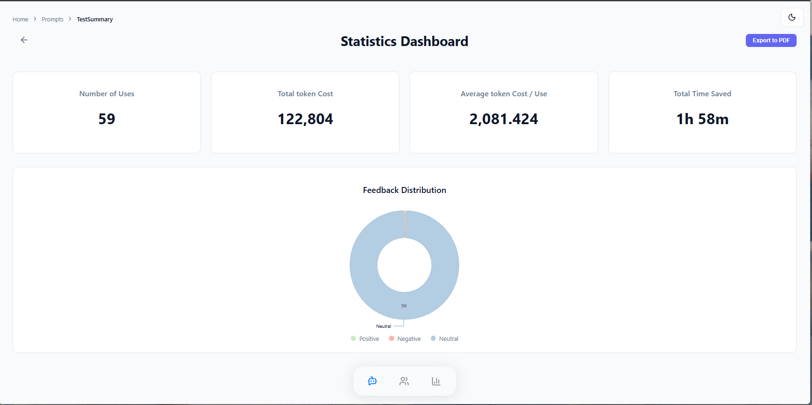

# Prompts Management

Prompts are the building blocks of your AI interactions. This section allows administrators to manage the lifecycle of these prompts, from creation to performance analysis.

## 1. Prompt List & Search

The main view displays a table of all available prompts in the system.

- **Search:** Quickly find specific prompts by their ID or content.
- **Actions:** From here, you can create new prompts, edit existing ones, or view their specific statistics.
- **API Reference:** `GET /api/v1/admin/prompts`.

## 2. Prompt Editor (CRUD)

The editor allows for granular configuration of prompt behavior.

### Content & Configuration

- **Content Editor:** Edit the **Thymeleaf template** used to generate the prompt dynamically.
- **Model Configuration:** Set the default LLM provider (e.g., OpenAI) and model (e.g., GPT-4).
- **Capabilities:** Toggle specific flags based on the prompt's needs:
  - **Reasoning:** Enable or disable reasoning capabilities.
  - **Multi-modal:** Flag if the prompt requires image/audio inputs.
  - **Function Calling:** Flag if the prompt triggers external tools.

### ROI Settings

- **Time Saved:** Define an estimated "Time Saved per usage" (in seconds). This value is used to calculate the Return on Investment (ROI) metrics across the platform.

## 3. Prompt Statistics

By selecting a specific prompt, you can access performance metrics specific to that configuration.

- **Usage Count:** The total number of times this prompt has been triggered.
- **Feedback:** A breakdown of user ratings (**Good**, **Bad**, **Neutral**) to assess the quality of the outputs.
- **Cost & ROI:** Analysis of token consumption (`totalCost`, `costAverage`) and the specific time saved by this prompt.
