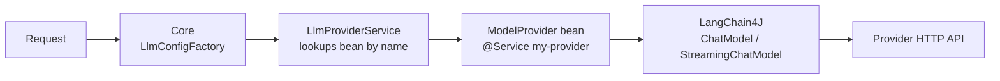

An LLM client is a Java class that wraps a language model API into the Uxopian AI provider system. Each client implements the `ModelProvider` interface and is registered as a Spring bean. At runtime, `LlmClientLoader` discovers it automatically from the classpath or from a plugin JAR in the `llm-clients/` directory.

## How it fits in the system



*Figure: A request is resolved to a provider bean, which builds a LangChain4J model instance.*

## ModelProvider interface

Every LLM client implements this interface:

```java
package com.uxopian.ai.model.llm.connector;

public interface ModelProvider
{
    ChatModel createChatModelInstance(LlmModelConf params);

    StreamingChatModel createStreamingChatModelInstance(LlmModelConf params);

    default List<ExtraParamDescriptor> getExtraParamDescriptors()
    {
        return List.of();
    }
}
```

| Method | Required | Description |
|---|---|---|
| `createChatModelInstance` | Yes | Build a synchronous `ChatModel` from configuration |
| `createStreamingChatModelInstance` | Yes | Build a `StreamingChatModel` for token streaming |
| `getExtraParamDescriptors` | No | Declare provider-specific parameters shown in the admin UI |

## AbstractLlmClient base class

All built-in providers extend this helper:

```java
public abstract class AbstractLlmClient implements ModelProvider
{
    protected <T> void applyIfNotNull(T value, Consumer<T> setter)
    {
        if (value != null)
        {
            setter.accept(value);
        }
    }
}
```

The `applyIfNotNull` utility avoids null checks when mapping optional configuration fields to the LangChain4J builder.

## LlmModelConf parameters

The `LlmModelConf` class (extends `LlmBaseConf`) is passed to both `create*` methods. It contains the merged global + model-specific configuration:

| Field | Type | Description |
|---|---|---|
| `apiSecret` | String | API key or credential |
| `endpointUrl` | String | Provider API base URL |
| `modelName` | String | Actual model name sent to the API |
| `llmModelConfName` | String | Internal configuration name |
| `temperature` | Double | Sampling temperature |
| `topP` | Double | Nucleus sampling |
| `topK` | Integer | Top-K sampling |
| `seed` | Long | Random seed for reproducibility |
| `maxTokens` | Integer | Maximum output tokens |
| `maxRetries` | Integer | Retry count on failure |
| `timeout` | Integer | Request timeout in seconds |
| `presencePenalty` | Double | Presence penalty |
| `frequencyPenalty` | Double | Frequency penalty |
| `multiModalSupported` | Boolean | Model accepts image inputs |
| `functionCallSupported` | Boolean | Model supports tool calling |
| `extras` | `Map<String, String>` | Provider-specific key-value parameters |

## ExtraParamDescriptor

Providers that need custom parameters override `getExtraParamDescriptors()`. Each descriptor is shown in the admin UI when configuring the provider.

```java
public record ExtraParamDescriptor(String key, String description) {}
```

## Registration mechanism

`LlmClientLoader` scans for classes implementing `ModelProvider`:

1. Scans the classpath and JARs in the `llm-clients/` directory.
2. Skips abstract classes and interfaces.
3. Requires `@Service("bean-name")` with a non-empty value.
4. Instantiates the class via `AutowireCapableBeanFactory.createBean()`.
5. Registers it as a Spring bean. The bean name becomes the provider identifier used in `llm-clients-config.yml` and the admin UI.

If a bean name collides with an existing provider, the duplicate is not loaded. A warning is logged.

## Built-in providers

All built-in providers follow the same pattern. Here is the complete source of each:

### openai

```java
@Service("openai")
public class OpenAiClient extends AbstractLlmClient
{
    @Override
    public ChatModel createChatModelInstance(LlmModelConf params)
    {
        OpenAiChatModel.OpenAiChatModelBuilder builder = OpenAiChatModel.builder();
        builder.apiKey(params.getApiSecret());
        builder.modelName(params.getModelName());
        if (params.getEndpointUrl() != null)
        {
            builder.baseUrl(params.getEndpointUrl());
        }
        applyIfNotNull(params.getTemperature(), builder::temperature);
        applyIfNotNull(params.getTopP(), builder::topP);
        applyIfNotNull(params.getMaxTokens(), builder::maxTokens);
        applyIfNotNull(params.getPresencePenalty(), builder::presencePenalty);
        applyIfNotNull(params.getFrequencyPenalty(), builder::frequencyPenalty);
        applyIfNotNull(params.getMaxRetries(), builder::maxRetries);
        applyIfNotNull(params.getTimeout(), t -> builder.timeout(Duration.ofSeconds(t)));
        return builder.build();
    }

    @Override
    public StreamingChatModel createStreamingChatModelInstance(LlmModelConf params)
    {
        OpenAiStreamingChatModel.OpenAiStreamingChatModelBuilder builder = OpenAiStreamingChatModel.builder();
        builder.apiKey(params.getApiSecret());
        builder.modelName(params.getModelName());
        if (params.getEndpointUrl() != null)
        {
            builder.baseUrl(params.getEndpointUrl());
        }
        applyIfNotNull(params.getTemperature(), builder::temperature);
        applyIfNotNull(params.getTopP(), builder::topP);
        applyIfNotNull(params.getMaxTokens(), builder::maxTokens);
        applyIfNotNull(params.getPresencePenalty(), builder::presencePenalty);
        applyIfNotNull(params.getFrequencyPenalty(), builder::frequencyPenalty);
        applyIfNotNull(params.getTimeout(), t -> builder.timeout(Duration.ofSeconds(t)));
        return builder.build();
    }
}
```

### anthropic

```java
@Service("anthropic")
public class AnthropicClient extends AbstractLlmClient
{
    @Override
    public ChatModel createChatModelInstance(LlmModelConf params)
    {
        AnthropicChatModel.AnthropicChatModelBuilder builder = AnthropicChatModel.builder();
        builder.apiKey(params.getApiSecret());
        builder.baseUrl(params.getEndpointUrl());
        builder.modelName(params.getModelName());
        applyIfNotNull(params.getTemperature(), builder::temperature);
        applyIfNotNull(params.getTopP(), builder::topP);
        applyIfNotNull(params.getTopK(), builder::topK);
        applyIfNotNull(params.getMaxTokens(), builder::maxTokens);
        applyIfNotNull(params.getMaxRetries(), builder::maxRetries);
        applyIfNotNull(params.getTimeout(), t -> builder.timeout(Duration.ofSeconds(t)));
        return builder.build();
    }

    @Override
    public StreamingChatModel createStreamingChatModelInstance(LlmModelConf params)
    {
        AnthropicStreamingChatModel.AnthropicStreamingChatModelBuilder builder =
                AnthropicStreamingChatModel.builder();
        builder.apiKey(params.getApiSecret());
        builder.baseUrl(params.getEndpointUrl());
        builder.modelName(params.getModelName());
        applyIfNotNull(params.getTemperature(), builder::temperature);
        applyIfNotNull(params.getTopP(), builder::topP);
        applyIfNotNull(params.getTopK(), builder::topK);
        applyIfNotNull(params.getMaxTokens(), builder::maxTokens);
        applyIfNotNull(params.getTimeout(), t -> builder.timeout(Duration.ofSeconds(t)));
        return builder.build();
    }
}
```

### azure-openai

```java
@Service("azure-openai")
public class AzureOpenAiClient extends AbstractLlmClient
{
    @Override
    public ChatModel createChatModelInstance(LlmModelConf params)
    {
        AzureOpenAiChatModel.Builder builder = AzureOpenAiChatModel.builder();
        builder.endpoint(params.getEndpointUrl());
        builder.apiKey(params.getApiSecret());
        builder.deploymentName(params.getModelName());
        applyIfNotNull(params.getTemperature(), builder::temperature);
        applyIfNotNull(params.getTopP(), builder::topP);
        applyIfNotNull(params.getMaxTokens(), builder::maxTokens);
        applyIfNotNull(params.getPresencePenalty(), builder::presencePenalty);
        applyIfNotNull(params.getFrequencyPenalty(), builder::frequencyPenalty);
        applyIfNotNull(params.getMaxRetries(), builder::maxRetries);
        applyIfNotNull(params.getTimeout(), t -> builder.timeout(Duration.ofSeconds(t)));
        return builder.build();
    }

    @Override
    public StreamingChatModel createStreamingChatModelInstance(LlmModelConf params)
    {
        AzureOpenAiStreamingChatModel.Builder builder = AzureOpenAiStreamingChatModel.builder();
        builder.endpoint(params.getEndpointUrl());
        builder.apiKey(params.getApiSecret());
        builder.deploymentName(params.getModelName());
        applyIfNotNull(params.getTemperature(), builder::temperature);
        applyIfNotNull(params.getTopP(), builder::topP);
        applyIfNotNull(params.getMaxTokens(), builder::maxTokens);
        applyIfNotNull(params.getPresencePenalty(), builder::presencePenalty);
        applyIfNotNull(params.getFrequencyPenalty(), builder::frequencyPenalty);
        applyIfNotNull(params.getTimeout(), t -> builder.timeout(Duration.ofSeconds(t)));
        return builder.build();
    }
}
```

### bedrock (with extra parameters)

```java
@Service("bedrock")
public class BedrockClient extends AbstractLlmClient
{
    private final static String AwsRegionKey = "AwsRegion";
    private final static String AwsAccessKey = "AwsAccessKey";
    private final static String AwsSessionToken = "AwsSessionToken";

    @Override
    public List<ExtraParamDescriptor> getExtraParamDescriptors()
    {
        return List.of(
                new ExtraParamDescriptor(AwsRegionKey, "AWS region (e.g. us-east-1)"),
                new ExtraParamDescriptor(AwsAccessKey, "AWS access key ID"),
                new ExtraParamDescriptor(AwsSessionToken,
                        "AWS session token (required for temporary credentials)"));
    }

    @Override
    public ChatModel createChatModelInstance(LlmModelConf params)
    {
        BedrockRuntimeClient bedrockClient = BedrockRuntimeClient.builder()
                .region(Region.of(params.getExtras().get(AwsRegionKey)))
                .credentialsProvider(getCredentialsProvider(params)).build();
        BedrockChatModel.Builder builder = BedrockChatModel.builder();
        builder.client(bedrockClient);
        builder.modelId(params.getModelName());
        applyIfNotNull(params.getMaxRetries(), builder::maxRetries);
        return builder.build();
    }

    @Override
    public StreamingChatModel createStreamingChatModelInstance(LlmModelConf params)
    {
        BedrockRuntimeAsyncClient bedrockAsyncClient = BedrockRuntimeAsyncClient.builder()
                .region(Region.of(params.getExtras().get(AwsRegionKey)))
                .credentialsProvider(getCredentialsProvider(params)).build();
        BedrockStreamingChatModel.Builder builder = BedrockStreamingChatModel.builder();
        builder.client(bedrockAsyncClient);
        builder.modelId(params.getModelName());
        return builder.build();
    }

    private StaticCredentialsProvider getCredentialsProvider(LlmModelConf params) { /* ... */ }
}
```

### gemini

```java
@Service("gemini")
public class GeminiClient extends AbstractLlmClient
{
    @Override
    public ChatModel createChatModelInstance(LlmModelConf params)
    {
        GoogleAiGeminiChatModel.GoogleAiGeminiChatModelBuilder builder =
                GoogleAiGeminiChatModel.builder();
        builder.apiKey(params.getApiSecret());
        builder.modelName(params.getModelName());
        applyIfNotNull(params.getTemperature(), builder::temperature);
        applyIfNotNull(params.getTopP(), builder::topP);
        applyIfNotNull(params.getTopK(), builder::topK);
        applyIfNotNull(params.getMaxTokens(), builder::maxOutputTokens);
        applyIfNotNull(params.getMaxRetries(), builder::maxRetries);
        applyIfNotNull(params.getTimeout(), t -> builder.timeout(Duration.ofSeconds(t)));
        return builder.build();
    }

    @Override
    public StreamingChatModel createStreamingChatModelInstance(LlmModelConf params)
    {
        GoogleAiGeminiStreamingChatModel.GoogleAiGeminiStreamingChatModelBuilder builder =
                GoogleAiGeminiStreamingChatModel.builder();
        builder.apiKey(params.getApiSecret());
        builder.modelName(params.getModelName());
        applyIfNotNull(params.getTemperature(), builder::temperature);
        applyIfNotNull(params.getTopP(), builder::topP);
        applyIfNotNull(params.getTopK(), builder::topK);
        applyIfNotNull(params.getMaxTokens(), builder::maxOutputTokens);
        applyIfNotNull(params.getTimeout(), t -> builder.timeout(Duration.ofSeconds(t)));
        return builder.build();
    }
}
```

### mistral-ai

```java
@Service("mistral-ai")
public class MistralAiClient extends AbstractLlmClient
{
    @Override
    public ChatModel createChatModelInstance(LlmModelConf params)
    {
        MistralAiChatModel.MistralAiChatModelBuilder builder = MistralAiChatModel.builder();
        builder.apiKey(params.getApiSecret());
        builder.baseUrl(params.getEndpointUrl());
        builder.modelName(params.getModelName());
        applyIfNotNull(params.getTemperature(), builder::temperature);
        applyIfNotNull(params.getTopP(), builder::topP);
        applyIfNotNull(params.getMaxTokens(), builder::maxTokens);
        applyIfNotNull(params.getMaxRetries(), builder::maxRetries);
        applyIfNotNull(params.getSeed(), s -> builder.randomSeed(s.intValue()));
        applyIfNotNull(params.getTimeout(), t -> builder.timeout(Duration.ofSeconds(t)));
        return builder.build();
    }

    @Override
    public StreamingChatModel createStreamingChatModelInstance(LlmModelConf params)
    {
        MistralAiStreamingChatModel.MistralAiStreamingChatModelBuilder builder =
                MistralAiStreamingChatModel.builder();
        builder.apiKey(params.getApiSecret());
        builder.baseUrl(params.getEndpointUrl());
        builder.modelName(params.getModelName());
        applyIfNotNull(params.getTemperature(), builder::temperature);
        applyIfNotNull(params.getTopP(), builder::topP);
        applyIfNotNull(params.getMaxTokens(), builder::maxTokens);
        applyIfNotNull(params.getSeed(), s -> builder.randomSeed(s.intValue()));
        applyIfNotNull(params.getTimeout(), t -> builder.timeout(Duration.ofSeconds(t)));
        return builder.build();
    }
}
```

### ollama

```java
@Service("ollama")
public class OllamaClient extends AbstractLlmClient
{
    @Override
    public ChatModel createChatModelInstance(LlmModelConf params)
    {
        OllamaChatModel.OllamaChatModelBuilder builder = OllamaChatModel.builder();
        builder.baseUrl(params.getEndpointUrl());
        builder.modelName(params.getModelName());
        applyIfNotNull(params.getTemperature(), builder::temperature);
        applyIfNotNull(params.getTopP(), builder::topP);
        applyIfNotNull(params.getTopK(), builder::topK);
        applyIfNotNull(params.getMaxRetries(), builder::maxRetries);
        applyIfNotNull(params.getMaxTokens(), builder::numPredict);
        applyIfNotNull(params.getSeed(), s -> builder.seed(s.intValue()));
        applyIfNotNull(params.getTimeout(), t -> builder.timeout(Duration.ofSeconds(t)));
        return builder.build();
    }

    @Override
    public StreamingChatModel createStreamingChatModelInstance(LlmModelConf params)
    {
        OllamaStreamingChatModel.OllamaStreamingChatModelBuilder builder =
                OllamaStreamingChatModel.builder();
        builder.baseUrl(params.getEndpointUrl());
        builder.modelName(params.getModelName());
        applyIfNotNull(params.getTemperature(), builder::temperature);
        applyIfNotNull(params.getTopP(), builder::topP);
        applyIfNotNull(params.getTopK(), builder::topK);
        applyIfNotNull(params.getMaxTokens(), builder::numPredict);
        applyIfNotNull(params.getSeed(), s -> builder.seed(s.intValue()));
        applyIfNotNull(params.getTimeout(), t -> builder.timeout(Duration.ofSeconds(t)));
        return builder.build();
    }
}
```

### huggingface

```java
@Service("huggingface")
public class HuggingFaceClient extends AbstractLlmClient
{
    @Override
    public ChatModel createChatModelInstance(LlmModelConf params)
    {
        HuggingFaceChatModel.Builder builder = HuggingFaceChatModel.builder();
        builder.accessToken(params.getApiSecret());
        builder.modelId(params.getModelName());
        applyIfNotNull(params.getTemperature(), builder::temperature);
        applyIfNotNull(params.getMaxTokens(), builder::maxNewTokens);
        applyIfNotNull(params.getTimeout(), t -> builder.timeout(Duration.ofSeconds(t)));
        return builder.build();
    }

    @Override
    public StreamingChatModel createStreamingChatModelInstance(LlmModelConf params)
    {
        throw new UnsupportedOperationException(
                "StreamingChatModel is not supported by HuggingFaceClient");
    }
}
```

### nu-extract (with extra parameters)

```java
@Service("nu-extract")
public class NuExtractClient extends AbstractLlmClient
{
    public static final String EXTRA_MODEL_ID = "modelId";

    @Override
    public List<ExtraParamDescriptor> getExtraParamDescriptors()
    {
        return List.of(new ExtraParamDescriptor(EXTRA_MODEL_ID,
                "Model ID override (defaults to modelName if absent)"));
    }

    @Override
    public ChatModel createChatModelInstance(LlmModelConf params)
    {
        String modelId = resolveModelId(params, params.getModelName());
        return new NuExtractChatModel(params.getEndpointUrl(), params.getApiSecret(),
                params.getModelName(), modelId);
    }

    @Override
    public StreamingChatModel createStreamingChatModelInstance(LlmModelConf params)
    {
        String modelId = resolveModelId(params, params.getModelName());
        return new NuExtractStreamingChatModel(params.getEndpointUrl(), params.getApiSecret(),
                params.getModelName(), modelId);
    }

    private String resolveModelId(LlmModelConf params, String resolvedModelName)
    {
        Map<String, String> extras = params.getExtras();
        if (extras != null && extras.containsKey(EXTRA_MODEL_ID))
        {
            return extras.get(EXTRA_MODEL_ID);
        }
        return resolvedModelName;
    }
}
```

## Provider parameter support

Each provider uses a different subset of `LlmModelConf` fields:

| Field | openai | anthropic | azure-openai | bedrock | gemini | mistral-ai | ollama | huggingface | nu-extract |
|---|---|---|---|---|---|---|---|---|---|
| `apiSecret` | x | x | x | | x | x | | x | x |
| `endpointUrl` | opt | x | x | | | x | x | | x |
| `temperature` | x | x | x | | x | x | x | x | |
| `topP` | x | x | x | | x | x | x | | |
| `topK` | | x | | | x | | x | | |
| `maxTokens` | x | x | x | | x | x | x | x | |
| `maxRetries` | x | x | x | x | x | x | x | | |
| `timeout` | x | x | x | | x | x | x | x | |
| `presencePenalty` | x | | x | | | | | | |
| `frequencyPenalty` | x | | x | | | | | | |
| `seed` | | | | | | x | x | | |
| `extras` | | | | x | | | | | x |

## Write a custom provider

### 1. Create a Maven project

Add the `llm-connector` module as a dependency. It contains the `ModelProvider` interface and `LlmModelConf`.

```xml
<dependencies>
    <dependency>
        <groupId>com.uxopian.ai</groupId>
        <artifactId>llm-connector</artifactId>
        <version>${uxopian-ai.version}</version>
    </dependency>
    <dependency>
        <groupId>org.springframework</groupId>
        <artifactId>spring-context</artifactId>
        <scope>provided</scope>
    </dependency>
    <!-- LangChain4J core -->
    <dependency>
        <groupId>dev.langchain4j</groupId>
        <artifactId>langchain4j-core</artifactId>
        <version>${langchain4j.version}</version>
        <scope>provided</scope>
    </dependency>
    <!-- Your provider-specific LangChain4J module or HTTP client -->
</dependencies>
```

### 2. Implement the provider

```java
package com.example;

import java.time.Duration;
import java.util.List;

import org.springframework.stereotype.Service;

import com.uxopian.ai.model.llm.connector.AbstractLlmClient;
import com.uxopian.ai.model.llm.connector.ExtraParamDescriptor;
import com.uxopian.ai.model.llm.connector.LlmModelConf;

import dev.langchain4j.model.chat.ChatModel;
import dev.langchain4j.model.chat.StreamingChatModel;

@Service("my-provider")
public class MyProviderClient extends AbstractLlmClient
{
    @Override
    public List<ExtraParamDescriptor> getExtraParamDescriptors()
    {
        return List.of(
                new ExtraParamDescriptor("customParam", "Description of custom parameter"));
    }

    @Override
    public ChatModel createChatModelInstance(LlmModelConf params)
    {
        // Build and return a LangChain4J ChatModel
        // Use params.getApiSecret(), params.getEndpointUrl(), params.getModelName()
        // Use params.getExtras().get("customParam") for provider-specific config
    }

    @Override
    public StreamingChatModel createStreamingChatModelInstance(LlmModelConf params)
    {
        // Build and return a LangChain4J StreamingChatModel
        // If streaming is not supported, throw UnsupportedOperationException
    }
}
```

### 3. Package as a shaded JAR

Use the Maven Shade plugin. Exclude Spring and LangChain4J core classes already provided by the runtime:

```xml
<build>
    <plugins>
        <plugin>
            <groupId>org.apache.maven.plugins</groupId>
            <artifactId>maven-shade-plugin</artifactId>
            <version>3.5.2</version>
            <executions>
                <execution>
                    <phase>package</phase>
                    <goals><goal>shade</goal></goals>
                    <configuration>
                        <artifactSet>
                            <excludes>
                                <exclude>org.springframework:*</exclude>
                                <exclude>org.springframework.boot:*</exclude>
                                <exclude>dev.langchain4j:langchain4j-core</exclude>
                                <exclude>com.uxopian.ai:llm-connector</exclude>
                            </excludes>
                        </artifactSet>
                    </configuration>
                </execution>
            </executions>
        </plugin>
    </plugins>
</build>
```

### 4. Deploy the JAR

Place the shaded JAR in the `llm-clients/` directory on the uxopian-ai host.

In Docker Compose:

```yaml
services:
  uxopian-ai:
    volumes:
      - ./llm-clients:/app/llm-clients
```

```bash
cp target/my-provider-1.0.0.jar ./llm-clients/
```

### 5. Configure in llm-clients-config.yml

Add a provider entry using the bean name from your `@Service` annotation:

```yaml
llm:
  provider:
    globals:
      - provider: my-provider
        defaultLlmModelConfName: my-model
        globalConf:
          apiSecret: ${MY_PROVIDER_API_KEY:}
          endpointUrl: https://api.my-provider.com/v1
          temperature: 0.7
          timeout: 60s
          maxRetries: 3
          extras:
            customParam: some-value
        llModelConfs:
          - llmModelConfName: my-model
            modelName: my-model-v1
            multiModalSupported: false
            functionCallSupported: true
```

The provider can also be configured at runtime via the [admin UI](../admin/managing_llm_providers.md) or the Admin API.

### 6. Restart and verify

Restart uxopian-ai. Check the logs for successful registration:

```
Successfully registered LLM client: 'my-provider'
```

The provider appears in `GET /api/v1/admin/llm/providers` and in the admin UI provider type dropdown.

## Override a built-in provider

The built-in providers (`openai`, `anthropic`, `azure-openai`, etc.) are shipped as JARs in the `llm-clients/` directory. `LlmClientLoader` scans all JARs in that directory and registers every `ModelProvider` it finds. If two JARs contain a class with the same `@Service` bean name, the first one loaded wins and the duplicate is skipped with a warning:

```
Bean name collision: 'openai'. Connector com.example.MyOpenAiClient will not be loaded.
```

To replace the behavior of a built-in provider:

1. **Remove the built-in JAR** from the `llm-clients/` directory.
2. **Deploy your replacement JAR** with the same `@Service` bean name.

In Docker Compose, mount a custom `llm-clients/` volume that contains only the JARs you want:

```yaml
services:
  uxopian-ai:
    volumes:
      - ./my-llm-clients:/app/llm-clients
```

Copy all the original JARs except the one you want to replace, then add your custom JAR:

```bash
# Copy built-in JARs from the image
docker create --name tmp artifactory.arondor.cloud:5001/uxopian-ai:2026.0.0-ft2
docker cp tmp:/app/llm-clients/ ./my-llm-clients/
docker rm tmp

# Remove the JAR you want to replace (e.g., the OpenAI client)
rm ./my-llm-clients/openai-client-*.jar

# Add your replacement
cp target/my-openai-client-1.0.0.jar ./my-llm-clients/
```

Your replacement JAR must use the **same bean name** as the original (`@Service("openai")` in this example). The rest of the system (configuration, admin UI, existing `llm-clients-config.yml` entries) continues to work without changes because the provider identifier stays the same.

### Example: override the OpenAI client

This example replaces the built-in OpenAI client with a version that adds a custom HTTP header to every request:

```java
@Service("openai")
public class CustomOpenAiClient extends AbstractLlmClient
{
    @Override
    public ChatModel createChatModelInstance(LlmModelConf params)
    {
        OpenAiChatModel.OpenAiChatModelBuilder builder = OpenAiChatModel.builder();
        builder.apiKey(params.getApiSecret());
        builder.modelName(params.getModelName());
        if (params.getEndpointUrl() != null)
        {
            builder.baseUrl(params.getEndpointUrl());
        }
        // Custom: add organization header
        builder.organizationId(params.getExtras().get("organizationId"));
        applyIfNotNull(params.getTemperature(), builder::temperature);
        applyIfNotNull(params.getTopP(), builder::topP);
        applyIfNotNull(params.getMaxTokens(), builder::maxTokens);
        applyIfNotNull(params.getMaxRetries(), builder::maxRetries);
        applyIfNotNull(params.getTimeout(), t -> builder.timeout(Duration.ofSeconds(t)));
        return builder.build();
    }

    @Override
    public StreamingChatModel createStreamingChatModelInstance(LlmModelConf params)
    {
        OpenAiStreamingChatModel.OpenAiStreamingChatModelBuilder builder =
                OpenAiStreamingChatModel.builder();
        builder.apiKey(params.getApiSecret());
        builder.modelName(params.getModelName());
        if (params.getEndpointUrl() != null)
        {
            builder.baseUrl(params.getEndpointUrl());
        }
        builder.organizationId(params.getExtras().get("organizationId"));
        applyIfNotNull(params.getTemperature(), builder::temperature);
        applyIfNotNull(params.getTopP(), builder::topP);
        applyIfNotNull(params.getMaxTokens(), builder::maxTokens);
        applyIfNotNull(params.getTimeout(), t -> builder.timeout(Duration.ofSeconds(t)));
        return builder.build();
    }

    @Override
    public List<ExtraParamDescriptor> getExtraParamDescriptors()
    {
        return List.of(
                new ExtraParamDescriptor("organizationId", "OpenAI organization ID"));
    }
}
```

Configure the extra parameter in `llm-clients-config.yml`:

```yaml
- provider: openai
  globalConf:
    apiSecret: ${OPENAI_API_KEY:}
    extras:
      organizationId: org-abc123
```

## Important constraints

- The `@Service` annotation value is the provider identifier. It must be non-empty.
- If two JARs in `llm-clients/` declare the same bean name, the first one scanned wins. The duplicate is skipped with a warning. To override a built-in, remove its JAR first.
- If streaming is not supported, throw `UnsupportedOperationException` in `createStreamingChatModelInstance`. Chat will fall back to synchronous mode.
- Extra parameters are stored as `Map<String, String>`. Values are always strings.
- API secrets are encrypted at rest in OpenSearch via AES/GCM.
- All built-in providers use LangChain4J 1.11.0. Use a compatible version.

## Related pages

- [LLM providers](../understanding/llm_providers.md)
- [Configure LLM providers](../how_to/configure_llm_providers.md)
- [Managing LLM providers in the admin UI](../admin/managing_llm_providers.md)
- [Configuration file reference](../reference/configuration.md)
- [Plugin system](../understanding/plugin_system.md)
