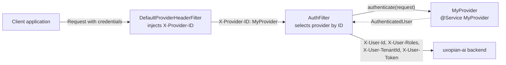

A connection provider is a Java class that authenticates incoming requests in the Uxopian Gateway (BFF). Each provider extracts user identity from the request (JWT, headers, cookies, OAuth token) and returns an `AuthenticatedUser` that the gateway forwards to uxopian-ai as enriched headers. Use this when the three built-in providers (FlowerDocsProvider, Fast2Provider, DevProvider) do not cover your authentication system.

## How a connection provider fits in the system



*Figure: The gateway matches the request path to a route, injects the provider ID header, then delegates authentication to the matching provider. The authenticated identity is forwarded to uxopian-ai as HTTP headers.*

## Request processing pipeline

1. **DefaultProviderHeaderFilter** reads the request path, matches it to a route defined in `application.yml`, and injects the `X-Provider-ID` header with the route's `provider` value.
2. **AuthFilter** reads `X-Provider-ID`, looks up the corresponding `AuthProvider` bean by name, and calls `authenticate(request)`.
3. On success, the filter enriches the downstream request with four headers: `X-User-Id`, `X-User-Roles`, `X-User-TenantId`, `X-User-Token`.
4. On failure (the provider returns a `BadCredentialsException`), the gateway responds with HTTP 401.

## Prerequisites

- Java 21
- Maven with access to the Uxopian AI artifact registry (see [Registry access](../getting_started/registry_access.md))

## Steps

### 1. Create a Maven project

Add the `model` module from uxopian-gateway as a dependency. It contains the `AuthProvider` interface and `AuthenticatedUser` DTO.

```xml
<project xmlns="http://maven.apache.org/POM/4.0.0"
         xmlns:xsi="http://www.w3.org/2001/XMLSchema-instance"
         xsi:schemaLocation="http://maven.apache.org/POM/4.0.0
         http://maven.apache.org/xsd/maven-4.0.0.xsd">
    <modelVersion>4.0.0</modelVersion>

    <groupId>com.example</groupId>
    <artifactId>my-auth-provider</artifactId>
    <version>1.0.0</version>

    <dependencies>
        <dependency>
            <groupId>com.uxopian.gateway</groupId>
            <artifactId>model</artifactId>
            <version>${uxopian-gateway.version}</version>
        </dependency>
    </dependencies>
</project>
```

The `model` artifact is published to the Arondor Artifactory registry (`artifactory.arondor.cloud`). Set `${uxopian-gateway.version}` to the gateway release version you are targeting.

### 2. Implement the AuthProvider interface

The interface has a single method:

```java
public interface AuthProvider
{
    Mono<AuthenticatedUser> authenticate(ServerHttpRequest request);
}
```

Your implementation extracts credentials from the request, validates them, and returns an `AuthenticatedUser` with four fields:

| Field | Description |
|---|---|
| `id` | Unique user identifier |
| `roles` | List of role names (e.g. `admin`, `user`). The gateway prefixes each role with `ROLE_` for Spring Security. |
| `tenantId` | Tenant identifier. Every resource in uxopian-ai is scoped to this value. |
| `token` | Original token or credential string, forwarded as-is to uxopian-ai. |

Here is a complete example that validates a JWT against a remote JWKS endpoint:

```java
package com.example.myprovider;

import org.springframework.http.server.reactive.ServerHttpRequest;
import org.springframework.security.authentication.BadCredentialsException;
import org.springframework.stereotype.Service;
import org.springframework.util.StringUtils;

import com.uxopian.ai.bff.gateway.model.provider.AuthProvider;
import com.uxopian.ai.bff.gateway.model.user.AuthenticatedUser;

import reactor.core.publisher.Mono;
import reactor.core.scheduler.Schedulers;

@Service("MyProvider")
public class MyProvider implements AuthProvider
{
    @Override
    public Mono<AuthenticatedUser> authenticate(ServerHttpRequest request)
    {
        String token = extractBearerToken(request);

        if (!StringUtils.hasText(token))
        {
            return Mono.error(
                    new BadCredentialsException("Authentication token is missing."));
        }

        return Mono.fromCallable(() -> validateAndConvert(token))
                .subscribeOn(Schedulers.boundedElastic())
                .onErrorMap(e -> (e instanceof BadCredentialsException) ? e
                        : new BadCredentialsException("Invalid token", e));
    }

    private AuthenticatedUser validateAndConvert(String token)
    {
        // Replace with your actual token validation logic:
        // decode JWT, call JWKS endpoint, query an external IdP, etc.
        Claims claims = decodeJwt(token);

        AuthenticatedUser user = new AuthenticatedUser();
        user.setId(claims.getSubject());
        user.setTenantId(claims.getTenantId());
        user.setToken(token);
        user.addRole(claims.getRole());
        return user;
    }

    private String extractBearerToken(ServerHttpRequest request)
    {
        String header = request.getHeaders().getFirst("Authorization");
        if (StringUtils.hasText(header) && header.startsWith("Bearer "))
        {
            return header.substring(7);
        }
        return header;
    }
}
```

Key rules:

- The `@Service` annotation value (`"MyProvider"`) is the provider identifier. It must match the `provider` field in the route configuration.
- The method is reactive. Wrap blocking calls (JWT parsing, HTTP calls) in `Mono.fromCallable(...).subscribeOn(Schedulers.boundedElastic())` to avoid blocking the event loop.
- Return `Mono.error(new BadCredentialsException(...))` on authentication failure. The gateway translates this to HTTP 401.

### 3. Add configuration properties (optional)

If your provider needs external configuration (endpoint URLs, secret keys), create a `@ConfigurationProperties` class. `AuthProviderLoader` automatically binds it from `application.yml`.

```java
package com.example.myprovider;

import org.springframework.boot.context.properties.ConfigurationProperties;

@ConfigurationProperties(prefix = "my-provider")
public class MyProviderProperties
{
    private String jwksUrl;
    private String defaultTenantId;

    public String getJwksUrl()
    {
        return jwksUrl;
    }

    public void setJwksUrl(String jwksUrl)
    {
        this.jwksUrl = jwksUrl;
    }

    public String getDefaultTenantId()
    {
        return defaultTenantId;
    }

    public void setDefaultTenantId(String defaultTenantId)
    {
        this.defaultTenantId = defaultTenantId;
    }
}
```

Then inject it in your provider constructor:

```java
@Service("MyProvider")
public class MyProvider implements AuthProvider
{
    private final MyProviderProperties properties;

    public MyProvider(MyProviderProperties properties)
    {
        this.properties = properties;
    }

    // ...
}
```

Values are read from the gateway's `application.yml`:

```yaml
my-provider:
  jwks-url: https://idp.example.com/.well-known/jwks.json
  default-tenant-id: my-tenant
```

### 4. Package as a shaded JAR

The provider JAR must be self-contained. Use the Maven Shade plugin and exclude Spring classes already provided by the gateway runtime:

```xml
<build>
    <plugins>
        <plugin>
            <groupId>org.apache.maven.plugins</groupId>
            <artifactId>maven-shade-plugin</artifactId>
            <version>3.5.2</version>
            <executions>
                <execution>
                    <phase>package</phase>
                    <goals>
                        <goal>shade</goal>
                    </goals>
                    <configuration>
                        <filters>
                            <filter>
                                <artifact>*:*</artifact>
                                <excludes>
                                    <exclude>META-INF/*.SF</exclude>
                                    <exclude>META-INF/*.DSA</exclude>
                                    <exclude>META-INF/*.RSA</exclude>
                                </excludes>
                            </filter>
                        </filters>
                        <artifactSet>
                            <excludes>
                                <exclude>org.springframework.boot:*</exclude>
                                <exclude>org.springframework:*</exclude>
                                <exclude>org.springframework.security:*</exclude>
                            </excludes>
                        </artifactSet>
                    </configuration>
                </execution>
            </executions>
        </plugin>
    </plugins>
</build>
```

Build:

```bash
mvn clean package
```

:::warning
Do not include Spring Boot, Spring Framework, or Spring Security classes in the shaded JAR. These are already loaded by the gateway. Duplicates cause class-loading conflicts at startup.
:::

### 5. Deploy the JAR

Place the shaded JAR in the `provider/` directory on the uxopian-gateway host. `AuthProviderLoader` scans this directory at startup (configurable with `auth.provider.path`).

In Docker Compose:

```yaml
services:
  uxopian-gateway:
    volumes:
      - ./provider:/app/provider
```

```bash
cp target/my-auth-provider-1.0.0.jar ./provider/
```

Alternatively, build a custom Docker image:

```dockerfile
FROM artifactory.arondor.cloud:5001/uxopian-gateway:2026.0.0-ft2

COPY ./target/my-auth-provider-1.0.0.jar /app/provider/
```

### 6. Configure a route to use the provider

In the gateway `application.yml`, add or update a route entry with the `provider` field set to your `@Service` bean name:

```yaml
app:
  routes:
    - id: my-app
      uri: http://ai-standalone-service:8080
      prefix: /my-app/
      path: /my-app/**
      provider: MyProvider
      security:
        - path: /assets/**
          public: true
        - path: /actuator/health
          public: true
```

When a request matches `/my-app/**`, the gateway sets `X-Provider-ID: MyProvider` and delegates authentication to your provider.

### 7. Restart and verify

Restart the gateway:

```bash
docker compose restart uxopian-gateway
```

Check the logs for successful registration:

```bash
docker compose logs uxopian-gateway | grep "MyProvider"
```

You should see:

```
Successfully registered Auth Provider: 'MyProvider'
```

Send a test request through the gateway:

```bash
curl -v "https://<gateway-host>/my-app/api/v1/conversations" \
     -H "Authorization: Bearer <YOUR_TOKEN>"
```

A successful authentication returns the uxopian-ai response. A failed authentication returns HTTP 401.

## Important constraints

- The `@Service` annotation must have a non-empty value. Providers without a bean name are skipped.
- If a bean name collides with an already-registered provider, the duplicate is not loaded. A warning is logged.
- Providers are loaded from `provider/` (default). This is separate from the `plugins/` directory used by uxopian-ai for tools and helpers.
- `AuthProviderLoader` also discovers `@ConfigurationProperties` classes in the same JAR and binds them before instantiating the provider.
- The `authenticate` method must not block the Netty event loop. Wrap blocking I/O in `Schedulers.boundedElastic()`.

## Related pages

- [Authentication and gateway](../understanding/authentication.md)
- [Plugin system](../understanding/plugin_system.md)
- [Configuration file reference](../reference/configuration.md)
