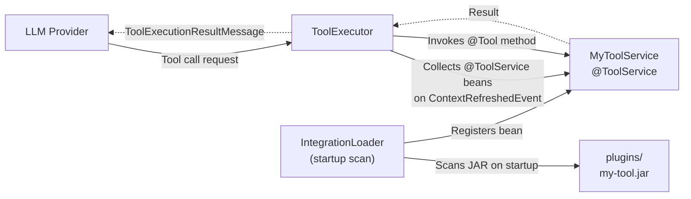

A custom tool is a Java method that the LLM can call during a conversation. Tools give the LLM the ability to perform actions: query a database, call an external API, read a file. This guide explains how to write a tool, package it, and deploy it.

## How a custom tool fits in the system



*Figure: A custom tool JAR is scanned at startup, registered by IntegrationLoader, and invoked by ToolExecutor on LLM tool call requests.*

## Prerequisites

- Java 21
- Maven with access to the Uxopian AI BOM or individual dependency coordinates
- The uxopian-ai `model` and `common` modules available as dependencies (or use the shaded JAR approach)

## Steps

### 1. Create a Maven project

Create a standard Maven project. Add the required dependencies: the LangChain4J `agent.tool` annotations and the uxopian-ai tool annotations. The key annotations come from:

- `dev.langchain4j:langchain4j-core`: provides `@Tool` and `@P`
- `com.uxopian.ai:annotation`: provides `@ToolService` (groupId `com.uxopian.ai`, artifactId `annotation`)

```xml
<dependency>
    <groupId>dev.langchain4j</groupId>
    <artifactId>langchain4j-core</artifactId>
    <version>1.11.0</version>
</dependency>
<dependency>
    <groupId>com.uxopian.ai</groupId>
    <artifactId>annotation</artifactId>
    <version>${uxopian-ai.version}</version>
</dependency>
```

The `annotation` artifact is published to the Arondor Artifactory registry (`artifactory.arondor.cloud`). See [Registry access](../getting_started/registry_access.md) for repository configuration. Set `${uxopian-ai.version}` to the Uxopian AI release version you are targeting.

### 2. Write the tool class

```java
import dev.langchain4j.agent.tool.P;
import dev.langchain4j.agent.tool.Tool;
import com.uxopian.ai.model.annotation.tool.ToolService;
import org.springframework.stereotype.Service;

@Service
@ToolService
public class MyCustomTool {

    @Tool("Search the internal knowledge base for articles matching a topic. "
        + "Returns a list of article titles and summaries.")
    public List<String> searchKnowledgeBase(
            @P("The topic to search for") String topic,
            @P("Maximum number of results") int maxResults) {

        // Your implementation here
        return List.of("Article about " + topic);
    }
}
```

Rules for tool methods:
- The method must be `public`.
- The `@Tool` annotation value is the description sent to the LLM. Write it clearly: the LLM uses this description to decide when to call the tool.
- Each parameter annotated with `@P` gets a description. The LLM uses these to construct the arguments.
- The return type must be serializable. Strings and lists of simple objects work well. The result is converted to a string before being returned to the LLM.
- Tool execution is synchronous. Long-running operations will block the request thread.

### 3. Package as a shaded JAR

The plugin JAR must be self-contained (all dependencies included). Use the Maven Shade plugin:

```xml
<plugin>
    <groupId>org.apache.maven.plugins</groupId>
    <artifactId>maven-shade-plugin</artifactId>
    <version>3.5.0</version>
    <executions>
        <execution>
            <phase>package</phase>
            <goals>
                <goal>shade</goal>
            </goals>
        </execution>
    </executions>
</plugin>
```

Build the shaded JAR:

```bash
mvn clean package
```

The output JAR is in `target/my-custom-tool-1.0.0.jar` (or similar).

### 4. Deploy the JAR

Copy the shaded JAR to the `plugins/` directory on the uxopian-ai host. In Docker Compose deployments, mount the directory:

```yaml
services:
  uxopian-ai:
    volumes:
      - ./plugins:/app/plugins
```

Then copy the JAR:

```bash
cp target/my-custom-tool-1.0.0.jar ./plugins/
```

### 5. Restart uxopian-ai

Plugins are scanned at startup. Restart the container to load the new plugin:

```bash
docker compose restart uxopian-ai
```

Check the logs to confirm the tool was registered:

```bash
docker compose logs uxopian-ai | grep "Registered"
```

You should see a line indicating the number of tool methods registered.

### 6. Verify the tool is available

The LLM will use tools when they are relevant to the user's request. To confirm the tool is loaded, check the admin UI statistics or send a request that explicitly asks the LLM to use the tool.

## Important constraints

- Shaded JARs must not include Spring Boot's own classes. Only include classes needed by the tool.
- If a bean name collides with an already-registered bean, `IntegrationLoader` logs a warning and skips the duplicate.
- Tools can be disabled globally with `TOOLS_ENABLED=false`.
- The LLM only calls tools if the model configured for the conversation has `functionCallSupported: true`.
- Prompts with `reasoningDisabled: true` do not receive tool specifications.

## Related pages

- [Tools](../understanding/tools.md)
- [Plugin system](../understanding/plugin_system.md)
- [Write custom service helpers](./custom_service_helpers.md)
- [LLM providers](../understanding/llm_providers.md)
