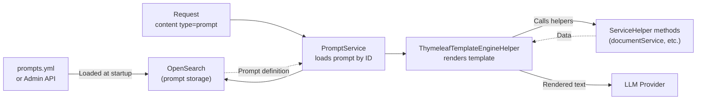

This guide explains how to define prompts in `prompts.yml`, use Thymeleaf expressions to inject dynamic content, call ServiceHelpers, and manage prompts at runtime via the Admin API.

## Prompt rendering flow



*Figure: From YAML definition to rendered prompt sent to the LLM.*

## Prompt definition structure

Define prompts under `prompts.globals` in `prompts.yml`:

```yaml
prompts:
  globals:
    - id: myPrompt
      role: USER
      content: |
        Analyze the following document and provide a summary:
        [[${documentService.extractTextualContent(documentId)}]]
      requiresMultiModalModel: false
      requiresFunctionCallingModel: false
      reasoningDisabled: false
```

### Fields

| Field | Required | Description |
|---|---|---|
| `id` | Yes | Unique identifier. Referenced in requests and goals. |
| `role` | Yes | `SYSTEM`, `USER`, or `ASSISTANT` |
| `content` | Yes | Thymeleaf template string |
| `requiresMultiModalModel` | No | Set to `true` if the prompt includes images |
| `requiresFunctionCallingModel` | No | Set to `true` if the prompt requires tool calling |
| `reasoningDisabled` | No | Set to `true` to disable tool calls for this prompt |
| `defaultLlmProvider` | No | Override the LLM provider for this specific prompt |
| `defaultLlmModel` | No | Override the LLM model for this specific prompt |

## Thymeleaf syntax

Prompts use Thymeleaf TEXT mode. Standard Thymeleaf `${}` syntax uses double-bracket wrappers:

```
[[${variable}]]
```

### Variable expressions

A payload variable `documentId` passed in the request:

```
[[${documentId}]]
```

### Conditional expressions

:::warning[Don't use an inline ternary with a colon]
`prompts.yml` is bound through Spring Boot's `@ConfigurationProperties`, which resolves `${...}` as a **property placeholder** before Thymeleaf ever sees the string — this happens once, at startup, and the resolved (or corrupted) text is what gets stored and reused for every request. A colon anywhere inside a single `${...}` block (as in `${cond ? a : b}`, or the older `${cond} ? ${a} : 'b'` form) is parsed by Spring as `${propertyKey:defaultValue}` and silently replaced with the default value, breaking the expression before Thymeleaf runs. Avoid ternaries with a `:` in prompt content — use the block conditional below instead.
:::

Use Thymeleaf's block conditional (`th:if`/`th:unless`), which needs no colon:

```
[# th:if="${targetLanguage != null}"][[${targetLanguage}]][/][# th:unless="${targetLanguage != null}"]english[/]
```

The framework validates that every variable referenced in the template is present in the request payload — even the one only used in the `th:unless` branch. Always include the key in `payload`, using `null` when you want the default:

```json
{ "payload": { "targetLanguage": null } }
```

:::warning[Avoid variable names that collide with real config/env properties]
A bare `${name}` in `prompts.yml` is *also* resolved by the same Spring placeholder mechanism if `name` happens to match a real Spring property or OS environment variable — it silently returns that unrelated value instead of staying a template placeholder. For example, `${language}` resolves against the container's `LANGUAGE` locale environment variable (typically `en_US:en` on Linux), not your request payload. Pick payload variable names unlikely to collide with real properties or env vars (e.g. `targetLanguage` rather than `language`).
:::

### Iteration

```
[# th:each="docId, iterStat : ${documentIds}"]
Document [[${iterStat.count}]]:
[[${documentService.extractTextualContent(docId)}]]
[/]
```

### ServiceHelper calls

ServiceHelpers registered in plugins are available by their `@HelperService(name="...")` name:

```
[[${documentService.extractTextualContent(documentId)}]]
```

`documentId` is a payload variable passed in the request content item.

## Passing variables to prompts

Variables are passed in the `payload` map of the request content item:

```json
{
  "type": "prompt",
  "value": "myPrompt",
  "payload": {
    "documentId": "doc-abc-123",
    "targetLanguage": "french"
  }
}
```

All keys in `payload` become Thymeleaf context variables accessible with `[[${key}]]`.

## Tenant-specific overrides

Add per-tenant overrides under `prompts.tenants`:

```yaml
prompts:
  tenants:
    - tenantId: my-tenant
      mergeStrategy: merge
      prompts:
        - id: basePrompt
          role: SYSTEM
          content: |
            You are an assistant specialized for my-tenant. Always respond in French.
```

`mergeStrategy: merge` updates prompts that match by `id`. Other prompts remain unchanged. `mergeStrategy: replace` discards all global prompts for the tenant and uses only the listed ones.

## Managing prompts at runtime

Prompts can be created, updated, and deleted via the Admin API without restarting:

```bash
# List all prompts for the current tenant
curl https://your-gateway/api/v1/admin/prompts

# Create a new prompt
curl -X POST https://your-gateway/api/v1/admin/prompts \
  -H "Content-Type: application/json" \
  -d '{
  "id": "myNewPrompt",
  "role": "user",
  "content": "Please explain: [[${question}]]",
  "requiresMultiModalModel": false,
  "requiresFunctionCallingModel": false,
  "reasoningDisabled": false
}'

# Update a prompt
curl -X PUT https://your-gateway/api/v1/admin/prompts/{id} \
  -H "Content-Type: application/json" \
  -d '{ ... }'

# Delete a prompt
curl -X DELETE https://your-gateway/api/v1/admin/prompts/{id}
```

Changes made via the API are persisted in OpenSearch and take effect immediately for the tenant. They survive application restarts.

## Tips for effective prompts

- Write `role: SYSTEM` prompts for persistent instructions (persona, rules, context).
- Write `role: USER` prompts for document-specific context or task instructions.
- Keep ServiceHelper calls isolated: if a helper call fails, the entire prompt rendering fails.
- Use `[[${variable != null} ? ${variable} : 'default']]` to handle optional payload variables.
- Test with the Admin API render endpoint (`POST /api/v1/admin/prompts/{id}/render`) to preview rendered output before deploying.

## Related pages

- [Prompts and templating](../understanding/prompts_and_templating.md)
- [Managing prompts in the admin UI](../admin/managing_prompts.md)
- [Goals](../understanding/goals.md)
- [Write goals](./writing_goals.md)
- [Custom service helpers](./custom_service_helpers.md)
- [Configuration file reference](../reference/configuration.md)
