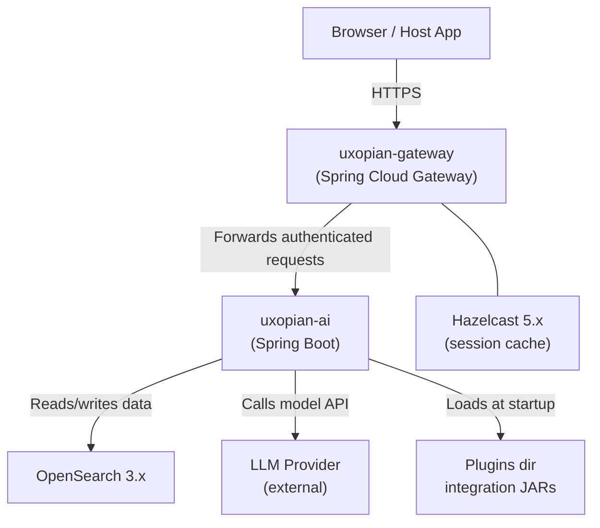

Uxopian AI is a framework for embedding AI assistants inside legacy enterprise applications. It is designed for content management and document-centric systems. It does not replace the host application. It adds a conversational interface, connects to multiple LLM providers, and exposes tools the LLM can call to operate on enterprise data.

## Who this documentation is for

| Audience | Entry point |
|---|---|
| System administrator deploying the stack | [Quickstart with Docker Compose](./quickstart.md) |
| Integration developer embedding the chat UI | [Embed in a web application](../how_to/embed_in_web_application.md) |
| Solution architect evaluating the system | [System architecture](../understanding/architecture.md) |
| ARender integrator | [Integrate with ARender](../how_to/integrate_with_arender.md) |
| FlowerDocs integrator | [Integrate with FlowerDocs](../how_to/integrate_with_flowerdocs.md) |
| Prompt or assistant developer | [Prompts and templating](../understanding/prompts_and_templating.md) |

## System components

*Figure: High-level component topology.*

### uxopian-ai

The primary application. Java 21, Spring Boot (reactive WebFlux stack). Handles all business logic: conversations, requests, prompt rendering, tool execution, LLM calls, and the REST/WebSocket API.

### uxopian-gateway

Spring Cloud Gateway acting as a reverse proxy. The only public entry point. Authenticates every request using a configurable `AuthProvider` and forwards identity headers to uxopian-ai. uxopian-ai must never be exposed directly to browsers.

### OpenSearch

Primary persistence store. Stores conversations, requests, prompts, goal configurations, LLM provider configurations, and usage metrics. All data is tenant-scoped.

### Hazelcast

Distributed in-memory cache used by the gateway for session token caching. Configured via `hazelcast.yml`.

## Supported LLM providers

Nine providers are supported out of the box:

| Provider | Key identifier |
|---|---|
| OpenAI | `openai` |
| Anthropic | `anthropic` |
| Azure OpenAI | `azure` |
| AWS Bedrock | `bedrock` |
| Google Gemini | `gemini` |
| Mistral AI | `mistral` |
| HuggingFace | `huggingface` |
| Ollama | `ollama` |
| NuExtract | `nu-extract` |

See [LLM providers](../understanding/llm_providers.md) for configuration details.

## Integration paths

Three integration paths are available:

- **Generic web application**: load the JavaScript and CSS bundles from the gateway's `/api/web-components/chat/script` and `/api/web-components/chat/style` endpoints, call `window.createChat()`. See [Embed in a web application](../how_to/embed_in_web_application.md).
- **ARender document viewer**: adds an AI menu to the ARender top panel. Documents are accessed via the ARender DSB API. See [Integrate with ARender](../how_to/integrate_with_arender.md).
- **FlowerDocs ECM**: embeds the chat panel via FlowerDocs scope files. Uses `FlowerDocsProvider` in the gateway. See [Integrate with FlowerDocs](../how_to/integrate_with_flowerdocs.md).

## Extension mechanisms

- **Custom tool plugins**: write a `@ToolService` class, package as a shaded JAR, drop in `plugins/`. The LLM can then call those methods as tools.
- **Custom ServiceHelpers**: write a `@HelperService` class, expose it as a named expression object in Thymeleaf prompt templates.
- **Custom auth providers**: implement the `AuthProvider` interface in the gateway to support any identity system.
- **Prompt and goal customization**: define per-tenant overrides in `prompts.yml` and `goals.yml`, or manage them live via the Admin API.

## Key concepts

| Concept | Description |
|---|---|
| Tenant | Primary isolation unit. All data is scoped to a tenant ID. |
| Conversation | A chat session. Contains a sequence of Requests. |
| Request | A single LLM round-trip: inputs, rendered prompt, response, token usage. |
| Prompt | A named Thymeleaf template defining a role and content. |
| Goal | A named group of ordered prompt references with optional filters. |
| Plugin | A shaded JAR in `plugins/` loaded at startup by `IntegrationLoader`. |

## Next steps

1. Follow [Quickstart with Docker Compose](./quickstart.md) to run a local stack.
2. Read [System architecture](../understanding/architecture.md) for the full component diagram and request flow.
3. Read [Authentication and gateway](../understanding/authentication.md) before any deployment.
