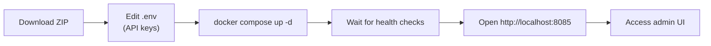

This guide walks through running a local Uxopian AI stack with Docker Compose. The result is a working deployment with OpenSearch, uxopian-ai, and uxopian-gateway, accessible at `http://localhost:8085`.

:::warning Development stack only
This quickstart uses `DevProvider` in the gateway and the `dev` Spring profile on `uxopian-ai`. Authentication is disabled. Do not use this configuration in a production or publicly accessible environment.
:::

## Prerequisites

- Docker and Docker Compose installed
- Access to a Uxopian AI Docker registry (Cloudsmith public or Arondor Artifactory). See [Registry access](./registry_access.md).
- At least one LLM provider API key (e.g., OpenAI, Anthropic, Gemini)

## Step flow



*Figure: Steps from download to a running stack.*

## Steps

### 1. Download the example package

:::tip[Download]
**<a href={require('./uxopian-ai_docker_example.zip').default} download="uxopian-ai_docker_example.zip">uxopian-ai_docker_example.zip</a>**
:::

Extract the ZIP. The archive contains:

```
uxopian-ai-stack.yml        # Docker Compose file
gateway-application.yaml    # Gateway configuration
config/
  application.yml           # uxopian-ai base config
  opensearch.yml            # OpenSearch connection
  llm-clients-config.yml    # LLM provider configurations (minimal)
  llm-clients-config.yml.example  # Full example with all providers
  prompts.yml               # Default prompt definitions
  goals.yml                 # Goal group definitions (empty by default)
  metrics.yml               # Micrometer metrics configuration
  mcp-server.yml            # MCP server config (disabled by default)
```

### 2. Configure LLM API keys

Create a `.env` file in the same directory as `uxopian-ai-stack.yml`. Set at least one LLM API key:

```bash
OPENAI_API_KEY=sk-your-openai-key
# ANTHROPIC_API_KEY=your-key
# AZURE_OPENAI_API_KEY=your-key
# GEMINI_API_KEY=your-gemini-key
```

If you want to configure all provider options, copy `config/llm-clients-config.yml.example` to `config/llm-clients-config.yml` and edit it. The minimal `llm-clients-config.yml` is pre-configured for OpenAI.

### 3. Log in to the registry

**Cloudsmith (public preview):** no login required. The compose file includes the Cloudsmith image lines as comments — see [Registry access](./registry_access.md) to switch.

**Artifactory (enterprise):**

```bash
docker login artifactory.arondor.cloud:5001
```

See [Registry access](./registry_access.md) for credentials and for instructions on switching to the Cloudsmith registry.

### 4. Start the stack

```bash
docker compose -f uxopian-ai-stack.yml up -d
```

This starts three containers: `opensearch`, `uxopian-ai`, and `uxopian-gateway`. The `uxopian-ai` service waits for OpenSearch to pass its health check before starting.

### 5. Verify the stack is healthy

```bash
docker compose -f uxopian-ai-stack.yml ps
```

All three containers should show `healthy` or `running`. You can also check the gateway health endpoint:

```bash
curl http://localhost:8085/actuator/health
```

Expected response:

```json
{"status":"UP"}
```

### 6. Access the application

Open `http://localhost:8085` in your browser. The gateway is listening on port 8085.

To access the admin UI, open the admin element page. Since 2026.0.0-ft5, `DevProvider` always injects a fixed development identity (`dev`, tenant `dev`, role `ADMIN`) regardless of any client-supplied headers — a hardening fix so it can never be used to forge an arbitrary user. There is no way to pick a different tenant through `DevProvider` headers anymore; use `FlowerDocsProvider`/`Fast2Provider` (or a real deployment) to test multi-tenant behavior.

## Configuration notes

The gateway configuration (`gateway-application.yaml`) routes all traffic to `uxopian-ai:8080` using `DevProvider`. The admin API routes (`/api/v1/admin/**`) are marked public in this example.

The `uxopian-ai` container is not exposed to the host. All browser traffic goes through port 8085 on the gateway.

## Stopping the stack

```bash
docker compose -f uxopian-ai-stack.yml down
```

To also remove the OpenSearch data volume:

```bash
docker compose -f uxopian-ai-stack.yml down -v
```

## Next steps

- [Embed the chat interface in a web application](../how_to/embed_in_web_application.md)
- [Configure LLM providers](../how_to/configure_llm_providers.md)
- [Authentication and gateway](../understanding/authentication.md) — understand the security model before going to production
- [Write prompts](../extending/writing_prompts.md)
