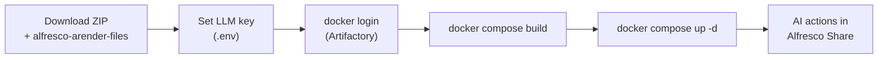
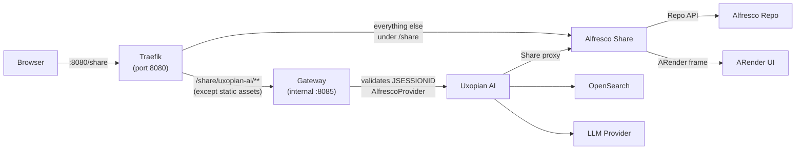

This guide starts a full Alfresco + ARender + Uxopian AI stack using Docker Compose. The result is an Alfresco Share instance where users can trigger AI actions (chat, summarize, translate, compare) from the Document Library context menu.

:::warning Development stack only
This quickstart runs with the `dev` Spring profile. The gateway uses `AlfrescoProvider` to validate Alfresco Share sessions, but uxopian-ai itself has no authentication. Do not use this configuration in production. See [Integrate with Alfresco](../how_to/integrate_with_alfresco.mdx) for the production-ready setup.
:::

## Prerequisites

- Docker and Docker Compose installed
- Access to the Arondor Artifactory registry (`artifactory.arondor.cloud:5001`). See [Registry access](./registry_access.md).
- At least one LLM provider API key

## Step flow



*Figure: Steps from download to AI actions available in the Document Library.*

## Steps

### 1. Download the packages

:::tip[Download — Docker Compose stack]
**<a href={require('./uxopian-ai_docker_alfresco_arender.zip').default} download="uxopian-ai_docker_alfresco_arender.zip">uxopian-ai_docker_alfresco_arender.zip</a>**
:::

:::tip[Download — Alfresco integration files]
**<a href={require('./alfresco-arender-files.zip').default} download="alfresco-arender-files.zip">alfresco-arender-files.zip</a>**
:::

Extract both archives into separate folders so the directory layout looks like:

```
<your-workspace>/
  uxopian-ai/
    alfresco-arender-files/      ← extracted from alfresco-arender-files.zip
      src/main/resources/custom/
        plugins/
        repo-webscripts/
        share-resources/
        share-webscripts/
      web-components-output/
  ops/
    docker/
      docker_alfresco_arender/   ← extracted from uxopian-ai_docker_alfresco_arender.zip
        docker-compose.yml
        Dockerfile.alfresco-repository
        Dockerfile.alfresco-share
        gateway-application.yaml
        share-config-custom.xml
        arender-custom-server.properties
        custom-opensearch.yml
        .env
        config/
```

The `docker-compose.yml` references `../../../uxopian-ai/alfresco-arender-files` as a relative build context, which resolves correctly from this layout. The first archive is the Compose stack; the second contains the pre-compiled JARs and web assets used to build the custom Alfresco and Share images.

### 2. Set an LLM API key

Open `.env` and add at least one key:

```bash
OPENAI_API_KEY=sk-your-openai-key
# ANTHROPIC_API_KEY=your-key
# AZURE_OPENAI_API_KEY=your-key
```

Then open `config/llm-clients-config.yml` and confirm `llm.default.provider` matches your key.

### 3. Log in to the registry

```bash
docker login artifactory.arondor.cloud:5001
```

See [Registry access](./registry_access.md) for credentials.

### 4. Build the custom images

The `alfresco` and `share` services are built locally from the downloaded integration files. The `uxopian-ai` and `gateway` images are pulled directly from the registry.

```bash
docker compose build
```

### 5. Start the stack

```bash
docker compose up -d
```

Alfresco takes 1–2 minutes to pass its health check; Share starts after. Follow uxopian-ai logs if needed:

```bash
docker compose logs -f uxopian-ai
```

### 6. Verify

1. Open Alfresco Share at `http://localhost:8080/share`.
2. Log in as `admin` / `admin`.
3. Navigate to the Document Library and right-click a document.
4. The AI actions appear in the context menu: **Chat IA**, **Summarize**, **Translate**, **Comparison**, **Extract invoice number**.
5. Click an action to open the Uxopian AI chat panel with the document in context.
6. Optionally open the admin dashboard from the user menu (top-right) → **Uxopian AI Admin page**, served at `http://localhost:8080/share/uxopian-ai/admin/`. It lists prompts, LLM providers, users, and usage statistics. Like the chat, it is reached same-origin through Traefik — it only works because `UXOPIAN_AI_PUBLIC_URL` points at `:8080` (see the architecture note below).

If the actions do not appear, check the uxopian-ai logs:

```bash
docker compose logs uxopian-ai
```

If the actions appear and the chat panel opens, but sending a message fails silently (nothing renders, or the browser console shows a CORS error on `.../api/v1/conversations`), see [Keep the gateway same-origin with Share](#architecture-in-this-stack) above — `UXOPIAN_AI_PUBLIC_URL` in `.env` was likely changed to point at the gateway's own `:8085`.

:::note[Chat replies must stay conversational]
The Alfresco Share chat renders each assistant message as plain markdown. The bundled `config/prompts.yml` therefore instructs the assistant (in `basePrompt` and `alfrescoAssistant`) to **always answer in natural prose and never emit raw JSON or structured "choices" objects** — otherwise the model can return a machine-readable choice block that the Share chat shows as raw JSON instead of a readable answer. Keep those instructions if you customise the prompts.
:::

## Architecture in this stack



*Figure: The browser only ever talks to Traefik on :8080. Traefik forwards AI action calls to the gateway (which validates the Alfresco session) and everything else to Share. The gateway is never exposed to the browser on its own port.*

:::warning[Keep the gateway same-origin with Share]
`UXOPIAN_AI_PUBLIC_URL` must stay `http://localhost:8080/share/uxopian-ai` — the same host and port as Share, not the gateway's own `:8085`. `uxopian-ai` and the gateway both echo the request's `Origin` back in `Access-Control-Allow-Origin`, and stacked across a real cross-origin call the duplicate header gets rejected outright by the browser (chat opens, but every message silently fails with a CORS error in the console). Same-origin requests never go through that check, which is why the stack routes the gateway through Traefik on `:8080` instead of exposing `:8085` directly. If you fork this Compose file, keep that Traefik routing — don't "simplify" it by pointing the browser straight at the gateway's port.
:::

## Related pages

- [Integrate with Alfresco](../how_to/integrate_with_alfresco.mdx) — production setup with full authentication
- [Registry access](./registry_access.md)
- [Quickstart with ARender](./quickstart_arender.mdx)
- [Quickstart with Docker Compose](./quickstart.mdx)
- [Prompts and templating](../understanding/prompts_and_templating.md)
